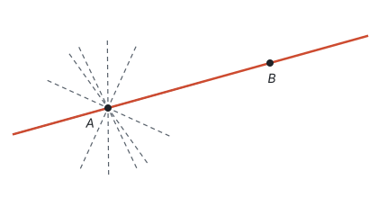
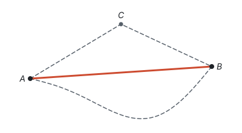
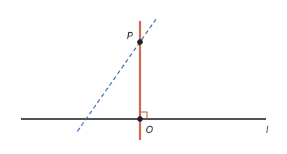
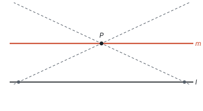
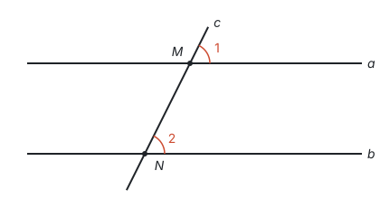
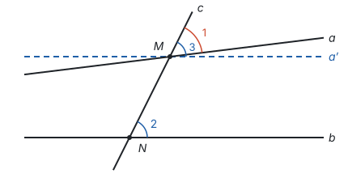
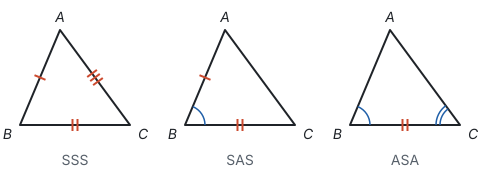
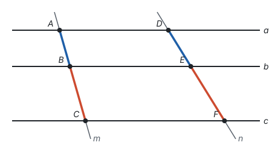
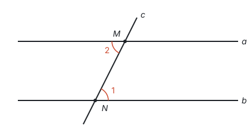
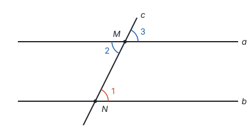

# 基本事实

> 对应人教版八年级上册第十四章“图说数学史：公理化方法”，基本事实散见各册。

**基本事实是公认正确、不加证明、作为推理起点的少数几条结论。** 其余的几何定理，都由定义和这几条基本事实一步一步推出来。

## 为什么需要不证自明的起点

对一个结论追问“为什么”：对顶角为什么相等？因为同角的补角相等。同角的补角为什么相等？因为补角的定义和等式的性质……每一次回答都要用到前面的结论，这样问下去没有尽头。就像查字典，每个词都用别的词来解释，总得有几个最基本的词，大家不再追问就懂。

所以推理必须有起点。数学的做法是：**选出少数几条简单、公认的结论，不证明，直接承认；其余的结论全部从它们和定义推出来。** 两千多年前，古希腊的欧几里得写《几何原本》，就是从几条公设和公理出发，推出了几百条几何命题。这种“选定少数起点、其余全部推出”的方法，叫**公理化方法**。初中数学把选作起点的结论叫**基本事实**。

选作起点的结论，要满足两个要求：一是足够简单，谁都承认；二是足够用，后面的定理都能从它们推出来。

## 初中几何的基本事实

| 编号 | 基本事实 | 后面用在哪里 |
| --- | --- | --- |
| 1 | 两点确定一条直线 | 两条直线最多有一个交点；画直线、画一次函数的图象只需两个点 |
| 2 | 两点之间，线段最短 | 两点间的距离；三角形三边关系；最短路径问题 |
| 3 | 同一平面内，过一点有且只有一条直线与已知直线垂直 | 点到直线的距离；三角形的高；作垂线 |
| 4 | 过直线外一点有且只有一条直线与这条直线平行 | 平行于同一条直线的两条直线平行；三角形内角和的证明 |
| 5 | 两条直线被第三条直线所截，如果同位角相等，那么这两条直线平行 | 平行线的其他判定；平行线的性质 |
| 6 | 两边和它们的夹角分别相等的两个三角形全等（SAS） | 等腰三角形的性质；线段垂直平分线的性质 |
| 7 | 两角和它们的夹边分别相等的两个三角形全等（ASA） | 推出 AAS |
| 8 | 三边分别相等的两个三角形全等（SSS） | 三角形的稳定性；尺规作图 |
| 9 | 两条直线被一组平行线所截，所得的对应线段成比例 | 相似三角形的判定 |

下面逐条看它们说了什么、为什么可信、在哪里用到。

## 直线和线段

**基本事实 1：两点确定一条直线。** 经过两点有一条直线，并且只有一条直线。

经过一个点 $A$ 能画无数条直线；再要求经过点 $B$，就只剩一条了。“确定”包含两层意思：有，并且只有一条。木工弹墨线、植树时先定两端的两棵树，用的都是这个事实。

用到它的地方：两条直线相交只有一个交点（见下面的例 1）；一次函数的图象是直线，所以画图只需两个点，求解析式只需两个条件（见第七部分“一次函数”）。

**基本事实 2：两点之间，线段最短。** 连接两点的所有线中，线段最短。

因此把连接两点的线段的长度，叫这两点间的**距离**。

用到它的地方：图中的折线 $ACB$ 和线段 $AB$ 围成 $\triangle ABC$，从 $A$ 直接到 $B$ 比绕道 $C$ 近，所以 $AC + CB > AB$，这就是三角形两边之和大于第三边（见第五部分“三角形”）；最短路径问题，都是想办法把折线变成一条线段（见第五部分“轴对称与等腰三角形”）。

## 垂线和平行线

**基本事实 3：在同一平面内，过一点有且只有一条直线与已知直线垂直。** 这个点可以在直线上，也可以在直线外。

“有且只有”也是两层意思：**有**，是说这样的直线存在，能画出来；**只有**，是说它是唯一的。让一条直线绕点 $P$ 转动，它和 $l$ 的夹角连续变化，恰好有一个位置是直角。

用到它的地方：因为过 $P$ 的垂线只有一条，垂线段 $PO$ 就是唯一确定的，它的长度才能叫**点到直线的距离**；三角形的高、尺规作垂线也都依靠它（见第五部分“尺规作图”）。“垂线段最短”也常常直接使用，学了勾股定理后可以说明它：直角三角形中，斜边的平方等于两直角边的平方和，所以斜边比直角边长。

**基本事实 4：过直线外一点有且只有一条直线与这条直线平行。**

过点 $P$ 的直线只要稍微倾斜，向一侧延长就会和 $l$ 相交；只有 $m$ 这一个位置，两边无限延长都不相交。

用到它的地方：

- **平行于同一条直线的两条直线互相平行。** 如果直线 $a$、$b$ 都和 $l$ 平行，而 $a$、$b$ 相交于点 $P$，那么过点 $P$ 就有两条直线和 $l$ 平行，这和基本事实 4 矛盾。所以 $a$、$b$ 不能相交，$a \parallel b$。
- **三角形内角和的证明**要过一个顶点作对边的平行线，再用“两直线平行，内错角相等”。这条平行线能作出来，靠的是基本事实 4；平行线的性质也要用基本事实 4 才能推出（见下面基本事实 5 之后的推导）。内角和的证明见第一部分“怎样证明”。

**基本事实 5：两条直线被第三条直线所截，如果同位角相等，那么这两条直线平行。** 简单说成：同位角相等，两直线平行。

用到它的地方：平行线的另外两个判定（内错角相等、同旁内角互补，两直线平行）都由它推出，见下面的例 2。

平行线的性质“两直线平行，同位角相等”是它的逆命题，由基本事实 4 和 5 可以推出。设 $a \parallel b$，直线 $c$ 与 $a$、$b$ 分别交于点 $M$、$N$，$\angle 1$、$\angle 2$ 是同位角（上图）。先假设结论不成立：$\angle 1 \ne \angle 2$。过点 $M$ 作直线 $a'$，使 $a'$ 与 $c$ 所成的同位角 $\angle 3 = \angle 2$，由基本事实 5，$a' \parallel b$。因为 $\angle 3 = \angle 2 \ne \angle 1$，$a'$ 和 $a$ 不重合，于是过点 $M$ 有两条直线 $a$、$a'$ 都和 $b$ 平行，这和基本事实 4 矛盾。所以 $\angle 1 = \angle 2$。

下图画的是假设的情况（$\angle 1 \ne \angle 2$），所以 $a$ 看起来和 $b$ 不平行。正是这种情况推出了矛盾，说明它不会出现。

## 三角形全等

**基本事实 6～8：SAS、ASA、SSS。**

按这三组条件画三角形，不管谁来画，画出来的都能完全重合：三角形的形状和大小被“定死”了（见第五部分“全等三角形”）。注意 SSA（两边和其中一边的对角）不在其中，它确实定不死三角形。

用到它的地方：AAS 由 ASA 和三角形内角和推出，直角三角形的 HL 也能由它们推出；等腰三角形“三线合一”、角平分线的性质、线段垂直平分线的性质、平行四边形的性质，都要借助全等来证明；尺规作图“作一个角等于已知角”的依据是 SSS。

## 平行线分线段成比例

**基本事实 9：两条直线被一组平行线所截，所得的对应线段成比例。**

图中 $a \parallel b \parallel c$，直线 $m$ 与它们交于 $A$、$B$、$C$，直线 $n$ 与它们交于 $D$、$E$、$F$，那么

$$\frac{AB}{BC} = \frac{DE}{EF}.$$

特别地，如果 $AB = BC$，那么 $DE = EF$：平行线在一条直线上截得的线段相等，在另一条直线上截得的线段也相等。

用到它的地方：“平行于三角形一边的直线截其他两边，截得的三角形与原三角形相似”，以及相似三角形的各个判定，都由它推出（见第八部分“相似”）。

## 代数推理的起点

代数推理同样有起点。计算和解方程时，每一步都能追到下面几类规则：

| 起点 | 内容 | 推出了什么 |
| --- | --- | --- |
| 运算律 | $a + b = b + a$，$(a + b) + c = a + (b + c)$，$ab = ba$，$(ab)c = a(bc)$，$a(b + c) = ab + ac$ | 去括号、合并同类项、整式乘法、乘法公式 |
| 等式的性质 | 等式两边加（或减）同一个数或式子，结果仍相等；两边乘同一个数，或除以同一个不为 0 的数，结果仍相等 | 移项、去分母，解方程的每一步 |
| 不等式的性质 | 两边加（或减）同一个数或式子，不等号方向不变；两边乘（或除以）同一个正数，方向不变；乘（或除以）同一个负数，方向改变 | 解不等式的每一步 |

运算律在小学是从具体的数里总结出来的；数扩充到负数、无理数以后，仍然承认它们成立，并以它们为依据继续推理。加上相反数、绝对值、乘方这些定义，代数里的法则、公式都能由此推出。

## 例题

**例 1**　用基本事实说明：两条直线相交，只有一个交点。

**思路：** 要说明“只有一个”，可以设想有两个，看会不会出问题。

**解：** 假设直线 $a$ 和 $b$ 相交，并且有两个不同的交点 $P$、$Q$。那么 $a$ 经过 $P$、$Q$ 两点，$b$ 也经过 $P$、$Q$ 两点，经过两点就有了两条不同的直线，和“两点确定一条直线”矛盾。所以两条直线相交只有一个交点。

这种先假设结论不成立、再推出矛盾的说理方法，叫反证法（见第一部分“怎样证明”）。

**例 2**　如图，直线 $a$、$b$ 被直线 $c$ 所截，$\angle 1 = \angle 2$。求证：$a \parallel b$。

**思路：** $\angle 1$ 和 $\angle 2$ 是内错角。能用来判定平行的，目前只有基本事实“同位角相等，两直线平行”。所以要找一个角，它和 $\angle 1$ 是同位角，又和 $\angle 2$ 相等：$\angle 2$ 的对顶角 $\angle 3$ 正好是。

**证明：** 因为 $\angle 2 = \angle 3$（对顶角相等），$\angle 1 = \angle 2$（已知），所以 $\angle 1 = \angle 3$（等量代换），所以 $a \parallel b$（同位角相等，两直线平行）。

**回顾：** 这就是判定定理“内错角相等，两直线平行”的证明。把依据一路往回追：“对顶角相等”来自补角和平角，“同位角相等，两直线平行”是基本事实。每一个定理都这样扎根在定义和基本事实上。

**例 3**　解方程 $2(x - 1) = x + 4$，并说出每一步的依据。

**思路：** 解方程的每一步都是在用运算律或等式的性质，把它们写出来。

**解：**

| 步骤 | 依据 |
| --- | --- |
| $2x - 2 = x + 4$ | 分配律（去括号） |
| $2x - x = 4 + 2$ | 等式的性质：两边都加 2，再都减去 $x$（移项） |
| $x = 6$ | 分配律：$2x - x = (2 - 1)x$（合并同类项） |

**检验：** 左边 $2 \times (6 - 1) = 10$，右边 $6 + 4 = 10$，左边等于右边。

**想一想：** 移项要“变号”，不是一条需要记住的规定。等式两边都加 2，左边的 $-2 + 2 = 0$ 消失了，右边多出一个 $+2$，看起来就像 $-2$ 变号后移到了右边。

## 易错点

- **把“看起来显然”的结论当基本事实用。** 几何的基本事实只有表里这几条。用 SSA 判定全等、凭图说两条线平行，都是用了没有依据的“事实”。
- **漏掉“同一平面内”“直线外”。** 在空间里，过一点和已知直线垂直的直线有无数条；点在直线上时，过这一点的直线都和已知直线相交或重合，谈不上平行。
- **把判定和性质弄反。** 基本事实 5 是由角推出平行（判定）；“两直线平行，同位角相等”是由平行推出角（性质），方向相反，不能混用。
- **把线段和距离混为一谈。** 距离是线段的长度，是一个数；线段是图形。“点到直线的距离”是垂线段的长度，不是垂线段本身。
- **“有且只有”只理解了一半。** “有”是存在，“只有”是唯一。作辅助线时用的是“有”，说明两条线重合时用的是“只有”。

## 联系

- **定义、命题与定理：** 基本事实是不证明的真命题，定理是证明了的真命题。见第一部分“定义、命题与定理”。
- **怎样证明：** 证明里的每一个依据，追到最后都是定义和基本事实。见第一部分“怎样证明”。
- **几何图形初步：** 直线、线段、两点间的距离从这里开始。见第五部分“几何图形初步”。
- **相交线与平行线：** 垂线、平行线的判定和性质，都建立在基本事实 3、4、5 上，也就是同一平面内过一点有且只有一条直线与已知直线垂直，过直线外一点有且只有一条直线与这条直线平行，同位角相等，两直线平行。见第五部分“相交线与平行线”。
- **三角形：** 三边关系来自“两点之间，线段最短”，内角和的证明要用到平行线。见第五部分“三角形”。
- **全等三角形：** 全等的判定从 SAS、ASA、SSS 出发。见第五部分“全等三角形”。
- **相似：** 相似三角形的判定从“平行线分线段成比例”出发。见第八部分“相似”。
- **一次函数：** “两点确定一条直线”对应待定系数法里的“两个条件确定 $k$ 和 $b$”。见第七部分“一次函数”。
- **一元一次方程：** 解方程的依据是等式的性质。见第四部分“一元一次方程”。
