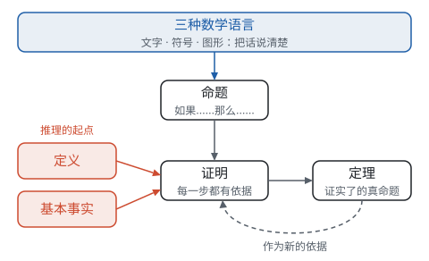

# 总览：数学怎样说话、怎样讲理

**数学先用文字、符号、图形三种语言把一件事说清楚，再从定义和基本事实出发，一步一步推出所有的结论。** 这一部分讲的就是这两件事：怎样说，怎样讲理。它是全书的工具，不属于哪一个年级，可以穿插着学。

## 这一部分的四页

| 页面 | 回答的问题 | 主要内容 | 最先用到的地方 |
| --- | --- | --- | --- |
| 第一部分“三种数学语言” | 同一个关系怎样用不同的方式说出来？ | 文字、符号、图形互相翻译；用字母表示一般规律 | 七年级上册列代数式 |
| 第一部分“定义、命题与定理” | 推理用的“材料”各是什么？ | 定义；命题的条件和结论；真假与反例；逆命题 | 七年级下册相交线与平行线 |
| 第一部分“基本事实” | 推理从哪里开始？ | 为什么需要起点；公理化方法；9 条基本事实各用在哪里 | 七年级上册几何图形初步 |
| 第一部分“怎样证明” | 怎样一步步推出结论？ | 书写格式；分析法和综合法；辅助线；反证法；代数推理 | 八年级上册三角形、全等三角形 |

## 推理的材料

| 类别 | 是什么 | 要不要证明 | 例子 |
| --- | --- | --- | --- |
| 定义 | 规定一个名称指的是什么 | 不需要，是约定 | 两条直线相交成直角，叫互相垂直 |
| 命题 | 判断一件事情的语句，有条件和结论 | 真的要证明，假的举反例 | 相等的角是对顶角（假命题） |
| 基本事实 | 公认正确、作为起点的真命题 | 不证明，直接用 | 两点确定一条直线 |
| 定理 | 经过证明的真命题 | 要证明 | 对顶角相等 |

## 四页之间的关系

- **三种语言是“说”。** 要推理，先得把题目读懂、把命题说清楚：文字叙述的命题要翻译成图形和符号，写成“已知、求证”；代数里用字母把“任意一个数”写出来。
- **定义、命题是“材料”。** 定义规定每个名称的意思；命题分成条件和结论，才知道从哪里出发、要到哪里去。
- **基本事实是“起点”。** 追问“为什么”总要有个尽头，这几条不证明的结论就是尽头。
- **证明是“方法”。** 从起点出发，每一步有依据，推出的真命题就是定理。定理又能当作新的依据，去证明下一个定理。

整个初中数学就是这样一层层搭起来的：对顶角相等 → 平行线的判定和性质 → 三角形内角和 → 多边形内角和……每一层都站在前一层上，最底下是定义和基本事实。

## 什么时候读哪一页

这一部分不必一口气读完，学到相关内容时回来读对应的部分，效果更好：

| 学到 | 读 |
| --- | --- |
| 七年级上册：用字母表示数、代数式 | “三种数学语言”的前半部分 |
| 七年级上册：几何图形初步 | “基本事实”中的直线和线段 |
| 七年级下册：相交线与平行线 | “定义、命题与定理”；“基本事实”中的垂线和平行线；“三种数学语言”中的几何翻译 |
| 七年级下册：解方程、解不等式 | “基本事实”中代数推理的起点 |
| 八年级上册：三角形、全等三角形 | “怎样证明”；“基本事实”中的三角形全等 |
| 八年级上册：整式的乘法 | “怎样证明”中的代数推理 |
| 九年级：相似 | “基本事实”中的平行线分线段成比例 |

全书各部分之间的关系，见[导读](../index.md)的框架图。
