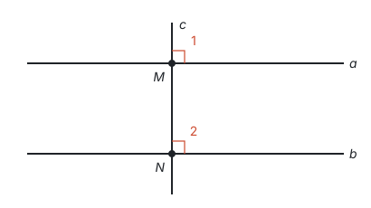
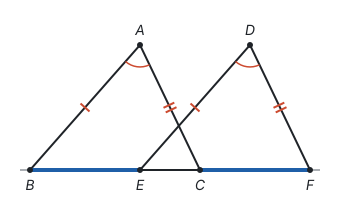
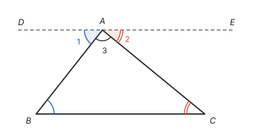
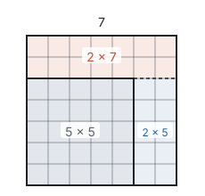

# 怎样证明 ★

> 对应人教版八年级上册第十三章阅读与思考“为什么要证明”。

**证明就是从已知条件出发，每一步都以定义、基本事实或已经证明的定理为依据，推出要证的结论。** 只要每一步都站得住，结论就对所有满足条件的情况成立，这是测量和举例做不到的。

## 为什么要证明

**测量有误差。** 用量角器量一个三角形的三个内角，加起来可能是 $179^\circ$，也可能是 $181^\circ$。量得再仔细，也只能说“差不多是 $180^\circ$”，不能说“恰好是 $180^\circ$”，更不能说“每个三角形都是”。

**举例是有限的。** 看式子 $n^2 + n + 41$：

| $n$ | 0 | 1 | 2 | 3 | 4 | … | 39 | 40 |
| --- | --- | --- | --- | --- | --- | --- | --- | --- |
| $n^2 + n + 41$ | 41 | 43 | 47 | 53 | 61 | … | 1601 | 1681 |

从 $n = 0$ 到 $n = 39$，算出的 40 个数全是质数。能不能说“$n$ 取任何自然数，$n^2 + n + 41$ 都是质数”？不能：$n = 40$ 时，

$$40^2 + 40 + 41 = 40 \times (40 + 1) + 41 = 41 \times 41,$$

不是质数。试对了 40 次，第 41 次就错了。

所以，测量和举例可以帮助发现规律、找到反例，但要确定一个结论**对所有情况都成立**，只能靠证明。

## 证明的样子：每一步都有依据

证明由一步一步的“因为……，所以……”组成，每一步后面用括号写出依据。能当依据的只有这几类：

| 依据 | 例子 |
| --- | --- |
| 已知条件 | $AB = DE$（已知） |
| 定义 | $\angle 1 = 90^\circ$（垂直的定义） |
| 基本事实 | $a \parallel b$（同位角相等，两直线平行） |
| 已经证明的定理 | $\angle 1 = \angle 3$（对顶角相等） |
| 等式、不等式的性质和运算律 | $\angle 1 = \angle 3$（等量代换） |

图上“看出来”的关系、没有证明过的猜想，都不能当依据。

## 几何证明的书写格式

题目直接给出图和条件时，写“证明”就行。如果要证的是一个用文字叙述的命题，要先翻译（见第一部分“三种数学语言”），完整的格式分三步：

1. 按题意画出图形；
2. 用图中的字母写出**已知**（条件）和**求证**（结论）；
3. 写出**证明**过程。

**例 1**　求证：在同一平面内，垂直于同一条直线的两条直线互相平行。

**思路：** 条件是“两条直线都垂直于同一条直线”，结论是“这两条直线平行”。先画直线 $c$，再画两条直线都和它垂直。要证平行，手里的工具是“同位角相等，两直线平行”；垂直给出的两个直角，正好是一对同位角。

**已知：** 如图，直线 $a \perp c$，垂足为 $M$；直线 $b \perp c$，垂足为 $N$。

**求证：** $a \parallel b$。

**证明：** 因为 $a \perp c$，$b \perp c$，所以 $\angle 1 = 90^\circ$，$\angle 2 = 90^\circ$（垂直的定义），所以 $\angle 1 = \angle 2$（等量代换），所以 $a \parallel b$（同位角相等，两直线平行）。

## 综合法和分析法

证明有两个思考方向：

- **综合法：** 从已知出发，看能推出什么，一步步推向结论。“由因导果”。
- **分析法：** 从结论出发，问“要证它，只要证什么”，一步步退到已知。“执果索因”。

找思路时常用分析法，写证明时用综合法。

**例 2**　如图，点 $B$、$E$、$C$、$F$ 在同一条直线上，$AB = DE$，$AC = DF$，$BE = CF$。求证：$\angle A = \angle D$。

**思路（分析法）：** 从结论往回想：

- 要证 $\angle A = \angle D$，只要证它们所在的 $\triangle ABC \cong \triangle DEF$；
- 两个三角形已有 $AB = DE$、$AC = DF$，还差一个条件。$\angle A$、$\angle D$ 是这两边的夹角，正是要证的，不能用；那就找第三边，只要证 $BC = EF$，就能用 SSS；
- $BC = BE + EC$，$EF = CF + EC$，已知 $BE = CF$，两边都加上公共部分 $EC$ 就行了。

退到这里，全是已知条件。整条思路是：

$$\angle A = \angle D \;\Leftarrow\; \triangle ABC \cong \triangle DEF \;\Leftarrow\; BC = EF \;\Leftarrow\; BE = CF.$$

**证明（综合法）：** 把上面的思路倒过来写。因为 $BE = CF$，所以 $BE + EC = CF + EC$，即 $BC = EF$。

在 $\triangle ABC$ 和 $\triangle DEF$ 中，

- $AB = DE$（已知），
- $AC = DF$（已知），
- $BC = EF$（已证），

所以 $\triangle ABC \cong \triangle DEF$（SSS），所以 $\angle A = \angle D$（全等三角形的对应角相等）。

**想一想：** 两种方法走的是同一条路，只是方向相反。

| 比较 | 分析法 | 综合法 |
| --- | --- | --- |
| 方向 | 从结论退向已知 | 从已知推向结论 |
| 每一步在问 | 要证这个，还缺什么？ | 由这些，能推出什么？ |
| 好处 | 目标明确，不容易走岔路 | 书写清楚，每一步的依据一目了然 |
| 用在 | 草稿上找思路 | 正式写证明 |

只用综合法，已知条件能推出的东西很多，不知道该往哪里走；只用分析法，写出来的是一串“只要证”，读起来费力。先分析、后综合，是证明题最常用的办法。

## 添辅助线：把条件和结论接上

有时图里现成的线不够用，要添上新的线，叫**辅助线**，画成虚线。辅助线不是凭空想出来的，是分析“缺什么”的结果。

**例 3**　求证：三角形的内角和等于 $180^\circ$。

**思路：** $180^\circ$ 在哪里见过？平角是 $180^\circ$。可是三个角分散在三个顶点，要想办法把它们“搬”到同一个顶点，拼成一个平角。能把一个角原样搬到别处的工具是平行线：两直线平行，内错角相等。所以过点 $A$ 作 $BC$ 的平行线。

**已知：** $\triangle ABC$。

**求证：** $\angle BAC + \angle B + \angle C = 180^\circ$。

**证明：** 过点 $A$ 作直线 $DE \parallel BC$。

因为 $DE \parallel BC$，所以 $\angle 1 = \angle B$，$\angle 2 = \angle C$（两直线平行，内错角相等）。

因为 $D$、$A$、$E$ 在同一条直线上，所以 $\angle 1 + \angle 3 + \angle 2 = 180^\circ$（平角的定义）。

所以 $\angle B + \angle 3 + \angle C = 180^\circ$（等量代换），即 $\angle BAC + \angle B + \angle C = 180^\circ$。

**回顾：** 图中的动画把 $\angle B$ 绕 $AB$ 的中点旋转 $180^\circ$，它正好落在 $\angle 1$ 的位置；$\angle C$ 绕 $AC$ 的中点旋转 $180^\circ$，落在 $\angle 2$ 的位置。辅助线 $DE$ 的作用，就是给这两个角一个“落脚的地方”。过点 $A$ 能作出这条平行线，而且只有一条，依据是“过直线外一点有且只有一条直线与这条直线平行”（见第一部分“基本事实”）。

## 反证法（了解）

有的结论直接证不好下手，可以反过来想：**假设结论不成立，从这个假设出发推出矛盾，说明假设是错的，所以结论成立。** 这种方法叫**反证法**，步骤是：

1. 假设结论的反面成立；
2. 从假设出发，推出和已知条件、定义、基本事实或定理相矛盾的结果；
3. 所以假设不成立，原结论成立。

**例 4**　求证：一个三角形的三个内角中，至少有一个角大于或等于 $60^\circ$。

**思路：** “至少有一个”不知道是哪一个，直接证不好说。它的反面是“三个角都小于 $60^\circ$”，这很具体，可以算。

**证明：** 假设三角形的三个内角都小于 $60^\circ$，那么三个内角的和小于 $60^\circ \times 3 = 180^\circ$，这和“三角形的内角和等于 $180^\circ$”矛盾。所以假设不成立，三个内角中至少有一个大于或等于 $60^\circ$。

结论里出现“至少”“至多”“只有一个”“不是”“不可能”这类说法时，常常考虑反证法。前面已经用过几次：说明两条直线相交只有一个交点，是假设有两个交点 $P$、$Q$，那么经过 $P$、$Q$ 就有两条不同的直线，和“两点确定一条直线”矛盾；说明平行于同一条直线的两条直线平行，是假设直线 $a$、$b$ 都和 $l$ 平行，而 $a$、$b$ 相交于点 $P$，那么过点 $P$ 就有两条直线和 $l$ 平行，和“过直线外一点有且只有一条直线与这条直线平行”矛盾（见第一部分“基本事实”）。

## 代数推理：用字母说明一般规律

代数里的结论也要证明。“对所有的数都成立”，就用字母表示任意的数，再按运算律和公式推理。

**例 5**　说明：两个连续奇数的平方差是 8 的倍数。

**思路：** 先试几个：$3^2 - 1^2 = 8$，$5^2 - 3^2 = 16$，$7^2 - 5^2 = 24$，都是 8 的倍数。但试多少个都不够，要用字母表示“任意两个连续奇数”：设 $n$ 是整数，较大的奇数是 $2n + 1$，较小的是 $2n - 1$。

**解：**

$$\begin{aligned} (2n + 1)^2 - (2n - 1)^2 &= (4n^2 + 4n + 1) - (4n^2 - 4n + 1) \\ &= 8n. \end{aligned}$$

$n$ 是整数，所以 $8n$ 是 8 的倍数，即两个连续奇数的平方差是 8 的倍数。

**想一想：** 用平方差公式，算得更快：

$$(2n + 1)^2 - (2n - 1)^2 = \big[(2n + 1) + (2n - 1)\big]\big[(2n + 1) - (2n - 1)\big] = 4n \times 2 = 8n.$$

还可以画出来看。取 $n = 3$，从 $7 \times 7$ 的正方形里去掉 $5 \times 5$ 的正方形，剩下一个宽为 2 的 L 形：

L 形可以分成 $2 \times 7$ 和 $2 \times 5$ 两块，面积是 $2 \times (7 + 5) = 24$。一般地，L 形的宽总是两个奇数的差 2，两块的长加起来是两个奇数的和 $4n$，面积是 $2 \times 4n = 8n$。展开计算、用公式、画面积图，是同一个事实的三种说法。

## 易错点

- **用要证的结论当依据。** 要证 $a \parallel b$，却写“因为 $a \parallel b$，所以同位角相等”，这是拿结论去证结论，叫循环论证。
- **判定和性质用反了方向。** 要证平行，用“……，两直线平行”（判定）；已知平行，才能用“两直线平行，……”（性质）。
- **把图上看出来的关系当条件。** 看起来相等、垂直、共线的，没有给出、没有证明，就不能写进证明。
- **举例代替证明。** 验证了几个数、量了几个图，只能说“可能对”。说明“对所有情况都对”，要用字母或一般的图形推理。
- **反证法的假设不是结论的反面。** “至少有一个角大于或等于 $60^\circ$”的反面是“三个角都小于 $60^\circ$”，不是“至少有一个角小于 $60^\circ$”。
- **辅助线交代不清，或者要求太多。** 要写清楚怎样作：“过点 $A$ 作 $DE \parallel BC$”。不能让一条辅助线同时满足两个条件，比如“过点 $A$ 作 $AD$ 平分 $\angle BAC$ 且垂直于 $BC$”，这样的线不一定存在。
- **代数推理没交代字母的范围。** 用 $2n + 1$ 表示奇数，要说明 $n$ 是整数；否则 $n = 0.5$ 时 $2n + 1 = 2$，不是奇数。

## 联系

- **定义、命题与定理：** 证明是判断命题真假的方法，证明过的真命题就是定理。见第一部分“定义、命题与定理”。
- **基本事实：** 证明的依据往回追，最后都落在定义和基本事实上。见第一部分“基本事实”。
- **三种数学语言：** 写“已知、求证”就是把文字命题翻译成图形和符号。见第一部分“三种数学语言”。
- **三角形：** 内角和定理和它的推论，都是用这里的方法证出来的。见第五部分“三角形”。
- **全等三角形：** 证线段相等、角相等，最常用的就是“分析法找全等，综合法写全等”。见第五部分“全等三角形”。
- **整式的乘法：** 平方差公式可以用来做代数推理，也可以用面积来看。见第三部分“整式的乘法”。
- **平移、轴对称与旋转：** 例 3 证明内角和时过点 $A$ 作 $DE \parallel BC$，$\angle B$ 绕 $AB$ 中点旋转 $180^\circ$ 落到 $\angle 1$（即 $\angle DAB$）的位置，这是中心对称。见第六部分“平移、轴对称与旋转”。
- **实数：** 说明 $\sqrt{2}$ 不是有理数，用的也是反证法。见第二部分“实数”。
- **辅助线：** 常用的辅助线有哪些、各自为了接上什么条件。见第十一部分“辅助线从哪里来”。
