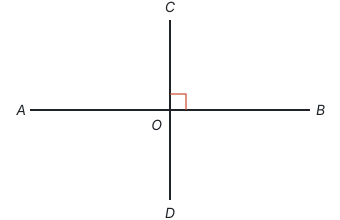
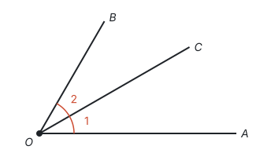
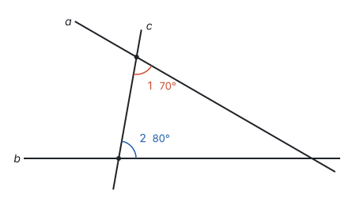
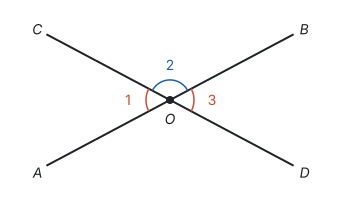
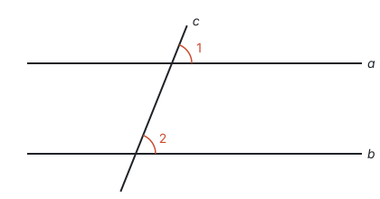

# 定义、命题与定理

> 对应人教版七年级下册 7.3。

**定义规定一个名称指的是什么；命题是判断一件事情的语句，由条件和结论组成；从定义、基本事实出发，经过推理证实是正确的命题，叫定理。** 读数学书时，先分清一句话是在下定义，还是在说一个命题；推理，就是用定义和已知的真命题去判断新命题的真假。

## 定义：先把话说清楚

两个同学争论两条直线算不算“垂直”，如果没有一个共同的标准，就永远争不出结果。数学先把名称的意思规定下来，这就是**定义**。比如：

**两条直线相交所成的四个角中，有一个角是直角时，就说这两条直线互相垂直。**

注意这个定义只要求“有一个角是直角”。另外三个角也是直角，是可以推出来的：$\angle AOC$ 和 $\angle BOC$ 合成平角 $\angle AOB$，$\angle BOD$ 和 $\angle BOC$ 合成平角 $\angle COD$，所以它们都等于 $180^\circ - 90^\circ = 90^\circ$；剩下的 $\angle AOD$ 和 $\angle AOC$ 合成平角 $\angle COD$，同样等于 $180^\circ - 90^\circ = 90^\circ$。定义里只写最少的条件，其余的特征留给推理，这是数学定义的习惯。

**定义可以正着用，也可以反着用：**

- 已知 $AB \perp CD$，可以得出 $\angle BOC = 90^\circ$（垂直的定义）；
- 已知 $\angle BOC = 90^\circ$，可以得出 $AB \perp CD$（垂直的定义）。

所以定义既能用来判断“是不是”，也能用来推出“有什么特征”。

很多定义的写法是：在一类已经知道的对象里，用一个特征划出一部分。

| 概念 | 从哪一类里划出来 | 划分的特征 |
| --- | --- | --- |
| 等腰三角形 | 三角形 | 有两条边相等 |
| 平行四边形 | 四边形 | 两组对边分别平行 |
| 方程 | 等式 | 含有未知数 |
| 一元一次方程 | 方程 | 等号两边都是整式，只含一个未知数，未知数的次数是 1 |

定义是约定，不需要证明；但一经约定，就要严格按它来判断。判断两个角是不是对顶角，要看它们是不是两条直线相交形成的、有公共顶点、两边互为反向延长线，而不是看它们相不相等。

## 命题：条件和结论

**判断一件事情的语句，叫命题。** “对顶角相等”“两个负数的积是正数”都是命题；“$2 + 3 = 6$”也是命题，只不过判断错了。“画线段 $AB = 3$ cm”“$\angle 1$ 和 $\angle 2$ 相等吗？”没有作出判断，不是命题。

命题由**条件**和**结论**两部分组成：条件是已知的事项，结论是由条件推出的事项。把命题改写成“如果……那么……”，条件和结论就分开了：

| 命题 | 如果（条件） | 那么（结论） |
| --- | --- | --- |
| 对顶角相等 | 两个角是对顶角 | 这两个角相等 |
| 两个负数的积是正数 | 两个数都是负数 | 它们的积是正数 |
| 同角的补角相等 | 两个角是同一个角的补角 | 这两个角相等 |
| 两直线平行，同位角相等 | 两条平行线被第三条直线所截 | 所得的同位角相等 |
| 等腰三角形的两个底角相等 | 一个三角形是等腰三角形 | 它的两个底角相等 |

有的命题条件写在前面（“两直线平行，同位角相等”），有的藏在主语里（“对顶角相等”的条件是“两个角是对顶角”）。改写时先问：这句话在说谁、这个“谁”已知有什么特征？这就是条件；说它“怎么样”的部分，就是结论。

## 真命题、假命题和反例

- **真命题：** 如果条件成立，那么结论一定成立。
- **假命题：** 条件成立时，不能保证结论成立。

说明一个命题是假命题，只要举出**一个反例**：满足条件、却不满足结论的例子。比如“相等的角是对顶角”：

$OC$ 平分 $\angle AOB$，$\angle 1 = \angle 2$，满足条件“两个角相等”；它们是相邻的两个角，不是对顶角，不满足结论。一个反例就够了。

代数里也一样。“如果 $a^2 = b^2$，那么 $a = b$”是假命题，反例是 $a = 2$，$b = -2$：$a^2 = b^2 = 4$，但 $a \ne b$。

反过来，说明一个命题是真命题，举多少个例子都不够，因为例子是举不完的，必须用推理证明（见第一部分“怎样证明”）。

**例 1**　下列命题是真命题还是假命题？假命题请举出反例。

1. 两个锐角的和是钝角。
2. 如果 $a > b$，那么 $a^2 > b^2$。
3. 同旁内角互补。
4. 如果一个整数是 4 的倍数，那么它是 2 的倍数。

**思路：** 先分清条件和结论。怀疑是假命题，就在满足条件的例子里找一个不满足结论的；觉得是真命题，就要说出对所有情况都成立的理由。

**解：**

1. 假命题。$30^\circ$ 和 $40^\circ$ 都是锐角，和是 $70^\circ$，不是钝角。
2. 假命题。$a = 1$，$b = -2$ 时，$a > b$，但 $a^2 = 1$，$b^2 = 4$，$a^2 < b^2$。
3. 假命题。条件里没有“两直线平行”。两条不平行的直线被第三条直线所截，同旁内角的和不等于 $180^\circ$。反例见下图：直线 $a$、$b$ 不平行，被直线 $c$ 所截，同旁内角 $\angle 1 = 70^\circ$，$\angle 2 = 80^\circ$，和是 $150^\circ$。
4. 真命题。4 的倍数可以写成 $4k$（$k$ 是整数），$4k = 2 \times 2k$，$2k$ 也是整数，所以它是 2 的倍数。

**回顾：** 第 2 题的反例要用到负数，第 3 题的毛病出在漏掉了条件。找反例时，专门去试那些“不太一样”的情况：负数和 0、钝角和直角、不平行的直线、不等腰的三角形。

## 定理、推论和基本事实

真命题里，有几条是公认正确、不加证明、作为推理起点的，叫**基本事实**（见第一部分“基本事实”）。从定义、基本事实出发，经过推理证实为正确的命题，叫**定理**。定理证明之后，又可以当作新的依据去证明别的命题。

比如“对顶角相等”就是定理，证明它只用到平角和补角：

$A$、$O$、$B$ 在一条直线上，所以 $\angle 1 + \angle 2 = 180^\circ$；$C$、$O$、$D$ 在一条直线上，所以 $\angle 2 + \angle 3 = 180^\circ$。$\angle 1$ 和 $\angle 3$ 都是 $\angle 2$ 的补角，所以 $\angle 1 = \angle 3$（同角的补角相等）。

由一个定理直接推出的真命题，叫这个定理的**推论**。比如由“三角形内角和等于 $180^\circ$”，马上推出“直角三角形的两个锐角互余”。

| 类别 | 是什么 | 要不要证明 | 例子 |
| --- | --- | --- | --- |
| 定义 | 规定名称的意思 | 不需要，是约定 | 有一个角是直角的两条相交直线互相垂直 |
| 基本事实 | 公认正确的推理起点 | 不证明，直接用 | 两点确定一条直线 |
| 定理 | 经过证明的真命题 | 要证明 | 对顶角相等 |
| 推论 | 由定理直接推出的真命题 | 要证明，通常很短 | 直角三角形的两个锐角互余 |

## 逆命题

把一个命题的条件和结论互换，得到的新命题叫原命题的**逆命题**。

- “两直线平行，同位角相等”的逆命题是“同位角相等，两直线平行”，两个都是真命题。
- “对顶角相等”的逆命题是“相等的角是对顶角”。前面举过反例：$OC$ 平分 $\angle AOB$，分成的 $\angle 1 = \angle 2$，但它们是相邻的两个角，不是对顶角，所以它是假命题。

**原命题是真命题，逆命题不一定是真命题。** 如果一个定理的逆命题也经过证明是真命题，它就是原定理的**逆定理**，这两个定理叫互逆定理。

上图里，“$a \parallel b$”和“$\angle 1 = \angle 2$”可以互相推出。从角推出平行，是平行线的**判定**；从平行推出角，是平行线的**性质**。几何里的判定和性质，常常就是这样一对互逆的命题：

| 性质：已知是什么图形，推出它的特征 | 判定：已知有这些特征，推出是什么图形 |
| --- | --- |
| 两直线平行，同位角相等 | 同位角相等，两直线平行 |
| 等腰三角形的两个底角相等 | 有两个角相等的三角形是等腰三角形 |
| 角平分线上的点到角两边的距离相等 | 角的内部到角两边距离相等的点在角的平分线上 |
| 直角三角形两直角边的平方和等于斜边的平方 | 两边的平方和等于第三边的平方的三角形是直角三角形 |
| 平行四边形的两组对边分别相等 | 两组对边分别相等的四边形是平行四边形 |

证明时选哪一个，看方向：**要证“是什么”，用判定；已知“是什么”，用性质。** 已知 $a \parallel b$，要得到角相等，用性质；要证 $a \parallel b$，用判定。

**例 2**　写出下列命题的逆命题，并判断逆命题的真假。

1. 两直线平行，内错角相等。
2. 如果 $x = 2$，那么 $x^2 = 4$。
3. 全等三角形的对应角相等。

**思路：** 先把原命题写成“如果……那么……”，把两部分交换位置，再整理成通顺的句子。判断真假时，把逆命题当作一个全新的命题来对待，不要受原命题的影响。

**解：**

1. 逆命题：内错角相等，两直线平行。真命题。
2. 逆命题：如果 $x^2 = 4$，那么 $x = 2$。假命题，反例是 $x = -2$。
3. 原命题改写为“如果两个三角形全等，那么它们的对应角相等”，逆命题是：如果两个三角形的三个角分别相等，那么这两个三角形全等。假命题：把一个三角形按比例放大，三个角都不变，但两个三角形大小不同，不全等。

## 易错点

- **反例只满足了一半。** 反例必须满足条件、不满足结论。要说明“如果 $a > b$，那么 $a^2 > b^2$”是假命题，取 $a = -3$，$b = 2$ 不行，因为 $-3 > 2$ 不成立，这组数连条件都不满足。
- **以为原命题真，逆命题也真。** 原命题和逆命题的真假没有必然联系，逆命题要重新判断。
- **漏掉隐含的条件。** “同旁内角互补”“内错角相等”单独说都是假命题，少了“两直线平行”这个条件。
- **举几个例子就说是真命题。** 例子只能帮助发现规律、找反例；说明一个命题对所有情况都成立，要靠证明。
- **不按定义判断。** 判断对顶角、垂直、等腰三角形，要按定义逐条检查，不能凭“看起来像”或“大小相等”。
- **条件和结论找错。** “等角的余角相等”的条件是“两个角分别是两个相等的角的余角”，结论是“这两个角相等”。条件不是“两个角相等”。

## 联系

- **基本事实：** 不证明、作为推理起点的真命题。见第一部分“基本事实”。
- **证明：** 判断一个命题是真命题，要用证明。见第一部分“怎样证明”。
- **平行线：** 平行线的判定和性质是互逆的两组命题。见第五部分“相交线与平行线”。
- **等腰三角形：** “等边对等角”和“等角对等边”互为逆定理。见第五部分“轴对称与等腰三角形”。
- **角平分线：** 角平分线的性质和判定互为逆定理。见第五部分“全等三角形”。
- **勾股定理：** 勾股定理和它的逆定理，一个由直角推出边的关系，一个由边的关系推出直角。见第五部分“勾股定理”。
- **四边形：** 平行四边形、矩形、菱形、正方形都有一组性质和一组判定，很多是互逆的。见第五部分“四边形”。
- **绝对值：** 绝对值的定义是“到原点的距离”，它的性质都从这个定义推出来。见第二部分“有理数”。
