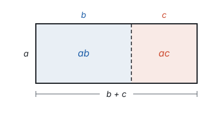
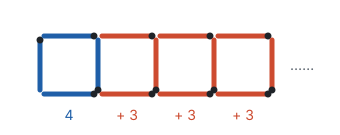
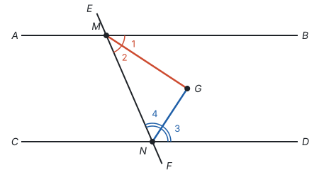

# 三种数学语言

> 对应人教版七年级上册第三章、七年级下册 7.3。

**同一个数学关系可以用三种语言来说：文字语言好懂，符号语言简洁、能直接运算，图形语言直观。** 读题、列式、画图、写证明，其实都是在这三种语言之间翻译。

## 从哪里来

小学学过的乘法分配律，可以用三种方式说出来：

| 语言 | 乘法分配律 |
| --- | --- |
| 文字语言 | 一个数乘两个数的和，等于把这个数分别乘这两个数，再把两个积相加 |
| 符号语言 | $a(b + c) = ab + ac$ |
| 图形语言 | 宽为 $a$、长为 $b + c$ 的长方形，面积可以整体算，也可以分成两块算 |

三种说法讲的是同一件事。文字适合第一次理解；符号只用一行，而且可以接着算下去；图形让人一眼看出它为什么对：大长方形被虚线分成两块，整体的面积当然等于两块面积的和。

## 三种语言各有长处

| 语言 | 长处 | 短处 | 适合做什么 |
| --- | --- | --- | --- |
| 文字语言 | 好懂，能说清前因后果 | 长，不便计算，有时有歧义 | 读题；叙述定义、定理 |
| 符号语言 | 简洁、准确，能按规则运算和推理 | 抽象，看不出直观的意思 | 列式、计算、写证明 |
| 图形语言 | 直观，容易看出位置关系和解题方向 | 只画出一种情况，看出来的不能当依据 | 理解题意、找思路、检验答案 |

文字的歧义是真实存在的。“$a$ 与 $b$ 的和的平方”和“$a$ 与 $b$ 的平方和”只差一个“的”字，意思却不同，前者是 $(a + b)^2$，后者是 $a^2 + b^2$。写成符号，就不会有第二种理解。

## 用字母表示数

符号语言的核心是**用字母表示数**。字母可以表示：

- **一般规律：** $a + b = b + a$ 这一个式子，代替了 $1 + 2 = 2 + 1$、$3.5 + 7 = 7 + 3.5$ 等无数个算式；
- **公式：** 长方形面积 $S = ab$，圆的周长 $C = 2\pi r$；
- **未知数：** 列方程时，用 $x$ 表示要求的量（见第四部分“一元一次方程”）；
- **变量：** 一个量随另一个量变化时，用 $x$、$y$ 表示它们（见第七部分“函数”）。

字母代表的数可以是正数、负数，也可以是 0。所以 $-a$ 不一定是负数：$a = -3$ 时，$-a = 3$。

**例 1**　用火柴棒按下图的方式摆正方形。摆 $n$ 个正方形，需要多少根火柴棒？

**思路：** 先数具体的：1 个正方形 4 根，2 个 7 根，3 个 10 根，4 个 13 根。再看是怎样多出来的：第 1 个正方形用 4 根，以后每多摆一个，左边那根和前一个正方形共用，只要再加 3 根。把这个“数法”翻译成符号就行。

**解：** 第 1 个正方形用 4 根，后面还有 $n - 1$ 个正方形，每个用 3 根，共需

$$4 + 3(n - 1) = 3n + 1$$

根火柴棒。

**检验：** $n = 4$ 时，$3 \times 4 + 1 = 13$，和数出来的一样。

**想一想：** 同一张图，换一种看法，就得到另一个式子：

| 看法 | 式子 |
| --- | --- |
| 第 1 个正方形 4 根，以后每个再加 3 根 | $4 + 3(n - 1)$ |
| 每个正方形都只算上、下、右 3 根，最后补上最左边 1 根 | $3n + 1$ |
| 横放的分上下两排，每排 $n$ 根；竖放的有 $n + 1$ 根 | $2n + (n + 1)$ |
| 每个正方形都算 4 根，再减去重复算了的 $n - 1$ 根 | $4n - (n - 1)$ |

四个式子化简后都是 $3n + 1$（见第三部分“整式的加减”）。数的方法不同，数的却是同一堆火柴，所以结果一定相等。这正是化简的意义：看起来不同的式子，其实表示同一个数量。

**例 2**　任意写一个个位不是 0 的两位数，把它的十位数字和个位数字交换，得到一个新的两位数。说明：这两个数的和一定是 11 的倍数。

**思路：** 试几个：$23 + 32 = 55$，$47 + 74 = 121$，都是 11 的倍数。但“任意”一个两位数有很多个，一个个试不完，要用字母表示一般的两位数。

**解：** 设原来的两位数十位数字是 $a$，个位数字是 $b$，这个数是 $10a + b$；交换后的数是 $10b + a$。它们的和是

$$(10a + b) + (10b + a) = 11a + 11b = 11(a + b).$$

$a + b$ 是整数，所以和是 11 的倍数。

这里的关键一步是翻译：十位数字是 $a$、个位数字是 $b$ 的两位数，是 $10a + b$，不是 $ab$。用字母说明一般规律，就是代数推理（见第一部分“怎样证明”）。

## 几何里的翻译

几何题常常三种语言一起出现：题目用文字叙述，配一张图，证明要用符号写。常见的说法这样对应：

| 文字语言 | 符号语言 |
| --- | --- |
| 点 $C$ 是线段 $AB$ 的中点 | $AC = CB = \frac{1}{2}AB$ |
| 射线 $OC$ 平分 $\angle AOB$ | $\angle AOC = \angle BOC = \frac{1}{2}\angle AOB$ |
| 直线 $AB$ 与 $CD$ 垂直，垂足为 $O$ | $AB \perp CD$ 于点 $O$，$\angle AOC = 90^\circ$ |
| 直线 $a$ 与 $b$ 平行 | $a \parallel b$ |
| $\angle 1$ 与 $\angle 2$ 互补 | $\angle 1 + \angle 2 = 180^\circ$ |
| $\triangle ABC$ 与 $\triangle DEF$ 全等 | $\triangle ABC \cong \triangle DEF$ |

一个用文字叙述、没有图的几何命题，要证明它，先要做三件事：

1. 分清条件和结论（见第一部分“定义、命题与定理”）；
2. 按条件画图，给点和线起名字，画一般的情况，不要画成特殊图形；
3. 用图上的字母把条件写成“已知”，把结论写成“求证”。

**例 3**　把命题“两条平行线被第三条直线所截，同旁内角的平分线互相垂直”写成已知、求证，并证明。

**思路：** 条件是“两条平行线被第三条直线所截”和“画出一对同旁内角的平分线”，结论是“这两条平分线互相垂直”。文字里一个字母也没有，要先画图、起名字，再用这些名字写出已知和求证。

**已知：** 如图，$AB \parallel CD$，直线 $EF$ 分别交 $AB$、$CD$ 于点 $M$、$N$，$MG$ 平分 $\angle BMN$，$NG$ 平分 $\angle DNM$，$MG$ 与 $NG$ 交于点 $G$。

**求证：** $MG \perp NG$。

图中 $\angle 1$、$\angle 2$ 是 $\angle BMN$ 被 $MG$ 分成的两个角，$\angle 3$、$\angle 4$ 是 $\angle DNM$ 被 $NG$ 分成的两个角。翻译好了，证明的方向也就清楚了：要证垂直，就是要证 $\angle MGN = 90^\circ$；它在 $\triangle MGN$ 里，只要算出另外两个角 $\angle 2$、$\angle 4$ 的和。

**证明：** 因为 $AB \parallel CD$，所以 $\angle BMN + \angle DNM = 180^\circ$（两直线平行，同旁内角互补）。因为 $MG$ 平分 $\angle BMN$，$NG$ 平分 $\angle DNM$，所以

$$\angle 2 + \angle 4 = \frac{1}{2}\angle BMN + \frac{1}{2}\angle DNM = \frac{1}{2} \times 180^\circ = 90^\circ.$$

在 $\triangle MGN$ 中，$\angle MGN = 180^\circ - (\angle 2 + \angle 4) = 90^\circ$（三角形内角和等于 $180^\circ$），所以 $MG \perp NG$。

## 图形语言也能说代数

图形不只属于几何。代数里的很多关系，都能画出来：

| 符号语言 | 图形语言 | 见 |
| --- | --- | --- |
| $\lvert a \rvert$ | 数轴上表示 $a$ 的点到原点的距离 | 第二部分“有理数” |
| $x > 2$ | 数轴上 2 右边的部分 | 第四部分“不等式与不等式组” |
| $(a + b)^2 = a^2 + 2ab + b^2$ | 边长为 $a + b$ 的正方形分成四块 | 第三部分“整式的乘法” |
| $y = 2x + 1$ | 一条直线 | 第七部分“一次函数” |
| 二元一次方程组的解 | 两条直线的交点 | 第四部分“二元一次方程组” |

一道代数题卡住了，试着把它画出来；一张图看不出结论，试着用字母把它算出来。这两个方向的翻译，贯穿整本书。

## 易错点

- **文字翻成符号时弄错运算顺序。** 先找出最后一步做的是什么运算：“$a$ 与 $b$ 的和的平方”最后做平方，是 $(a + b)^2$；“$a$ 与 $b$ 的平方和”最后做加法，是 $a^2 + b^2$。“比 $a$ 的 2 倍少 3”是 $2a - 3$，不是 $3 - 2a$。
- **把两位数写成 $ab$。** 字母连写表示相乘，$ab$ 是 $a \times b$。十位数字是 $a$、个位数字是 $b$ 的两位数是 $10a + b$。
- **以为 $-a$ 一定是负数。** 字母可以表示任何数，$a$ 是负数时，$-a$ 是正数。
- **代数式书写不规范。** 数字写在字母前面，写 $2a$ 不写 $a2$；字母和字母、数字和字母相乘时乘号可以省略，数字和数字相乘不能省略；带分数和字母相乘要写成假分数，一又二分之一乘 $a$ 写成 $\frac{3}{2}a$；除法一般写成分数的形式。
- **把图上“看起来”的关系当成条件。** 看起来垂直、相等、在一条直线上，题目没有给出、也没有证明，就不能用。图形语言帮助找思路，不能当依据。
- **画图只画了特殊情况。** 题目说“三角形”，却画成等腰三角形或直角三角形，就容易把特殊图形才有的性质当成一般结论。

## 联系

- **代数式：** 用字母表示数量关系，就是把文字语言翻译成符号语言。见第三部分“代数式”。
- **整式的加减：** 例 1 摆 $n$ 个正方形的火柴棒问题，$4 + 3(n - 1)$、$2n + (n + 1)$、$4n - (n - 1)$ 这几个式子看起来不同，化简后都是 $3n + 1$。见第三部分“整式的加减”。
- **整式的乘法：** 分配律、乘法公式都有面积模型，是符号和图形的互相翻译。见第三部分“整式的乘法”。
- **函数：** 函数的解析式和图象，是同一个对应关系的符号语言和图形语言。见第七部分“函数”。
- **证明：** 写“已知、求证”就是把文字命题翻译成图形和符号。见第一部分“怎样证明”。
