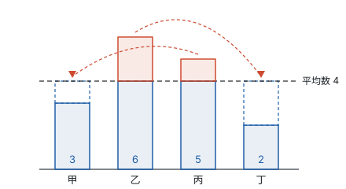
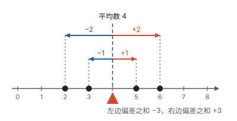
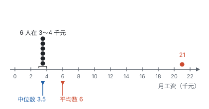
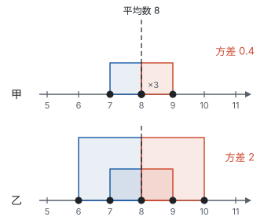
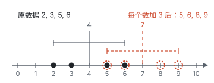
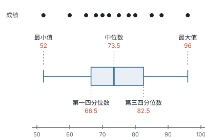
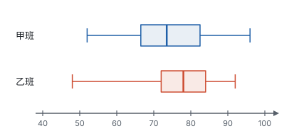

# 数据的分析 ★

> 对应人教版八年级下册第二十四章。

**分析一组数据，主要看两件事：数据集中在哪里（平均数、中位数、众数），数据分散得多开（极差、方差、四分位数）。**

## 从哪里来

甲、乙两名射击队员各打 5 枪，成绩（环）如下：

| 队员 | 第 1 枪 | 第 2 枪 | 第 3 枪 | 第 4 枪 | 第 5 枪 |
| --- | --- | --- | --- | --- | --- |
| 甲 | 7 | 8 | 8 | 8 | 9 |
| 乙 | 6 | 7 | 8 | 9 | 10 |

谁打得好？先算总环数：两人都是 40 环，平均每枪都是 8 环。只看“平均打几环”，两人一样好。可是一眼就能看出两人不一样：甲每枪都在 8 环上下，很稳定；乙时好时坏，忽高忽低。

这说明一组数据至少要用两类数来描述：一类说明数据的**集中趋势**，也就是“一般水平”在哪里；另一类说明数据的**离散程度**，也就是数据分散得开不开、稳定不稳定。这一页先讲第一类，再讲第二类。

## 平均数：移多补少

**一组数据的总和除以数据的个数，叫这组数据的平均数，** 记作 $\bar{x}$（读作“$x$ 拔”）：

$$\bar{x} = \frac{x_1 + x_2 + \cdots + x_n}{n}.$$

平均数的意思是“匀一匀”：把多的移给少的，让每个数据都变得一样多，这个一样多的数就是平均数。比如甲、乙、丙、丁四人上个月分别读了 3、6、5、2 本书，总共 16 本，平均每人 4 本。下图中，乙比平均数多的 2 本移给丁，丙多的 1 本移给甲，四个长条就一样高了：

**比平均数多出来的总量，正好等于比平均数少的总量。** 每个数据与平均数的差 $x_i - \bar{x}$ 叫这个数据的**偏差**，多的是正的，少的是负的。偏差加起来总是 0：

$$\begin{aligned} (x_1 - \bar{x}) + (x_2 - \bar{x}) + \cdots + (x_n - \bar{x}) &= (x_1 + x_2 + \cdots + x_n) - n\bar{x} \\ &= n\bar{x} - n\bar{x} = 0. \end{aligned}$$

第二步用的是平均数的定义：总和等于 $n\bar{x}$。把数据画在数轴上，平均数就像跷跷板的支点：左边的偏差加起来是 $-3$，右边的加起来是 $+3$，正好平衡：

这个事实后面算方差时还要用到。

## 加权平均数：每个数据的分量不一样

**数据重复出现时。** 甲的 5 枪成绩 7、8、8、8、9 中，8 出现了 3 次，可以把 3 个 8 合起来算：

$$\bar{x} = \frac{7 \times 1 + 8 \times 3 + 9 \times 1}{1 + 3 + 1} = \frac{40}{5} = 8.$$

一般地，数据 $x_1, x_2, \cdots, x_k$ 分别出现 $f_1, f_2, \cdots, f_k$ 次，平均数是

$$\bar{x} = \frac{x_1 f_1 + x_2 f_2 + \cdots + x_k f_k}{f_1 + f_2 + \cdots + f_k}.$$

这里的 $f_1, f_2, \cdots, f_k$ 叫**权**，这样算出的平均数叫**加权平均数**。“权”就是秤砣，出现次数多的数据，在平均数里的分量就重。

**数据的重要程度不一样时。** 权不一定是次数，也可以是人为规定的重要程度。

**例 1**　公司招聘，笔试和面试成绩如下。按笔试和面试 6 : 4 的比例计算总分，谁被录取？如果改成 4 : 6 呢？

| 应聘者 | 笔试 | 面试 |
| --- | --- | --- |
| A | 90 | 75 |
| B | 78 | 88 |

**思路：** “按 6 : 4 计算”就是笔试的权是 6，面试的权是 4，用加权平均数。

**解：** 按 6 : 4 计算：

$$\bar{x}_A = \frac{90 \times 6 + 75 \times 4}{6 + 4} = 84, \qquad \bar{x}_B = \frac{78 \times 6 + 88 \times 4}{6 + 4} = 82.$$

A 的总分高，录取 A。

按 4 : 6 计算：

$$\bar{x}_A = \frac{90 \times 4 + 75 \times 6}{4 + 6} = 81, \qquad \bar{x}_B = \frac{78 \times 4 + 88 \times 6}{4 + 6} = 84.$$

B 的总分高，录取 B。

**回顾：** 同样的成绩，权变了，结果就反过来。重视笔试，笔试好的 A 占优；重视面试，面试好的 B 占优。权反映的正是“看重什么”。如果不加权（相当于权都是 1），A 是 82.5 分，B 是 83 分。

**分组数据的平均数。** 数据已经分组、不知道每个数据的具体值时，用每组两个端点的平均数，也就是**组中值**，代表这一组的数据，再按各组的频数加权。第十部分“数据的收集、整理与描述”里 50 名同学的跳绳次数，5 组的组中值是 90、110、130、150、170，频数是 4、9、16、13、8：

$$\bar{x} \approx \frac{90 \times 4 + 110 \times 9 + 130 \times 16 + 150 \times 13 + 170 \times 8}{50} = \frac{6740}{50} = 134.8.$$

这是估计值，因为每组里的数据不一定正好都等于组中值。

## 中位数和众数：不怕极端值

**把一组数据从小到大排列，处在最中间的数叫中位数；** 数据个数是偶数时，中间有两个数，取它们的平均数。**一组数据中出现次数最多的数叫众数。**

有了平均数，为什么还要中位数？看一个例子：某小店 7 名员工的月工资（元）是

3000，3200，3500，3500，3800，4000，21000。

最后一个 21000 是店长的工资。平均数是 $42000 \div 7 = 6000$（元），可是 7 个人里有 6 个人的工资不超过 4000 元，远低于 6000 元。平均数被一个特别大的数拉高了：

中位数是排在第 4 位的 3500 元，众数也是 3500 元，它们更能代表“一般员工”的工资。原因在于：平均数用到了每个数据的**大小**，一个数据变大，平均数就跟着变大；中位数只看数据的**排列位置**，把 21000 换成 100000，它仍然排在最后，中位数不变。

三个数各有长处：

| 统计量 | 怎样得到 | 长处 | 短处 | 适合 |
| --- | --- | --- | --- | --- |
| 平均数 | 总和 ÷ 个数 | 用到了全部数据，能算总量 | 受极端值影响大 | 数据比较均匀时的一般水平；要估计总量时 |
| 中位数 | 排序后取中间 | 不受极端值影响 | 只用到了中间的一两个数 | 有特别大或特别小的数据时，比如工资、房价 |
| 众数 | 数出现的次数 | 反映“最多的是哪个” | 可能不止一个，也可能每个数都只出现一次，意义不大 | 关心最常见的取值时，比如鞋店进哪个尺码最多 |

## 离散程度：极差和方差

回到射击的例子。甲 5 枪的成绩是 7、8、8、8、9，乙是 6、7、8、9、10，平均数都是 8，要比的是“离 8 远不远”。

**极差：最大值减最小值。** 甲的极差是 $9 - 7 = 2$，乙的是 $10 - 6 = 4$。极差简单，但只用了最大和最小两个数，中间的数据怎样分布，它一概不管。

**方差：把每个数据离平均数有多远都算进来。** 自然的想法是看偏差 $x_i - \bar{x}$。可是前面已经证明，偏差加起来总是 0，正的负的互相抵消，取平均也是 0，没法用。要让偏差不再抵消，就把它们**平方**，全变成非负数，再取平均：

$$s^2 = \frac{(x_1 - \bar{x})^2 + (x_2 - \bar{x})^2 + \cdots + (x_n - \bar{x})^2}{n}.$$

**$s^2$ 叫这组数据的方差。** 方差越大，数据越分散，波动越大；方差越小，数据越集中，越稳定。

偏差的平方有一个几何的样子：以数据点到平均数的线段为边画正方形，偏差的平方就是这个正方形的面积。方差就是这些正方形面积的平均数。乙的数据离 8 更远，正方形又多又大：

算一算：

$$s^2_\text{甲} = \frac{(7-8)^2 + 3 \times (8-8)^2 + (9-8)^2}{5} = \frac{2}{5} = 0.4,$$

$$s^2_\text{乙} = \frac{(6-8)^2 + (7-8)^2 + (8-8)^2 + (9-8)^2 + (10-8)^2}{5} = \frac{10}{5} = 2.$$

$s^2_\text{甲} < s^2_\text{乙}$，甲的成绩更稳定。

方差的单位是原数据单位的平方（环²），用起来不方便。把方差开平方，得到的 $s$ 叫**标准差**，单位和原数据相同，意义和方差一样。

**想一想：** 甲、乙谁该去参加比赛？如果比的是稳定，选方差小的甲；如果对手很强，要打出 9 环以上才有希望赢，乙 5 枪里有 2 枪达到 9 环以上，甲只有 1 枪，这时选乙也有道理。统计量给出的是依据，怎样决策还要看目标。

## 数据整体加减、整体放大后

**每个数据都加上同一个数 $a$，平均数也加 $a$，方差不变。** 在数轴上看，每个点都向右平移 $a$ 个单位，平衡点也跟着平移，但点与点之间的距离、各点到平衡点的距离都没变：

用式子说明：新数据是 $x_i + a$，新的平均数是 $\bar{x} + a$，新的偏差是

$$(x_i + a) - (\bar{x} + a) = x_i - \bar{x},$$

和原来的偏差完全一样，所以方差不变。

**每个数据都乘同一个数 $k$，平均数也乘 $k$，方差乘 $k^2$。** 新的偏差是 $kx_i - k\bar{x} = k(x_i - \bar{x})$，平方后是 $k^2(x_i - \bar{x})^2$，每一项都乘了 $k^2$，平均后方差也乘 $k^2$。比如 2、3、5、6 的方差是 2.5，每个数乘 2 得 4、6、10、12，方差是 $2.5 \times 4 = 10$。

这两条性质可以简化计算：算甲的方差时，先把 7、8、8、8、9 每个数都减 8，得到 $-1, 0, 0, 0, 1$，这组数的方差和原来一样，平均数是 0，方差是 $(1 + 0 + 0 + 0 + 1) \div 5 = 0.4$。

## 四分位数和箱线图

中位数把排好序的数据分成个数相等的两半。**前一半数据的中位数叫第一四分位数，后一半数据的中位数叫第三四分位数。** 数据个数是偶数时，正好分成个数相同的前后两半；是奇数时，正中间的那个数（中位数）怎样处理有两种做法，见例 3。第一四分位数、中位数、第三四分位数三个数，把数据分成了个数大致相等的四段，“四分位数”由此得名。

**例 2**　12 名同学数学测验的成绩从小到大排列如下，求这组数据的中位数和两个四分位数。

52，60，65，68，70，72，75，78，80，85，88，96

**思路：** 一共 12 个数，先找中位数，把数据分成前 6 个和后 6 个两半，再分别找两半的中位数。

**解：** 中位数是第 6、7 个数的平均数：$\frac{72 + 75}{2} = 73.5$。

前一半是 52，60，65，68，70，72，它的中位数是 $\frac{65 + 68}{2} = 66.5$，这是第一四分位数。

后一半是 75，78，80，85，88，96，它的中位数是 $\frac{80 + 85}{2} = 82.5$，这是第三四分位数。

**把最小值、第一四分位数、中位数、第三四分位数、最大值这五个数画在数轴上方，就得到箱线图：** 两个四分位数之间画一个“箱子”，箱子里用一条竖线标出中位数，箱子两端各引一条线，一直延伸到最小值和最大值。

箱线图的每一段都包含大约四分之一的数据。所以：

- **箱子**里装着中间的一半数据，箱子越短，中间一半的数据越集中；
- **竖线**的位置是中位数，说明一般水平；
- **两条线**伸得多长，说明最高、最低的那几个数离中间有多远。

箱子的长度，也就是第三四分位数减第一四分位数，也是衡量离散程度的一个数。它和极差不同：极差只看两个最极端的数，箱子的长度只看中间一半，个别特别高或特别低的数据影响不到它。

**例 3**　9 个数据从小到大排列如下，求两个四分位数。

3，5，6，8，10，12，13，15，20

**思路：** 一共 9 个数，中位数是第 5 个数 10。难点在于：分前后两半时，10 算不算进去？两种做法都有人用。

**解法一：中位数不放进两半。** 前一半是 3，5，6，8，第一四分位数是 $\frac{5 + 6}{2} = 5.5$；后一半是 12，13，15，20，第三四分位数是 $\frac{13 + 15}{2} = 14$。

**解法二：中位数两半都放。** 前一半是 3，5，6，8，10，第一四分位数是 6；后一半是 10，12，13，15，20，第三四分位数是 13。

**想一想：** 两种做法的差别只在“正中间那个数归不归两边”，所以只有数据个数是奇数时才会不同；个数是偶数时（比如例 2 的 12 个成绩，正好分成前 6 个和后 6 个），两种做法的结果完全一样。两种结果相差不大，都把数据分成了个数大致相等的四段，箱线图的样子也差不多。做题时用哪一种，看课本和题目的约定；同一次比较里，几组数据要用同一种做法。

箱线图最适合**比较几组数据**。把例 2 的 12 个成绩看作甲班的成绩（五个数是 52，66.5，73.5，82.5，96），再和乙班的成绩画在同一条数轴上：

| 比较 | 甲班 | 乙班 | 说明 |
| --- | --- | --- | --- |
| 中位数 | 73.5 | 78 | 乙班的一般水平更高，至少一半同学不低于 78 分 |
| 箱子的长度 | $82.5 - 66.5 = 16$ | $84 - 72 = 12$ | 乙班中间一半同学的成绩更集中 |
| 极差 | $96 - 52 = 44$ | $92 - 48 = 44$ | 两班一样，只看极差分不出差别 |

## 用样本估计总体

实际问题中，总体往往太大，没法一个一个量。这时用样本的平均数估计总体的平均数，用样本的方差估计总体的方差。和用样本频率估计总体频率一样，前提是样本随机、容量足够大（见第十部分“数据的收集、整理与描述”）。

**例 4**　果园里有 100 棵苹果树。随机选 5 棵，产量（千克）分别是 48，52，50，47，53。估计这个果园苹果的总产量。

**思路：** 总产量 = 每棵的平均产量 × 棵数。每棵的平均产量不知道，用样本的平均数来估计。

**解：** 样本平均数是

$$\bar{x} = \frac{48 + 52 + 50 + 47 + 53}{5} = \frac{250}{5} = 50 \ (\text{千克}).$$

估计总产量约为 $50 \times 100 = 5000$（千克）。

**想一想：** 这里为什么用平均数，不用中位数或众数？因为要估计的是**总量**，而平均数正好是“总量 ÷ 个数”，乘回个数就得到总量。中位数和众数没有这个性质。

## 易错点

- **求中位数忘了排序。** 中位数是排好序以后的中间数，不是原始顺序里的中间数。
- **数据个数是偶数时，中位数只取一个。** 偶数个数据中间有两个数，要取它们的平均数，中位数不一定是原数据中的数（例 2 的 73.5 就不是）。
- **众数写成了次数。** 众数是出现次数最多的那个**数据**，不是它出现的次数。甲的成绩里 8 出现 3 次，众数是 8，不是 3。
- **加权平均数除错了数。** 分母是权的和，不是数据的种类数。例 1 按 6 : 4 算，分母是 10，不是 2。
- **以为方差大就是成绩差。** 方差说的是稳不稳定，不是高低。乙的方差大，平均成绩和甲一样。
- **数据加减一个数，以为方差也变。** 平移不改变分散程度，方差不变；乘 $k$ 时方差乘的是 $k^2$，不是 $k$。
- **样本估计的结果写成等号。** 用样本估计总体，得到的是近似值，要写“约”。

## 联系

- **数据的收集、整理与描述：** 这一页的数据从调查和整理来；直方图的分组数据可以用组中值估计平均数。见第十部分“数据的收集、整理与描述”。
- **有理数：** 偏差有正有负，是数轴上相对于平均数的位置；平均数是数轴上的平衡点。见第二部分“有理数”。
- **平移、轴对称与旋转：** 每个数据都加 $a$，就是把数轴上所有的点平移 $a$ 个单位，距离不变，所以方差不变。见第六部分“平移、轴对称与旋转”。
- **整式的加减：** 偏差之和为 0、数据变化后平均数和方差怎样变，都是用字母表示数、再合并同类项推出来的。见第三部分“整式的加减”。
- **概率：** 样本越大，样本的频率越接近概率，样本的平均数也越接近总体的平均数。见第十部分“概率”。
