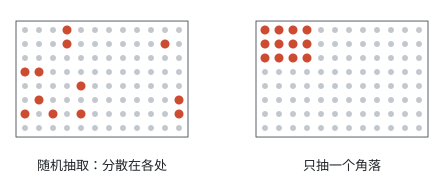
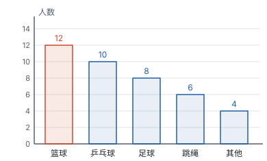
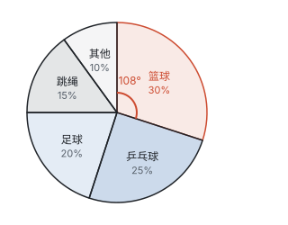
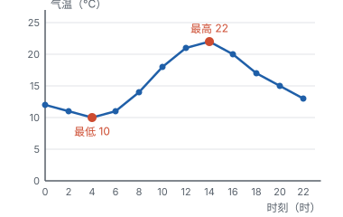
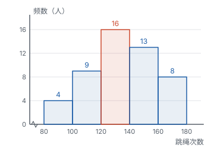

# 数据的收集、整理与描述

> 对应人教版七年级下册第十二章。

**统计先要回答三个问题：数据从哪里来（调查谁、调查多少），怎样把一堆原始数据理清楚（频数和频率），怎样让别人一眼看懂（统计图）。**

## 从哪里来

学校想知道全校 1200 名同学最喜欢哪项运动，好决定多开哪种体育社团。最直接的办法是挨个问，可是 1200 份问卷要发、要收、要统计，花的工夫很大。能不能只问一部分人，就大致知道全校的情况？问哪些人才算数？问回来的答案又怎样整理、怎样展示？

这一页按做统计的先后顺序，把这几件事一件一件讲清楚：**收集**（调查谁）→ **整理**（数一数，算比例）→ **描述**（画成图）。后面的“分析”和“推断”见第十部分“数据的分析”。

## 收集：全面调查和抽样调查

**全面调查**是对所有对象都做调查，比如人口普查、全班同学的体检。**抽样调查**是只抽取一部分对象做调查，再用这一部分的情况去估计全体的情况。

描述抽样调查，要分清四个词：

| 名称 | 意思 | 在“1200 名同学最喜欢的运动”里 |
| --- | --- | --- |
| 总体 | 要考察的全体对象 | 1200 名同学最喜欢的运动 |
| 个体 | 组成总体的每一个考察对象 | 每名同学最喜欢的运动 |
| 样本 | 从总体中抽取的那一部分个体 | 被抽到的 40 名同学最喜欢的运动 |
| 样本容量 | 样本中个体的数目 | 40 |

注意“考察对象”指的是我们关心的那个**数据**，不是人本身。调查睡眠时间，总体就是“所有同学的睡眠时间”；调查身高，总体就是“所有同学的身高”。同一群人，关心的数据不同，总体也就不同。

**什么时候用哪一种？**

| 适合 | 情况 | 原因 |
| --- | --- | --- |
| 全面调查 | 对象少、容易调查，比如全班同学的视力 | 工作量不大，结果准确 |
| 全面调查 | 要求绝对准确、事关安全，比如乘飞机前的安检、航天器零件的检查 | 漏掉一个都不行 |
| 抽样调查 | 对象很多，比如全省初中生的睡眠时间 | 全面调查费时费力 |
| 抽样调查 | 调查有破坏性，比如灯泡的使用寿命、一批烟花的燃放效果 | 全部检查完，产品也就全毁了 |

**样本要有代表性。** 抽样调查的结果能不能代表总体，关键看样本是怎样抽的。下图左边的样本在总体中**随机**抽取，每个个体被抽到的机会相同，抽到的个体分散在各处；右边只抽了一个角落，如果这个角落恰好都是同一个年级、同一个班的同学，结果就会偏向这一小群人：

所以抽样要做到两点：一是**随机**，不挑不选，每个个体被抽到的机会相同；二是样本容量**不能太小**，只问 3 个人，偶然性太大。

## 整理：频数和频率

问回来的是 40 个杂乱的答案。先数一数每一类各有多少个：用“正”字划记，一笔代表一个。

| 运动 | 划记 | 频数 | 频率 |
| --- | --- | --- | --- |
| 篮球 | 正正丅 | 12 | 0.3 |
| 乒乓球 | 正正 | 10 | 0.25 |
| 足球 | 正下 | 8 | 0.2 |
| 跳绳 | 正一 | 6 | 0.15 |
| 其他 | 止 | 4 | 0.1 |
| 合计 | | 40 | 1 |

- **频数：** 每一类出现的次数。所有频数加起来等于数据的总个数。
- **频率：** 频数与数据总数的比，即

$$\text{频率} = \frac{\text{频数}}{\text{数据总数}}.$$

频率就是“这一类占全体的几分之几”，是一个比例，所以**所有频率加起来等于 1**。频率也常写成百分数：篮球的频率 0.3，就是 30%。

为什么除了频数还要算频率？频数只说明“有多少个”，频率说明“占多大比例”。两个样本容量不同的调查，比频数没有意义，比频率才公平。后面用样本估计总体、用频率估计概率，用的都是频率。

## 描述：把数据画成图

同一组数据可以画成不同的统计图，每种图擅长说明的事不同。

**条形图：各类有多少。** 每一类画一个长条，长条的高度就是频数。哪一类最多、各类相差多少，一眼就能比出来：

**扇形图：各部分占整体的百分比。** 用整个圆代表全体，每一类用一个扇形表示，扇形的大小表示这一类占的百分比：

扇形的大小怎样确定？整个圆的圆心角是 $360^\circ$，代表全体（100%）。某一类占全体的百分之几，它的扇形就占整个圆的百分之几，圆心角也就是 $360^\circ$ 的百分之几：

$$\text{扇形的圆心角} = 360^\circ \times \text{这一类所占的百分比}.$$

篮球占 30%，圆心角是 $360^\circ \times 30\% = 108^\circ$；其他占 10%，圆心角是 $36^\circ$。所有扇形的圆心角加起来正好是 $360^\circ$，因为所有百分比加起来是 100%。

**折线图：随时间怎样变化。** 横轴是时间，把每个时刻的数据描成点，再依次连成折线。折线上升表示增加，下降表示减少，越陡变化越快。用折线图表示数据随时间变化的趋势，这样的图也叫趋势图：

从图上能读出：这一天 4 时气温最低，14 时最高；4 时到 14 时气温上升，其中 8 时到 10 时上升得最快（折线最陡，2 小时升高 4 °C）。

**频数分布直方图：数值型数据落在各个范围的有多少。** 跳绳次数、身高、成绩这样的数据，几乎每个人都不一样，直接一个一个数没有意义。要先把数据按大小**分组**，再数每一组有多少个，画成直方图（画法见下一节）：

直方图和条形图看上去很像，区别在横轴：条形图的横轴是一个个**类别**（篮球、足球……），类别之间没有先后，所以长条之间留空；直方图的横轴是**数轴**，各组是一段一段首尾相接的区间，所以长方形紧挨在一起，中间没有缝。

四种统计图对照：

| 统计图 | 擅长说明 | 从图上读什么 |
| --- | --- | --- |
| 条形图 | 各类的具体数量 | 长条的高度 |
| 扇形图 | 各部分占整体的百分比 | 扇形的圆心角或百分比 |
| 折线图 | 数据随时间的变化趋势 | 折线的升降和陡缓 |
| 频数分布直方图 | 数值型数据在各个范围内的分布 | 各组长方形的高度，哪一组最多，数据集中在哪里 |

## 画直方图：先分组再数

50 名同学 1 分钟跳绳的次数，最少 83 次，最多 176 次。画直方图分四步：

1. **算最大值与最小值的差：** $176 - 83 = 93$，说明数据分布在 93 次的范围里。
2. **定组距和组数：** 组距是每一组的宽度。取组距为 20，$93 \div 20 = 4.65$，要分 5 组才能把所有数据装下。为了好看好算，从 80 开始分：$80 \le x < 100$，$100 \le x < 120$，……，$160 \le x < 180$。
3. **列频数分布表：** 数一数每组有多少个数据。

| 次数 $x$ | $80 \le x < 100$ | $100 \le x < 120$ | $120 \le x < 140$ | $140 \le x < 160$ | $160 \le x < 180$ |
| --- | --- | --- | --- | --- | --- |
| 频数 | 4 | 9 | 16 | 13 | 8 |
| 频率 | 0.08 | 0.18 | 0.32 | 0.26 | 0.16 |

4. **画直方图：** 横轴标出各组的端点，每组画一个长方形，高度等于这一组的频数。

每组都写成“$a \le x < b$”：左端点算在这一组里，右端点算在下一组里。这样每个数据**恰好落在一组**，不会被数两次，也不会漏掉。比如 120 次算在“$120 \le x < 140$”这一组，不算在前一组。

组数不宜太多也不宜太少：组太少，所有数据挤在一两组里，看不出分布；组太多，每组只有一两个数据，又回到了一个一个看。数据在 100 个以内时，一般分 5～12 组。

## 例题

**例 1**　为了解某校 1200 名学生每天的睡眠时间，从中随机抽取 100 名学生进行调查。

（1）这次调查的总体、个体、样本、样本容量各是什么？

（2）如果只抽取九年级的 100 名学生，这样的样本合适吗？

**思路：** 先找出“考察对象”：这次关心的是睡眠时间，所以总体、个体、样本都要落在“睡眠时间”上，而不是“学生”上。

**解：**（1）总体是这 1200 名学生每天的睡眠时间；个体是每名学生每天的睡眠时间；样本是抽取的 100 名学生每天的睡眠时间；样本容量是 100。

（2）不合适。九年级学生学习任务重，学习时间往往更长，睡眠时间和七、八年级不同。只抽九年级，样本不能代表全校，得到的平均睡眠时间会偏少。应该在全校学生中随机抽取。

**例 2**　随机抽取部分学生调查最喜欢的运动，画条形图和扇形图时只记下了部分数据：最喜欢篮球的有 12 人，在扇形图中占 30%；“足球”对应扇形的圆心角是 $72^\circ$。

（1）一共调查了多少名学生？最喜欢足球的有多少人？

（2）全校有 1200 名学生，估计最喜欢篮球的有多少人？

**思路：** 条形图给数量，扇形图给比例，两张图要靠“数量 = 总数 × 百分比”连起来。已知篮球的数量和百分比，就能求出总数；有了总数，别的类只要知道百分比或圆心角，就能求出数量。

**解：**（1）调查的总人数是 $12 \div 30\% = 40$（人）。

足球的圆心角是 $72^\circ$，占全体的 $72^\circ \div 360^\circ = 20\%$，所以最喜欢足球的有 $40 \times 20\% = 8$（人）。

（2）样本中最喜欢篮球的占 30%，用样本估计总体，全校最喜欢篮球的约有 $1200 \times 30\% = 360$（人）。

**回顾：** 第（2）问用的是样本的**频率**，不是样本的频数。样本里 12 人喜欢篮球，不能说全校也是 12 人；能搬到总体上的，是“占 30%”这个比例。

**例 3**　前面画直方图时，50 名同学 1 分钟跳绳次数的频数分布表是：

| 次数 $x$ | $80 \le x < 100$ | $100 \le x < 120$ | $120 \le x < 140$ | $140 \le x < 160$ | $160 \le x < 180$ |
| --- | --- | --- | --- | --- | --- |
| 频数 | 4 | 9 | 16 | 13 | 8 |
| 频率 | 0.08 | 0.18 | 0.32 | 0.26 | 0.16 |

根据这张表回答：

（1）哪一组的人数最多？

（2）1 分钟跳绳 140 次及以上为优秀。全校有 800 名学生，估计有多少人达到优秀？

**思路：** “140 次及以上”包括最后两组：$140 \le x < 160$ 和 $160 \le x < 180$。先算这两组在样本中的频率，再乘全校人数。

**解：**（1）$120 \le x < 140$ 这一组人数最多，有 16 人。

（2）样本中达到优秀的有 $13 + 8 = 21$（人），频率是 $21 \div 50 = 0.42$。估计全校达到优秀的约有 $800 \times 0.42 = 336$（人）。

**想一想：** 这个“336 人”是准确的吗？不是。换一批 50 人来抽，频率可能是 0.40，也可能是 0.44。用样本估计总体，得到的是**估计值**，所以答案要写“约有”。样本越大、抽得越随机，估计值通常越接近真实值。

## 易错点

- **把样本说成“学生”。** 例 1 的样本是“100 名学生每天的睡眠时间”，不是“100 名学生”。统计考察的是数据。
- **样本容量带单位。** 样本容量是个数，写“100”，不写“100 名”。
- **样本没有代表性。** 在网上调查“大家每天上网多长时间”、只在篮球场调查“最喜欢的运动”，样本都偏向了一部分人，结论不能推到全体。
- **用扇形图比较两个群体的数量。** 甲班扇形图里篮球占 30%，乙班占 40%，不能说乙班喜欢篮球的人多：扇形图只反映比例，两个班人数不同，数量要用“总数 × 百分比”算出来再比。
- **分组时端点重复或遗漏。** 写成“$80 \sim 100$，$100 \sim 120$”，100 就不知道算哪一组。每组要写清楚是否包含端点。
- **把直方图当成条形图画。** 直方图的长方形之间不留空，横轴标的是各组的端点，不是类别名称。
- **频率之和不等于 1。** 百分数算完后加一加，不是 100% 就说明有一类算错了；扇形的圆心角加起来也要正好 $360^\circ$。

## 联系

- **数据的分析：** 数据整理好以后，要用平均数、中位数、方差等数来刻画它；直方图的分组数据也能估计平均数。见第十部分“数据的分析”。
- **概率：** 频率是统计里的比例，做大量重复试验时，频率会稳定在概率附近。见第十部分“概率”。
- **与圆有关的计算：** 扇形的圆心角占 $360^\circ$ 的几分之几，扇形的面积就占整个圆面积的几分之几，扇形图正是用这个比例来表示百分比。见第九部分“与圆有关的计算”。
- **函数：** 气温随时刻变化，每个时刻对应一个气温，这就是函数关系；折线图就是把测得的点描出来再连起来，和画函数图象的方法一样。见第七部分“函数”。
- **有理数的运算：** 频率、百分比的计算，就是分数和比例的计算。见第二部分“有理数的运算”。
