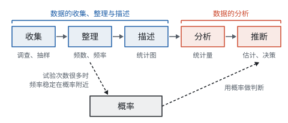

# 总览：从数据到决策

**这一部分的主线是：从一部分数据出发，经过收集、整理、描述、分析，对全体作出估计和判断；概率则给“不确定”配上一个数，它和统计通过“频率”连在一起。**

## 一条流程

| 步骤 | 做什么 | 用到的工具 | 页面 |
| --- | --- | --- | --- |
| 收集 | 确定调查谁、调查多少 | 全面调查、抽样调查；总体、个体、样本、样本容量 | 数据的收集、整理与描述 |
| 整理 | 把杂乱的数据数清楚 | 划记、频数、频率；分组、频数分布表 | 数据的收集、整理与描述 |
| 描述 | 让数据一眼看懂 | 条形图、扇形图、折线图、直方图 | 数据的收集、整理与描述 |
| 分析 | 用几个数概括一组数据 | 平均数、中位数、众数；极差、方差；四分位数和箱线图 | 数据的分析 |
| 推断 | 从样本说到总体，作出决策 | 用样本的频率、平均数、方差估计总体 | 数据的分析 |

## 统计图用在哪里

| 统计图 | 回答的问题 | 例子 |
| --- | --- | --- |
| 条形图 | 各类各有多少 | 最喜欢各项运动的人数 |
| 扇形图 | 各部分占整体的百分之几 | 各项运动所占的百分比 |
| 折线图 | 随时间怎样变化 | 一天中气温的变化 |
| 频数分布直方图 | 数值型数据落在各个范围里的有多少 | 跳绳次数在各个范围里的人数 |
| 箱线图 | 数据的中间一半在哪里，几组数据怎样比较 | 两个班测验成绩的比较 |

## 统计量用在哪里

| 刻画什么 | 统计量 | 看的是 | 特点 |
| --- | --- | --- | --- |
| 集中趋势（一般水平） | 平均数 | 全部数据的大小 | 用到每个数据，受极端值影响 |
| 集中趋势（一般水平） | 中位数 | 排序后中间的位置 | 不受极端值影响 |
| 集中趋势（一般水平） | 众数 | 出现的次数 | 反映最常见的取值 |
| 离散程度（稳定性） | 极差 | 最大值和最小值 | 简单，只用了两个数 |
| 离散程度（稳定性） | 方差、标准差 | 每个数据离平均数多远 | 用到每个数据，越小越稳定 |
| 离散程度（稳定性） | 四分位数 | 中间一半数据的范围 | 不受极端值影响，适合画箱线图比较 |

## 统计和概率的关系

统计从**数据**出发：做了调查、做了试验，得到频率、平均数，再去估计总体。概率从**可能性**出发：还没做试验，就能根据等可能的结果算出事件发生的机会有多大。

两者在“频率”这里接上：试验次数越多，事件发生的频率越稳定在它的概率附近。所以结果等可能时，可以直接算概率；结果不等可能时（比如种子发芽、树苗成活），就用大量试验的频率来估计概率。这和用样本估计总体是同一个想法：**用看得见的一部分，推断看不见的全体。**

## 学习顺序

按页面顺序学：

1. **数据的收集、整理与描述：** 先学会抽样的道理，会算频率、读懂和画出四种统计图（见第十部分“数据的收集、整理与描述”）；
2. **数据的分析：** 重点是平均数（含加权平均数）、中位数、众数和方差，会根据问题选择合适的统计量，会读箱线图（见第十部分“数据的分析”）；
3. **概率：** 重点是用列表法和树状图列出所有等可能的结果，以及用频率估计概率（见第十部分“概率”）。

这一部分用到的计算不难，难在**选对工具、说清理由**：为什么这次调查要随机抽样，为什么这组数据用中位数比平均数好，为什么这几种结果是等可能的。每一个答案都要能从定义讲出道理。
