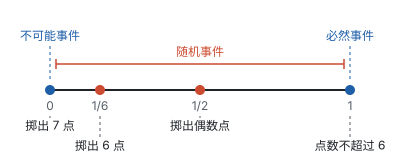
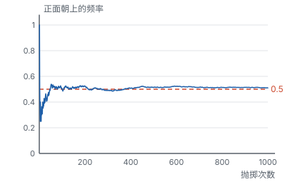
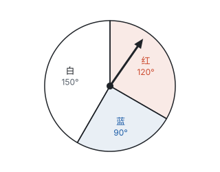
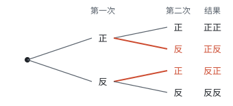
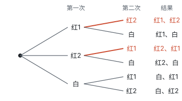

# 概率 ★

> 对应人教版九年级“概率初步”一章。

**概率是给“可能性有多大”配上的一个 0 到 1 之间的数：同一个试验重复做很多次，事件发生的频率会稳定在这个数附近。**

## 从哪里来

掷一枚骰子，结果可能是 1 到 6 点中的任何一个，掷之前说不准。但“说不准”也有程度之分：

- “掷出的点数不超过 6”，每次都一定发生，叫**必然事件**；
- “掷出 7 点”，每次都一定不发生，叫**不可能事件**；
- “掷出 6 点”“掷出偶数点”，可能发生也可能不发生，叫**随机事件**。

同样是随机事件，“掷出偶数点”显然比“掷出 6 点”更容易发生：偶数点有 2、4、6 三种，6 点只有一种。能不能用一个数把“更容易”说准确？这个数就是概率。

事件 $A$ 发生的概率记作 $P(A)$。必然事件每次都发生，概率规定为 1；不可能事件从不发生，概率规定为 0；随机事件的概率在 0 和 1 之间：

$$0 < P(\text{随机事件}) < 1.$$

## 概率的意义：频率会稳定下来

抛一枚硬币，正面朝上的可能性有多大？抛几次看不出规律：抛 10 次可能 7 次正面，也可能 3 次。但抛的次数越多，正面朝上的**频率**越稳定。下图是用计算机模拟抛一枚硬币 1000 次，每抛一次算一下到目前为止正面朝上的频率：

开始时频率上下乱跳，抛到几百次以后，就在 0.5 附近很小的范围里摆动了。历史上有人真的做过这个试验：

| 试验者 | 抛掷次数 | 正面朝上的次数 | 频率 |
| --- | --- | --- | --- |
| 布丰 | 4040 | 2048 | 0.5069 |
| 皮尔逊 | 12000 | 6019 | 0.5016 |
| 皮尔逊 | 24000 | 12012 | 0.5005 |

**在大量重复试验中，事件发生的频率会稳定在某个常数附近，这个常数就是事件的概率。** 硬币正面朝上的概率是 $\frac{1}{2}$。

概率说的是“大量重复时的规律”，不是“每一次的结果”。概率是 $\frac{1}{2}$，不等于抛 2 次必有 1 次正面，也不等于抛 100 次正好 50 次正面。单独一次试验的结果仍然是随机的。

## 等可能的结果：直接算

每求一个概率都去做几千次试验，太费事。有一类试验可以直接算出概率：

1. 试验的结果只有**有限个**；
2. 每个结果出现的可能性**相等**。

掷一枚质地均匀的骰子就是这样：只有 6 种结果，骰子六个面一模一样，没有哪一面更容易朝上。6 种结果可能性相同，合起来是必然事件，概率是 1，所以每种结果的概率都是 $\frac{1}{6}$。“掷出偶数点”包含 2、4、6 三种结果，它的概率就是 3 个 $\frac{1}{6}$：

$$P(\text{掷出偶数点}) = \frac{3}{6} = \frac{1}{2}.$$

一般地，**一次试验有 $n$ 种等可能的结果，事件 $A$ 包含其中的 $m$ 种，那么**

$$P(A) = \frac{m}{n}.$$

因为 $0 \le m \le n$，所以 $0 \le P(A) \le 1$；$m = n$ 时 $A$ 是必然事件，$m = 0$ 时 $A$ 是不可能事件，和前面的规定（必然事件的概率是 1，不可能事件的概率是 0）一致。

**结果无穷多时，用面积或角度来比。** 转动一个转盘，指针可能停在任何位置，结果有无穷多种，没法一个一个数。但转盘是均匀的，指针停在哪里的机会都一样，所以停在某个区域的概率，就等于这个区域占整个转盘的比例。

**例 1**　如图，转盘被分成三个扇形，红色扇形的圆心角是 $120^\circ$，蓝色是 $90^\circ$，白色是 $150^\circ$。自由转动转盘，求指针停在红色区域、蓝色区域的概率，以及停在白色以外区域的概率。

**思路：** 指针停在各处的机会均等，停在某个扇形里的概率，就是这个扇形占整个圆的比例，也就是圆心角占 $360^\circ$ 的比例。

**解：**

$$P(\text{红}) = \frac{120}{360} = \frac{1}{3}, \qquad P(\text{蓝}) = \frac{90}{360} = \frac{1}{4}.$$

白色以外的区域就是红色和蓝色合起来，圆心角是 $120^\circ + 90^\circ = 210^\circ$：

$$P(\text{不是白色}) = \frac{210}{360} = \frac{7}{12}.$$

**回顾：** 也可以先求 $P(\text{白}) = \frac{150}{360} = \frac{5}{12}$，再用 $1 - \frac{5}{12} = \frac{7}{12}$。“停在白色”和“不停在白色”必有一个发生、又不会同时发生，两个概率加起来是 1。

## 两步试验：列表法和树状图

同时抛两枚硬币，“一枚正面、一枚反面”的概率是多少？

结果看上去有三种：两正、两反、一正一反，于是很容易答 $\frac{1}{3}$。可是这三种结果并不是等可能的。把两枚硬币分成第一枚和第二枚，一步一步地画出所有可能：

第一枚有正、反两种，每一种后面第二枚又有正、反两种，一共 $2 \times 2 = 4$ 种结果，这 4 种才是等可能的。“一正一反”包含“正反”和“反正”两种，所以

$$P(\text{一正一反}) = \frac{2}{4} = \frac{1}{2}.$$

这样一层一层分叉列出所有结果的图叫**树状图**。试验分两步完成时，也可以列一个表，第一步的结果做行，第二步的结果做列，这叫**列表法**。两种方法做的是同一件事：**不重不漏地列出所有等可能的结果**，然后数一数事件包含其中几种。

掷两枚骰子，点数之和的所有结果列成表（行是第一枚，列是第二枚）：

| 第一枚＼第二枚 | 1 | 2 | 3 | 4 | 5 | 6 |
| --- | --- | --- | --- | --- | --- | --- |
| 1 | 2 | 3 | 4 | 5 | 6 | **7** |
| 2 | 3 | 4 | 5 | 6 | **7** | 8 |
| 3 | 4 | 5 | 6 | **7** | 8 | 9 |
| 4 | 5 | 6 | **7** | 8 | 9 | 10 |
| 5 | 6 | **7** | 8 | 9 | 10 | 11 |
| 6 | **7** | 8 | 9 | 10 | 11 | 12 |

一共 $6 \times 6 = 36$ 种等可能的结果。和为 7 的有 6 种，排在一条斜线上，所以 $P(\text{和为 7}) = \frac{6}{36} = \frac{1}{6}$，和为 7 是所有和里最容易出现的；和为 2 或 12 都只有 1 种，概率都是 $\frac{1}{36}$。

**三步及以上用树状图，两步用哪个都行。** 表只有行和列两个方向，适合恰好两步的试验；三步及以上（比如抛三枚硬币），用树状图一层一层往下画更方便。

**例 2**　不透明的袋子里有 2 个红球和 1 个白球，除颜色外都相同。从中摸出一个球，记下颜色；再摸一个球。

（1）第一次摸出的球放回袋子、摇匀后再摸，求两次都摸到红球的概率；

（2）第一次摸出的球不放回，直接再摸，求两次都摸到红球的概率。

**思路：** 两个红球虽然颜色相同，却是两个不同的球，要把它们编号成红 1、红 2 区分开，这样每个球被摸到的可能性才相同。再看放回和不放回的差别：放回时第二次还是从 3 个球里摸，不放回时第二次只能从剩下的 2 个球里摸。

**解：**（1）放回时，每次都有 3 种等可能的结果，列表：

| 第一次＼第二次 | 红 1 | 红 2 | 白 |
| --- | --- | --- | --- |
| 红 1 | 红 1、红 1 | 红 1、红 2 | 红 1、白 |
| 红 2 | 红 2、红 1 | 红 2、红 2 | 红 2、白 |
| 白 | 白、红 1 | 白、红 2 | 白、白 |

共有 $3 \times 3 = 9$ 种等可能的结果，两次都是红球的有 4 种（表的左上角），所以

$$P(\text{两次都是红球}) = \frac{4}{9}.$$

（2）不放回时，第一次有 3 种结果，第二次只剩 2 种，画树状图：

共有 $3 \times 2 = 6$ 种等可能的结果，两次都是红球的有 2 种，所以

$$P(\text{两次都是红球}) = \frac{2}{6} = \frac{1}{3}.$$

**想一想：** 两种摸法为什么答案不同？放回时，同一个球可以被摸两次，“红 1、红 1”这样的结果是存在的；不放回时，第二次摸不到第一次摸出的那个球，表格里对角线上的 3 种结果（红 1、红 1，红 2、红 2，白、白）都不会出现，剩下的正是树状图里的 6 种。把（1）的表去掉对角线，就得到（2）的所有结果，两种方法列出的其实是同一批结果。

## 用频率估计概率

图钉落地时钉尖朝上还是朝下，一粒种子能不能发芽，一棵树苗能不能成活，这些试验的结果**不是等可能的**，没法用 $\frac{m}{n}$ 直接算。这时就回到概率的本来意义：做大量重复试验，用稳定下来的频率作为概率的估计值。

**例 3**　某林场移栽一种树苗，记录的成活情况如下：

| 移栽棵数 | 50 | 100 | 200 | 500 | 1000 | 2000 |
| --- | --- | --- | --- | --- | --- | --- |
| 成活棵数 | 44 | 89 | 178 | 452 | 901 | 1802 |
| 成活的频率 | 0.88 | 0.89 | 0.89 | 0.904 | 0.901 | 0.901 |

（1）估计这种树苗成活的概率；

（2）要得到 18000 棵成活的树苗，大约要移栽多少棵？

**思路：** 树苗成活不是等可能的结果，只能看频率。移栽的棵数越多，频率越稳定，从表中看，频率稳定在 0.9 附近。

**解：**（1）这种树苗成活的概率约是 0.9。

（2）设大约要移栽 $x$ 棵，则 $0.9x = 18000$，解得 $x = 20000$。大约要移栽 20000 棵。

**例 4**　不透明的袋子里有 3 个红球和若干个白球，除颜色外都相同。每次摸出一个球，记下颜色后放回摇匀。摸了很多次后发现，摸到红球的频率稳定在 0.25。估计袋中有几个白球。

**思路：** 这道题把两种求概率的方法接了起来。一方面，大量试验的频率稳定在 0.25，所以摸到红球的概率约是 0.25；另一方面，摸到每个球是等可能的，设白球有 $x$ 个，摸到红球的概率又可以直接算出来。两个结果相等，就得到一个方程。

**解：** 设袋中有 $x$ 个白球，则摸到红球的概率是 $\frac{3}{3 + x}$。由题意，

$$\frac{3}{3 + x} = 0.25,$$

两边同乘 $4(3 + x)$，得 $12 = 3 + x$，解得 $x = 9$。经检验，$x = 9$ 是原方程的解。袋中大约有 9 个白球。

## 易错点

- **把不等可能的结果当成等可能的。** 抛两枚硬币的结果不是“两正、两反、一正一反”三种等可能，而是四种；用 $\frac{m}{n}$ 之前，先确认每种结果的可能性真的相同。
- **相同的东西没有区分。** 两个红球要编号成红 1、红 2，否则“红、红”“红、白”这样的结果可能性并不相同。
- **放回和不放回不分。** 放回时每次都是原来的全部结果；不放回时第二次的结果少了一个。
- **列表或画树状图时有重有漏。** 按顺序一层一层列：先固定第一步，再列第二步的所有可能。“正反”和“反正”是两种不同的结果，不能只算一种。
- **把概率当成“一定”。** 中奖的概率是 $\frac{1}{100}$，买 100 张彩票不一定中奖；概率描述的是大量重复时的规律。
- **试验次数太少就下结论。** 抛 10 次硬币出现 7 次正面，不能说正面朝上的概率是 0.7。频率只有在试验次数很多时才稳定。
- **频率和概率混为一谈。** 频率是做试验得到的，每次做都可能不同；概率是事件本身的一个确定的数，频率在它附近摆动。

## 联系

- **数据的收集、整理与描述：** 频率就是统计里的比例，概率是频率稳定下来的值；用频率估计概率，和用样本估计总体是同一个想法。见第十部分“数据的收集、整理与描述”。
- **数据的分析：** 用统计量做判断和用概率做判断，都是在不确定中找依据。见第十部分“数据的分析”。
- **与圆有关的计算：** 转盘问题里，指针停在某个扇形的概率等于这个扇形的圆心角占 $360^\circ$ 的比例，也等于扇形面积占圆面积的比例。见第九部分“与圆有关的计算”。
- **有理数的运算：** $P(A) = \frac{m}{n}$ 是一个分数，“部分占整体的几分之几”。见第二部分“有理数的运算”。
- **分式方程：** 已知概率反求球的个数，列出的往往是分式方程，解完要检验。见第四部分“分式方程”。
- **一元一次方程：** 已知成活率求要移栽的棵数，就是列一元一次方程。见第四部分“一元一次方程”。
