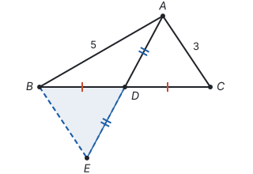
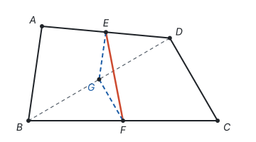
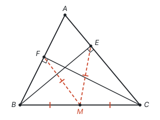
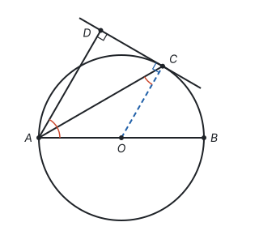

# 辅助线从哪里来

> 对应人教版八年级上册第十四章和第十五章、八年级下册第二十一章、九年级上册第二十九章和第三十章，散见各册的几何证明。

**辅助线不是凭空想出来的：先看结论要用哪个定理，再看这个定理需要什么样的图形，图里缺什么，就添一条线把它补出来。**

## 从哪里来：条件和结论接不上

每个定理都有它的“基本图形”：用全等，要有两个分别包含目标线段或角的三角形；用中位线，要有一个三角形和它两边的中点；用垂径定理，要有半径、弦和弦心距。题目给的图里，条件和结论常常分散在不同的地方，中间缺一座桥，辅助线就是这座桥。

找辅助线，用的是分析法：从结论往回想（见第一部分“怎样证明”）。

1. 要证的结论，通常靠哪个定理得到？
2. 这个定理需要什么图形、什么条件？
3. 图里已经有哪些？还缺什么？
4. 添一条线，把缺的补上。

下表是初中几何里最常见的几种情况。表里的每一行都不用背，按上面四步就能想出来：

| 图中有 | 想用的结论 | 常添的线 |
| --- | --- | --- |
| 三角形的中线，要比较边的大小或求范围 | 全等（SAS）把分散的边移到一个三角形里，再用三边关系 | 倍长中线 |
| 两个中点，或一个中点和一条要求的线段 | 三角形的中位线 | 连接两个中点，或再取一条边（对角线）的中点 |
| 直角三角形斜边的中点 | 斜边上的中线等于斜边的一半 | 连接直角顶点和斜边中点 |
| 角平分线 | 角平分线上的点到角两边的距离相等 | 从角平分线上的点向两边作垂线 |
| 等腰三角形 | 三线合一 | 作底边上的高（也是中线、顶角平分线） |
| 两条平行线之间的折线 | 平行线的性质 | 过拐点作平行线 |
| 直径 | 直径所对的圆周角是直角 | 连接直径端点和圆上的点 |
| 弦 | 垂径定理、勾股定理 | 作弦心距，连接半径 |
| 切线 | 切线垂直于过切点的半径 | 连接圆心和切点 |
| 要求边长或三角函数，但没有直角 | 勾股定理、锐角三角函数 | 作高，造出直角三角形 |

## 构造全等：倍长中线

**例 1**　在 $\triangle ABC$ 中，$AB = 5$，$AC = 3$，$AD$ 是 $BC$ 边上的中线。求 $AD$ 的取值范围。

**思路：** 求一条线段的范围，想到三角形的三边关系。可是 $AD$、$AB$、$AC$ 不在同一个三角形里。$D$ 是 $BC$ 的中点，把 $\triangle ADC$ 绕点 $D$ 旋转 $180^\circ$，$C$ 转到 $B$，$A$ 转到 $AD$ 延长线上的点 $E$，$AC$ 就被“搬”到了 $BE$ 的位置，和 $AB$、$AE = 2AD$ 围成一个三角形。落到作图上，就是延长 $AD$ 到 $E$，使 $DE = AD$。

**解：** 延长 $AD$ 到点 $E$，使 $DE = AD$，连接 $BE$。

在 $\triangle ADC$ 和 $\triangle EDB$ 中，

- $CD = BD$（$AD$ 是中线），
- $\angle ADC = \angle EDB$（对顶角相等），
- $AD = ED$（作图），

所以 $\triangle ADC \cong \triangle EDB$（SAS），$BE = AC = 3$。

在 $\triangle ABE$ 中，$AB - BE < AE < AB + BE$，即 $2 < 2AD < 8$，所以 $1 < AD < 4$。

**回顾：** “倍长中线”不是一个孤立的技巧：中点是旋转 $180^\circ$ 的中心，旋转前后的图形全等（见第六部分“平移、轴对称与旋转”）。图中只要出现中点，又想把中点两侧的边或角移到一起，都可以这样想。

## 巧用中点：中位线和斜边上的中线

**例 2**　在四边形 $ABCD$ 中，$AB$ 与 $CD$ 不平行，$E$、$F$ 分别是 $AD$、$BC$ 的中点。求证：$EF < \frac{1}{2}(AB + CD)$。

**思路：** 结论里有 $\frac{1}{2}AB$ 和 $\frac{1}{2}CD$，而“一半”加上“中点”，让人想到三角形的中位线（见第五部分“四边形”）。但 $E$、$F$ 不在同一个三角形的两边上。连接对角线 $BD$，取它的中点 $G$：在 $\triangle ABD$ 里，$E$、$G$ 是两边中点；在 $\triangle BCD$ 里，$G$、$F$ 是两边中点。两条中位线分别等于 $AB$、$CD$ 的一半，再和 $EF$ 围成一个三角形，用三边关系。

**证明：** 连接 $BD$，取 $BD$ 的中点 $G$，连接 $EG$、$GF$。

在 $\triangle ABD$ 中，$E$、$G$ 分别是 $AD$、$BD$ 的中点，所以 $EG \parallel AB$，$EG = \frac{1}{2}AB$。

在 $\triangle BCD$ 中，$G$、$F$ 分别是 $BD$、$BC$ 的中点，所以 $GF \parallel CD$，$GF = \frac{1}{2}CD$。

因为 $AB$ 与 $CD$ 不平行，所以 $EG$ 与 $GF$ 不在同一条直线上，$E$、$G$、$F$ 三点构成三角形。由三边关系，

$$EF < EG + GF = \frac{1}{2}AB + \frac{1}{2}CD = \frac{1}{2}(AB + CD).$$

**例 3**　在 $\triangle ABC$ 中，$BE \perp AC$ 于点 $E$，$CF \perp AB$ 于点 $F$，$M$ 是 $BC$ 的中点。求证：$ME = MF$。

**思路：** 图中有两个直角：$\angle BEC = 90^\circ$，$\angle BFC = 90^\circ$，两个直角三角形 $BEC$、$BFC$ 共用斜边 $BC$，而 $M$ 正是斜边的中点。“直角 + 斜边中点”，想到斜边上的中线等于斜边的一半。连接 $ME$、$MF$，它们就是两条斜边上的中线。

**证明：** 连接 $ME$、$MF$。

在 $\text{Rt}\triangle BEC$ 中，$M$ 是斜边 $BC$ 的中点，所以 $ME = \frac{1}{2}BC$。

在 $\text{Rt}\triangle BFC$ 中，$M$ 是斜边 $BC$ 的中点，所以 $MF = \frac{1}{2}BC$。

所以 $ME = MF$。

**回顾：** 例 2、例 3 用的都是“中点”，添的线却不同。区别在于还有什么条件：再找到一个中点，用中位线；有直角，用斜边上的中线；想把边移到一起，倍长中线。

## 圆中的辅助线

圆的性质几乎都和半径、直径有关，所以圆中的辅助线大多是连半径、作直径、作弦心距。

**例 4**　$AB$ 是 $\odot O$ 的直径，$C$ 是 $\odot O$ 上一点，过点 $C$ 作 $\odot O$ 的切线，$AD$ 垂直于这条切线，垂足为 $D$。求证：$AC$ 平分 $\angle DAB$。

**思路：** 有切线，就连接圆心和切点，得到 $OC \perp CD$。又 $AD \perp CD$，两条直线都垂直于 $CD$，所以 $OC \parallel AD$，平行线带来内错角相等。要证的是 $\angle DAC = \angle CAB$，而 $\angle CAB$ 在等腰三角形 $OAC$ 里（$OA$、$OC$ 都是半径），两个角可以通过 $\angle ACO$ 联系起来。

**证明：** 连接 $OC$。

因为 $CD$ 是 $\odot O$ 的切线，所以 $OC \perp CD$（切线垂直于过切点的半径）。又 $AD \perp CD$，所以 $OC \parallel AD$（垂直于同一条直线的两条直线平行），$\angle DAC = \angle ACO$（两直线平行，内错角相等）。

因为 $OA = OC$，所以 $\angle OAC = \angle ACO$（等边对等角）。

所以 $\angle DAC = \angle OAC$，即 $AC$ 平分 $\angle DAB$。

## 坐标系里的辅助线

在坐标系里，斜着的线段不好算，常过点作坐标轴的垂线：垂线段的长就是坐标的绝对值，斜线段成了直角三角形的斜边，面积可以用竖直线段分割。求三角形面积时过动点作竖直线，就是这样一条辅助线（见第十一部分“以数解形”）。

## 易错点

- **辅助线的作法说不清。** 要写成能照着画的话：“延长 $AD$ 到点 $E$，使 $DE = AD$，连接 $BE$”。
- **一条辅助线附加了两个条件。** “过 $A$ 作 $AE \perp BC$，交 $BC$ 于中点 $E$”是错的：过 $A$ 作 $BC$ 的垂线，垂足不一定是中点。过一点作线，只能再附加一个条件（垂直、平行、过另一点……），其余的性质要证明。
- **把添线后“看起来”的关系当成已知。** 例 1 延长中线 $AD$ 到 $E$、使 $DE = AD$ 以后，图中 $BE \parallel AC$ 看起来很明显，要用它，得先由全等得出 $\angle CAD = \angle BED$，再由内错角相等推出；例 2 中 $E$、$F$ 是 $AD$、$BC$ 的中点，$G$ 是对角线 $BD$ 的中点，$E$、$G$、$F$ 不共线，是由 $AB$ 与 $CD$ 不平行推出来的。都要有依据，不能从图上看。
- **性质的依据漏写。** 连接 $OC$ 后，$OC \perp CD$ 的理由是“切线垂直于过切点的半径”，要写出来。
- **没有目标地乱添线。** 线越添越多，图越来越乱。先从结论出发，想清楚要用哪个定理，再添。辅助线画成虚线，和原图区分开。

## 联系

- **怎样证明：** 分析法从结论往回想，是找辅助线的方法。见第一部分“怎样证明”。
- **全等三角形：** 倍长中线、角平分线作垂线，都是为了构造全等。见第五部分“全等三角形”。
- **旋转：** 倍长中线就是绕中点旋转 $180^\circ$。见第六部分“平移、轴对称与旋转”。
- **三角形：** 三边关系、三角形的高。见第五部分“三角形”。
- **四边形：** 三角形的中位线、直角三角形斜边上的中线。见第五部分“四边形”。
- **等腰三角形：** 三线合一，作底边上的高。见第五部分“轴对称与等腰三角形”。
- **平行线：** 拐角问题过拐点作平行线。见第五部分“相交线与平行线”。
- **圆：** 连半径、作弦心距、直径所对的圆周角、切线的性质。见第九部分“圆的有关性质”和第九部分“与圆有关的位置关系”。
- **以数解形：** 坐标法把“想辅助线”换成了“选坐标系、列式计算”，两种方法可以对照着用。见第十一部分“以数解形”。
