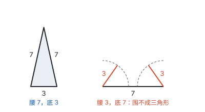
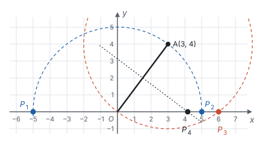
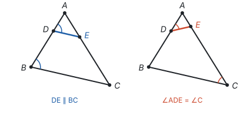
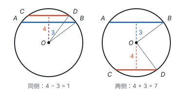

# 分类讨论 ★

> 对应人教版七年级上册第一章、八年级上册第十五章、九年级上册第二十五章和第二十九章、九年级下册“相似”一章等，散见各册。

**题目的条件不能唯一确定图形的位置、对应关系或式子的符号时，要把所有可能的情况都列出来，一种一种地求解、检验，最后合在一起作答，这就是分类讨论。**

## 从哪里来

分类讨论不是一种题型，而是条件“没说死”时的必然结果。需要分类的原因主要有三种：

| 原因 | 例子 |
| --- | --- |
| 概念本身分情况 | 绝对值：$a \ge 0$ 时 $\lvert a \rvert = a$，$a < 0$ 时 $\lvert a \rvert = -a$；方程 $ax^2 + bx + c = 0$ 中 $a$ 是否为 0，决定它是不是一元二次方程 |
| 对应关系没有说明 | 等腰三角形哪条边是腰；两个三角形相似，哪个角和哪个角对应；平行四边形哪两个顶点相对 |
| 图形的位置不确定 | 点在线段上还是在延长线上；两条弦在圆心同侧还是两侧；三角形的高在形内还是形外 |

分类时守住三条：

1. **标准统一：** 按同一个标准分，比如都按“哪个点是顶角的顶点”分，不要一会儿按边、一会儿按位置。
2. **不重不漏：** 各种情况合起来是全部可能，彼此不重叠。
3. **逐一检验：** 每种情况算出的结果，都要代回去看是否真的成立。

## 等腰三角形：哪条边是腰

**例 1**　等腰三角形的两条边长分别是 3 和 7，求它的周长。

**思路：** 没说哪条是腰，分两种情况。等腰三角形的三边里有两条相等，还要满足三边关系：任意两边之和大于第三边（见第五部分“三角形”）。

**解：**

- 腰长为 3：三边是 3、3、7。$3 + 3 = 6 < 7$，围不成三角形，舍去。
- 腰长为 7：三边是 7、7、3。$7 + 3 > 7$，能围成三角形，周长是 $7 + 7 + 3 = 17$。

所以周长是 17。

同样的道理，“等腰三角形有一个角是 $40^\circ$”也要分两种：$40^\circ$ 是顶角时，底角是 $70^\circ$；$40^\circ$ 是底角时，顶角是 $100^\circ$。两种都成立。

**例 2**　在平面直角坐标系中，$O$ 是原点，点 $A(3, 4)$。点 $P$ 在 $x$ 轴上，且 $\triangle OAP$ 是等腰三角形。求点 $P$ 的坐标。

**思路：** 按“哪个点是顶角的顶点”分三种：$O$、$A$ 或 $P$。每种情况对应一个几何图形：

- $O$ 是顶点，$OP = OA$：$P$ 在以 $O$ 为圆心、$OA$ 为半径的圆上；
- $A$ 是顶点，$AP = AO$：$P$ 在以 $A$ 为圆心、$AO$ 为半径的圆上；
- $P$ 是顶点，$PO = PA$：$P$ 在 $OA$ 的垂直平分线上（见第五部分“轴对称与等腰三角形”）。

这两个圆和一条直线与 $x$ 轴的交点，就是要找的点。再用坐标算出来。

**解：** $OA = \sqrt{3^2 + 4^2} = 5$。设 $P(x, 0)$，则 $OP = \lvert x \rvert$，$PA^2 = (x - 3)^2 + 16$。

- $OP = OA$：$\lvert x \rvert = 5$，$x = \pm 5$，得 $P_1(-5, 0)$、$P_2(5, 0)$。
- $AP = AO$：$(x - 3)^2 + 16 = 25$，$x = 0$ 或 $x = 6$。$x = 0$ 时 $P$ 与 $O$ 重合，不是三角形，舍去；得 $P_3(6, 0)$。
- $PO = PA$：$x^2 = (x - 3)^2 + 16$，$0 = -6x + 25$，$x = \frac{25}{6}$，得 $P_4\left(\frac{25}{6}, 0\right)$。

所以点 $P$ 的坐标是 $(-5, 0)$、$(5, 0)$、$(6, 0)$ 或 $\left(\frac{25}{6}, 0\right)$。

**回顾：** 按顶点分类，三种情况正好对应“哪两条边相等”，不重也不漏。每种情况先想图形（圆或垂直平分线），就知道大概有几个点、在哪里；再用坐标列方程，把点算准（见第十一部分“以数解形”）。

## 相似：对应关系不唯一

**例 3**　在 $\triangle ABC$ 中，$AB = 6$，$AC = 8$，点 $D$ 在 $AB$ 上，$AD = 2$。点 $E$ 在 $AC$ 上，且以 $A$、$D$、$E$ 为顶点的三角形与 $\triangle ABC$ 相似，求 $AE$ 的长。

**思路：** 两个三角形有公共角 $\angle A$，于是 $A$ 对应 $A$。剩下 $D$ 可能对应 $B$，也可能对应 $C$。两种对应，两组比例式（见第八部分“相似”）。

**解：**

- $D$ 对应 $B$，$\triangle ADE \sim \triangle ABC$：$\frac{AD}{AB} = \frac{AE}{AC}$，即 $\frac{2}{6} = \frac{AE}{8}$，$AE = \frac{8}{3}$。
- $D$ 对应 $C$，$\triangle ADE \sim \triangle ACB$：$\frac{AD}{AC} = \frac{AE}{AB}$，即 $\frac{2}{8} = \frac{AE}{6}$，$AE = \frac{3}{2}$。

两个值都小于 $AC = 8$，$E$ 都在 $AC$ 上。所以 $AE = \frac{8}{3}$ 或 $\frac{3}{2}$。

**注意：** 如果题目写的是“$\triangle ADE \sim \triangle ABC$”，字母顺序已经规定了对应关系，只有第一种情况。要分类的，是“以……为顶点的三角形与……相似”这种没说顺序的说法。

## 位置不确定：每种位置画一个图

**例 4**　$\odot O$ 的半径是 5，$AB$、$CD$ 是 $\odot O$ 的两条平行弦，$AB = 8$，$CD = 6$。求 $AB$ 与 $CD$ 之间的距离。

**思路：** 弦长和半径知道了，由垂径定理和勾股定理可以算出圆心到每条弦的距离（见第九部分“圆的有关性质”）。两条平行弦可能在圆心的同侧，也可能在两侧，两种位置都要画出来。

**解：** 过 $O$ 作 $AB$、$CD$ 的垂线。由垂径定理，垂足分别平分 $AB$、$CD$，所以圆心到 $AB$ 的距离是 $\sqrt{5^2 - 4^2} = 3$，到 $CD$ 的距离是 $\sqrt{5^2 - 3^2} = 4$。

- 两弦在圆心同侧：距离是 $4 - 3 = 1$；
- 两弦在圆心两侧：距离是 $4 + 3 = 7$。

所以 $AB$ 与 $CD$ 之间的距离是 1 或 7。

## 含字母的式子：按系数分

**例 5**　关于 $x$ 的方程 $(m - 1)x^2 + 2x + 1 = 0$ 有实数根，求 $m$ 的取值范围。

**思路：** 题目只说“方程”，没说是一元二次方程。二次项系数 $m - 1$ 可能是 0，这时方程是一次方程，不能用判别式。按 $m - 1$ 是否为 0 分两种情况。

**解：**

- $m = 1$ 时，方程是 $2x + 1 = 0$，有实数根 $x = -\frac{1}{2}$，符合题意。
- $m \ne 1$ 时，方程是一元二次方程，有实数根的条件是 $\Delta = 2^2 - 4(m - 1) \times 1 = 8 - 4m \ge 0$，即 $m \le 2$。结合 $m \ne 1$，得 $m \le 2$ 且 $m \ne 1$。

把两种情况合起来：$m \le 2$。

**想一想：** 如果题目改成“一元二次方程 $(m - 1)x^2 + 2x + 1 = 0$ 有实数根”，就不能取 $m = 1$，答案是 $m \le 2$ 且 $m \ne 1$。一个说法的差别，决定了要不要分类。

## 分完以后怎样合并

分类讨论的结果用“或”连接：每种情况得到的答案，都是整道题的答案，合在一起是它们的全体（例 5 中，$m = 1$ 和 $m \le 2$ 且 $m \ne 1$ 合起来是 $m \le 2$）。

要和不等式组区分开：不等式组的几个条件要**同时**满足，取公共部分，用“且”连接。一种情况内部的几个条件用“且”，不同情况之间用“或”。

## 易错点

- **只画一种图。** 题目的图往往只画了一种位置，但文字条件允许另一种。读完题先问：点的位置、对应关系是不是唯一的？
- **不检验。** 腰长 3、底边 7 围不成三角形；$P$ 和 $O$ 重合就不是三角形。每种情况都要代回原题检查。
- **分类标准不统一，造成重复或遗漏。** 例 2 按“哪个点是顶角的顶点”分，正好三种；如果一会儿按边、一会儿按 $P$ 在左右，容易重复数同一个点。
- **合并时取了公共部分。** 不同情况的结果要合在一起，不是取交集。
- **二次项系数含字母时忘了它可能为 0。** 题目说“方程”时要考虑一次方程的情况；说“一元二次方程”时要加上系数不为 0。

## 联系

- **绝对值：** 去绝对值要按正负分类，在数轴上就是点在哪一侧。见第二部分“有理数”和第十一部分“以形助数”。
- **等腰三角形：** 腰和底、顶角和底角的分类；垂直平分线上的点到两端距离相等。见第五部分“轴对称与等腰三角形”。
- **三角形的三边关系：** 分类以后检验能否围成三角形。见第五部分“三角形”。
- **相似：** 对应关系决定比例式的写法。见第八部分“相似”。
- **垂径定理：** 求弦心距。见第九部分“圆的有关性质”。
- **一元二次方程：** 判别式只对一元二次方程适用。见第四部分“一元二次方程”。
- **以数解形、动点与函数：** 平行四边形的第四个顶点、动点的分段，都是分类讨论。见第十一部分“以数解形”和第十一部分“动点与函数”。
