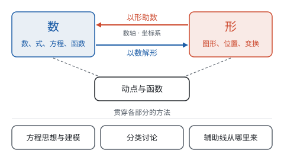

# 总览：一体两面

**这一部分把全书的数和形收拢到一起：每个代数关系都有一个几何的样子，每个几何关系都能写成数，能在两者之间来回翻译，综合问题就有了思路。**

## 代数和几何对照表

前面十个部分里，同一件事常常以两种面貌出现过：

| 代数的面貌 | 几何的面貌 | 在哪里学过 |
| --- | --- | --- |
| 实数 | 数轴上的点，一一对应 | 第二部分“实数” |
| 相反数 | 关于原点对称的两个点 | 第二部分“有理数” |
| 绝对值 $\lvert a - b \rvert$ | 数轴上两点间的距离 | 第二部分“有理数” |
| 不等式的解集 | 数轴上的一段 | 第四部分“不等式与不等式组” |
| 乘法公式 $(a + b)^2 = a^2 + 2ab + b^2$ | 正方形面积的拼图 | 第三部分“整式的乘法” |
| 配方 | 把长方形补成正方形 | 第四部分“一元二次方程” |
| $a^2 + b^2 = c^2$ | 直角三角形的三条边 | 第五部分“勾股定理” |
| 有序数对 $(x, y)$ | 平面上的点 | 第六部分“平面直角坐标系” |
| 两点间的距离公式 | 坐标系里的勾股定理 | 第三部分“二次根式” |
| 函数 | 图象 | 第七部分“函数” |
| 一次函数的 $k$ | 直线的倾斜程度 | 第七部分“一次函数” |
| 二元一次方程组的解 | 两条直线的交点 | 第四部分“二元一次方程组” |
| 一元二次方程的根 | 抛物线与 $x$ 轴的交点 | 第七部分“二次函数” |
| 判别式的正、零、负 | 抛物线与 $x$ 轴有两个、一个、没有交点 | 第四部分“一元二次方程” |
| 比例、相似比 | 形状相同、大小不同的图形 | 第八部分“相似” |
| 锐角三角函数 | 直角三角形两条边的比 | 第八部分“锐角三角函数” |
| 圆心到直线的距离与半径比大小 | 直线与圆有几个公共点 | 第九部分“与圆有关的位置关系” |

每一行都是同一件事的两种说法。遇到一个代数问题，可以问“它画出来是什么样子”；遇到一个几何问题，可以问“它写成数是什么式子”。

## 贯穿全书的几条主线

| 主线 | 经过的地方 |
| --- | --- |
| 数轴 → 坐标系 → 函数图象 | 数轴上的点和距离 → 不等式的解集画在数轴上 → 平面直角坐标系 → 一次、反比例、二次函数的图象 |
| 面积模型 | 乘法公式的拼图 → 因式分解 → 勾股定理的拼图证明 → 配方法 |
| 方程是数与形的交点 | 方程组的解是两直线的交点 → 一元二次方程的根是抛物线与 $x$ 轴的交点 → 判别式与交点个数 → 直线与圆的位置关系 |
| 对称 | 相反数 → 轴对称与等腰三角形 → 坐标系中的对称点 → 抛物线的对称轴 → 圆的对称性和垂径定理 |
| 比 | 比例 → 相似 → 锐角三角函数 → 一次函数的 $k$ |
| 变化与对应 | 代数式的值 → 函数 → 动点问题 |

## 这一部分的六页

| 页面 | 要回答的问题 | 典型的例子 |
| --- | --- | --- |
| 以形助数 | 代数问题怎样画成图 | 绝对值之和的最小值；方程在某个范围内的根的个数；比较两个函数的大小 |
| 以数解形 | 几何问题怎样写成数来算 | 坐标系中判断三角形的形状；平行四边形的第四个顶点；三角形面积的最大值；点的存在性 |
| 动点与函数 | 运动中的量怎样变化 | 按转折点分段写函数；从图象反推图形；两个动点的面积 |
| 方程思想与建模 | 不知道的量怎样求出来 | 折叠求线段长；购买方案；拱桥的宽度 |
| 分类讨论 | 条件不确定时怎样不重不漏 | 等腰三角形的腰；相似的对应关系；平行弦的位置 |
| 辅助线从哪里来 | 条件和结论怎样接上 | 倍长中线；取中点构造中位线；切线连半径 |

前两页是同一种翻译的两个方向：第十一部分“以形助数”把数画成形，第十一部分“以数解形”把形写成数。第十一部分“动点与函数”两个方向都用：从图形里写出函数，再用函数的图象读懂运动。

后三页讲的是贯穿各部分的想法，不局限于数形结合：第十一部分“方程思想与建模”讲怎样把未知的量设出来、找等量关系；第十一部分“分类讨论”讲条件没说死时怎样把情况列全；第十一部分“辅助线从哪里来”讲几何证明里缺的那座桥怎样补上。这三种想法在前面各部分的例题里已经反复出现，这里把它们单独拿出来看清楚。

## 学习顺序

这一部分用到前面各部分的知识，适合在相关内容学完以后阅读，也适合总复习时通读：

1. **以形助数、以数解形：** 学完第七部分的三种函数后读，重点是会在数和形之间翻译；
2. **动点与函数：** 学完第七部分“二次函数”后读；
3. **方程思想与建模：** 学完第四部分的各种方程后就可以读，几何的例子需要第五部分“勾股定理”；
4. **分类讨论：** 学完第八部分“相似”和第九部分“圆的有关性质”后读，其中等腰三角形、方程的例子可以更早看；
5. **辅助线从哪里来：** 在学第五部分的证明时就可以对照着看，圆的部分学完第九部分再读。

每页的例题都跨了几个部分。读的时候如果某一步看不懂，按页末“联系”里的链接回到原来的页面去补。
