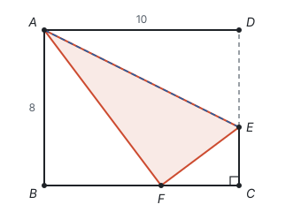
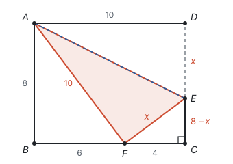
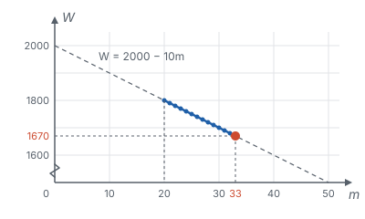
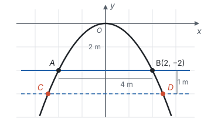
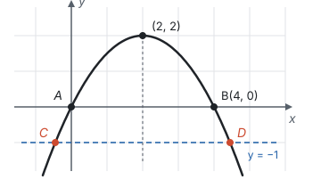

# 方程思想与建模

> 对应人教版七年级上册第五章、七年级下册第十章和第十一章、八年级上册第十八章 18.5 节、八年级下册第二十三章、九年级上册第二十五章和第二十六章中的实际问题。

**方程思想，就是把不知道的量先设出来，让它和已知的量一样参与运算，再找出同一个量的两种表示，让它们相等。** 把这种想法推广到不等关系和变化关系，就是建立数学模型：把实际问题翻译成方程、不等式或函数，算完再翻译回去。

## 从哪里来

小学解应用题用算术方法：要求的量不能参与运算，只能从已知的量出发，一步一步凑出它，每一步都要想好先算什么。方程换了一个方向：**把要求的量设成 $x$，当作已经知道，顺着题目的意思往下写**，写到同一个量出现两种表示时，就得到了方程（见第四部分“一元一次方程”）。

这个想法不只用在应用题里。几何里求一条线段的长，找不到直接算的办法时，也可以把它设成 $x$，再用勾股定理、相似、面积找出一个等量关系。

实际问题里的数量关系有三种，对应三种模型：

| 题目里的说法 | 数量关系 | 模型 | 得到什么 |
| --- | --- | --- | --- |
| 相等、恰好、共、是……的几倍 | 等量关系 | 方程（组） | 确定的值 |
| 至少、不超过、不低于、多于 | 不等关系 | 不等式（组） | 一个范围 |
| 随着……变化、怎样最省、何时最大 | 两个变量的对应关系 | 函数 | 变化规律、最大值和最小值、方案比较 |

## 几何里的方程思想

**例 1**　如图，矩形 $ABCD$ 中，$AB = 8$，$BC = 10$。沿 $AE$ 折叠，使点 $D$ 落在 $BC$ 边上的点 $F$ 处，折痕 $AE$ 的端点 $E$ 在 $CD$ 上。求 $DE$ 的长。

**思路：** 折叠就是轴对称，折叠前后的图形全等：$\triangle AFE \cong \triangle ADE$，所以 $AF = AD$，$EF = DE$。要求的 $DE$ 没有直接的算法，把它设成 $x$，那么 $EF$、$EC$ 都能用 $x$ 表示，它们都在直角三角形 $ECF$ 里，勾股定理正好给出一个方程。还缺 $FC$：先在直角三角形 $ABF$ 里算出 $BF$。

**解：** 由折叠，$AF = AD = BC = 10$，$EF = DE$。

在 $\text{Rt}\triangle ABF$ 中，$BF = \sqrt{AF^2 - AB^2} = \sqrt{100 - 64} = 6$，所以 $FC = BC - BF = 4$。

设 $DE = x$，则 $EF = x$，$EC = CD - DE = 8 - x$。在 $\text{Rt}\triangle ECF$ 中，由勾股定理，

$$(8 - x)^2 + 4^2 = x^2.$$

展开得 $64 - 16x + x^2 + 16 = x^2$，即 $16x = 80$，$x = 5$。所以 $DE = 5$。

**回顾：** 勾股定理是直角三角形三条边之间的一个等式。三条边里只要能都用同一个未知数表示，它就是一个方程。几何里常用来列方程的等量关系还有：相似三角形的对应边成比例、同一个图形的面积用两种方法算、角的和（如三角形内角和）。

## 方程组、不等式、函数：一步接一步

**例 2**　学校计划购买甲、乙两种树苗。买 3 棵甲种和 2 棵乙种共需 170 元，买 2 棵甲种和 3 棵乙种共需 180 元。

（1）两种树苗的单价各是多少元？

（2）学校要购买两种树苗共 50 棵，总费用不超过 1800 元，并且甲种树苗的数量不超过乙种的 2 倍。有几种购买方案？哪种方案的费用最低？

**思路：** 三种关系依次出现：第（1）问有两个未知的单价、两个“共需”的等量关系，列方程组；第（2）问“不超过”是不等关系，列不等式组求出甲种树苗数量的范围；“费用最低”是在这个范围里比较，总费用随甲种树苗的数量变化，写成函数。

**解：**（1）设甲种树苗每棵 $x$ 元，乙种每棵 $y$ 元。

$$\begin{cases} 3x + 2y = 170, \\ 2x + 3y = 180. \end{cases}$$

两式相加得 $5x + 5y = 350$，即 $x + y = 70$；第二式减第一式得 $-x + y = 10$。解得 $x = 30$，$y = 40$。

答：甲种树苗每棵 30 元，乙种每棵 40 元。

（2）设购买甲种树苗 $m$ 棵，则乙种 $(50 - m)$ 棵。

$$\begin{cases} 30m + 40(50 - m) \le 1800, \\ m \le 2(50 - m). \end{cases}$$

由第一个不等式，$2000 - 10m \le 1800$，得 $m \ge 20$；由第二个不等式，$3m \le 100$，得 $m \le 33\frac{1}{3}$。$m$ 是整数，所以 $20 \le m \le 33$，共有 14 种方案。

总费用 $W = 30m + 40(50 - m) = 2000 - 10m$。$W$ 是 $m$ 的一次函数，$k = -10 < 0$，$W$ 随 $m$ 的增大而减小，所以 $m = 33$ 时 $W$ 最小，$W = 2000 - 330 = 1670$。

答：共有 14 种购买方案；购买甲种 33 棵、乙种 17 棵时费用最低，为 1670 元。

**回顾：** 一道题里用了三种模型，各管一件事：方程组求出确定的单价，不等式组划出可行的范围，函数在范围里挑出最好的方案。函数的图象是一条下降的直线，可行的方案只是其中一段上的 14 个整数点，最低点在这一段的右端。

## 函数模型：先建坐标系

实际问题里的曲线（拱桥、抛物线的轨迹）要写出解析式，得先放进坐标系。坐标系可以自己选，选得好，解析式就简单。

**例 3**　一座拱桥的桥洞是抛物线形。水面宽 4 m 时，拱顶离水面 2 m。水面下降 1 m 后，水面宽多少米？（精确到 0.1 m。参考数据：$\sqrt{6} \approx 2.45$）

**思路：** 以拱顶为原点、对称轴为 $y$ 轴建立坐标系，抛物线的顶点在原点，解析式可以设成最简单的 $y = ax^2$，只有一个待定系数。水面在拱顶下方，所以水面上的点纵坐标是负数。

**解：** 建立如图所示的坐标系，设抛物线为 $y = ax^2$。水面宽 4 m、拱顶离水面 2 m，所以点 $B(2, -2)$ 在抛物线上：$-2 = 4a$，$a = -\frac{1}{2}$，抛物线为 $y = -\frac{1}{2}x^2$。

水面下降 1 m 后，水面上的点纵坐标是 −3。令 $-\frac{1}{2}x^2 = -3$，得 $x^2 = 6$，$x = \pm\sqrt{6}$。所以水面宽 $CD = 2\sqrt{6} \approx 2 \times 2.45 = 4.9$（m）。

答：水面宽 $2\sqrt{6}$ m，约 4.9 m。

**想一想：** 如果以水面 $AB$ 的左端 $A$ 为原点、水面为 $x$ 轴，顶点是 $(2, 2)$，解析式是 $y = -\frac{1}{2}(x - 2)^2 + 2$，水面下降后令 $y = -1$，得 $(x - 2)^2 = 6$，两个交点的距离仍是 $2\sqrt{6}$。坐标系是我们加上去的，换一种放法，解析式变了，答案不变；选顶点为原点，只是让计算最省事。

## 建模的步骤

1. **审题：** 找出已知量、未知量，圈出表示关系的词（“共”“恰好”“不超过”“最多”）。
2. **选模型：** 等量关系列方程，不等关系列不等式，问变化和最值写函数；有图形的，先想图形里有什么等量关系，需要时建坐标系。
3. **设未知数：** 可以直接设要求的量，也可以设中间的量；设得不同，列出的方程类型也可能不同（见第四部分“分式方程”）。
4. **列式：** 同一个量的两种表示相等，或者满足不等关系，或者写出函数关系式和自变量的范围。
5. **求解。**
6. **检验并作答：** 一查是不是方程（不等式）的解；二查是否符合实际，比如数量是正整数、长度是正数、在题目给的范围里。

## 易错点

- **单位不统一。** 分钟和小时、厘米和米混在一起列式。列式前先把单位统一。
- **关系词翻译错。** “不超过”是 $\le$，“少于”是 $<$，“至少”是 $\ge$。
- **取整数时方向错。** $m \le 33\frac{1}{3}$ 的整数解是 $m \le 33$；$m \ge 19.5$ 的整数解是 $m \ge 20$。在数轴上看一下往哪边取。
- **函数最值只看顶点或只看单调性。** 最值要在自变量的范围里找：一次函数看范围的端点，二次函数先看顶点在不在范围里。
- **建坐标系后点的坐标符号写错。** 例 3 以拱顶为原点，水面在拱顶下方，纵坐标是负数，水面宽 4 m 的右端点是 $B(2, -2)$；写成 $(2, 2)$ 会得到开口向上的抛物线。
- **不检验实际意义。** 算出的棵数不是整数、长度是负数、时间超出范围，都要舍去或调整。

## 联系

- **方程和不等式：** 各类方程、不等式的列法和解法。见第四部分“一元一次方程”、第四部分“二元一次方程组”、第四部分“不等式与不等式组”、第四部分“分式方程”和第四部分“一元二次方程”。
- **函数：** 方案比较用一次函数，最大值、最小值常用二次函数。见第七部分“一次函数”和第七部分“二次函数”。
- **勾股定理、相似：** 几何里列方程最常用的等量关系。见第五部分“勾股定理”和第八部分“相似”。
- **翻折：** 折叠是轴对称，折叠前后图形全等。见第六部分“平移、轴对称与旋转”。
- **以数解形：** 给实际物体建立坐标系，就是用数来描述形。见第十一部分“以数解形”。
- **动点与函数：** 动点问题也是建模：从图形里找出变量之间的关系。见第十一部分“动点与函数”。
