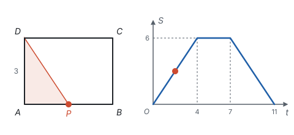
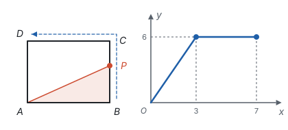
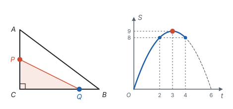
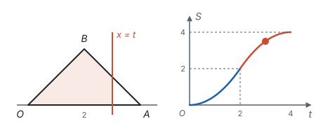

# 动点与函数 ★

> 对应人教版八年级下册第二十二章和第二十三章、九年级上册第二十六章，以及各册几何章节中的动点问题。

**点在图形上运动时，和它有关的长度、面积也跟着变化：把运动的时间或路程当作自变量，把要求的量当作函数，动点问题就变成了函数问题。**

## 从哪里来

函数讲的是“一个量变，另一个量跟着变，而且每个值只对应一个结果”（见第七部分“函数”）。动点正是这样：每一时刻，点只有一个位置；点的位置定了，和它有关的线段长、三角形面积也就定了。

所以解动点问题，先回答三个问题：

1. **自变量是什么，范围多大？** 通常是运动时间 $t$ 或走过的路程 $x$，从出发到停止。
2. **关系在哪里改变？** 点拐过图形的顶点、两个动点中有一个停下，关系式就可能换一个。这些时刻叫**转折点**，要在这里分段。
3. **每一段是什么函数？** 看要求的量怎样由变化的长度算出来。

| 运动的情况 | 常见的量 | 函数的类型 |
| --- | --- | --- |
| 一个点沿直线匀速运动，另一条边不变 | 以不变的边为底的三角形面积、到定点的水平或竖直距离 | 一次函数，每一段是一条线段 |
| 两个点同时运动，两条边都在变 | 两条变化的边围成的面积 | 二次函数 |
| 一条直线平移，扫过一个图形 | 扫过部分的面积 | 分段的二次函数 |

## 写关系：按转折点分段

**例 1**　矩形 $ABCD$ 中，$AB = 4$，$BC = 3$。点 $P$ 从 $A$ 出发，沿 $A \to B \to C \to D$ 以每秒 1 个单位的速度运动，到 $D$ 停止。设运动时间为 $t$ 秒，$\triangle APD$ 的面积为 $S$。写出 $S$ 与 $t$ 的函数关系式，并画出图象。

**思路：** $\triangle APD$ 的边 $AD = BC = 3$ 不变，把它当作底，高就是点 $P$ 到 $AD$ 的距离。$P$ 在三条边上时，这个距离的算法不同，所以按 $P$ 到达 $B$、$C$ 的时刻分段：

- $P$ 到 $B$ 用时 $4 \div 1 = 4$（秒），到 $C$ 再用 3 秒（共 7 秒），到 $D$ 再用 4 秒（共 11 秒）。

**解：**

- $P$ 在 $AB$ 上（$0 < t \le 4$）：高 $= AP = t$，$S = \frac{1}{2} \times 3 \times t = \frac{3}{2}t$；
- $P$ 在 $BC$ 上（$4 < t \le 7$）：高 $= AB = 4$，$S = \frac{1}{2} \times 3 \times 4 = 6$；
- $P$ 在 $CD$ 上（$7 < t < 11$）：高 $= DP = 4 - (t - 7) = 11 - t$，$S = \frac{3}{2}(11 - t)$。

$$S = \begin{cases} \frac{3}{2}t, & 0 < t \le 4, \\ 6, & 4 < t \le 7, \\ \frac{3}{2}(11 - t), & 7 < t < 11. \end{cases}$$

$t = 0$ 和 $t = 11$ 时 $P$ 与 $A$ 或 $D$ 重合，三角形不存在，所以不取端点。

图象是三段线段组成的折线（上图右边）。每一段的样子都能从运动看出来：$P$ 离 $AD$ 越来越远，面积上升；$P$ 在 $BC$ 上时离 $AD$ 的距离不变，面积不变，图象是平的；$P$ 回头靠近 $AD$，面积下降。

## 读图：从图象反推运动

反过来，给出图象，也能读出图形的尺寸。

**例 2**　矩形 $ABCD$ 中，点 $P$ 从 $B$ 出发，沿 $B \to C \to D$ 运动。设 $P$ 走过的路程为 $x$，$\triangle ABP$ 的面积为 $y$，$y$ 与 $x$ 的函数图象如下图右边所示。求 $AB$、$BC$ 的长和矩形 $ABCD$ 的面积。

**思路：** 图象的转折点对应 $P$ 经过矩形的顶点。先把图象的每一段翻译成运动：

- $0 \le x \le 3$，$y$ 从 0 均匀增大到 6：$P$ 在 $BC$ 上，$\triangle ABP$ 的底 $AB$ 不变，高 $BP = x$ 在增大；
- $3 \le x \le 7$，$y$ 保持 6 不变：$P$ 在 $CD$ 上，到 $AB$ 的距离始终是 $BC$，面积不变。

**解：** 由转折点，$P$ 走到 $C$ 时 $x = 3$，所以 $BC = 3$；从 $C$ 到 $D$ 走了 $7 - 3 = 4$，所以 $CD = 4$，$AB = CD = 4$。矩形的面积是 $4 \times 3 = 12$。

**检验：** $P$ 在 $C$ 时，$y = \frac{1}{2} AB \cdot BC = \frac{1}{2} \times 4 \times 3 = 6$，和图象上的最高值一致。

判断一个动点问题的图象对不对，也按同样的顺序看：

1. **找转折点：** 图象在哪里拐弯，是否正好对应动点到达顶点的时刻；
2. **看每段的类型：** 是平的、斜的直线，还是曲线（二次函数）；曲线向上弯还是向下弯；
3. **看特殊点的值：** 起点、终点、转折点的函数值对不对。

## 两个动点：面积是二次函数

**例 3**　在 $\text{Rt}\triangle ABC$ 中，$\angle C = 90^\circ$，$AC = 6$ cm，$BC = 8$ cm。点 $P$ 从 $A$ 出发沿 $AC$ 向 $C$ 以 1 cm/s 的速度运动，同时点 $Q$ 从 $C$ 出发沿 $CB$ 向 $B$ 以 2 cm/s 的速度运动，其中一点到达终点时，另一点也停止。设运动时间为 $t$ s，$\triangle PCQ$ 的面积为 $S$ cm²。

（1）求 $S$ 与 $t$ 的函数关系式，写出 $t$ 的取值范围；

（2）$t$ 为何值时，$S$ 最大？最大是多少？

（3）$t$ 为何值时，$S = 8$？

**思路：** $\triangle PCQ$ 是直角三角形，两条直角边 $PC$、$CQ$ 都随 $t$ 变化，每条都是 $t$ 的一次式，相乘就是二次函数。取值范围由先到终点的那个点决定。

**解：**（1）$PC = 6 - t$，$CQ = 2t$。$P$ 到 $C$ 要 6 s，$Q$ 到 $B$ 要 $8 \div 2 = 4$（s），所以运动 4 s 后停止，$0 < t \le 4$。

$$S = \frac{1}{2}(6 - t) \cdot 2t = -t^2 + 6t \quad (0 < t \le 4).$$

（2）配方，$S = -(t - 3)^2 + 9$。$t = 3$ 在 $0 < t \le 4$ 内，所以 $t = 3$ 时 $S$ 最大，最大值是 9。

（3）令 $-t^2 + 6t = 8$，即 $t^2 - 6t + 8 = 0$，解得 $t = 2$ 或 $t = 4$。两个值都在 $0 < t \le 4$ 内，所以 $t = 2$ 或 $t = 4$。

**检验：** $t = 4$ 时，$PC = 2$，$CQ = 8$（$Q$ 正好到达 $B$），$S = \frac{1}{2} \times 2 \times 8 = 8$。

**想一想：** 如果把 $BC$ 改成 6 cm，$Q$ 到 $B$ 只要 3 s，取值范围变成 $0 < t \le 3$。关系式没变，第（3）问解方程仍得 $t = 2$ 或 $t = 4$，但 $t = 4$ 时 $Q$ 已经停了，只能取 $t = 2$。上图中 $t > 4$ 的虚线部分也是这样：解析式还能算，但点已经不动了，没有意义。**解析式来自图形，取值范围也来自图形，两样都要写。**

## 动线：扫过的面积

动的不一定是点，也可以是一条线。道理一样：找到转折点，分段写关系。

**例 4**　在平面直角坐标系中，$O(0, 0)$、$A(4, 0)$、$B(2, 2)$。直线 $x = t$（$0 \le t \le 4$）从左向右平移，$\triangle OAB$ 在这条直线左侧部分的面积为 $S$。求 $S$ 与 $t$ 的函数关系式。

**思路：** 直线经过 $B$（$t = 2$）时，左侧部分的形状从三角形变成四边形，这是转折点。$OB$ 所在直线是 $y = x$，$AB$ 所在直线是 $y = -x + 4$，直线 $x = t$ 与它们的交点都能用 $t$ 表示。

**解：** $\triangle OAB$ 的面积是 $\frac{1}{2} \times 4 \times 2 = 4$。

- $0 \le t \le 2$：左侧是直角三角形，两条直角边都是 $t$（交点是 $(t, t)$），$S = \frac{1}{2}t^2$；
- $2 < t \le 4$：右侧剩下一个直角三角形，两条直角边都是 $4 - t$（交点是 $(t, 4 - t)$），$S = 4 - \frac{1}{2}(4 - t)^2$。

$$S = \begin{cases} \frac{1}{2}t^2, & 0 \le t \le 2, \\ 4 - \frac{1}{2}(4 - t)^2, & 2 < t \le 4. \end{cases}$$

**检验：** $t = 2$ 时两个式子都等于 2，图象在这里连起来；$t = 4$ 时 $S = 4$，正好是整个三角形。

图象由两段抛物线组成，先越来越陡，过了 $t = 2$ 又越来越平。原因在图形里：直线在三角形内截出的线段越长，每移动一点扫过的面积就越多；这条线段在 $t = 2$ 时最长，所以 $S$ 在这里增加得最快。

## 易错点

- **不分段。** 动点拐过顶点、某个点停下，关系式就可能改变。写关系式前先把转折点的时刻全部算出来。
- **取值范围写错。** 两个点同时出发时，先到终点的那个决定停止时间；三角形退化成线段的时刻（面积为 0）要看题意决定取不取。
- **把速度忘了。** 速度是 2 时，$t$ 秒走过的路程是 $2t$，不是 $t$。
- **求出 $t$ 不检验。** 解方程得到的 $t$ 要落在取值范围内，否则舍去。
- **判断图象只看升降。** 同样是上升，直线和抛物线不一样；抛物线向上弯还是向下弯也不一样。还要核对起点、转折点的函数值。

## 联系

- **函数：** 动点问题是“变量与对应”最直观的例子。见第七部分“函数”。
- **一次函数、二次函数：** 一个量在变，得到一次函数；两个量同时变再相乘，得到二次函数；最值用配方求。见第七部分“一次函数”和第七部分“二次函数”。
- **一元二次方程：** “面积等于某个值”就是解方程，解出来要检验范围。见第四部分“一元二次方程”。
- **四边形、勾股定理：** 动点经过的图形，边长、高由图形的性质决定。见第五部分“四边形”和第五部分“勾股定理”。
- **以数解形：** 在坐标系里设动点的坐标，用竖直线段求面积。见第十一部分“以数解形”。
- **以形助数：** 水平直线 $y = m$ 上下移动，看它和图象有几个交点，也是一种“动线”。见第十一部分“以形助数”。
- **分类讨论：** 分段本身就是按点的位置分类。见第十一部分“分类讨论”。
