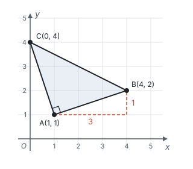
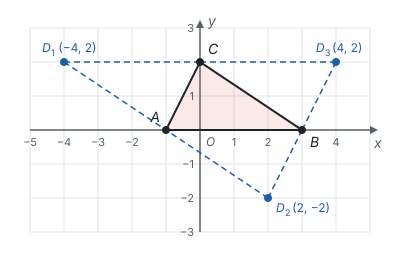
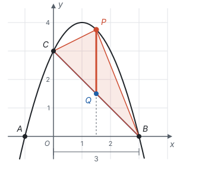
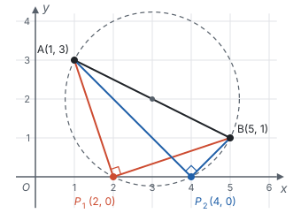
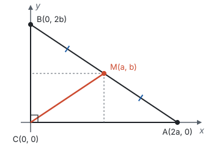
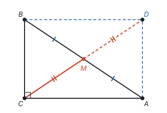

# 以数解形

> 对应人教版七年级下册第九章、八年级下册第二十章、第二十一章和第二十三章，九年级上册第二十六章、第二十九章和第三十章，综合运用。

**以数解形，就是给图形装上坐标，把点写成数对、把线写成方程，于是长度、面积、位置关系都能按固定的步骤算出来。**

## 从哪里来

几何证明常常要先想到一条辅助线，想不到就卡住。坐标系给了另一条路：点有了坐标，几何关系就能翻译成式子，接下来只要计算。

| 几何的说法 | 用坐标说 |
| --- | --- |
| 点 | 有序数对 $(x, y)$ |
| 水平线段、竖直线段的长 | 横坐标之差、纵坐标之差（大减小） |
| 两点间的距离 | 勾股定理：$\sqrt{(x_1 - x_2)^2 + (y_1 - y_2)^2}$ |
| 线段的中点 | 横、纵坐标分别取平均数 |
| 直线 | 一次函数 $y = kx + b$ |
| 两条直线平行 | $k$ 相等（$b$ 不等） |
| 点在图象上 | 点的坐标满足解析式 |
| 两条线的交点 | 两个解析式组成的方程组的解 |

用坐标解几何题的步骤是：**建坐标系、设坐标 → 把条件翻译成式子 → 计算 → 把结果翻译回几何。** 前后两步是“翻译”，中间一步是代数。

## 距离：勾股定理的坐标写法

设 $A(x_1, y_1)$、$B(x_2, y_2)$。过 $A$ 画水平线、过 $B$ 画竖直线，交出一个直角三角形：水平直角边长 $\lvert x_1 - x_2 \rvert$，竖直直角边长 $\lvert y_1 - y_2 \rvert$，斜边就是 $AB$。由勾股定理，

$$AB^2 = (x_1 - x_2)^2 + (y_1 - y_2)^2.$$

平方以后正负号不影响结果，所以公式里不用写绝对值。

**例 1**　已知 $A(1, 1)$、$B(4, 2)$、$C(0, 4)$，判断 $\triangle ABC$ 的形状。

**思路：** 判断形状就是比较边的长短、看有没有直角。三边的平方都能用距离公式算出来；比较平方就够了，不用开方。

**解：**

$$\begin{aligned} AB^2 &= (4 - 1)^2 + (2 - 1)^2 = 10, \\ AC^2 &= (0 - 1)^2 + (4 - 1)^2 = 10, \\ BC^2 &= (0 - 4)^2 + (4 - 2)^2 = 20. \end{aligned}$$

$AB = AC$；又 $AB^2 + AC^2 = 20 = BC^2$，由勾股定理的逆定理，$\angle A = 90^\circ$。所以 $\triangle ABC$ 是等腰直角三角形。

## 中点：平行四边形的第四个顶点

数轴上 $a$ 和 $b$ 的中点是 $\frac{a + b}{2}$，它到两端的距离都是 $\frac{\lvert a - b \rvert}{2}$。平面上也一样：线段 $AB$ 的中点，横坐标在 $x_1$、$x_2$ 的正中间，纵坐标在 $y_1$、$y_2$ 的正中间，所以中点是

$$\left( \frac{x_1 + x_2}{2}, \frac{y_1 + y_2}{2} \right).$$

平行四边形的对角线互相平分，也就是两条对角线的中点重合（见第五部分“四边形”）。写成坐标：**平行四边形相对的两个顶点，坐标之和相等。** 比如 $ABCD$ 是平行四边形，$AC$、$BD$ 是对角线，则 $x_A + x_C = x_B + x_D$，$y_A + y_C = y_B + y_D$。

**例 2**　已知 $A(-1, 0)$、$B(3, 0)$、$C(0, 2)$。以 $A$、$B$、$C$、$D$ 为顶点的四边形是平行四边形，求点 $D$ 的坐标。

**思路：** 题目说“以 $A$、$B$、$C$、$D$ 为顶点”，没有说顶点的顺序，所以不知道 $D$ 和谁相对。$D$ 可以和 $A$、$B$、$C$ 中的任何一个相对，要分三种情况（见第十一部分“分类讨论”）。每种情况用“相对顶点坐标之和相等”列式。

**解：** 设 $D(x, y)$。

- $D$ 与 $B$ 相对（$AC$ 是对角线）：$x + 3 = -1 + 0$，$y + 0 = 0 + 2$，得 $D_1(-4, 2)$；
- $D$ 与 $C$ 相对（$AB$ 是对角线）：$x + 0 = -1 + 3$，$y + 2 = 0 + 0$，得 $D_2(2, -2)$；
- $D$ 与 $A$ 相对（$BC$ 是对角线）：$x + (-1) = 3 + 0$，$y + 0 = 0 + 2$，得 $D_3(4, 2)$。

所以点 $D$ 的坐标是 $(-4, 2)$、$(2, -2)$ 或 $(4, 2)$。

## 面积：竖直的线段最好算

在坐标系里，水平或竖直的线段，长度就是坐标之差；斜着的线段要用距离公式，斜边上的高更难求。所以求面积时，常用一条竖直线把图形分开，让竖直线段当底。

**例 3**　抛物线 $y = -x^2 + 2x + 3$ 与 $x$ 轴交于 $A$、$B$ 两点（$A$ 在左边），与 $y$ 轴交于点 $C$。点 $P$ 是直线 $BC$ 上方抛物线上的一个动点。求 $\triangle PBC$ 面积的最大值，以及此时点 $P$ 的坐标。

**思路：** $\triangle PBC$ 的三条边都是斜的。过 $P$ 作竖直线交 $BC$ 于 $Q$，把三角形分成 $\triangle PQC$ 和 $\triangle PQB$。两个三角形有公共底 $PQ$，高分别是 $C$、$B$ 到直线 $PQ$ 的水平距离，两个高加起来正好是 $B$、$C$ 的横坐标之差。$PQ$ 是竖直线段，长度就是 $P$、$Q$ 的纵坐标之差。

**解：** 令 $y = 0$，得 $-x^2 + 2x + 3 = 0$，$x = -1$ 或 $x = 3$，所以 $A(-1, 0)$，$B(3, 0)$；令 $x = 0$，得 $C(0, 3)$。

直线 $BC$ 过 $(0, 3)$ 和 $(3, 0)$，解析式是 $y = -x + 3$。

设 $P(t, -t^2 + 2t + 3)$，$0 < t < 3$，则 $Q(t, -t + 3)$。$P$ 在 $Q$ 的上方，

$$PQ = (-t^2 + 2t + 3) - (-t + 3) = -t^2 + 3t.$$

$$\begin{aligned} S_{\triangle PBC} &= \frac{1}{2} PQ \cdot t + \frac{1}{2} PQ \cdot (3 - t) = \frac{3}{2} PQ \\ &= -\frac{3}{2}t^2 + \frac{9}{2}t = -\frac{3}{2}\left(t - \frac{3}{2}\right)^2 + \frac{27}{8}. \end{aligned}$$

$-\frac{3}{2} < 0$，$t = \frac{3}{2}$ 在 $0 < t < 3$ 内，所以 $t = \frac{3}{2}$ 时面积最大，最大值是 $\frac{27}{8}$。此时 $-t^2 + 2t + 3 = \frac{15}{4}$，点 $P$ 的坐标是 $\left(\frac{3}{2}, \frac{15}{4}\right)$。

**回顾：** 这道题把几何问题（面积）变成了函数问题（二次函数求最值）。“竖直线段的长 = 上面的纵坐标 − 下面的纵坐标”，是坐标系里求面积最常用的一步。

## 存在性：先设坐标，再列方程

“是否存在一个点，使……”这类问题，做法是：先假设点存在，用一个字母表示它的坐标（点在坐标轴或已知图象上，就只需要一个字母），把条件翻译成方程。方程有解，点就存在，解就是坐标；方程无解，点就不存在。

**例 4**　已知 $A(1, 3)$、$B(5, 1)$。在 $x$ 轴上是否存在点 $P$，使 $\angle APB = 90^\circ$？若存在，求出点 $P$ 的坐标。

**思路：** $\angle APB = 90^\circ$，就是 $\triangle APB$ 以 $AB$ 为斜边，三边满足勾股定理。$P$ 在 $x$ 轴上，设 $P(x, 0)$，三边的平方都能用 $x$ 表示。

**解：** 设 $P(x, 0)$。

$$PA^2 = (x - 1)^2 + 9, \quad PB^2 = (x - 5)^2 + 1, \quad AB^2 = 4^2 + 2^2 = 20.$$

由勾股定理及其逆定理，$\angle APB = 90^\circ$ 就是 $PA^2 + PB^2 = AB^2$：

$$(x - 1)^2 + 9 + (x - 5)^2 + 1 = 20.$$

整理得 $2x^2 - 12x + 16 = 0$，即 $x^2 - 6x + 8 = 0$，解得 $x = 2$ 或 $x = 4$。

所以存在，点 $P$ 的坐标是 $(2, 0)$ 或 $(4, 0)$。

**想一想：** 为什么恰好两个点？直径所对的圆周角是直角，所以使 $\angle APB = 90^\circ$ 的点都在以 $AB$ 为直径的圆上（见第九部分“圆的有关性质”）。这个圆的圆心是 $AB$ 的中点 $(3, 2)$，半径是 $\sqrt{5}$。圆心到 $x$ 轴的距离 2 小于半径 $\sqrt{5}$，所以圆与 $x$ 轴有两个交点（见第九部分“与圆有关的位置关系”）。代数这边，方程 $x^2 - 6x + 8 = 0$ 的判别式 $36 - 32 = 4 > 0$，也是两个根。**交点的个数，和方程根的个数，是同一件事。**

## 用坐标证明几何结论

**例 5**　用坐标证明：直角三角形斜边上的中线等于斜边的一半。

**思路：** 建坐标系要让尽量多的点落在坐标轴上。直角顶点放在原点，两条直角边放在两条坐标轴上。斜边端点的坐标设成 $2a$、$2b$，中点的坐标就不带分数。

**证明：** 设 $\text{Rt}\triangle ABC$ 中 $\angle C = 90^\circ$。以 $C$ 为原点，$CA$、$CB$ 所在直线为 $x$ 轴、$y$ 轴建立坐标系，设 $A(2a, 0)$、$B(0, 2b)$（$a > 0$，$b > 0$）。斜边 $AB$ 的中点是 $M(a, b)$。

$$CM = \sqrt{a^2 + b^2}, \quad AB = \sqrt{(2a)^2 + (2b)^2} = 2\sqrt{a^2 + b^2}.$$

所以 $CM = \frac{1}{2}AB$。

**想一想：** 不用坐标的证法是延长 $CM$ 到 $D$，使 $MD = CM$，证出四边形 $ACBD$ 是矩形，再用矩形的对角线相等（见第五部分“四边形”）。那种证法要先想到辅助线；坐标证法不用想辅助线，但要会选坐标系。两种方法各有长处：几何证法说明了为什么（这个三角形是矩形的一半），坐标证法步骤固定、不容易卡住。

## 易错点

- **由坐标求长度时带上了负号。** 点 $(2, -3)$ 到 $x$ 轴的距离是 3，不是 −3。竖直线段的长是“上面的纵坐标减下面的纵坐标”，不确定上下时加绝对值。
- **距离公式漏了平方或开方。** $AB$ 不是 $(x_1 - x_2) + (y_1 - y_2)$；它是直角三角形的斜边，要用勾股定理。
- **只按一种顶点顺序找平行四边形。** “以 $A$、$B$、$C$、$D$ 为顶点”没有规定顺序，三种情况都要算；如果题目写的是“平行四边形 $ABCD$”，顺序已经定了，只有一种。
- **动点坐标用了两个字母。** 点在已知图象上时，纵坐标用横坐标表示，如 $P(t, -t^2 + 2t + 3)$，只留一个未知数。
- **忘了动点的范围。** 例 3 中 $P$ 在 $BC$ 上方，所以 $0 < t < 3$；求出的最值点要检验是否在范围内。

## 联系

- **平面直角坐标系：** 点的坐标、坐标和距离是这一页的基础。见第六部分“平面直角坐标系”。
- **勾股定理：** 距离公式就是坐标系里的勾股定理。见第五部分“勾股定理”和第三部分“二次根式”。
- **四边形：** 平行四边形对角线互相平分，写成坐标就是中点重合。见第五部分“四边形”。
- **函数：** 直线用一次函数表示，面积的最大值用二次函数求。见第七部分“一次函数”和第七部分“二次函数”。
- **圆：** 直径所对的圆周角是直角；圆与直线交点的个数对应方程根的个数。见第九部分“圆的有关性质”和第九部分“与圆有关的位置关系”。
- **分类讨论：** 平行四边形的第四个顶点、存在性问题常常要分情况。见第十一部分“分类讨论”。
- **反方向：** 把代数问题画成图来想，见第十一部分“以形助数”。
