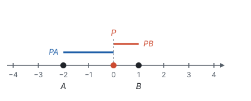
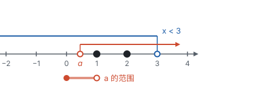
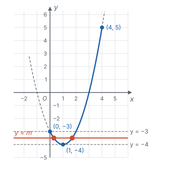
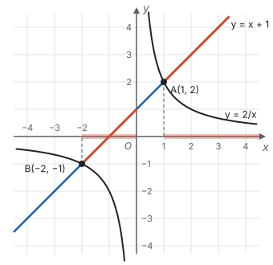
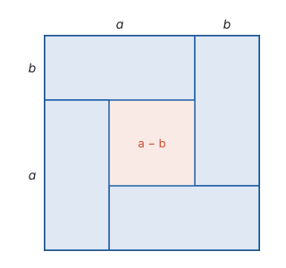
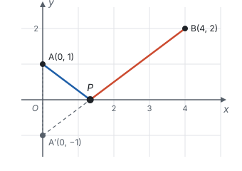

# 以形助数

> 对应人教版七年级上册第一章、七年级下册第十一章、八年级上册第十六章、八年级下册第二十三章、九年级上册第二十五章至第二十七章，综合运用。

**以形助数，就是把数、式子、方程画成图，让图告诉我们答案在哪里、有几个、什么时候最大最小，再用计算把答案算准。**

## 从哪里来

代数的计算一步一步往前推，每一步都可靠，但看不到全局；图形一眼就能看到全局，却说不准具体的数。前面各部分里，几乎每个代数对象都有一个几何的样子：

| 代数的说法 | 画成图 |
| --- | --- |
| 一个数 $a$ | 数轴上的一个点 |
| $\lvert a - b \rvert$ | 数轴上 $a$、$b$ 两点间的距离 |
| 不等式的解集 | 数轴上的一段 |
| 函数值的大小 | 图象上点的高低 |
| 两个式子相等时 $x$ 的值 | 两个图象交点的横坐标 |
| 乘积 $ab$ | 长 $a$、宽 $b$ 的长方形面积 |
| $\sqrt{a^2 + b^2}$ | 两条直角边为 $a$、$b$ 的直角三角形的斜边 |

以形助数就是用这张表把题目“翻译”过去：先画图，看出答案的方向（在哪一段、有几个、哪里最小），再回到代数把它算出来。图负责想，式子负责算。

## 数轴：绝对值是距离

数轴上表示 $a$ 和 $b$ 的两点之间的距离是 $\lvert a - b \rvert$：$a \ge b$ 时距离是 $a - b$，$a < b$ 时距离是 $b - a$，两种情况合起来正好是 $\lvert a - b \rvert$（见第二部分“有理数”）。所以 $\lvert x - 1 \rvert$ 是 $x$ 到 1 的距离，$\lvert x + 2 \rvert = \lvert x - (-2) \rvert$ 是 $x$ 到 −2 的距离。

**例 1**　（1）求 $\lvert x - 1 \rvert + \lvert x + 2 \rvert$ 的最小值；（2）解方程 $\lvert x - 1 \rvert + \lvert x + 2 \rvert = 5$。

**思路：** 在数轴上取点 $A$ 表示 −2，点 $B$ 表示 1，点 $P$ 表示 $x$。式子 $\lvert x - 1 \rvert + \lvert x + 2 \rvert$ 就是 $PB + PA$：点 $P$ 到 $A$、$B$ 两点的距离之和。

**解：**（1）$AB = 1 - (-2) = 3$。

- $P$ 在 $A$、$B$ 之间（含端点）时，$PA + PB = AB = 3$；
- $P$ 在 $B$ 的右边时，$PA = AB + PB$，所以 $PA + PB = 3 + 2PB > 3$；
- $P$ 在 $A$ 的左边时，同理 $PA + PB = 3 + 2PA > 3$。

所以最小值是 3，当 $-2 \le x \le 1$ 时取到。

（2）$5 > 3$，所以 $P$ 在线段 $AB$ 外面。由（1），$P$ 在 $B$ 的右边时 $PA + PB = 3 + 2PB$，在 $A$ 的左边时 $PA + PB = 3 + 2PA$。

- $P$ 在 $B$ 的右边：$2PB = 2$，$PB = 1$，$x = 1 + 1 = 2$；
- $P$ 在 $A$ 的左边：$2PA = 2$，$PA = 1$，$x = -2 - 1 = -3$。

**检验：** $\lvert 2 - 1 \rvert + \lvert 2 + 2 \rvert = 1 + 4 = 5$，$\lvert -3 - 1 \rvert + \lvert -3 + 2 \rvert = 4 + 1 = 5$。所以 $x = 2$ 或 $x = -3$。

**想一想：** 不画图也能做：按 $x \ge 1$、$-2 \le x < 1$、$x < -2$ 三段分别去掉绝对值，在每一段里解方程（见第十一部分“分类讨论”）。这三段正是 $P$ 在 $B$ 的右边、在 $AB$ 之间、在 $A$ 的左边三种位置。代数解法的分段要先想到才会分，图上的分段是一眼看出来的；图还顺便说明了为什么中间一段的值都是 3。

## 数轴：不等式组的整数解

**例 2**　关于 $x$ 的不等式组

$$\begin{cases} x > a, \\ x < 3 \end{cases}$$

恰好有 2 个整数解，求 $a$ 的取值范围。

**思路：** 解集是 $a < x < 3$。在数轴上从 3 往左数整数：3 不在解集里（空心点），接下来是 2、1。恰好 2 个整数解，就是 2 和 1 在解集里、0 不在。所以 $a$ 要落在 0 和 1 之间。

**解：** 1 在解集里，要求 $a < 1$；0 不在解集里，要求 $a \ge 0$。

端点要单独检验，不能只凭图：

- $a = 0$ 时，解集是 $0 < x < 3$，整数解是 1、2，恰好 2 个，$a = 0$ 可以取；
- $a = 1$ 时，解集是 $1 < x < 3$，整数解只有 2，$a = 1$ 不能取。

所以 $0 \le a < 1$。

## 图象：方程的解就是交点

方程 $x^2 - 2x - 3 = m$ 的解，就是抛物线 $y = x^2 - 2x - 3$ 和水平直线 $y = m$ 交点的横坐标。$m$ 变化时，直线上下平移，交点的个数跟着变。

**例 3**　关于 $x$ 的方程 $x^2 - 2x - 3 = m$。

（1）$m$ 取什么值时，方程有两个不相等的实数根？

（2）如果只考虑 $0 \le x \le 4$ 范围内的解，$m$ 取什么值时，方程在这个范围内恰好有两个解？

**思路：** 第（1）问可以用判别式，也可以看图；第（2）问限定了 $x$ 的范围，判别式只管有没有根，不管根落在哪里，这时看图最直接。

**解：**（1）方程化为 $x^2 - 2x - 3 - m = 0$，

$$\Delta = (-2)^2 - 4 \times 1 \times (-3 - m) = 16 + 4m.$$

$\Delta > 0$ 时有两个不相等的实数根，即 $m > -4$。从图上看：$y = x^2 - 2x - 3 = (x - 1)^2 - 4$，顶点是 $(1, -4)$，是图象的最低点。直线 $y = m$ 高于顶点时和抛物线交于两点，正好是 $m > -4$。

（2）只看 $0 \le x \le 4$ 的一段（图中实线）。它的两端是 $(0, -3)$ 和 $(4, 5)$，最低点是 $(1, -4)$。让直线 $y = m$ 从下往上移动：

| $m$ 的范围 | 交点个数 |
| --- | --- |
| $m < -4$ | 0 |
| $m = -4$ | 1（顶点） |
| $-4 < m \le -3$ | 2（左边一个在 $0 \le x < 1$，右边一个在 $1 < x \le 2$） |
| $-3 < m \le 5$ | 1（左边的交点跑到 $x < 0$，不算了） |
| $m > 5$ | 0 |

所以 $-4 < m \le -3$。

**检验端点：** $m = -3$ 时，方程是 $x^2 - 2x = 0$，解得 $x = 0$ 或 $x = 2$，都在范围里，确实是两个解。

**想一想：** 第（2）问如果只用代数，要求两个根都在 $0 \le x \le 4$ 里，得同时考虑判别式、对称轴的位置和端点的函数值，条件多，容易漏。画图后，只要看直线在哪个高度范围内和实线部分交两次，关键高度就是顶点和两个端点的纵坐标。

## 图象：比较两个函数的大小

**例 4**　直线 $y = x + 1$ 与双曲线 $y = \frac{2}{x}$ 交于 $A$、$B$ 两点。

（1）求 $A$、$B$ 两点的坐标；

（2）$x$ 取什么值时，$x + 1 > \frac{2}{x}$？

**思路：** 交点坐标要解方程；比较大小看的是“直线在双曲线上方”的部分。这个不等式里 $x$ 在分母上，两边乘 $x$ 时不知道 $x$ 的正负，代数做法很麻烦，看图就简单了。

**解：**（1）令 $x + 1 = \frac{2}{x}$，两边乘 $x$，得 $x^2 + x - 2 = 0$，即 $(x + 2)(x - 1) = 0$，所以 $x = 1$ 或 $x = -2$。检验：两个值都不使分母为 0。所以 $A(1, 2)$，$B(-2, -1)$。

（2）画出两个图象：

直线在双曲线上方的部分有两段：$B$ 和 $y$ 轴之间的一段（$-2 < x < 0$），和 $A$ 右边的一段（$x > 1$）。所以当 $-2 < x < 0$ 或 $x > 1$ 时，$x + 1 > \frac{2}{x}$。

$x = 0$ 不在答案里：双曲线在 $x = 0$ 处断开，$\frac{2}{x}$ 没有意义。$0 < x < 1$ 时双曲线在直线上方，这一段不满足。

## 面积：式子的几何样子

把边长为 $a + b$ 的正方形按下图分割（设 $a > b$）：四个角上是四个长 $a$、宽 $b$ 的长方形，中间剩下一个边长为 $a - b$ 的小正方形。

算两遍面积：

$$(a + b)^2 = 4ab + (a - b)^2.$$

用乘法公式展开两边也能验证（见第三部分“整式的乘法”）。中间的小正方形面积 $(a - b)^2 \ge 0$，所以 $(a + b)^2 \ge 4ab$；只有 $a = b$ 时小正方形消失，等号成立。

**例 5**　用长 20 m 的篱笆围一个长方形菜园，长和宽各是多少时面积最大？最大面积是多少？

**思路：** 周长一定，就是长与宽的和一定。把长 $a$、宽 $b$ 放进上面的图：$a + b$ 不变，大正方形不变；面积 $ab$ 是四个长方形之一，四个长方形越大，中间的空就越小。空消失时 $ab$ 最大。

**解：** 设长为 $a$ m，宽为 $b$ m，则 $2(a + b) = 20$，$a + b = 10$。由 $(a + b)^2 \ge 4ab$，得 $4ab \le 100$，$ab \le 25$，当 $a = b = 5$ 时等号成立。

答：长和宽都是 5 m（围成正方形）时面积最大，最大面积是 $25 \text{ m}^2$。

**想一想：** 也可以设长为 $x$ m，写出面积 $S = x(10 - x) = -(x - 5)^2 + 25$，用二次函数求最大值（见第七部分“二次函数”），结果一样。函数的方法算得出最值，图形的方法说得清为什么：两边一样长时，中间的“空”没有了。

## 距离：把根式看成线段（拓展）

$\sqrt{a^2 + b^2}$ 是直角边为 $a$、$b$ 的直角三角形的斜边，在坐标系里就是两点间的距离（见第三部分“二次根式”）。

**例 6**　$x$ 取什么值时，$\sqrt{x^2 + 1} + \sqrt{(x - 4)^2 + 4}$ 最小？最小值是多少？

**思路：** 把两个根式都看成两点间的距离。设 $P(x, 0)$ 是 $x$ 轴上的动点：

$$\sqrt{x^2 + 1} = \sqrt{(x - 0)^2 + (0 - 1)^2} = PA, \quad A(0, 1);$$

$$\sqrt{(x - 4)^2 + 4} = \sqrt{(x - 4)^2 + (0 - 2)^2} = PB, \quad B(4, 2).$$

问题变成：在 $x$ 轴上找一点 $P$，使 $PA + PB$ 最小。$A$、$B$ 在 $x$ 轴同侧，这正是最短路径问题（见第五部分“轴对称与等腰三角形”）：作 $A$ 关于 $x$ 轴的对称点 $A'(0, -1)$，则 $PA = PA'$。

**解：** $PA + PB = PA' + PB \ge A'B$，当 $P$ 在线段 $A'B$ 上时取等号（两点之间，线段最短）。

$$A'B = \sqrt{(4 - 0)^2 + (2 + 1)^2} = \sqrt{25} = 5.$$

直线 $A'B$ 过 $(0, -1)$ 和 $(4, 2)$，用待定系数法得 $y = \frac{3}{4}x - 1$。令 $y = 0$，得 $x = \frac{4}{3}$。

所以 $x = \frac{4}{3}$ 时，原式有最小值 5。

**检验：** $x = \frac{4}{3}$ 时，$\sqrt{\frac{16}{9} + 1} = \frac{5}{3}$，$\sqrt{\frac{64}{9} + 4} = \frac{10}{3}$，和是 5。

## 易错点

- **$\lvert x + 2 \rvert$ 当成 $x$ 到 2 的距离。** $\lvert x + 2 \rvert = \lvert x - (-2) \rvert$，是 $x$ 到 **−2** 的距离。先把式子写成“$x$ 减一个数”的样子，再读出是到哪个点。
- **端点凭图判断。** 图上实心点、空心点容易画错，也容易看错。像例 2 那样，把端点值代回原题检验一次。
- **限定了范围还只用判别式。** 判别式只回答“有没有实数根、有几个”，不回答根在哪里。题目限定了 $x$ 的范围，要看图象在这个范围里的那一段。
- **读图时漏掉一段。** 双曲线有两支，比较大小时 $y$ 轴两侧要分别看；$x = 0$ 处函数没有意义，不能算进答案。
- **用图代替计算。** 图只告诉我们答案的方向和个数。交点坐标、最值、范围的端点，都要回到方程和不等式算出来。画得不准的图还会误导，比如两个靠得很近的交点，可能被看成一个。

## 联系

- **有理数：** 绝对值是数轴上的距离，是以形助数的第一个例子。见第二部分“有理数”。
- **不等式：** 解集画在数轴上，不等式组的解集是公共部分。见第四部分“不等式与不等式组”。
- **函数与方程：** 方程的解是图象交点的横坐标，不等式的解集是图象在上方的部分。见第七部分“一次函数”、第七部分“反比例函数”和第七部分“二次函数”。
- **判别式：** 判别式的正负对应抛物线与直线交点的个数。见第四部分“一元二次方程”。
- **面积模型：** 乘法公式、配方都能画成正方形的拼图。见第三部分“整式的乘法”和第四部分“一元二次方程”。
- **最短路径：** 两段距离之和最小，用轴对称把折线拉直。见第五部分“轴对称与等腰三角形”。
- **反方向：** 把几何问题写成数来算，见第十一部分“以数解形”。
