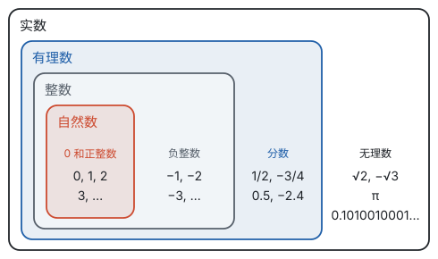

# 总览：数的扩充

**数从自然数一步步扩充到实数：每一次都是因为遇到了原来的数解决不了的问题，而每一次扩充，原来的运算律都保持不变。**

## 四次扩充

| 数的范围 | 遇到的问题 | 新添的数 | 从此总能做的运算 | 在数轴上 |
| --- | --- | --- | --- | --- |
| 自然数 | 数一数有多少个 | $0, 1, 2, 3, \cdots$ | 加法、乘法 | 原点右边一个个隔开的点 |
| 整数 | 意义相反的量；小数减大数，如 $3 - 5$ | 负整数 | 减法 | 原点左边也有了点 |
| 有理数 | 平均分，如 $1 \div 3$；不足一个单位的量 | 分数 | 除法（除数不为 0） | 整数点之间密密麻麻，但还有缝 |
| 实数 | 面积为 2 的正方形的边长，如 $x^2 = 2$ | 无理数 | 非负数开平方、任何数开立方 | 数轴被填满，实数和点一一对应 |

四个范围一层套一层，后面的范围包含前面的全部：

合起来就是实数的分类：

| 分类标准 | 第一层 | 第二层 |
| --- | --- | --- |
| 按定义分 | 有理数（有限小数或无限循环小数） | 整数（正整数、0、负整数）；分数（正分数、负分数） |
| 按定义分 | 无理数（无限不循环小数） | 正无理数、负无理数 |
| 按正负分 | 正实数 | 正有理数、正无理数 |
| 按正负分 | 0 | — |
| 按正负分 | 负实数 | 负有理数、负无理数 |

## 扩充时什么不变

每次添进新的数，都要重新规定怎样运算。规定的原则是：**原来成立的交换律、结合律、分配律，扩充以后必须照样成立。** 负数乘负数为什么得正数，正是分配律推出来的；减去一个数等于加上它的相反数，也是从加法的运算律推出来的。

另一件不变的事是**数轴**。相反数、绝对值、大小比较，都是用数轴上的位置和距离来定义的，所以从有理数推广到实数时，意思一点都不用改。

## 三页之间的关系

| 页面 | 讲什么 | 核心的想法 |
| --- | --- | --- |
| 有理数 | 正数和负数；分类；数轴；相反数；绝对值；大小比较 | 数有了方向，每个数都是数轴上的一个点 |
| 有理数的运算 | 加、减、乘、除、乘方；混合运算；科学记数法；近似数 | 加法是移动，减法、除法是逆运算，法则由运算律推出 |
| 实数 | 平方根、立方根；无理数；实数与数轴；估算 | 有理数填不满数轴，补上无理数 |

建议按顺序学：

1. 先学第二部分“有理数”，把数轴、相反数、绝对值这几个工具弄熟。后面所有内容都在数轴上展开。
2. 再学第二部分“有理数的运算”。每条法则都能在数轴上画出来，或者用运算律推出来，不需要死记。这一页是全书计算的基础，要练到又准又快。
3. 最后学第二部分“实数”。它在课本上排在七年级下册，学它时可以回头对照有理数：哪些概念原样推广了，新添了什么。

这一部分的数轴，后面会变成平面直角坐标系（见第六部分“平面直角坐标系”），再变成函数图象的舞台；这一部分的运算律，到了第三部分会变成式的运算规则（见第三部分“代数式”）。
