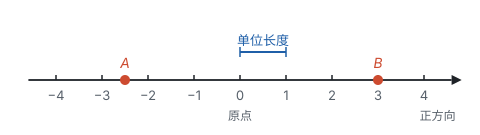
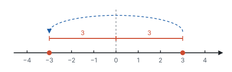
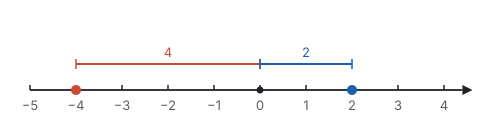
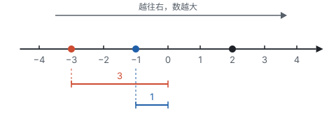

# 有理数

> 对应人教版七年级上册第一章。

**正数和负数表示意义相反的量，整数和分数合起来叫有理数；每个有理数都是数轴上的一个点，相反数、绝对值、大小都可以在数轴上看出来。**

## 从哪里来：意义相反的量

小学里的数只能回答“有多少”。可生活里很多量除了多少，还有方向：

| 情境 | 一个方向 | 相反的方向 | 基准 |
| --- | --- | --- | --- |
| 气温 | 零上 5 ℃，记作 $5$ | 零下 3 ℃，记作 $-3$ | 0 ℃ |
| 海拔 | 高于海平面 200 m，记作 $200$ | 低于海平面 50 m，记作 $-50$ | 海平面 |
| 收支 | 收入 100 元，记作 $100$ | 支出 30 元，记作 $-30$ | 不收不支 |
| 水位 | 比警戒线高 0.4 m，记作 $0.4$ | 比警戒线低 1.2 m，记作 $-1.2$ | 警戒线 |

这几个例子的做法完全一样：**先定一个基准，记作 0；再规定一个方向为正，相反的方向就是负。** 哪个方向算正，是人规定的，只要前后一致就行。比如把“支出”规定为正也可以，那收入就要记成负数。

- 大于 0 的数叫**正数**，如 $3$、$\frac{1}{2}$、$2.5$。正数前面的“+”号可以省略。
- 在正数前面加上“−”号的数叫**负数**，如 $-3$、$-\frac{1}{2}$、$-2.5$。
- **0 既不是正数，也不是负数。** 它是正、负的分界，是基准本身。

## 有理数的分类

**正整数、0、负整数统称整数；正分数、负分数统称分数；整数和分数统称有理数。**

有限小数和无限循环小数都能化成分数，比如 $0.5 = \frac{1}{2}$，$-2.4 = -\frac{12}{5}$，$0.333\cdots = \frac{1}{3}$，所以它们也是分数，是有理数。整数也能写成分数，比如 $5 = \frac{5}{1}$。所以有理数有一个统一的样子：**都能写成两个整数的商 $\frac{p}{q}$（$q \ne 0$）。**

同一批数可以按不同的标准分类：

| 分类标准 | 第一层 | 第二层 |
| --- | --- | --- |
| 按整数、分数分 | 整数 | 正整数、0、负整数 |
| 按整数、分数分 | 分数 | 正分数、负分数 |
| 按正负分 | 正有理数 | 正整数、正分数 |
| 按正负分 | 0 | — |
| 按正负分 | 负有理数 | 负整数、负分数 |

分类时要做到**不重不漏**：每个有理数恰好落在一类里。0 在按正负分时单独成一类，在按整数、分数分时属于整数。正数和 0 合起来叫**非负数**，这个说法后面会经常用到。

**例 1**　把下列各数填入相应的类别：$-3$，$0$，$\frac{2}{5}$，$-0.6$，$7$，$-2\frac{1}{3}$，$\pi$。

**思路：** 先看它能不能写成两个整数的商，再看正负和是不是整数。

**解：**

| 类别 | 数 |
| --- | --- |
| 正数 | $\frac{2}{5}$，$7$，$\pi$ |
| 负数 | $-3$，$-0.6$，$-2\frac{1}{3}$ |
| 整数 | $-3$，$0$，$7$ |
| 分数 | $\frac{2}{5}$，$-0.6$，$-2\frac{1}{3}$ |
| 有理数 | $-3$，$0$，$\frac{2}{5}$，$-0.6$，$7$，$-2\frac{1}{3}$ |

$\pi = 3.14159\cdots$ 是正数，但它是无限不循环小数，写不成两个整数的商，不是有理数（见第二部分“实数”）。$0$ 是整数，但既不在正数里，也不在负数里。

## 数轴：把数画成点

温度计是一根竖着的刻度尺，0 ℃ 以上是正、以下是负。把它横过来，就是数轴。

**规定了原点、正方向和单位长度的直线叫数轴。** 这三样缺一不可：

- **原点**说明 0 在哪里，是基准；
- **正方向**说明哪边是正，通常向右；
- **单位长度**说明 1 有多长，每一段都必须一样长。

有了这三样，每个有理数都能找到唯一的点：正数 $a$ 在原点右边、离原点 $a$ 个单位长度；负数 $-a$ 在原点左边、离原点 $a$ 个单位长度。下图中，点 $A$ 表示 $-2.5$，点 $B$ 表示 $3$：

从此，**一个数就是一个点**。数的性质可以在数轴上看，数轴上的位置关系也可以用数来算。

## 相反数：关于原点对称

**只有符号不同的两个数互为相反数**，如 $3$ 和 $-3$。0 的相反数是 0。

在数轴上，$3$ 和 $-3$ 分别在原点两侧，到原点的距离都是 3。沿着过原点的竖线把数轴对折，这两个点正好重合：**互为相反数的两个点关于原点对称。**

$a$ 的相反数记作 $-a$。所以 $-(-3)$ 是 $-3$ 的相反数，等于 $3$：对折两次，又回到原来的位置。

注意，$-a$ 读作“$a$ 的相反数”，不一定是负数：$a = -3$ 时，$-a = 3$。

## 绝对值：到原点的距离

**数轴上表示数 $a$ 的点与原点的距离，叫作 $a$ 的绝对值，记作 $\lvert a \rvert$。**

从图上看，$\lvert -4 \rvert = 4$，$\lvert 2 \rvert = 2$，$\lvert 0 \rvert = 0$。绝对值去掉了方向，只留下“有多远”。

从“距离”这个定义出发，可以推出绝对值的算法：

- $a > 0$ 时，点在原点右边，离原点 $a$ 个单位，所以 $\lvert a \rvert = a$；
- $a = 0$ 时，点就是原点，所以 $\lvert a \rvert = 0$；
- $a < 0$ 时，点在原点左边，它到原点的距离等于它的相反数，比如 $\lvert -4 \rvert = 4 = -(-4)$，所以 $\lvert a \rvert = -a$。

$$\lvert a \rvert = \begin{cases} a, & a > 0, \\ 0, & a = 0, \\ -a, & a < 0. \end{cases}$$

还有两条性质，也是直接从“距离”来的：

- **距离不会是负数，所以 $\lvert a \rvert \ge 0$。**
- 互为相反数的两个点到原点一样远，所以 $\lvert a \rvert = \lvert -a \rvert$。

**例 2**　（1）若 $\lvert x \rvert = 3$，求 $x$；（2）若 $\lvert x \rvert = -2$，求 $x$。

**思路：** 把 $\lvert x \rvert = 3$ 翻译成数轴上的话：点 $x$ 到原点的距离是 3。

**解：**（1）到原点距离为 3 的点，原点右边有一个，左边有一个，所以 $x = 3$ 或 $x = -3$。

（2）距离不可能是负数，没有满足条件的 $x$。

**例 3**　已知 $\lvert a - 2 \rvert + \lvert b + 3 \rvert = 0$，求 $a + b$ 的值。

**思路：** 这里只有一个等式，却有两个未知的数，关键在于绝对值不会是负数。两个不小于 0 的数相加得 0，只能两个都是 0：只要有一个大于 0，和就大于 0 了。

**解：** 因为 $\lvert a - 2 \rvert \ge 0$，$\lvert b + 3 \rvert \ge 0$，而它们的和是 0，所以

$$\lvert a - 2 \rvert = 0, \quad \lvert b + 3 \rvert = 0.$$

于是 $a - 2 = 0$，$b + 3 = 0$，得 $a = 2$，$b = -3$，所以 $a + b = -1$。

## 大小比较：越往右越大

正数之间比大小，小学就会：3 比 2 大，在数轴上 3 也在 2 的右边。把这个规律推广到所有有理数：**在数轴上，右边的点表示的数总比左边的大。** 这也符合生活经验：$-3$ ℃ 比 $-1$ ℃ 更冷。

从这一条出发，其他的比较规则都能在图上读出来：

- **正数大于 0，0 大于负数，正数大于负数。** 正数都在原点右边，负数都在原点左边。
- **两个负数，绝对值大的反而小。** 两个负数都在原点左边，离原点越远（绝对值越大），就越靠左，也就越小。上图中 $\lvert -3 \rvert = 3 > \lvert -1 \rvert = 1$，而 $-3 < -1$。

**例 4**　比较 $-\frac{3}{4}$ 和 $-\frac{4}{5}$ 的大小。

**思路：** 两个都是负数，谁离原点远谁就小，所以先比较它们的绝对值。

**解：** $\left\lvert -\frac{3}{4} \right\rvert = \frac{3}{4} = \frac{15}{20}$，$\left\lvert -\frac{4}{5} \right\rvert = \frac{4}{5} = \frac{16}{20}$。

因为 $\frac{15}{20} < \frac{16}{20}$，$-\frac{4}{5}$ 离原点更远、更靠左，所以 $-\frac{4}{5} < -\frac{3}{4}$。

## 易错点

- **把带“−”号的都当成负数。** $-a$ 是 $a$ 的相反数，$a$ 本身是负数时，$-a$ 是正数。同样，不带符号的字母 $a$ 也不一定是正数。
- **弄错 0 的归属。** 0 是整数、是有理数、是非负数，但既不是正数，也不是负数。
- **数轴画得不完整。** 缺原点、缺箭头（正方向）、刻度不等距，都不是数轴。
- **以为 $\lvert a \rvert = a$ 总成立。** 只有 $a \ge 0$ 时才成立；$a < 0$ 时 $\lvert a \rvert = -a$。所以 $\lvert x \rvert = 3$ 有两个解，漏掉 $-3$ 就是忘了原点左边还有一个点。
- **两个负数比大小时，按绝对值大的算大。** 这是把“离原点远”当成了“在右边”。回到定义：数的大小看左右，不看远近。
- **以为无限小数都不是有理数。** $0.333\cdots$ 是无限循环小数，等于 $\frac{1}{3}$，是有理数；$\pi$ 是无限不循环小数，才不是有理数。

## 联系

- **有理数的运算：** 加减法就是在数轴上移动，加法法则里要用绝对值。见第二部分“有理数的运算”。
- **实数：** 数轴上还有很多点不表示有理数，比如边长为 1 的正方形的对角线长。见第二部分“实数”。
- **平面直角坐标系：** 两条互相垂直的数轴组成坐标系，点的位置用两个数表示。见第六部分“平面直角坐标系”。
- **中心对称：** 相反数关于原点对称；到了坐标系里，关于原点对称的两个点，横坐标、纵坐标都互为相反数。见第六部分“平移、轴对称与旋转”。
- **不等式：** 不等式的解集是数轴上的一段，用“越往右越大”来画。见第四部分“不等式与不等式组”。
- **二次根式：** $\sqrt{a^2} = \lvert a \rvert$，化简时要用绝对值的算法。见第三部分“二次根式”。
- **分类讨论：** $\lvert x \rvert = 3$ 要分原点左右两种情况，这是分类讨论最早出现的地方。见第十一部分“分类讨论”。
