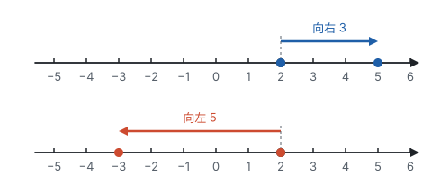
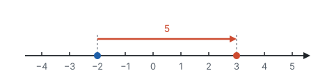
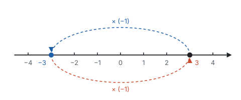
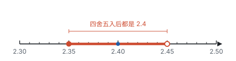

# 有理数的运算 ★

> 对应人教版七年级上册第二章。

**有理数的运算法则都是推出来的：加法是数轴上的移动，减法和除法分别是加法和乘法倒过来，负数乘负数得正数，是为了让交换律、结合律、分配律继续成立。**

## 从哪里来

有了负数，就要回答：$2 + (-5)$ 等于多少？$(-2) \times (-3)$ 呢？这些算式小学没有见过，结果不能随便规定，要满足两个要求：

1. **和实际意义相符。** 比如先收入 2 元、再支出 5 元，结果应该是少了 3 元。
2. **原来的运算律照样成立。** 小学的加法交换律、结合律，乘法交换律、结合律、分配律，到了有理数里仍然要对。

下面每一条法则，都是从这两个要求推出来的。

## 加法：在数轴上移动

把加法看成移动：**从 $a$ 出发，加上一个正数就向右移，加上一个负数就向左移，移动的距离是加数的绝对值。** 最后停在哪里，和就是几。

从“移动”可以读出加法法则：

| 情况 | 移动的过程 | 结果 | 例子 |
| --- | --- | --- | --- |
| 同号相加 | 两次都朝同一个方向走 | 方向不变，距离相加：取相同的符号，绝对值相加 | $(-2) + (-3) = -5$ |
| 异号相加 | 先朝一个方向走，再往回走 | 往回抵消了一部分：取绝对值较大的数的符号，用较大的绝对值减去较小的绝对值 | $2 + (-5) = -3$ |
| 互为相反数相加 | 走出去多远，就走回来多远 | 回到原点：$a + (-a) = 0$ | $3.5 + (-3.5) = 0$ |
| 加 0 | 不移动 | 仍是这个数：$a + 0 = a$ | $(-7) + 0 = -7$ |

先走哪一步、后走哪一步，最后停的位置不变，所以**加法交换律 $a + b = b + a$ 和结合律 $(a + b) + c = a + (b + c)$ 仍然成立**。计算时可以先把互为相反数的、同号的、能凑整的放在一起加。

## 减法：加法倒过来

减法是加法的逆运算：**$a - b$ 就是“加上 $b$ 以后等于 $a$”的那个数。**

那么哪个数加上 $b$ 等于 $a$？试一试 $a + (-b)$：

$$\big(a + (-b)\big) + b = a + \big((-b) + b\big) = a + 0 = a.$$

它正好满足要求，所以

$$a - b = a + (-b).$$

**减去一个数，等于加上这个数的相反数。** 这样减法就变成了加法，一串加减混合的算式可以全部看成加法，叫作**代数和**。比如 $5 - 8 + 3 - (-2)$ 就是 $5$、$-8$、$3$、$2$ 这四个数的和。

减法在数轴上也有意思：**$a - b$ 表示从点 $b$ 走到点 $a$，要走多远、朝哪个方向。** 比如某天最高气温 3 ℃、最低气温 $-2$ ℃，温差是 $3 - (-2) = 3 + 2 = 5$（℃）。

差是正数，说明从 $b$ 到 $a$ 是向右走；差是负数，说明是向左走。不管方向，只看路程，就是**数轴上两点 $a$、$b$ 之间的距离 $\lvert a - b \rvert$**。

## 乘法：让运算律继续成立

**正数乘负数。** $3 \times (-2)$ 是 3 个 $-2$ 相加：$(-2) + (-2) + (-2) = -6$。比如水位每天下降 2 cm，3 天后比原来低 6 cm。

**负数乘正数。** 要让乘法交换律成立，$(-2) \times 3$ 必须等于 $3 \times (-2)$，也是 $-6$。

**负数乘负数。** $(-2) \times (-3)$ 没法再说成“几个几相加”，这时让分配律来决定。一方面 $3 + (-3) = 0$，另一方面用分配律展开：

$$\begin{aligned} (-2) \times \big[3 + (-3)\big] &= (-2) \times 0 = 0, \\ (-2) \times \big[3 + (-3)\big] &= (-2) \times 3 + (-2) \times (-3) = -6 + (-2) \times (-3). \end{aligned}$$

所以 $-6 + (-2) \times (-3) = 0$，也就是说 $(-2) \times (-3)$ 是 $-6$ 的相反数：

$$(-2) \times (-3) = 6.$$

如果规定它等于 $-6$，分配律就不成立了。**负数乘负数得正数，不是随便规定的，而是保住分配律的唯一选择。**

也可以看一串算式的规律：

| 算式 | $(-2) \times 3$ | $(-2) \times 2$ | $(-2) \times 1$ | $(-2) \times 0$ | $(-2) \times (-1)$ | $(-2) \times (-2)$ |
| --- | --- | --- | --- | --- | --- | --- |
| 积 | $-6$ | $-4$ | $-2$ | $0$ | ？ | ？ |

第二个因数每减少 1，积就增加 2。顺着这个规律走下去，问号处应该是 $2$ 和 $4$，和分配律推出来的结果一致。

归纳起来就是**乘法法则：两数相乘，同号得正，异号得负，并把绝对值相乘；任何数与 0 相乘都得 0。**

**乘以 $-1$，就是取相反数。** $3 \times (-1) = -3$，$(-3) \times (-1) = 3$。在数轴上，乘以 $-1$ 就是把点翻到原点的另一侧：

乘一个负数，可以看成先乘它的绝对值、再乘以 $-1$ 翻一次面。所以**几个不是 0 的数相乘，积的符号由负因数的个数决定：** 负因数有奇数个，翻了奇数次，积为负；有偶数个，翻回来了，积为正。只要有一个因数是 0，积就是 0。

乘法交换律、结合律、分配律对有理数都成立：

$$ab = ba, \quad (ab)c = a(bc), \quad a(b + c) = ab + ac.$$

## 除法：乘法倒过来

**乘积是 1 的两个数互为倒数。** $-\frac{2}{3}$ 的倒数是 $-\frac{3}{2}$，$-5$ 的倒数是 $-\frac{1}{5}$。0 乘任何数都得 0，得不到 1，所以 **0 没有倒数**。

除法是乘法的逆运算：**$a \div b$ 就是“乘以 $b$ 以后等于 $a$”的那个数。** 试一试 $a \times \frac{1}{b}$：

$$\left(a \times \frac{1}{b}\right) \times b = a \times \left(\frac{1}{b} \times b\right) = a \times 1 = a.$$

它正好满足要求，所以**除以一个不等于 0 的数，等于乘这个数的倒数**：

$$a \div b = a \times \frac{1}{b} \quad (b \ne 0).$$

这样除法就变成了乘法，符号法则也和乘法一样：同号得正，异号得负。比如 $(-12) \div 4 = -3$，$(-12) \div (-4) = 3$。

**为什么除数不能是 0？** 按定义，$a \div 0$ 是“乘以 0 等于 $a$”的数。$a \ne 0$ 时，任何数乘以 0 都是 0，找不到这样的数；$a = 0$ 时，任何数乘以 0 都等于 0，答案不唯一。两种情况都没法给出确定的结果，所以除数不能为 0。

## 乘方：相同因数的乘积

$n$ 个相同的因数 $a$ 相乘，记作 $a^n$，读作“$a$ 的 $n$ 次方”。这种运算叫**乘方**，结果叫**幂**，$a$ 叫**底数**，$n$ 叫**指数**。

乘方就是乘法，所以符号也由负因数的个数决定：

- 正数的任何次幂都是正数；
- **负数的偶数次幂是正数，负数的奇数次幂是负数**，比如 $(-2)^4 = 16$，$(-2)^3 = -8$；
- 0 的任何正整数次幂都是 0。

**指数只管紧挨着它的那个数。** $(-2)^4$ 的底数是 $-2$，表示 4 个 $-2$ 相乘，等于 $16$；$-2^4$ 的底数是 $2$，表示 $2^4$ 的相反数，等于 $-16$。同样，$\left(\frac{2}{3}\right)^2 = \frac{4}{9}$，而 $\frac{2^2}{3} = \frac{4}{3}$。

## 混合运算：先算“打包”的运算

**运算顺序：先乘方，再乘除，最后加减；同级运算从左到右；有括号先算括号里面的。**

这个顺序有它的道理。$3 \times 4$ 是 $4 + 4 + 4$ 的简写，$3^2$ 是 $3 \times 3$ 的简写：级别越高的运算，越是把低一级的运算“打了包”。算 $2 + 3 \times 4$ 时，$3 \times 4$ 是一个整体，要先拆开这个包，再和 2 相加，所以先乘后加。括号的作用就是人为地打一个包，告诉你“这一部分先算”。

同级运算要从左到右，是因为减法和除法不满足交换律。比如 $8 \div 4 \times 2$，从左到右算是 $2 \times 2 = 4$；先算 $4 \times 2$ 就得到 $1$，错了。把除法先化成乘法，$8 \times \frac{1}{4} \times 2$，就可以任意交换顺序，不会出错。

**例 1**　计算：

$$-2^2 + (-3)^2 \times \left(-\frac{2}{3}\right) - 6 \div \left(-\frac{3}{2}\right).$$

**思路：** 先认清式子里的“包”：两个乘方，一个乘法，一个除法，最外层是加减。$-2^2$ 的底数是 2，不是 $-2$。除以 $-\frac{3}{2}$ 就是乘以 $-\frac{2}{3}$。

**解：**

$$\begin{aligned} &-2^2 + (-3)^2 \times \left(-\frac{2}{3}\right) - 6 \div \left(-\frac{3}{2}\right) \\ =\ &-4 + 9 \times \left(-\frac{2}{3}\right) - 6 \times \left(-\frac{2}{3}\right) \\ =\ &-4 + (-6) - (-4) \\ =\ &-4 - 6 + 4 \\ =\ &-6. \end{aligned}$$

**例 2**　计算：

$$\left(\frac{1}{4} - \frac{5}{6} + \frac{2}{3}\right) \times (-12).$$

**思路：** 按顺序应该先算括号，要通分；也可以注意到 12 是 4、6、3 的公倍数，用分配律把 $-12$ 乘进去，每一项都能约掉分母。

**解法一：先算括号。**

$$\left(\frac{3}{12} - \frac{10}{12} + \frac{8}{12}\right) \times (-12) = \frac{1}{12} \times (-12) = -1.$$

**解法二：用分配律。**

$$\begin{aligned} &\frac{1}{4} \times (-12) - \frac{5}{6} \times (-12) + \frac{2}{3} \times (-12) \\ =\ &-3 - (-10) + (-8) \\ =\ &-3 + 10 - 8 \\ =\ &-1. \end{aligned}$$

**想一想：** 两种解法结果相同，因为分配律保证了“先加后乘”和“先乘后加”一样。

| 比较 | 解法一：先算括号 | 解法二：用分配律 |
| --- | --- | --- |
| 依据 | 运算顺序 | 分配律 |
| 麻烦在哪里 | 要通分，分数加减容易出错 | 要把 $-12$ 的符号带进每一项 |
| 什么时候更好 | 括号里的分数容易合并时 | 括号外的数正好是各个分母的公倍数时 |

运算顺序是“默认怎么算”，运算律告诉你“还可以怎么算而结果不变”。先看清式子的结构，再决定走哪条路。

**例 3**　10 箱苹果，每箱标准重量是 20 kg。超过标准的千克数记作正数，不足的记作负数，称得的结果是：

$$0.5,\ -0.3,\ 0,\ -0.2,\ 0.4,\ -0.1,\ 0.3,\ -0.4,\ 0.2,\ -0.2.$$

这 10 箱苹果一共重多少千克？

**思路：** 把 10 个数直接相加很繁。换个角度：总重量 = 标准总重 + 所有偏差的和。偏差里有好几对相反数，用加法交换律、结合律先把它们凑在一起，和为 0。

**解：** 偏差的和是

$$\begin{aligned} &\big[(-0.3) + 0.3\big] + \big[0.4 + (-0.4)\big] + \big[0.2 + (-0.2)\big] + 0.5 + 0 + (-0.2) + (-0.1) \\ =\ &0 + 0 + 0 + 0.5 - 0.3 \\ =\ &0.2. \end{aligned}$$

所以总重量是 $20 \times 10 + 0.2 = 200.2$（kg）。

选一个基准、只算偏差，是处理一批相近数据的常用办法，求平均数时也可以这样做。

## 科学记数法

地球到太阳的平均距离大约是 $150\,000\,000$ km，这样的数写起来长，读起来还要一位一位数。

$10^n$ 就是 1 后面跟 $n$ 个 0，比如 $10^8 = 100\,000\,000$。所以

$$150\,000\,000 = 1.5 \times 100\,000\,000 = 1.5 \times 10^8.$$

**把一个数写成 $a \times 10^n$ 的形式，其中 $1 \le \lvert a \rvert < 10$，$n$ 是正整数，叫科学记数法。** 对于绝对值大于等于 10 的数，$n$ 等于原数的整数位数减 1：$150\,000\,000$ 有 9 位整数，$n = 8$。负数也一样，$-32\,000 = -3.2 \times 10^4$。

这样写的好处是一眼看出数的大小：比较 $3.2 \times 10^5$ 和 $9.8 \times 10^4$，先看指数，$10^5$ 比 $10^4$ 大一个数量级，前者更大。

## 近似数

参加活动的人数、书的页数，都是准确数；量出来的长度、称出来的重量，往往是近似数。近似数与准确数的接近程度，用**精确度**表示：四舍五入到哪一位，就说**精确到哪一位**。

一个近似数代表的不是一个点，而是一段范围。**近似数 2.4（精确到十分位，也说精确到 0.1）代表的是四舍五入后等于 2.4 的所有数：**

所以 $2.4$ 和 $2.40$ 不一样：$2.40$ 精确到百分位，代表大于或等于 $2.395$ 且小于 $2.405$ 的数，范围小得多。**近似数末尾的 0 不能随便去掉。**

**例 4**　把 $3\,076\,500$ 精确到万位，并用科学记数法表示。

**思路：** 万位上的数字是 7，看它右边一位（千位）上的 6，大于等于 5，要进 1。结果是 308 万。如果写成 $3\,080\,000$，末尾的 0 会让人以为它精确到个位，所以要用科学记数法写。

**解：** $3\,076\,500 \approx 3.08 \times 10^6$。

反过来，已知近似数 $3.08 \times 10^6$，要判断它精确到哪一位，就看最后一位数字 8 在原数中的位置：$3.08 \times 10^6 = 3\,080\,000$，8 在万位上，所以精确到万位。

## 易错点

- **把 $-2^2$ 算成 4。** 指数只管紧挨着的 2，$-2^2 = -(2 \times 2) = -4$；要表示 $-2$ 的平方，必须写成 $(-2)^2$。
- **同级运算不从左到右。** $8 \div 4 \times 2 = 4$，不是 $1$。把除法化成乘倒数，就不会出错。
- **以为除法也有分配律。** $(a + b) \div c = a \div c + b \div c$ 是对的，因为它就是 $(a + b) \times \frac{1}{c}$；但 $c \div (a + b)$ 不能拆开。比如 $12 \div \left(\frac{1}{2} + \frac{1}{3}\right) = 12 \div \frac{5}{6} = \frac{72}{5}$，而 $12 \div \frac{1}{2} + 12 \div \frac{1}{3} = 60$。
- **交换位置时丢了符号。** 把 $5 - 8 + 3$ 看成 $5 + (-8) + 3$，符号跟着数一起走，才能交换成 $5 + 3 + (-8)$。
- **多个因数相乘时符号判断错。** 先数负因数的个数定符号，再算绝对值；有一个因数是 0，积就是 0。
- **0 没有倒数，0 不能作除数。** 求倒数、做除法之前，先确认它不是 0。
- **科学记数法里 $a$ 的范围不对。** $15 \times 10^7$ 不是科学记数法，要写成 $1.5 \times 10^8$。
- **近似数去掉了末尾的 0。** $2.40$ 和 $2.4$ 的精确度不同。

## 联系

- **有理数：** 加法法则里的“绝对值”、减法里的“相反数”、乘以 $-1$ 时的“关于原点对称”，都是前一页在数轴上定义的。见第二部分“有理数”。
- **实数：** 这一页的法则和运算律，到了实数里全部照样成立。见第二部分“实数”。
- **整式的加减：** 去括号就是乘以 $-1$ 再用分配律，合并同类项也是分配律。见第三部分“整式的加减”。
- **整式的乘法：** 同底数幂相乘、幂的乘方，都从“乘方是相同因数的乘积”推出来。见第三部分“整式的乘法”。
- **分式：** 分式的运算和分数的运算规则一样；绝对值小于 1 的数的科学记数法要用到负整数指数幂。见第三部分“分式”。
- **平移和中心对称：** 加一个数是把点沿数轴平移，乘以 $-1$ 是关于原点对称。见第六部分“平移、轴对称与旋转”。
- **数据的分析：** 例 3 称 10 箱苹果，以每箱 20 kg 为基准，只把偏差加起来（和是 0.2 kg），总重量就是 $20 \times 10 + 0.2 = 200.2$（kg）。这种选基准、算偏差的办法，求平均数时同样好用。见第十部分“数据的分析”。
