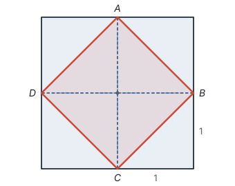
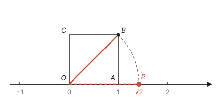
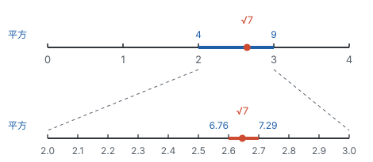

# 实数 ★

> 对应人教版七年级下册第八章。

**边长为 1 的正方形，对角线的长度不能用任何有理数表示；把这样的无限不循环小数（无理数）添进来，就得到实数，实数和数轴上的点一一对应。**

## 从哪里来：面积为 2 的正方形

用 4 个边长为 1 的小正方形拼成一个大正方形，面积是 4。连接大正方形四条边的中点，得到正方形 $ABCD$：

大正方形四个角上各有一个直角三角形，每个都是一个小正方形的一半。把它们分别绕斜边的中点转半圈，正好盖满正方形 $ABCD$。所以正方形 $ABCD$ 的面积是 4 个半个小正方形：

$$4 \times \frac{1}{2} = 2.$$

也可以用大正方形的面积减去四个角：$4 - 4 \times \frac{1}{2} = 2$。

设正方形 $ABCD$ 的边长是 $x$，那么 $x^2 = 2$。$x$ 是多少？试着逼近它：

| $x$ | $1.4$ | $1.5$ | $1.41$ | $1.42$ | $1.414$ | $1.415$ |
| --- | --- | --- | --- | --- | --- | --- |
| $x^2$ | $1.96$ | $2.25$ | $1.9881$ | $2.0164$ | $1.999396$ | $2.002225$ |

$x$ 在 $1.41$ 和 $1.42$ 之间，又在 $1.414$ 和 $1.415$ 之间……每次都能再夹紧一位，却总也碰不到平方正好是 2 的数。后面会证明：**没有哪个有理数的平方等于 2。** 这条边的长度实实在在地画在纸上，却不是有理数，数必须再扩充一次。

## 平方根和算术平方根

**如果 $x^2 = a$，那么 $x$ 叫作 $a$ 的平方根。** 求一个数的平方根的运算叫**开平方**，它和平方互为逆运算。

一个数有几个平方根？从“平方”的结果倒推：

- $3^2 = 9$，$(-3)^2 = 9$，所以 **正数有两个平方根，它们互为相反数**；
- 只有 $0^2 = 0$，所以 **0 的平方根是 0**；
- 正数、负数的平方都是正数（同号相乘得正），0 的平方是 0，没有哪个数的平方是负数，所以 **负数没有平方根**。

正数的两个平方根里，正的那个叫**算术平方根**，记作 $\sqrt{a}$；0 的算术平方根是 0。于是正数 $a$ 的两个平方根可以写成 $\pm\sqrt{a}$。开头那个面积为 2 的正方形 $ABCD$，边长 $x$ 满足 $x^2 = 2$，就是 $\sqrt{2}$，长度只能取正的那个，这正是要单独规定算术平方根的原因。

$\sqrt{a}$ 有两个“不小于 0”：**被开方数 $a \ge 0$，结果 $\sqrt{a} \ge 0$。** 由定义还直接得到 $(\sqrt{a})^2 = a$（$a \ge 0$）。

**例 1**　（1）求 $\frac{49}{100}$ 的平方根和算术平方根；（2）求 $\sqrt{16}$ 的平方根；（3）求 $\sqrt{(-3)^2}$。

**思路：** 每一问都先问自己：哪个数的平方等于它？要的是全部平方根，还是算术平方根？

**解：**（1）因为 $\left(\pm\frac{7}{10}\right)^2 = \frac{49}{100}$，所以 $\frac{49}{100}$ 的平方根是 $\pm\frac{7}{10}$，算术平方根是 $\frac{7}{10}$。

（2）先算 $\sqrt{16} = 4$，要求的是 4 的平方根，是 $\pm 2$。

（3）先算根号里面：$(-3)^2 = 9$，所以 $\sqrt{(-3)^2} = \sqrt{9} = 3$。算术平方根不会是负数，结果不是 $-3$。

## 立方根

**如果 $x^3 = a$，那么 $x$ 叫作 $a$ 的立方根，记作 $\sqrt[3]{a}$。** 体积为 8 的正方体，棱长是 $\sqrt[3]{8} = 2$；体积为 2 的正方体，棱长是 $\sqrt[3]{2}$。

立方和平方不同：三个负数相乘是负数，所以负数的立方是负数，正数的立方是正数，而且数越大，立方越大。所以**每个数都有且只有一个立方根**：正数的立方根是正数，负数的立方根是负数，0 的立方根是 0。比如 $\sqrt[3]{-8} = -2$，因为 $(-2)^3 = -8$。一般地，$\sqrt[3]{-a} = -\sqrt[3]{a}$。

| 比较 | 平方根 | 立方根 |
| --- | --- | --- |
| 定义 | $x^2 = a$ | $x^3 = a$ |
| 正数 | 两个，互为相反数 | 一个，是正数 |
| 0 | 0 | 0 |
| 负数 | 没有 | 一个，是负数 |
| 原因 | 任何数的平方都不是负数 | 立方保持原来的符号 |

**例 2**　求下列各式中的 $x$：（1）$2x^2 = 50$；（2）$(x - 1)^3 = -27$。

**思路：** 先把“谁的平方（立方）”看成一个整体，求出这个整体，再求 $x$。

**解：**（1）两边同时除以 2，得 $x^2 = 25$。25 的平方根是 $\pm 5$，所以 $x = 5$ 或 $x = -5$。

（2）把 $x - 1$ 看成整体，它的立方是 $-27$，所以 $x - 1 = \sqrt[3]{-27} = -3$，得 $x = -2$。

## 为什么根号 2 不是有理数（拓展）

有理数都能写成两个整数的商。如果 $\sqrt{2}$ 是有理数，会发生什么？

**证明：** 假设 $\sqrt{2}$ 是有理数，那么可以写成 $\sqrt{2} = \frac{p}{q}$，其中 $p$、$q$ 是正整数，并且这个分数已经约到最简，$p$、$q$ 没有 1 以外的公因数。两边平方，得

$$p^2 = 2q^2.$$

右边是偶数，所以 $p^2$ 是偶数。奇数的平方是奇数，所以 $p$ 不能是奇数，$p$ 是偶数。设 $p = 2m$，代入得 $4m^2 = 2q^2$，即

$$q^2 = 2m^2.$$

同样的道理，$q$ 也是偶数。$p$、$q$ 都是偶数，有公因数 2，和“已经约到最简”矛盾。所以假设不成立，**$\sqrt{2}$ 不是有理数**。

这种先假设结论不成立、推出矛盾的证明方法叫**反证法**（见第一部分“怎样证明”）。

## 无理数：无限不循环小数

把分数化成小数，会得到什么样的小数？用除法算 $\frac{1}{7}$：

$$\frac{1}{7} = 0.142857\,142857\,142857\cdots$$

除以 7 时，每一步的余数只能是 0、1、2、3、4、5、6 中的一个。余数是 0 就除尽了，得到有限小数；除不尽的话，最多 6 步之后，一定会遇到一个出现过的余数，从那以后商就开始重复。这里余数依次是 1、3、2、6、4、5，然后又回到 1，所以 142857 这 6 个数字循环出现。**任何分数化成小数，都是有限小数或无限循环小数。**

反过来，有限小数和无限循环小数也都能化成分数（拓展：设 $x = 0.1212\cdots$，则 $100x = 12.1212\cdots$，两式相减得 $99x = 12$，$x = \frac{12}{99} = \frac{4}{33}$）。所以：

**有理数就是有限小数和无限循环小数。无限不循环小数叫无理数。**

$\sqrt{2} = 1.41421356\cdots$ 不是有理数，所以它的小数既不会除尽，也不会循环。常见的无理数有三类：

- 开方开不尽的数，如 $\sqrt{2}$、$-\sqrt{3}$、$\sqrt[3]{2}$；
- 与 $\pi$ 有关的数，如 $\pi$、$\frac{\pi}{2}$；
- 有规律但不循环的小数，如 $0.1010010001\cdots$（相邻两个 1 之间 0 的个数依次多一个）。

判断时看的是“能不能写成两个整数的商”，不是看样子：$\sqrt{4} = 2$、$\sqrt[3]{-8} = -2$ 是有理数；$\frac{22}{7}$、$3.14$ 是 $\pi$ 的近似值，本身是有理数。

## 实数与数轴

**有理数和无理数统称实数。**

| 分类标准 | 第一层 | 第二层 |
| --- | --- | --- |
| 按定义分 | 有理数 | 整数、分数（有限小数或无限循环小数） |
| 按定义分 | 无理数 | 正无理数、负无理数（无限不循环小数） |
| 按正负分 | 正实数 | 正有理数、正无理数 |
| 按正负分 | 0 | — |
| 按正负分 | 负实数 | 负有理数、负无理数 |

$\sqrt{2}$ 能在数轴上找到。以数轴上从 0 到 1 的线段 $OA$ 为边作正方形 $OABC$，对角线 $OB$ 的长是 $\sqrt{2}$（它是面积为 2 的正方形的边长，也可以用勾股定理算出来）。以 $O$ 为圆心、$OB$ 为半径画弧，交数轴正半轴于点 $P$，点 $P$ 表示的数就是 $\sqrt{2}$：

同样，向左画弧得到的点表示 $-\sqrt{2}$。这说明**数轴上有些点不表示有理数**。有理数在数轴上已经非常密了，任意两个有理数之间都还有有理数，但它们之间仍然留着“缝”。把无理数补进来以后，数轴就被填满了：

**每一个实数都可以用数轴上的一个点表示；反过来，数轴上的每一个点都表示一个实数。实数和数轴上的点一一对应。**

在有理数里学过的概念，到了实数里意思不变，因为它们都是在数轴上定义的：

- $\sqrt{2}$ 的相反数是 $-\sqrt{2}$，关于原点对称；
- $\lvert -\sqrt{2} \rvert = \sqrt{2}$；$\sqrt{2} > 1$，所以 $1 - \sqrt{2} < 0$，$\lvert 1 - \sqrt{2} \rvert = \sqrt{2} - 1$；
- 数轴上右边的点表示的数更大。

有理数的运算法则和运算律，在实数里也全部成立。需要具体数值时，就用近似值计算，比如取 $\sqrt{2} \approx 1.414$，$\pi \approx 3.142$，精确到 0.01 时，$\sqrt{2} + \pi \approx 1.414 + 3.142 = 4.556 \approx 4.56$。

## 估算：用平方夹紧

对于两个正数，**大的数平方后仍然大；反过来，被开方数大的，算术平方根也大。** 用正方形来想：边长越长，面积越大；面积越大，边长也越长。所以要知道 $\sqrt{7}$ 有多大，只要找平方在 7 两边的数：

- $2^2 = 4 < 7 < 9 = 3^2$，所以 $2 < \sqrt{7} < 3$；
- 把 2 到 3 十等分，$2.6^2 = 6.76 < 7 < 7.29 = 2.7^2$，所以 $2.6 < \sqrt{7} < 2.7$；
- 再十等分，$2.64^2 = 6.9696 < 7 < 7.0225 = 2.65^2$，所以 $2.64 < \sqrt{7} < 2.65$。

每夹一次，范围缩小到原来的十分之一，想要多精确都可以继续夹下去。

**例 3**　求 $5 - \sqrt{7}$ 的整数部分和小数部分。

**思路：** 先把 $\sqrt{7}$ 夹在两个相邻整数之间，再看 $-\sqrt{7}$、$5 - \sqrt{7}$ 的范围。取相反数时，数轴上的点关于原点翻过去，左右次序正好颠倒，所以不等号要改方向。

**解：** 因为 $2 < \sqrt{7} < 3$，取相反数，得 $-3 < -\sqrt{7} < -2$。都加上 5，得 $2 < 5 - \sqrt{7} < 3$。

所以 $5 - \sqrt{7}$ 的整数部分是 2，小数部分是 $(5 - \sqrt{7}) - 2 = 3 - \sqrt{7}$。

**例 4**　比较 $\frac{\sqrt{5} - 1}{2}$ 与 $\frac{1}{2}$ 的大小。（参考数据：$\sqrt{5} \approx 2.236$）

**思路：** 两个分数的分母相同，只要比较 $\sqrt{5} - 1$ 和 1，也就是看 $\sqrt{5}$ 比 2 大还是小。

**解法一：用估算推理。** 因为 $2^2 = 4 < 5$，所以 $\sqrt{5} > 2$（被开方数大的，算术平方根也大），于是 $\sqrt{5} - 1 > 1$，两边都除以 2，得

$$\frac{\sqrt{5} - 1}{2} > \frac{1}{2}.$$

**解法二：用近似值计算。** 代入参考数据 $\sqrt{5} \approx 2.236$，得 $\frac{\sqrt{5} - 1}{2} \approx \frac{2.236 - 1}{2} = 0.618$。因为 $0.618 > 0.5$，所以 $\frac{\sqrt{5} - 1}{2} > \frac{1}{2}$。

**想一想：** 两种办法都对，差别在于需要多精确。

| 比较 | 解法一：估算推理 | 解法二：近似值计算 |
| --- | --- | --- |
| 做法 | 只需知道 $\sqrt{5} > 2$ | 需要知道 $\sqrt{5}$ 的前几位小数 |
| 结论 | 严格成立 | 两个数相差较大时可靠 |
| 什么时候用 | 两数接近、需要说明理由时 | 手边有计算器、差距明显时 |

两个数离得越近，需要的精确度越高。用夹逼的办法，只要夹到足够把两个数分开就可以停下来，这里夹到 $2 < \sqrt{5} < 3$ 就够了。

## 易错点

- **把平方根和算术平方根混为一谈。** “16 的平方根是 4”不对，应该是 $\pm 4$；$\sqrt{16}$ 的平方根是 $\pm 2$，不是 $\pm 4$，要先算出 $\sqrt{16} = 4$。
- **认为 $\sqrt{(-3)^2} = -3$。** 算术平方根一定不小于 0，结果是 3。一般地，$\sqrt{a^2} = \lvert a \rvert$。
- **负数开平方。** $\sqrt{-4}$ 没有意义；但负数可以开立方，$\sqrt[3]{-8} = -2$。
- **凭样子判断无理数。** 带根号的不一定是无理数（$\sqrt{9} = 3$），无限小数也不一定是无理数（$0.333\cdots$ 是循环小数）。判断的标准是能否写成两个整数的商，或者说是否无限不循环。
- **说“有理数和数轴上的点一一对应”。** 有理数不能填满数轴，和数轴上的点一一对应的是实数。
- **估算时取相反数不改不等号方向。** 由 $2 < \sqrt{7} < 3$ 得到的是 $-3 < -\sqrt{7} < -2$，不是 $-2 < -\sqrt{7} < -3$。

## 联系

- **有理数：** 相反数、绝对值、大小比较都是在数轴上定义的，所以原样推广到实数。见第二部分“有理数”。
- **勾股定理：** 直角边为 1、1 的直角三角形，斜边是 $\sqrt{2}$；直角边为 1、2 的，斜边是 $\sqrt{5}$。勾股定理算出来的边长经常是无理数。见第五部分“勾股定理”。
- **二次根式：** 把 $\sqrt{a}$ 当成式子来运算、化简，$\sqrt{a^2} = \lvert a \rvert$ 是化简的关键。见第三部分“二次根式”。
- **一元二次方程：** 解 $x^2 = a$ 就是求 $a$ 的平方根，正数有两个根，负数没有实数根，这就是判别式的雏形。见第四部分“一元二次方程”。
- **怎样证明：** $\sqrt{2}$ 不是有理数，是反证法的经典例子。见第一部分“怎样证明”。
- **平面直角坐标系：** 实数和数轴上的点一一对应，所以有序实数对和坐标平面上的点一一对应。见第六部分“平面直角坐标系”。
- **与圆有关的计算：** $\pi$ 是无理数，弧长、扇形面积的结果常常保留 $\pi$。见第九部分“与圆有关的计算”。
