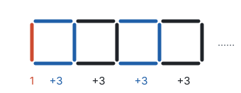
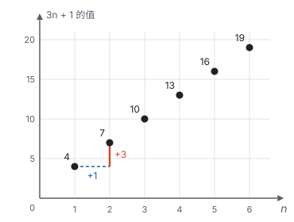

# 代数式

> 对应人教版七年级上册第三章。

**用运算符号把数和表示数的字母连接起来的式子，叫代数式。** 字母代表“任意一个数”，一个代数式就代表了一整类计算：字母取不同的值，式子就算出不同的结果。

## 从哪里来

用火柴棒摆正方形，一个挨一个排成一排：摆 1 个正方形要 4 根，摆 2 个要 7 根，摆 3 个要 10 根。摆 100 个要多少根？

一个一个数太慢。看看火柴是怎样增加的：最左边先放 1 根竖的，之后每添一个正方形，只要再加上、下、右 3 根。所以

- 摆 1 个：$1 + 3 \times 1 = 4$ 根；
- 摆 2 个：$1 + 3 \times 2 = 7$ 根；
- 摆 100 个：$1 + 3 \times 100 = 301$ 根。

这些算式的样子完全一样，变的只是正方形的个数。用字母 $n$ 表示正方形的个数，就能一次说清所有情况：**摆 $n$ 个正方形要 $3n + 1$ 根火柴。**

$3n + 1$ 就是一个代数式。像 $3n + 1$、$0.8a$、$a^2$、$\frac{a}{b}$、$\sqrt{x}$ 这样，用运算符号（加、减、乘、除、乘方、开方）把数和字母连起来的式子都是代数式。单独一个数或一个字母，比如 $5$、$a$，也算代数式。

换一种数法也可以：第一个正方形用 4 根，后面 $n - 1$ 个正方形每个再加 3 根，共 $4 + 3(n - 1)$ 根。两个式子样子不同，算出来的结果却总是一样，它们是“相等的式子”。怎样不用一个一个代数就看出它们相等，是下一页要讲的内容（见第三部分“整式的加减”）。

从算式到代数式，就是从“文字语言”翻译成“符号语言”：“正方形个数的 3 倍再加 1”写成 $3n + 1$，短而且准确（见第一部分“三种数学语言”）。

**代数式里没有等号和不等号。** $3n + 1$ 是代数式；$3n + 1 = 61$ 是方程，$3n + 1 > 61$ 是不等式。

## 代数式的写法

代数式里字母和数混在一起，为了不产生误会，写法有几条约定：

| 约定 | 例子 | 为什么 |
| --- | --- | --- |
| 数和字母、字母和字母相乘，乘号写成“·”或者省略 | $3 \times n$ 写成 $3n$，$a \times b$ 写成 $ab$ | 乘号“×”和字母 $x$ 容易看混 |
| 数写在字母前面 | $n \times 3$ 写成 $3n$ | 统一写法，一眼看出字母前面的数 |
| 带分数和字母相乘，带分数要化成假分数 | $1\frac{1}{2} \times a$ 写成 $\frac{3}{2}a$ | 带分数本身是“整数加分数”，后面紧跟字母容易读错 |
| 除法写成分数的形式 | $a \div 3$ 写成 $\frac{a}{3}$ | 分数线就是除号，写起来更紧凑 |

数和数相乘，乘号不能省：$3 \times 5$ 不能写成 $35$。

## 列代数式

列代数式的关键是**先用文字把“谁和谁、按什么顺序算”说清楚，再换成符号。** 运算顺序靠括号表达，文字里先算的部分，式子里就要先算，必要时加括号。

| 文字 | 代数式 | 说明 |
| --- | --- | --- |
| $a$ 与 $b$ 的和的平方 | $(a + b)^2$ | 先求和，再平方 |
| $a$ 与 $b$ 的平方和 | $a^2 + b^2$ | 先各自平方，再求和 |
| 比 $x$ 的 3 倍少 5 的数 | $3x - 5$ | 先算 3 倍，再减 5 |
| $x$ 与 1 的差的一半 | $\frac{x - 1}{2}$ | 先求差，再除以 2 |
| 十位数字是 $a$、个位数字是 $b$ 的两位数 | $10a + b$ | 十位上的 $a$ 表示 $a$ 个十 |
| 三个连续整数，中间一个是 $n$ | $n - 1$，$n$，$n + 1$ | 相邻整数相差 1 |

**例 1**　某商品每件进价 $a$ 元，商店按进价提高 40% 标价，再打八折出售。每件商品的利润是多少元？

**思路：** 利润 = 售价 − 进价。售价还不知道，要先求标价，再求售价，一步一步往前推。

**解：**

1. 标价：比进价提高 40%，是 $a(1 + 40\%) = 1.4a$（元）。
2. 售价：打八折，是标价的 0.8 倍，$0.8 \times 1.4a = 1.12a$（元）。
3. 利润：$1.12a - a = 0.12a$（元）。

答：每件商品的利润是 $0.12a$ 元。

**回顾：** 结果说明，不管进价是多少，利润总是进价的 12%。这是用字母算一次就得到的一般规律，换成具体的数就得每次重算。

**例 2**　一个两位数，十位数字是 $a$，个位数字是 $b$。把十位数字和个位数字交换位置，得到一个新的两位数。说明：原数与新数的差一定是 9 的倍数。

**思路：** “说明对所有两位数都成立”，不能只举几个例子，要用字母表示任意一个两位数，再算差。

**解：** 原数是 $10a + b$，新数是 $10b + a$。它们的差是

$$(10a + b) - (10b + a) = 10a + b - 10b - a = 9a - 9b = 9(a - b).$$

$a - b$ 是整数，所以差是 9 的倍数。

比如 $73 - 37 = 36 = 9 \times 4$，这里 $a - b = 7 - 3 = 4$，和算出来的一样。这种用字母和运算说明一般规律的方法叫代数推理（见第一部分“怎样证明”）；式子的变形用到了去括号和合并同类项（见第三部分“整式的加减”）。

## 代数式的值

**用数值代替代数式里的字母，按照式子中的运算算出的结果，叫代数式的值。** 求值分两步：先代入，再计算，计算就是有理数的混合运算（见第二部分“有理数的运算”）。

代入时要注意两点：

- 字母换成负数或分数时，要**加上括号**。$a = -2$ 时，$a^2$ 是 $(-2)^2 = 4$，不是 $-2^2 = -4$。
- 代数式里省略的乘号，代入数后要**写回来**：$a = -2$，$b = 3$ 时，$2ab$ 是 $2 \times (-2) \times 3$。

**例 3**　当 $a = -2$，$b = 3$ 时，求 $a^2 - 2ab + b^2$ 和 $(a - b)^2$ 的值。

**解：**

$$a^2 - 2ab + b^2 = (-2)^2 - 2 \times (-2) \times 3 + 3^2 = 4 + 12 + 9 = 25,$$

$$(a - b)^2 = (-2 - 3)^2 = (-5)^2 = 25.$$

两个式子的值相等。换别的 $a$、$b$ 试试，比如 $a = 1$，$b = 4$，两个式子都得 9。这不是巧合：$a^2 - 2ab + b^2$ 和 $(a - b)^2$ 是同一个式子的两种写法（见第三部分“整式的乘法”）。

**例 4**　已知 $x - 2y = 3$，求 $5 - 2x + 4y$ 的值。

**思路：** 只有一个条件，求不出 $x$、$y$ 各是多少。但看所求的式子：$-2x + 4y$ 正好是 $x - 2y$ 的 $-2$ 倍。把 $x - 2y$ 当成一个整体，就不必知道 $x$、$y$ 各自的值。

**解：**

$$5 - 2x + 4y = 5 - 2(x - 2y) = 5 - 2 \times 3 = -1.$$

**想一想：** 也可以随便找一组满足条件的数，比如 $x = 3$，$y = 0$，代入得 $5 - 6 + 0 = -1$。这样能检验答案，但不能代替解答：满足 $x - 2y = 3$ 的数有无数组，“整体代入”说明了不管取哪一组，结果都是 $-1$；只试一组，说明不了其他组也是 $-1$。

## 值随字母变化

回到开头的火柴棒：摆 $n$ 个正方形要 $3n + 1$ 根火柴。让 $n$ 取 1，2，3，…，代数式 $3n + 1$ 的值依次是：

| $n$ | 1 | 2 | 3 | 4 | 5 | 6 |
| --- | --- | --- | --- | --- | --- | --- |
| $3n + 1$ | 4 | 7 | 10 | 13 | 16 | 19 |

把每一对数画成一个点，横坐标是 $n$，纵坐标是 $3n + 1$ 的值：

$n$ 每增加 1，值就增加 3，这些点排在一条直线上。**代数式的值随字母的变化而变化，而且字母每取一个值，式子只有一个值和它对应。** 把这种对应关系本身当作研究对象，就是函数（见第七部分“函数”）；像 $3n + 1$ 这样“每一步增加同样多”的关系，是一次函数（见第七部分“一次函数”）。

这里的 $n$ 是正方形的个数，只能取正整数，所以图上是一个一个分开的点，不能连成线。**字母能取哪些值，要看它在问题里代表什么。**

## 易错点

- **省略乘号时出错。** 数和数之间的乘号不能省：$3 \times 5$ 不能写成 $35$；两位数写成 $ab$ 也是错的，$ab$ 表示 $a \times b$，两位数是 $10a + b$。
- **顺序和括号没弄清。** “$a$ 与 $b$ 的和的平方”是 $(a + b)^2$，“$a$ 与 $b$ 的平方和”是 $a^2 + b^2$；“$x$ 的一半与 1 的差”是 $\frac{x}{2} - 1$，“$x$ 与 1 的差的一半”是 $\frac{x - 1}{2}$。文字里哪部分先算，式子里就要先算。
- **代入负数不加括号。** $a = -2$ 时，$a^2 = (-2)^2 = 4$，$-a^2 = -4$。$a^2$ 是“$a$ 的平方”，$a$ 换成 $-2$ 后，平方的是整个 $-2$。
- **把求代数式的值当成解方程。** 代数式没有等号，“求值”是已知字母求结果；解方程是已知结果求字母。
- **忽略字母的实际意义。** 表示个数、人数的字母只能取正整数（或自然数），表示长度的字母只能取正数。

## 联系

- **三种数学语言：** 列代数式就是把文字语言翻译成符号语言。见第一部分“三种数学语言”。
- **整式的加减：** $3n + 1$ 和 $4 + 3(n - 1)$ 为什么总相等，靠去括号、合并同类项说明。见第三部分“整式的加减”。
- **方程：** 用了 61 根火柴，摆了几个正方形？令 $3n + 1 = 61$，得 $n = 20$。已知代数式的值反过来求字母，就是解方程。见第四部分“一元一次方程”。
- **函数：** 代数式的值随字母变化，字母每取一个值，式子只有一个值和它对应，这就是函数。见第七部分“函数”。
- **一次函数：** $3n + 1$ 每一步增加 3，画出来的点在一条直线上。见第七部分“一次函数”。
