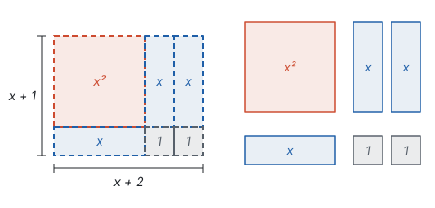
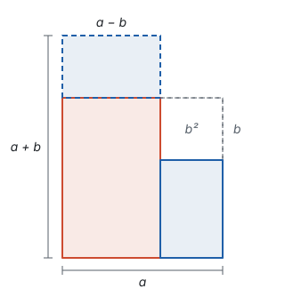
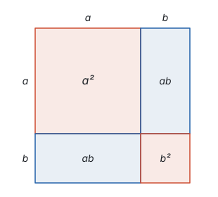
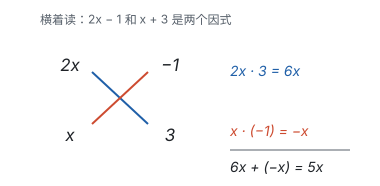

# 因式分解 ★

> 对应人教版八年级上册第十七章。

**把一个多项式化成几个整式的积，叫因式分解；它是整式乘法倒过来做。**

## 从哪里来

整式乘法把积变成和：$(x + 1)(x + 2) = x^2 + 3x + 2$。同一个等式从右往左读，就是把和变成积：

| 方向 | 从 | 到 | 例子 |
| --- | --- | --- | --- |
| 整式乘法 | 积 | 和 | $(x + 1)(x + 2) = x^2 + 3x + 2$ |
| 因式分解 | 和 | 积 | $x^2 + 3x + 2 = (x + 1)(x + 2)$ |

这和把整数分解质因数是一回事：$12 = 2 \times 2 \times 3$ 是把一个数写成几个数的积，因式分解是把一个多项式写成几个整式的积。

在图上，乘法是“知道长方形的两边，求面积”；因式分解是反过来：**手里有一些面积块，把它们拼成一个长方形，找出两边。** $x^2 + 3x + 2$ 是一个 $x \times x$ 的正方形、三个 $x \times 1$ 的长条和两个 $1 \times 1$ 的小正方形。它们能拼成一个长方形，两边分别是 $x + 2$ 和 $x + 1$：

所以 $x^2 + 3x + 2 = (x + 1)(x + 2)$。

为什么要把和化成积？因为积有和没有的好处：

- **积为 0，至少有一个因式为 0。** 解方程 $x^2 + 3x + 2 = 0$，化成 $(x + 1)(x + 2) = 0$，就得到 $x + 1 = 0$ 或 $x + 2 = 0$，即 $x = -1$ 或 $x = -2$（见第四部分“一元二次方程”）。
- **积可以约分。** 分式的分子、分母都化成积，公因式才看得出来，才能约掉（见第三部分“分式”）。
- **积好算。** $99^2 - 1 = (99 + 1)(99 - 1) = 100 \times 98 = 9800$。

## 提公因式法

如果多项式的每一项都含有同一个因式 $m$，用分配律倒过来，就能把 $m$ 提到括号外面：

$$ma + mb + mc = m(a + b + c).$$

各项都含有的因式叫**公因式**。找公因式分三部分：

- **系数：** 取各项系数的最大公约数；
- **字母：** 取各项都含有的字母；
- **指数：** 每个字母取各项中最低的次数。

这样找出的公因式“最大”，提出来以后，括号里的各项就没有公因式了。

**例 1**　分解因式：$6x^3y - 9x^2y^2 + 3x^2y$。

**思路：** 系数 6、$-9$、3 的最大公约数是 3；三项都含 $x$ 和 $y$，$x$ 的最低次数是 2，$y$ 的最低次数是 1。公因式是 $3x^2y$。再用每一项除以公因式，得到括号里的各项。

**解：**

$$6x^3y - 9x^2y^2 + 3x^2y = 3x^2y(2x - 3y + 1).$$

**检验：** 用乘法展开 $3x^2y(2x - 3y + 1)$，得到原式。最后一项 $3x^2y \div 3x^2y = 1$，这个 1 不能丢，丢了之后项数就少了一项。

**例 2**　分解因式：$a(x - y) - b(y - x)$。

**思路：** 公因式可以是一个多项式。$x - y$ 和 $y - x$ 互为相反数，$y - x = -(x - y)$，先把它们统一成同一个式子。

**解：**

$$a(x - y) - b(y - x) = a(x - y) + b(x - y) = (x - y)(a + b).$$

## 公式法

把乘法公式倒过来写，就得到两种分解的方法：

$$a^2 - b^2 = (a + b)(a - b),$$

$$a^2 + 2ab + b^2 = (a + b)^2, \qquad a^2 - 2ab + b^2 = (a - b)^2.$$

面积图也倒过来看：挖去一角的正方形拼成长方形，四块拼成一个大正方形。下面是验证这两个公式时用过的两张图（见第三部分“整式的乘法”）：

用公式之前，先看多项式的样子对不对得上：

| 公式 | 项数 | 特征 |
| --- | --- | --- |
| 平方差 | 两项 | 两项都能写成某个式子的平方，符号相反 |
| 完全平方 | 三项 | 两项能写成平方且同号，另一项是这两个式子的积的 2 倍（符号可正可负） |

**例 3**　分解因式：$4x^2 - 9$。

**思路：** 两项，$4x^2 = (2x)^2$，$9 = 3^2$，中间是减号，是平方差，公式里的 $a$ 是 $2x$，$b$ 是 3。

**解：**

$$4x^2 - 9 = (2x)^2 - 3^2 = (2x + 3)(2x - 3).$$

**例 4**　分解因式：（1）$x^2 - 6x + 9$；（2）$-x^2 + 4xy - 4y^2$。

**思路：** （1）三项，$x^2$ 和 $9 = 3^2$ 是平方，中间项 $-6x = -2 \cdot x \cdot 3$，是差的平方。（2）两个平方项都带负号，先提出 $-1$，括号里就是完全平方。

**解：**

$$x^2 - 6x + 9 = x^2 - 2 \cdot x \cdot 3 + 3^2 = (x - 3)^2,$$

$$-x^2 + 4xy - 4y^2 = -(x^2 - 4xy + 4y^2) = -(x - 2y)^2.$$

## 分解要彻底

因式分解要分解到每一个因式都不能再分解为止，就像分解质因数要分到每个因数都是质数。

**例 5**　分解因式：$2x^3 - 8x$。

**思路：** $2x^3 - 8x$ 本身不是平方差，$2x^3$ 不是一个整式的平方，直接套公式行不通。先看各项有没有公因式：有 $2x$。提出来以后，括号里剩 $x^2 - 4$，这才是平方差。

**解：**

$$2x^3 - 8x = 2x(x^2 - 4) = 2x(x + 2)(x - 2).$$

**想一想：** 如果只写到 $2x(x^2 - 4)$ 就停下，也是“化成了积”，但 $x^2 - 4$ 还能再分，分解就不彻底。再看 $x^4 - 16$：

$$x^4 - 16 = (x^2 + 4)(x^2 - 4) = (x^2 + 4)(x + 2)(x - 2).$$

$x^2 + 4$ 是平方和，不能再分解（在有理数范围内）。

从这两个例子能看出思考的顺序，每一步都有它的道理：

1. **先看有没有公因式。** 提公因式后，括号里的式子更简单，也更容易看出公式的样子。
2. **再看项数和形式，能不能用公式。** 两项想平方差，三项想完全平方。
3. **最后检查每个因式还能不能再分。**

## 十字相乘（拓展）

由整式乘法里的展开式（见第三部分“整式的乘法”）

$$(x + p)(x + q) = x^2 + (p + q)x + pq$$

倒过来读：要分解 $x^2 + bx + c$，只要找两个数 $p$、$q$，使 $p + q = b$，$pq = c$。开头拼长方形的例子 $x^2 + 3x + 2 = (x + 1)(x + 2)$，就是 $p = 1$、$q = 2$。

**例 6**　分解因式：（1）$x^2 - 5x + 6$；（2）$x^2 + x - 12$。

**思路：** 先从乘积入手找 $p$、$q$，因为乘积的可能比较少，再用和去挑。

**解：** （1）$pq = 6$，$p + q = -5$。积为正，两数同号；和为负，两数都是负数。$-2$ 和 $-3$ 符合。

$$x^2 - 5x + 6 = (x - 2)(x - 3).$$

（2）$pq = -12$，$p + q = 1$。积为负，两数异号；和为正，正数的绝对值较大。$4$ 和 $-3$ 符合。

$$x^2 + x - 12 = (x + 4)(x - 3).$$

二次项系数不是 1 时，要同时拆二次项系数和常数项。比如 $2x^2 + 5x - 3$：把 $2x^2$ 拆成 $2x \cdot x$，把 $-3$ 拆成 $(-1) \times 3$，交叉相乘再相加，看能不能得到一次项 $5x$：

$2x \cdot 3 + x \cdot (-1) = 6x - x = 5x$，正好是一次项，所以

$$2x^2 + 5x - 3 = (2x - 1)(x + 3).$$

交叉相乘就是在检验：$(2x - 1)(x + 3)$ 展开时，一次项正是由“外项乘外项”$2x \cdot 3$ 和“内项乘内项”$(-1) \cdot x$ 相加得到的。拆法不对，就换一种拆法再试。

## 易错点

- **分解不彻底。** $x^4 - 1 = (x^2 + 1)(x^2 - 1)$ 还没完，$x^2 - 1 = (x + 1)(x - 1)$，应该写成 $(x^2 + 1)(x + 1)(x - 1)$。
- **提公因式后漏掉 1。** $3a^2 + 3a = 3a(a + 1)$，不是 $3a \cdot a$。提出的公因式和某一项完全相同时，那一项剩下 1。
- **结果不是积。** $x^2 + 3x - 4 = x(x + 3) - 4$ 不是因式分解，整个式子最后一步是减法，还是“和”的形式。正确结果是 $(x + 4)(x - 1)$。
- **把乘法当成分解。** $(x + 1)(x - 1) = x^2 - 1$ 是整式乘法，方向反了。
- **误用完全平方公式。** $x^2 + 2x + 4$ 不是完全平方，$(x + 2)^2 = x^2 + 4x + 4$，中间项应该是 $4x$。先检查中间项是不是两个平方的底数的积的 2 倍。
- **平方和当成平方差。** $a^2 + b^2$ 不能用平方差公式分解。
- **提负号忘了变号。** $-x^2 + 4xy - 4y^2 = -(x^2 - 4xy + 4y^2)$，括号里的每一项都要变号，道理和去括号一样。

## 联系

- **整式的乘法：** 每一种分解方法，都是一个乘法等式倒过来读；分解完可以乘回去检验。见第三部分“整式的乘法”。
- **一元二次方程：** 因式分解法解方程，靠的是“两个数的积为 0，至少有一个为 0”。见第四部分“一元二次方程”。
- **分式：** 约分和通分之前，先把分子、分母因式分解。见第三部分“分式”。
- **二次函数：** $y = x^2 - 5x + 6 = (x - 2)(x - 3)$，图象和 $x$ 轴交于 $(2, 0)$ 和 $(3, 0)$，因式里直接看出交点。见第七部分“二次函数”。
