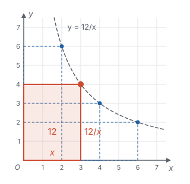
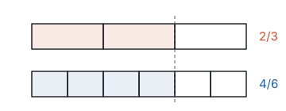

# 分式 ★

> 对应人教版八年级上册第十八章。

**一般地，$A$、$B$ 是整式，$B$ 中含有字母，式子 $\frac{A}{B}$ 叫分式；分式是字母版的分数，它的性质和运算法则都和分数一样。**

## 从哪里来

两个整数相除，结果常常不是整数，于是有了分数。两个整式相除也一样，结果常常不是整式：

- 面积为 12 的长方形，一边长 $x$，另一边长 $\frac{12}{x}$；
- 走 $m$ 千米用了 $t$ 小时，平均速度是 $\frac{m}{t}$ 千米/时；
- 一项工程，甲单独做要 $a$ 天完成，甲每天完成全部工程的 $\frac{1}{a}$。

以第一个为例，面积固定是 12，一边 $x$ 变长，另一边 $\frac{12}{x}$ 就变短：

这些式子的分母里有字母，它们不是整式，叫**分式**。分母里含字母是分式和整式的分界：$\frac{x}{3}$ 是整式（就是 $\frac{1}{3}x$），$\frac{3}{x}$ 是分式。

分式的分母代表除数，除数不能为 0，所以：

- **分式有意义：** 分母 $B \ne 0$；
- **分式的值为 0：** 分子 $A = 0$，**并且**分母 $B \ne 0$。

**例 1**　对于分式 $\frac{x^2 - 1}{x + 1}$：（1）$x$ 取什么值时它有意义？（2）$x$ 取什么值时它的值为 0？

**思路：** （1）只看分母。（2）分子为 0 只是必要的，还要保证这时分式有意义。

**解：** （1）由 $x + 1 \ne 0$，得 $x \ne -1$，所以 $x \ne -1$ 时分式有意义。

（2）由 $x^2 - 1 = 0$，得 $x = 1$ 或 $x = -1$。但 $x = -1$ 时分母为 0，分式没有意义，应舍去。所以 $x = 1$ 时分式的值为 0。

## 分式的基本性质

分数有基本性质：分子、分母同乘（或除以）同一个不为 0 的数，分数的值不变。比如 $\frac{2}{3} = \frac{4}{6}$：

把每一份再平分成两份，份数和取的份数都变成原来的 2 倍，取出的长度不变。

分式里的字母代表数，所以分式也有同样的性质：**分式的分子与分母乘（或除以）同一个不等于 0 的整式，分式的值不变。**

$$\frac{A}{B} = \frac{A \cdot C}{B \cdot C}, \qquad \frac{A}{B} = \frac{A \div C}{B \div C} \qquad (C \ne 0).$$

$C \ne 0$ 这个条件不能少：乘 0 后分母变成 0，式子就没有意义了。

分子、分母和分式本身，三处的符号改变其中两处，分式的值不变：

$$\frac{-a}{-b} = \frac{a}{b}, \qquad -\frac{a}{b} = \frac{-a}{b} = \frac{a}{-b}.$$

第一个等式是基本性质的特例：分子、分母同乘 $-1$。第二个等式里，$\frac{-a}{b}$ 就是 $(-a) \div b$，由有理数除法的符号法则，它等于 $-(a \div b)$，也就是 $-\frac{a}{b}$；再把 $\frac{-a}{b}$ 的分子、分母同乘 $-1$，就得到 $\frac{a}{-b}$。

## 约分和通分

基本性质的两个用处，和分数完全一样。

**约分：** 约去分子、分母的公因式。分子、分母是多项式时，要**先因式分解**，公因式才能看出来（见第三部分“因式分解”）。约分后分子、分母没有公因式的分式，叫最简分式。

**例 2**　约分：$\frac{x^2 - 4}{x^2 + 4x + 4}$。

**思路：** 分子是平方差，分母是完全平方，分解后找公因式。

**解：**

$$\frac{x^2 - 4}{x^2 + 4x + 4} = \frac{(x + 2)(x - 2)}{(x + 2)^2} = \frac{x - 2}{x + 2}.$$

**通分：** 把几个异分母的分式化成同分母的分式。分母取**最简公分母**：把各分母因式分解，取每个因式的最高次幂，乘在一起。这就是分数里求最小公倍数的做法。

**例 3**　通分：$\frac{1}{x^2 - x}$ 与 $\frac{1}{x^2 - 1}$。

**解：** 两个分母分解为 $x^2 - x = x(x - 1)$，$x^2 - 1 = (x + 1)(x - 1)$。因式 $x$、$x - 1$、$x + 1$ 都要有，最简公分母是 $x(x + 1)(x - 1)$。

$$\frac{1}{x^2 - x} = \frac{x + 1}{x(x + 1)(x - 1)}, \qquad \frac{1}{x^2 - 1} = \frac{x}{x(x + 1)(x - 1)}.$$

## 分式的运算

法则都和分数相同：

| 运算 | 法则 |
| --- | --- |
| 乘法 | 分子乘分子，分母乘分母：$\frac{a}{b} \cdot \frac{c}{d} = \frac{ac}{bd}$ |
| 除法 | 乘除式的倒数：$\frac{a}{b} \div \frac{c}{d} = \frac{a}{b} \cdot \frac{d}{c}$ |
| 乘方 | 分子、分母分别乘方：$\left(\frac{a}{b}\right)^n = \frac{a^n}{b^n}$ |
| 同分母加减 | 分母不变，分子相加减：$\frac{a}{c} \pm \frac{b}{c} = \frac{a \pm b}{c}$ |
| 异分母加减 | 先通分，变成同分母再加减 |

乘除的结果、加减的结果，都要约分化成最简分式或整式。

**例 4**　计算：$\frac{x^2 - 1}{x^2 + 2x} \div \frac{x - 1}{x}$。

**思路：** 除法变乘法，分子、分母先因式分解，能约的先约掉，再乘，比先乘出来再约省事。

**解：**

$$\frac{x^2 - 1}{x^2 + 2x} \div \frac{x - 1}{x} = \frac{(x + 1)(x - 1)}{x(x + 2)} \cdot \frac{x}{x - 1} = \frac{x + 1}{x + 2}.$$

**例 5**　计算：$\frac{2}{x^2 - 1} - \frac{1}{x - 1}$。

**思路：** 分母不同，先通分。最简公分母是 $(x + 1)(x - 1)$，第二个分式的分子、分母都要乘 $x + 1$。

**解：**

$$\begin{aligned} \frac{2}{x^2 - 1} - \frac{1}{x - 1} &= \frac{2}{(x + 1)(x - 1)} - \frac{x + 1}{(x + 1)(x - 1)} \\ &= \frac{2 - (x + 1)}{(x + 1)(x - 1)} = \frac{1 - x}{(x + 1)(x - 1)} = -\frac{1}{x + 1}. \end{aligned}$$

减去的分子 $x + 1$ 是一个整体，要加括号。最后一步用了 $1 - x = -(x - 1)$。

**例 6**　先化简，再求值：

$$\left(1 - \frac{1}{x + 1}\right) \div \frac{x}{x^2 - 1}, \quad \text{其中 } x = 3.$$

**思路：** 括号里是整式减分式，把 1 看成 $\frac{x + 1}{x + 1}$ 再通分；然后除法变乘法。

**解：**

$$\begin{aligned} \left(1 - \frac{1}{x + 1}\right) \div \frac{x}{x^2 - 1} &= \frac{x + 1 - 1}{x + 1} \cdot \frac{(x + 1)(x - 1)}{x} \\ &= \frac{x}{x + 1} \cdot \frac{(x + 1)(x - 1)}{x} = x - 1. \end{aligned}$$

当 $x = 3$ 时，原式 $= 3 - 1 = 2$。

**想一想：** 直接代入也能算：$1 - \frac{1}{4} = \frac{3}{4}$，$\frac{3}{3^2 - 1} = \frac{3}{8}$，$\frac{3}{4} \div \frac{3}{8} = 2$，结果相同。先化简的好处是式子变成了简单的 $x - 1$，代入只算一步。

但要注意：化简结果 $x - 1$ 对任何 $x$ 都有意义，原式却不是。原式里有分母 $x + 1$、$x^2 - 1$，还有除式 $\frac{x}{x^2 - 1}$ 不能为 0，所以 $x$ 不能取 $-1$、$1$、$0$。如果题目让你自己选一个 $x$ 的值代入，只能从这三个数以外选。**化简前后的两个式子，只在原式有意义的范围内相等。**

## 负整数指数幂

同底数幂相除 $a^m \div a^n = a^{m-n}$，原来要求 $m > n$（见第三部分“整式的乘法”）。$m < n$ 时会怎样？用分式约分来算：

$$a^2 \div a^5 = \frac{a^2}{a^5} = \frac{a^2}{a^2 \cdot a^3} = \frac{1}{a^3}.$$

如果法则照用，应该得到 $a^{2-5} = a^{-3}$。为了让法则继续成立，规定

$$a^{-n} = \frac{1}{a^n} \quad (a \ne 0,\ n \text{ 是正整数}).$$

和零指数幂 $a^0 = 1$（$a \ne 0$）一样，这个规定是为了让法则在更大的范围里成立。看 10 的幂，每往右一格，指数减 1，值除以 10，规律一直延续下去：

| $10^3$ | $10^2$ | $10^1$ | $10^0$ | $10^{-1}$ | $10^{-2}$ | $10^{-3}$ |
| --- | --- | --- | --- | --- | --- | --- |
| 1000 | 100 | 10 | 1 | 0.1 | 0.01 | 0.001 |

规定之后，同底数幂相乘、相除，幂的乘方，积的乘方，这些法则对全部整数指数都成立。比如 $a^{-2} \cdot a^5 = a^3$，也等于 $\frac{1}{a^2} \cdot a^5 = a^3$。

**用科学记数法表示绝对值小于 1 的数。** 大数写成 $a \times 10^n$（见第二部分“有理数的运算”），小数就写成 $a \times 10^{-n}$，其中 $1 \le \lvert a \rvert < 10$。比如

$$0.000036 = 3.6 \div 100000 = 3.6 \times 10^{-5}.$$

为什么指数是 $-5$？把 0.000036 的小数点向右移 5 位得到 3.6，相当于乘了 $10^5$；要让数值不变，就得再乘 $10^{-5}$。小数点要移的位数，正好是第一个不为 0 的数字前面 0 的个数（包括小数点前的那个 0）：3 的前面有 5 个 0，所以指数是 $-5$。

**例 7**　（1）1 纳米 $= 0.000000001$ 米，用科学记数法表示 7 纳米是多少米；（2）计算 $(2 \times 10^{-3}) \times (3 \times 10^{-5})$；（3）计算 $2^{-2}$ 和 $\left(-\frac{1}{2}\right)^{-2}$。

**解：** （1）$0.000000001 = 10^{-9}$，所以 7 纳米 $= 7 \times 10^{-9}$ 米。

（2）$(2 \times 10^{-3}) \times (3 \times 10^{-5}) = (2 \times 3) \times 10^{-3 + (-5)} = 6 \times 10^{-8}$。

（3）按负整数指数幂的规定，先化成正整数指数幂再算：

$$2^{-2} = \frac{1}{2^2} = \frac{1}{4}, \qquad \left(-\frac{1}{2}\right)^{-2} = \frac{1}{\left(-\frac{1}{2}\right)^2} = \frac{1}{\frac{1}{4}} = 4.$$

## 易错点

- **约分约的是因式，不是项。** $\frac{x^2 + 2x}{x} = \frac{x(x + 2)}{x} = x + 2$ 可以，因为 $x$ 是分子的因式；$\frac{x^2 + 2}{x}$ 不能约，$x$ 只是分子中一项的因式。$\frac{x + 2}{x + 4}$ 更不能把 $x$ “约掉”。
- **值为 0 时忘了分母。** 分子为 0 的同时，分母不能为 0，否则分式没有意义，更谈不上值是 0。
- **通分时分子漏乘，或减法漏了括号。** $\frac{2}{c} - \frac{x + 1}{c}$ 的分子是 $2 - (x + 1) = 1 - x$，不是 $2 - x + 1$。
- **化简求值代入了使原式无意义的数。** 看的是原式，不是化简以后的式子：原式中所有分母、除式都不能为 0。
- **把分式化简当成解方程去分母。** 化简 $\frac{1}{x} + \frac{1}{2}$ 要通分得 $\frac{2 + x}{2x}$，不能两边同乘 $2x$ 变成 $2 + x$。“两边同乘”是对等式做的，这里没有等式（见第四部分“分式方程”）。
- **负整数指数幂算错。** $2^{-3} = \frac{1}{8}$，不是 $-8$，也不是 $-6$；$3a^{-2} = \frac{3}{a^2}$，负指数只作用在 $a$ 上，不是 $\frac{1}{3a^2}$。

## 联系

- **有理数的运算：** 分式的约分、通分、四则运算，和分数一一对应；科学记数法从大数推广到小数。见第二部分“有理数的运算”。
- **因式分解：** 约分、通分之前，先把分子、分母因式分解。见第三部分“因式分解”。
- **整式的乘法：** 负整数指数幂把幂的运算法则从正整数指数推广到全部整数指数。见第三部分“整式的乘法”。
- **分式方程：** 分母里含未知数的方程，解的时候两边同乘最简公分母，还要检验分母是否为 0。见第四部分“分式方程”。
- **反比例函数：** 面积为 12 的长方形，一边 $x$ 变长，另一边 $\frac{12}{x}$ 就变短；把“从哪里来”那张图再放在下面，长方形右上角的顶点画出的正是 $y = \frac{12}{x}$ 的图象。见第七部分“反比例函数”。

