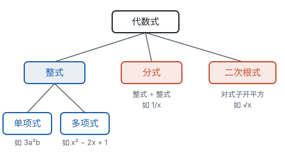

# 总览：式的家族

**用字母代替数，一类计算就能写成一个式子；式的每一条运算法则，都是数的运算律在字母上的延续。**

## 式的家族

式的家族是一步步扩充出来的，和数的扩充走的是同一条路（见第二部分“总览：数的扩充”）：

- 整式对加、减、乘都“封闭”：两个整式相加、相减、相乘，结果还是整式。这像整数。
- 整式除以整式，结果常常不再是整式，于是有了分式。这像整数除以整数得到分数。
- 对式子开平方，就有了二次根式。这像对数开平方得到 $\sqrt{2}$ 这样的无理数。

| 式 | 长什么样 | 对应哪一类数 | 能做的运算 | “化简”指什么 | 页面 |
| --- | --- | --- | --- | --- | --- |
| 整式 | 单项式、多项式，字母不在分母里，也不在根号下 | 整数 | 加、减、乘、乘方；除以单项式 | 去括号、合并同类项，写成没有同类项的多项式 | 整式的加减、整式的乘法 |
| 分式 | $\frac{A}{B}$，分母 $B$ 里含字母 | 分数 | 加、减、乘、除、乘方 | 约分，化成最简分式或整式 | 分式 |
| 二次根式 | $\sqrt{a}$（$a \ge 0$），根号下含字母 | $\sqrt{2}$ 这样的无理数 | 加、减、乘、除 | 化成最简二次根式，合并被开方数相同的根式，分母里不留根号 | 二次根式 |

## 两个方向：乘开与分解

整式的乘法和因式分解是同一个等式从两头读：

| 方向 | 做什么 | 例子 | 用在哪里 |
| --- | --- | --- | --- |
| 整式的乘法 | 积 → 和 | $(x + 1)(x + 2) = x^2 + 3x + 2$ | 展开、化简、代数推理 |
| 因式分解 | 和 → 积 | $x^2 + 3x + 2 = (x + 1)(x + 2)$ | 约分、通分、解一元二次方程 |

两个方向在图上是同一个长方形：乘法是“知道两边，求面积”，因式分解是“知道面积由哪些块组成，把它们拼成长方形，找出两边”。比如一个 $x^2$、三个 $x$、两个 1 这几块，拼成两边为 $x + 2$、$x + 1$ 的长方形：

## 贯穿这一部分的三个想法

**运算律不变。** 交换律、结合律、分配律在字母上照样成立。合并同类项、去括号、多项式乘法、提公因式、合并二次根式，用的都是分配律。

**类比数。** 整式像整数，分式像分数，二次根式像 $\sqrt{2}$。分式的约分、通分和分数一模一样；二次根式的化简就是把 $\sqrt{8}$ 写成 $2\sqrt{2}$ 的那套办法。遇到新的式，先想“换成数是怎么做的”。

**面积模型。** 长方形的面积等于长乘宽，所以多项式的乘法、乘法公式、因式分解都能画成长方形的分块和拼接。这个模型后面还会用来证明勾股定理、推导配方法（见第五部分“勾股定理”和第四部分“一元二次方程”）。

## 学习顺序

建议按页面顺序学，每一页都要用到前一页：

1. **代数式**：用字母表示数，列式子、求值（见第三部分“代数式”）。
2. **整式的加减**：认识单项式和多项式，学会合并同类项、去括号（见第三部分“整式的加减”）。
3. **整式的乘法**：幂的运算、多项式乘法和两个乘法公式，这一页是后面各页的基础（见第三部分“整式的乘法”）。
4. **因式分解**：把乘法倒过来做（见第三部分“因式分解”）。
5. **分式**：约分和通分都要先因式分解（见第三部分“分式”）。
6. **二次根式**：先复习平方根和无理数（见第二部分“实数”），再学根式的运算；它的乘法和加减又会用到乘法公式和合并同类项（见第三部分“二次根式”）。

式是后面各部分的工具：解方程就是对式子做变形（见第四部分“总览：从等式到方程”），函数的解析式就是一个含字母的式子（见第七部分“函数”）。
