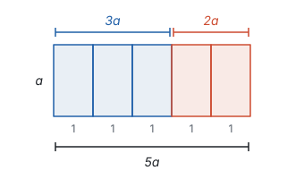
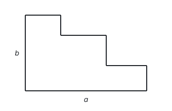
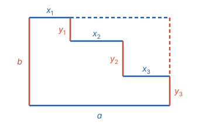

# 整式的加减

> 对应人教版七年级上册第四章。

**整式的加减只做两件事：去括号，合并同类项；这两件事的依据都是乘法分配律。**

## 单项式和多项式

上一页列出的代数式里，有一类只含加、减、乘、乘方运算，字母不在分母里，也不在根号下，比如 $3n + 1$、$0.12a$、$a^2 - 2ab + b^2$。它们叫**整式**。整式按项数分成两种。

**单项式：数与字母的积。** 比如 $-3a^2b$、$0.12a$、$\frac{2}{3}\pi r^2$。单独一个数或一个字母也是单项式。

- **系数：** 单项式中的数字因数。
- **次数：** 单项式中**所有字母**的指数的和。

| 单项式 | 系数 | 次数 | 说明 |
| --- | --- | --- | --- |
| $-3a^2b$ | $-3$ | 3 | $a$ 的指数 2 加 $b$ 的指数 1 |
| $xy$ | 1 | 2 | 系数 1 省略不写 |
| $-m$ | $-1$ | 1 | $-m$ 就是 $(-1) \times m$ |
| $\frac{2}{3}\pi r^2$ | $\frac{2}{3}\pi$ | 2 | $\pi$ 是一个确定的数，不是字母 |
| $-2^3x^2y$ | $-2^3$，即 $-8$ | 3 | $2^3$ 是数，它的指数不算进次数 |
| $5$ | 5 | 0 | 不含字母的单项式次数是 0 |

**多项式：几个单项式的和。** 比如 $3x^2 - 2x + 5$ 是 $3x^2$、$-2x$、$5$ 这三个单项式的和。

- **项：** 组成多项式的每个单项式，**连同它前面的符号**。$3x^2 - 2x + 5$ 的一次项是 $-2x$，不是 $2x$。
- **常数项：** 不含字母的项，这里是 5。
- **次数：** 次数最高的项的次数。$3x^2 - 2x + 5$ 有三项，最高次是 2，叫二次三项式。

为什么说 $3x^2 - 2x + 5$ 是“和”，式子里明明有减号？因为减去一个数等于加上它的相反数（见第二部分“有理数的运算”）：$3x^2 - 2x + 5 = 3x^2 + (-2x) + 5$。把减法都看成加法，每一项都带着自己的符号，后面的计算就不会丢符号。

单项式和多项式统称整式。写多项式时，一般按某个字母的指数从大到小排列（降幂排列），比如 $-x + 3x^2 - 7$ 写成 $3x^2 - x - 7$，这样各项一目了然，也方便检查有没有同类项。

## 同类项和合并同类项

先看一个面积的问题：一块长方形由 5 个宽为 1、高为 $a$ 的小长方形拼成，左边 3 个，右边 2 个。

左边面积是 $3a$，右边是 $2a$，合起来是 5 个同样的小长方形，面积是 $5a$。用分配律写出来就是

$$3a + 2a = (3 + 2)a = 5a.$$

能这样合并，是因为 $3a$ 和 $2a$ 都是“若干个 $a$”，分配律可以把共同的 $a$ 提出来，只把个数相加。换成 $3a^2 + 2a$ 就不行了：$a^2$ 和 $a$ 不是同一种“块”，没有共同的部分可以提出来，结果只能写成 $3a^2 + 2a$。

所以规定：**所含字母相同，并且相同字母的指数也相同的项，叫同类项。** 所有常数项也都是同类项。同类项与系数无关，与字母的顺序无关：$2xy$ 和 $-5yx$ 是同类项，$3a^2b$ 和 $3ab^2$ 不是。

**把多项式中的同类项合并成一项，叫合并同类项。** 由分配律直接得到法则：**系数相加，字母和字母的指数不变。**

**例 1**　合并同类项：$3x^2 - 5x + 2 - x^2 + 4x - 7$。

**思路：** 先找出同类项：二次项 $3x^2$ 和 $-x^2$，一次项 $-5x$ 和 $4x$，常数项 $2$ 和 $-7$。每一项带着自己前面的符号移动位置（加法交换律），再分别合并。

**解：**

$$\begin{aligned} &3x^2 - 5x + 2 - x^2 + 4x - 7 \\ =\ &(3x^2 - x^2) + (-5x + 4x) + (2 - 7) \\ =\ &2x^2 - x - 5. \end{aligned}$$

**检验：** 取 $x = 1$，原式 $= 3 - 5 + 2 - 1 + 4 - 7 = -4$，结果 $= 2 - 1 - 5 = -4$，一致。化简前后的两个式子对任何 $x$ 的值都相等，随便代一个数进去，是检查化简有没有出错的简便办法。

## 去括号

去括号也是分配律：括号前面的数，要乘括号里的**每一项**。

$$3(2x - 1) = 6x - 3, \qquad -2(x - 3) = -2x + 6.$$

括号前只有正号或负号时，把它看成乘 $+1$ 或 $-1$：

$$+(a - b) = a - b, \qquad -(a - b) = (-1)(a - b) = -a + b.$$

所以：**括号前是“+”号，去掉括号，括号里各项都不变号；括号前是“−”号，去掉括号，括号里各项都改变符号。** 这不是另外的规定，只是乘 $+1$ 和乘 $-1$ 的结果。

## 整式的加减

有了去括号和合并同类项，整式的加减就是：**有括号先去括号，再合并同类项。**

**例 2**　先化简，再求值：$(5a^2 - 3ab) - 2(2a^2 - ab + 1)$，其中 $a = -1$，$b = 2$。

**思路：** 可以直接代入，但式子里有好几项，每项都要算；先化简，式子变短了，代入只算一次。

**解：**

$$\begin{aligned} &(5a^2 - 3ab) - 2(2a^2 - ab + 1) \\ =\ &5a^2 - 3ab - 4a^2 + 2ab - 2 \\ =\ &a^2 - ab - 2. \end{aligned}$$

当 $a = -1$，$b = 2$ 时，原式 $= (-1)^2 - (-1) \times 2 - 2 = 1 + 2 - 2 = 1$。

**检验：** 不化简直接代入，$5a^2 - 3ab = 5 + 6 = 11$，$2a^2 - ab + 1 = 2 + 2 + 1 = 5$，$11 - 2 \times 5 = 1$，一致。

**例 3**　如图，一个台阶形图形的底边长 $a$，左边长 $b$，右上方是三级台阶。求它的周长。

**思路：** 每一级台阶的长和高都不知道，好像求不出来。但周长只要各段长度的**和**，不必知道每一段。三段横的台阶面向上平移，正好拼成顶边，和底边一样长；三段竖的台阶面向右平移，正好拼成右边，和左边一样长。

**解：** 设三段横的台阶面长 $x_1$，$x_2$，$x_3$，三段竖的长 $y_1$，$y_2$，$y_3$。把横的三段向上平移到顶边，竖的三段向右平移到右边：

由图，$x_1 + x_2 + x_3 = a$，$y_1 + y_2 + y_3 = b$。周长是

$$a + b + (x_1 + x_2 + x_3) + (y_1 + y_2 + y_3) = a + b + a + b = 2a + 2b.$$

台阶形的周长和长 $a$、宽 $b$ 的长方形的周长相同。

**例 4**　说明：任意三个连续整数的和都是 3 的倍数。

**解：** 设中间一个整数是 $n$，三个数是 $n - 1$，$n$，$n + 1$。它们的和是

$$(n - 1) + n + (n + 1) = 3n,$$

是 3 的倍数，而且正好是中间那个数的 3 倍。设中间的数，比设最小的数更方便：$-1$ 和 $+1$ 正好抵消。

## 易错点

- **次数算错。** 次数只看字母的指数：$-2^3x^2y$ 的次数是 3，不是 6；$\pi r^2$ 的次数是 2，$\pi$ 不是字母。多项式的次数是最高次项的次数，不是各项次数的和。
- **同类项判断错。** 看的是“字母相同，相同字母的指数也相同”：$3a^2b$ 和 $3ab^2$ 系数相同，却不是同类项；$2xy$ 和 $-yx$ 字母顺序不同，却是同类项。
- **合并时把指数也加了。** $3a^2 + 2a^2 = 5a^2$，不是 $5a^4$。分配律只把系数相加，“若干个 $a^2$”加起来还是 $a^2$。$a^2 + a^2 = 2a^2$ 也不是 $a^4$。
- **去括号漏变号、漏乘。** $-(2x - 3) = -2x + 3$；$-2(x - 3) = -2x + 6$，括号前的数要乘括号里的每一项，连同符号。
- **丢了项的符号。** $x^2 - 3x + 1$ 的一次项是 $-3x$，一次项系数是 $-3$。

## 联系

- **代数式：** 用火柴棒摆 $n$ 个正方形，一种数法得 $3n + 1$ 根，另一种数法得 $4 + 3(n - 1)$ 根；$4 + 3(n - 1)$ 去括号、合并同类项后就是 $3n + 1$，两种数法得到的是同一个式子。见第三部分“代数式”。
- **有理数的运算：** 减法变成加相反数，是“多项式是单项式的和”的由来；合并同类项就是用分配律，和有理数的简便运算一回事。见第二部分“有理数的运算”。
- **整式的乘法：** 单项式乘多项式、多项式乘多项式，都是分配律的进一步使用，最后一步总是合并同类项。见第三部分“整式的乘法”。
- **周长和面积：** 图形的周长用字母表示出来是整式，求周长就是整式的加减，比如例 3 里底边长 $a$、左边长 $b$ 的台阶形，周长是 $2a + 2b$；长方形的面积是长乘宽，要用到整式的乘法。见第三部分“整式的乘法”。
- **一元一次方程：** 解方程时的去括号、合并同类项，和这里完全一样。见第四部分“一元一次方程”。
- **二次根式：** 被开方数相同的二次根式合并，$2\sqrt{3} + 5\sqrt{3} = 7\sqrt{3}$，道理和合并同类项相同。见第三部分“二次根式”。
