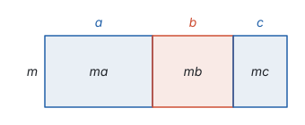
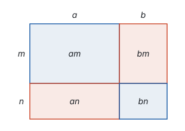
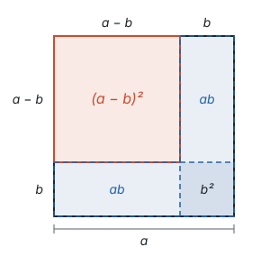
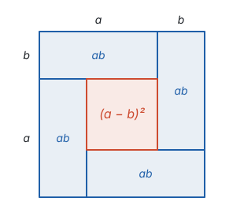
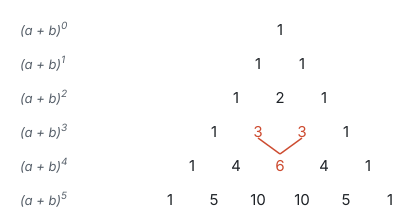

# 整式的乘法 ★

> 对应人教版八年级上册第十六章。

**整式乘法的每一条法则，都是由乘方的定义和乘法的交换律、结合律、分配律推出来的；多项式乘多项式，就是把一个长方形分成几块，再把各块的面积加起来。**

## 幂的运算：从乘方的定义出发

整式相乘，先要会算字母的幂相乘。一切从乘方的定义开始：

$$a^n = \underbrace{a \cdot a \cdot \cdots \cdot a}_{n \text{ 个 } a}.$$

**同底数幂相乘：数一数一共有几个 $a$。**

$$a^3 \cdot a^2 = (a \cdot a \cdot a) \cdot (a \cdot a) = a^5.$$

3 个 $a$ 再乘 2 个 $a$，一共 5 个 $a$。一般地，$m$ 个 $a$ 乘 $n$ 个 $a$，一共 $m + n$ 个 $a$：

$$a^m \cdot a^n = a^{m+n}.$$

**幂的乘方：$n$ 个 $a^m$ 相乘。**

$$(a^3)^2 = a^3 \cdot a^3 = a^{3+3} = a^6.$$

一般地，$(a^m)^n$ 是 $n$ 个 $a^m$ 相乘，由上一条，指数是 $n$ 个 $m$ 相加，得

$$(a^m)^n = a^{mn}.$$

**积的乘方：用交换律和结合律重新分组。**

$$(ab)^3 = (ab)(ab)(ab) = (a \cdot a \cdot a)(b \cdot b \cdot b) = a^3b^3.$$

一般地，$(ab)^n = a^nb^n$：积的乘方，等于把积的每个因式分别乘方，再相乘。

**同底数幂相除：约掉公共的 $a$。** 比如

$$a^5 \div a^2 = \frac{a \cdot a \cdot a \cdot a \cdot a}{a \cdot a} = a^3.$$

5 个 $a$ 除以 2 个 $a$，约掉 2 个，剩下 3 个。一般地，

$$a^m \div a^n = a^{m-n} \quad (a \ne 0,\ m > n).$$

$a \ne 0$，因为 0 不能作除数。

**零指数幂：为了让法则继续成立而规定。** $m = n$ 时，一方面 $a^m \div a^m = 1$（一个不为 0 的数除以它自己）；另一方面，如果同底数幂相除的法则还能用，应该得到 $a^{m-m} = a^0$。为了让两边一致，规定

$$a^0 = 1 \quad (a \ne 0).$$

$a^0$ 不能再理解成“0 个 $a$ 相乘”，它的意义来自“让法则继续成立”。$0^0$ 没有意义，因为推导时用到了除以 $a$。

| 运算 | 法则 | 从定义看 |
| --- | --- | --- |
| 同底数幂相乘 | $a^m \cdot a^n = a^{m+n}$ | $m$ 个 $a$ 和 $n$ 个 $a$ 放在一起 |
| 幂的乘方 | $(a^m)^n = a^{mn}$ | $n$ 组，每组 $m$ 个 $a$ |
| 积的乘方 | $(ab)^n = a^nb^n$ | 把 $n$ 个 $a$ 和 $n$ 个 $b$ 分别放在一起 |
| 同底数幂相除 | $a^m \div a^n = a^{m-n}$（$a \ne 0$，$m > n$） | 约掉 $n$ 个 $a$ |
| 零指数幂 | $a^0 = 1$（$a \ne 0$） | 规定，让相除的法则在 $m = n$ 时也成立 |

**例 1**　计算：$(-2a^2)^3 + a^2 \cdot a^4$。

**思路：** 两项分开算，各自用哪条法则要看清：第一项是积的乘方，$-2$ 和 $a^2$ 都要三次方；第二项是同底数幂相乘。最后看两项能不能合并。

**解：**

$$(-2a^2)^3 + a^2 \cdot a^4 = (-2)^3(a^2)^3 + a^6 = -8a^6 + a^6 = -7a^6.$$

**例 2**　已知 $2^m = 3$，$2^n = 5$，求 $2^{m+n}$ 和 $2^{2m+n}$ 的值。

**思路：** $m$、$n$ 不好求，但法则可以倒过来用：指数相加的幂，可以拆成两个幂相乘；指数是倍数的幂，可以写成幂的乘方。

**解：**

$$2^{m+n} = 2^m \cdot 2^n = 3 \times 5 = 15,$$

$$2^{2m+n} = 2^{2m} \cdot 2^n = (2^m)^2 \cdot 2^n = 3^2 \times 5 = 45.$$

## 单项式与单项式、多项式相乘

**单项式乘单项式：** 用交换律和结合律，把系数放在一起，同一个字母的幂放在一起：

$$3a^2b \cdot (-2ab^3) = [3 \times (-2)] \cdot (a^2 \cdot a) \cdot (b \cdot b^3) = -6a^3b^4.$$

也就是系数相乘，同底数幂相乘，只在一个单项式里出现的字母连同它的指数照写。

**单项式乘多项式：** 就是分配律，用单项式去乘多项式的每一项，再把积相加：

$$m(a + b + c) = ma + mb + mc.$$

在图上，这是一个高为 $m$ 的长方形，分成宽为 $a$、$b$、$c$ 的三块：

整个长方形的面积 $m(a + b + c)$，等于三块面积的和 $ma + mb + mc$。

## 多项式乘多项式

计算 $(a + b)(m + n)$ 时，先把 $m + n$ 看成一个整体，用一次分配律；再对每一部分各用一次：

$$(a + b)(m + n) = a(m + n) + b(m + n) = am + an + bm + bn.$$

结果是：**用一个多项式的每一项，乘另一个多项式的每一项，再把所得的积相加。** 两项乘两项，得 $2 \times 2 = 4$ 项（合并同类项之前）。在图上，长 $a + b$、宽 $m + n$ 的长方形正好被分成四块：

**例 3**　计算：$(x + 2)(x - 3)$。

**解：**

$$(x + 2)(x - 3) = x^2 - 3x + 2x - 6 = x^2 - x - 6.$$

**回顾：** 把 2 和 $-3$ 换成任意的 $p$、$q$，同样的步骤给出

$$(x + p)(x + q) = x^2 + (p + q)x + pq.$$

一次项系数是 $p + q$，常数项是 $pq$。例 3 里 $p + q = -1$，$pq = -6$，和算出来的一致。这个式子倒过来读，就是因式分解的一种方法（见第三部分“因式分解”）。

## 乘法公式

有两种多项式乘法特别常见，结果又特别整齐，把它们记成公式，以后看见这种结构就不必一项一项乘。

**平方差公式：** 两个数的和与这两个数的差相乘。

$$(a + b)(a - b) = a^2 - ab + ab - b^2 = a^2 - b^2.$$

中间的 $-ab$ 和 $+ab$ 正好抵消，只剩两项：**两个数的和与这两个数的差的积，等于这两个数的平方差。**

在图上：边长为 $a$ 的正方形挖去边长为 $b$ 的小正方形，剩下的面积是 $a^2 - b^2$。把剩下的部分剪成两个长方形，把右下方的一块转过来拼到上面，就拼成一个长 $a + b$、宽 $a - b$ 的长方形：

面积没有变，所以 $a^2 - b^2 = (a + b)(a - b)$。

**完全平方公式：** 两个数的和（或差）的平方。

$$(a + b)^2 = (a + b)(a + b) = a^2 + ab + ab + b^2 = a^2 + 2ab + b^2.$$

**两个数的和的平方，等于它们的平方和，加上它们的积的 2 倍。** 在图上，边长 $a + b$ 的正方形分成四块：两个正方形 $a^2$、$b^2$，两个同样的长方形 $ab$：

差的平方不必另外推导：把 $a - b$ 看成 $a + (-b)$，代入上面的公式，

$$(a - b)^2 = a^2 + 2a(-b) + (-b)^2 = a^2 - 2ab + b^2.$$

在图上，从边长 $a$ 的正方形里去掉右边和下边两条 $a \times b$ 的长方形，就剩下边长 $a - b$ 的正方形。但右下角那块 $b^2$ 被两条长方形都盖住了，减了两次，所以要加回一次：

**例 4**　用乘法公式计算：（1）$102 \times 98$；（2）$99^2$。

**思路：** 两个数都靠近 100，写成 100 加减一个小数，就能用公式。

**解：**

$$102 \times 98 = (100 + 2)(100 - 2) = 100^2 - 2^2 = 10000 - 4 = 9996,$$

$$99^2 = (100 - 1)^2 = 100^2 - 2 \times 100 \times 1 + 1^2 = 10000 - 200 + 1 = 9801.$$

**例 5**　计算：$(2x - 3y)^2$。

**思路：** 这是差的平方，公式里的 $a$ 是 $2x$，$b$ 是 $3y$。把整个 $2x$ 当作 $a$，平方时系数 2 也要平方。

**解：**

$$(2x - 3y)^2 = (2x)^2 - 2 \cdot 2x \cdot 3y + (3y)^2 = 4x^2 - 12xy + 9y^2.$$

**例 6**　已知 $a + b = 5$，$ab = 3$，求 $a^2 + b^2$ 和 $(a - b)^2$ 的值。

**思路：** 由 $a + b = 5$、$ab = 3$ 去求 $a$、$b$ 很麻烦（它们不是整数）。但完全平方公式把 $(a + b)^2$、$a^2 + b^2$、$ab$ 三者连在一起：知道其中两个，就能求第三个。

**解：** 由 $(a + b)^2 = a^2 + 2ab + b^2$，得

$$a^2 + b^2 = (a + b)^2 - 2ab = 5^2 - 2 \times 3 = 19.$$

再由 $(a - b)^2 = a^2 - 2ab + b^2$，得

$$(a - b)^2 = (a^2 + b^2) - 2ab = 19 - 6 = 13.$$

**想一想：** 上面求 $(a - b)^2$ 分了两步，先求出 $a^2 + b^2$。其实 $(a + b)^2$ 和 $(a - b)^2$ 可以直接比较：用四个长 $a$、宽 $b$ 的长方形围成一圈，拼成边长 $a + b$ 的大正方形，中间空出一个小正方形，它的边长是 $a - b$（长方形的长 $a$ 减去宽 $b$）：

大正方形比中间的小正方形多了 4 块 $ab$，也就是 $(a + b)^2 - (a - b)^2 = (a^2 + 2ab + b^2) - (a^2 - 2ab + b^2) = 4ab$。所以 $(a - b)^2 = (a + b)^2 - 4ab = 25 - 12 = 13$，一步就到。$(a + b)^2$、$(a - b)^2$、$ab$、$a^2 + b^2$ 这几个量，任意知道两个，就能用完全平方公式求出其余的，不必先求出 $a$ 和 $b$。

## 整式的除法

除法是乘法的逆运算：求“什么乘除式等于被除式”。

**单项式除以单项式：** 系数相除，同底数幂相除，只在被除式里出现的字母连同它的指数照写。

$$12a^3b^2 \div 3ab = (12 \div 3) \cdot (a^3 \div a) \cdot (b^2 \div b) = 4a^2b.$$

检验：$3ab \cdot 4a^2b = 12a^3b^2$，对了。

**多项式除以单项式：** 除以 $m$ 就是乘 $\frac{1}{m}$，再用分配律，所以用多项式的每一项分别除以这个单项式，再把商相加：

$$(am + bm) \div m = am \div m + bm \div m = a + b.$$

前面算单项式乘多项式 $m(a + b + c) = ma + mb + mc$ 时，用的是这张图：高为 $m$ 的长方形，分成宽为 $a$、$b$、$c$ 的三块。

除法就是反过来看这张图：知道整个长方形的面积 $ma + mb + mc$ 和高 $m$，求宽。每一块的宽都是它的面积除以高：$ma \div m = a$，$mb \div m = b$，$mc \div m = c$，合起来宽就是 $a + b + c$。这正是“用多项式的每一项分别除以单项式，再把商相加”。

**例 7**　计算：$(6x^3 - 4x^2 + 2x) \div 2x$。

**解：**

$$(6x^3 - 4x^2 + 2x) \div 2x = 6x^3 \div 2x - 4x^2 \div 2x + 2x \div 2x = 3x^2 - 2x + 1.$$

最后一项 $2x \div 2x = 1$，不是 0。检验：$2x(3x^2 - 2x + 1) = 6x^3 - 4x^2 + 2x$。

## 杨辉三角（拓展）

用 $(a + b)^2$ 再乘一次 $a + b$：

$$(a + b)^3 = (a^2 + 2ab + b^2)(a + b) = a^3 + 3a^2b + 3ab^2 + b^3.$$

把 $(a + b)^n$ 展开后各项的系数一行一行排起来：

每一行两端是 1，中间的每个数等于它“肩上”两个数的和。为什么？$(a + b)^4 = (a + b)^3(a + b)$，右边展开时，$a^2b^2$ 这一项有两个来源：$(a + b)^3$ 里的 $3a^2b$ 乘 $b$，和 $3ab^2$ 乘 $a$。所以 $a^2b^2$ 的系数是 $3 + 3 = 6$，正好是上一行相邻两个数的和。于是

$$(a + b)^4 = a^4 + 4a^3b + 6a^2b^2 + 4ab^3 + b^4.$$

这张表在南宋数学家杨辉的《详解九章算法》里就有记载，杨辉注明它出自更早的贾宪，所以叫杨辉三角，也叫贾宪三角。

## 易错点

- **幂的法则混用。** $a^3 \cdot a^2 = a^5$（指数相加），$(a^3)^2 = a^6$（指数相乘）。回到定义数一数有几个 $a$，就不会混。
- **把加法当乘法。** $a^3 + a^2$ 不能合并，更不是 $a^5$；$a^3 + a^3 = 2a^3$，不是 $a^6$。同底数幂相乘的法则只管乘法，加法只能合并同类项。
- **积的乘方漏乘。** $(ab)^3 = a^3b^3$，不是 $ab^3$；$(-2a)^2 = 4a^2$，不是 $-4a^2$，也不是 $-2a^2$。积里的每个因式都要乘方，包括系数和它的符号。
- **完全平方漏了中间项。** $(a + b)^2 \ne a^2 + b^2$。图上一眼就能看出：正方形里除了 $a^2$、$b^2$，还有两块 $ab$。取 $a = b = 1$ 也能看出，$(1 + 1)^2 = 4$，而 $1^2 + 1^2 = 2$。
- **不是平方差硬用平方差公式。** 用平方差公式，两个因式里要有一项完全相同、另一项互为相反数。$(-a + b)(-a - b) = (-a)^2 - b^2 = a^2 - b^2$ 可以用；$(a + b)(-a - b) = -(a + b)^2$，两项都互为相反数，不是平方差。
- **多项式除以单项式漏掉 1。** $(2x^2 + x) \div x = 2x + 1$，$x \div x = 1$ 不能丢。
- **忘了 $a^0 = 1$ 的条件。** $(x - 2)^0 = 1$ 要求 $x \ne 2$。

## 联系

- **整式的加减：** 单项式乘多项式、多项式乘多项式，是分配律的连续使用；乘完的最后一步总是合并同类项。见第三部分“整式的加减”。
- **因式分解：** 把乘法公式和 $(x + p)(x + q)$ 的展开式倒过来读，就是因式分解。见第三部分“因式分解”。
- **分式：** 同底数幂相除要求 $m > n$；$m < n$ 时会出现负整数指数幂，那里把幂的运算推广到全部整数指数。见第三部分“分式”。
- **怎样证明：** 用乘法公式做代数推理，比如两个连续奇数的平方差：$(2n + 1)^2 - (2n - 1)^2 = 8n$，总是 8 的倍数。见第一部分“怎样证明”。
- **勾股定理：** 拼图证明勾股定理，用的就是完全平方公式的面积图。见第五部分“勾股定理”。
- **一元二次方程：** 配方法就是凑出完全平方公式 $a^2 + 2ab + b^2$ 的样子，几何上是把图形补成正方形。见第四部分“一元二次方程”。
- **二次函数：** 顶点式 $y = a(x - h)^2 + k$ 展开就是一般式，用的是完全平方公式。见第七部分“二次函数”。
