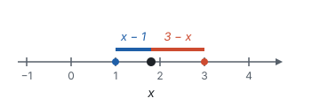
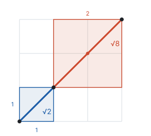
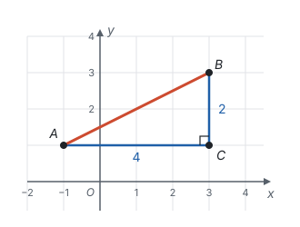

# 二次根式 ★

> 对应人教版八年级下册第十九章。

**形如 $\sqrt{a}$（$a \ge 0$）的式子叫二次根式；它的全部性质都来自一句话：$\sqrt{a}$ 是平方等于 $a$ 的那个非负数。**

## 从哪里来

面积为 2 的正方形，边长是 $\sqrt{2}$；直角边为 1 和 3 的直角三角形，斜边长是 $\sqrt{1^2 + 3^2} = \sqrt{10}$（见第五部分“勾股定理”）。求长度时总会遇到开平方，而且被开方的常常是含字母的式子：直角边为 $a$ 和 $b$ 的直角三角形，斜边是 $\sqrt{a^2 + b^2}$。

$\sqrt{a}$ 表示 $a$ 的**算术平方根**：平方等于 $a$ 的那个非负数（见第二部分“实数”）。所以，

- **被开方数 $a \ge 0$。** 负数没有平方根，$a < 0$ 时 $\sqrt{a}$ 没有意义。
- **$\sqrt{a} \ge 0$。** 算术平方根本身不是负数。

这两个“非负”是二次根式一切性质的出发点。

**例 1**　（1）$x$ 取什么值时，$\sqrt{x - 2}$ 有意义？$\frac{1}{\sqrt{x - 2}}$ 呢？（2）已知 $\sqrt{a - 3} + (b + 2)^2 = 0$，求 $a + b$ 的值。

**思路：** （1）根号下不能是负数；式子在分母上时，还不能为 0。（2）$\sqrt{a - 3} \ge 0$，$(b + 2)^2 \ge 0$，两个非负数的和为 0，只能每个都是 0。

**解：** （1）由 $x - 2 \ge 0$，得 $x \ge 2$，所以 $x \ge 2$ 时 $\sqrt{x - 2}$ 有意义。$\sqrt{x - 2}$ 在分母上，还要 $\sqrt{x - 2} \ne 0$，所以 $x > 2$ 时 $\frac{1}{\sqrt{x - 2}}$ 有意义。

（2）由 $\sqrt{a - 3} = 0$，$(b + 2)^2 = 0$，得 $a = 3$，$b = -2$，所以 $a + b = 1$。

## 两条基本性质

**性质一：**

$$(\sqrt{a})^2 = a \quad (a \ge 0).$$

这就是定义本身：$\sqrt{a}$ 是平方等于 $a$ 的数，它的平方当然是 $a$。

**性质二：**

$$\sqrt{a^2} = \lvert a \rvert.$$

$\sqrt{a^2}$ 是平方等于 $a^2$ 的**非负**数。平方等于 $a^2$ 的数是 $a$ 和 $-a$（$a = 0$ 时两者都是 0），要从中挑出非负的那一个：

- $a \ge 0$ 时，挑 $a$，$\sqrt{a^2} = a$；
- $a < 0$ 时，$-a$ 是正数，挑 $-a$，$\sqrt{a^2} = -a$。

这正是绝对值的定义，所以 $\sqrt{a^2} = \lvert a \rvert$。比如 $\sqrt{(-3)^2} = \sqrt{9} = 3$，不是 $-3$。

两条性质的区别在于运算的顺序：性质一先开方、再平方，$a$ 必须非负；性质二先平方、再开方，$a$ 可以是任何数，结果要取绝对值。

**例 2**　已知 $1 < x < 3$，化简 $\sqrt{(x - 1)^2} + \sqrt{(x - 3)^2}$。

**思路：** 由性质二，两项分别是 $\lvert x - 1 \rvert$ 和 $\lvert x - 3 \rvert$。去绝对值要看里面的正负，条件 $1 < x < 3$ 正是用来判断正负的。

**解：** 因为 $1 < x < 3$，所以 $x - 1 > 0$，$x - 3 < 0$。

$$\sqrt{(x - 1)^2} + \sqrt{(x - 3)^2} = \lvert x - 1 \rvert + \lvert x - 3 \rvert = (x - 1) + (3 - x) = 2.$$

**想一想：** 结果是一个常数，和 $x$ 无关，为什么？$\lvert x - 1 \rvert$ 是数轴上点 $x$ 到 1 的距离，$\lvert x - 3 \rvert$ 是点 $x$ 到 3 的距离（见第二部分“有理数”）。$x$ 在 1 和 3 之间移动时，两段距离一长一短，加起来总是 1 到 3 的距离 2：

如果 $x > 3$，两段距离就有重叠，和是 $2x - 4$，不再是常数。

## 乘法和除法

**乘法：**

$$\sqrt{a} \cdot \sqrt{b} = \sqrt{ab} \quad (a \ge 0,\ b \ge 0).$$

为什么？看左边 $\sqrt{a} \cdot \sqrt{b}$ 这个数：

- 它的平方是 $(\sqrt{a} \cdot \sqrt{b})^2 = (\sqrt{a})^2 \cdot (\sqrt{b})^2 = ab$（积的乘方，再用性质一）；
- 它是两个非负数的积，本身也非负。

平方等于 $ab$ 的非负数，就是 $\sqrt{ab}$。

**除法：** 同样的道理，

$$\frac{\sqrt{a}}{\sqrt{b}} = \sqrt{\frac{a}{b}} \quad (a \ge 0,\ b > 0).$$

$b > 0$ 是因为 $\sqrt{b}$ 在分母上。

**化简：把乘法法则倒过来用。** $\sqrt{ab} = \sqrt{a} \cdot \sqrt{b}$，被开方数里能开得尽方的因数就能移到根号外面：

$$\sqrt{8} = \sqrt{4 \times 2} = \sqrt{4} \times \sqrt{2} = 2\sqrt{2}.$$

在方格里也能看出来：$\sqrt{2}$ 是边长为 1 的正方形的对角线，$\sqrt{8}$ 是边长为 2 的正方形的对角线，后者正好由两条前者连成：

化简的目标是**最简二次根式**，满足两个条件：

- 被开方数不含分母；
- 被开方数中不含能开得尽方的因数或因式。

根号外面可以有分母，但分母里不留根号。去掉分母中根号的做法叫**分母有理化**：分子、分母同乘一个根式，让分母变成平方，比如

$$\frac{1}{\sqrt{2}} = \frac{1 \times \sqrt{2}}{\sqrt{2} \times \sqrt{2}} = \frac{\sqrt{2}}{2}.$$

为什么要统一化成最简形式？就像分数要约成最简分数，写法统一了，才看得出两个根式是不是“同一种”，才能合并和比较。

**例 3**　化简或计算：（1）$\sqrt{48}$；（2）$\sqrt{\frac{2}{3}}$；（3）$\sqrt{12} \times \sqrt{3}$；（4）$\sqrt{24} \div \sqrt{3}$。

**思路：** （1）找 48 里最大的平方因数 16。（2）被开方数有分母，先用除法法则拆开，再有理化。（3）（4）直接用乘、除法则，把被开方数合在一起算。

**解：**

$$\sqrt{48} = \sqrt{16 \times 3} = 4\sqrt{3},$$

$$\sqrt{\frac{2}{3}} = \frac{\sqrt{2}}{\sqrt{3}} = \frac{\sqrt{2} \times \sqrt{3}}{\sqrt{3} \times \sqrt{3}} = \frac{\sqrt{6}}{3},$$

$$\sqrt{12} \times \sqrt{3} = \sqrt{36} = 6, \qquad \sqrt{24} \div \sqrt{3} = \sqrt{8} = 2\sqrt{2}.$$

## 加法和减法

$2\sqrt{3}$ 是“2 个 $\sqrt{3}$”，$5\sqrt{3}$ 是“5 个 $\sqrt{3}$”，用分配律，

$$2\sqrt{3} + 5\sqrt{3} = (2 + 5)\sqrt{3} = 7\sqrt{3}.$$

这和合并同类项是一回事（见第三部分“整式的加减”）：**化成最简二次根式后，被开方数相同的可以合并**，系数相加，根式不变。被开方数不同就不能合并。

所以做加减之前，先把每个根式化成最简。比如 $\sqrt{2} + \sqrt{8}$，看起来不能合并，化简后是 $\sqrt{2} + 2\sqrt{2} = 3\sqrt{2}$。讲化简时的方格图里，$\sqrt{2}$ 是边长 1 的正方形的对角线，$\sqrt{8}$ 是边长 2 的正方形的对角线，两条接在一起：

合起来就是边长 3 的正方形的对角线：$\sqrt{18} = 3\sqrt{2}$。

**例 4**　计算：$\sqrt{12} - \sqrt{27} + \sqrt{\frac{1}{3}}$。

**思路：** 三个根式先分别化成最简，再看哪些被开方数相同。

**解：**

$$\sqrt{12} - \sqrt{27} + \sqrt{\frac{1}{3}} = 2\sqrt{3} - 3\sqrt{3} + \frac{\sqrt{3}}{3} = \left(2 - 3 + \frac{1}{3}\right)\sqrt{3} = -\frac{2\sqrt{3}}{3}.$$

## 混合运算

二次根式表示的是实数，实数的运算律照样成立，所以整式里的乘法公式照样能用。

$$(\sqrt{3} + \sqrt{2})(\sqrt{3} - \sqrt{2}) = (\sqrt{3})^2 - (\sqrt{2})^2 = 3 - 2 = 1,$$

$$(\sqrt{5} - 1)^2 = (\sqrt{5})^2 - 2\sqrt{5} + 1 = 6 - 2\sqrt{5}.$$

**拓展：** 第一个式子说明，分母是 $\sqrt{3} - \sqrt{2}$ 时，分子、分母同乘 $\sqrt{3} + \sqrt{2}$，用平方差公式就能去掉分母里的根号：

$$\frac{1}{\sqrt{3} - \sqrt{2}} = \frac{\sqrt{3} + \sqrt{2}}{(\sqrt{3} - \sqrt{2})(\sqrt{3} + \sqrt{2})} = \sqrt{3} + \sqrt{2}.$$

**例 5**　已知 $x = \sqrt{3} + 1$，求 $x^2 - 2x + 3$ 的值。

**解法一：直接代入。**

$$\begin{aligned} x^2 - 2x + 3 &= (\sqrt{3} + 1)^2 - 2(\sqrt{3} + 1) + 3 \\ &= 4 + 2\sqrt{3} - 2\sqrt{3} - 2 + 3 = 5. \end{aligned}$$

**解法二：先变形再代入。** 由 $x = \sqrt{3} + 1$，得 $x - 1 = \sqrt{3}$。所求的式子可以凑成 $(x - 1)^2$：

$$x^2 - 2x + 3 = (x^2 - 2x + 1) + 2 = (x - 1)^2 + 2 = (\sqrt{3})^2 + 2 = 5.$$

**想一想：** 解法一老老实实展开，含 $\sqrt{3}$ 的项最后正好抵消，步骤多、容易算错；解法二看出了 $x - 1$ 是个简单的数，把式子往 $x - 1$ 上凑，根号一次就消掉了。这是“整体代入”的想法（见第三部分“代数式”），凑的办法是完全平方公式（见第三部分“整式的乘法”）。

## 两点间的距离

**例 6**　在平面直角坐标系中，点 $A(-1, 1)$，$B(3, 3)$，求线段 $AB$ 的长。

**思路：** $AB$ 是斜的，不能直接数格子。过 $A$ 作水平线、过 $B$ 作竖直线，交于点 $C(3, 1)$，就得到以 $AB$ 为斜边的直角三角形，两条直角边的长可以从坐标算出来。

**解：** $AC = 3 - (-1) = 4$，$BC = 3 - 1 = 2$。由勾股定理，

$$AB = \sqrt{AC^2 + BC^2} = \sqrt{4^2 + 2^2} = \sqrt{20} = 2\sqrt{5}.$$

勾股定理算出的边长常常是二次根式，结果要化成最简。

## 易错点

- **$\sqrt{a^2}$ 忘了绝对值。** $\sqrt{a^2} = \lvert a \rvert$，只有知道 $a \ge 0$ 时才等于 $a$。$\sqrt{(-3)^2} = 3$；$x < 3$ 时 $\sqrt{(x - 3)^2} = 3 - x$。
- **把根号当成对加法也能拆。** $\sqrt{4 + 9} = \sqrt{13}$，不是 $2 + 3 = 5$；$\sqrt{2} + \sqrt{3} \ne \sqrt{5}$：两边平方，$(\sqrt{2} + \sqrt{3})^2 = 5 + 2\sqrt{6}$，比 $(\sqrt{5})^2 = 5$ 大。乘法法则 $\sqrt{ab} = \sqrt{a} \cdot \sqrt{b}$ 只对乘法成立。
- **乘法法则忘了条件。** $\sqrt{(-4) \times (-9)} = \sqrt{36} = 6$，不能写成 $\sqrt{-4} \times \sqrt{-9}$，因为负数的平方根没有意义。法则要求 $a \ge 0$，$b \ge 0$。
- **被开方数不同也去合并。** $\sqrt{2} + \sqrt{8}$ 要先化简成 $\sqrt{2} + 2\sqrt{2}$ 才能合并；$2\sqrt{3} + 3\sqrt{2}$ 化成最简后被开方数仍不同，不能合并。
- **结果不是最简。** $\sqrt{\frac{1}{2}}$ 被开方数含分母，$\frac{1}{\sqrt{2}}$ 分母里有根号，都要化成 $\frac{\sqrt{2}}{2}$。
- **有意义的条件没考虑全。** 根号下的式子要 $\ge 0$；根式在分母上时，还要 $\ne 0$，即根号下的式子 $> 0$。

## 联系

- **实数：** $\sqrt{2}$ 是无理数，二次根式的值常常是无理数；估算 $\sqrt{a}$ 的大小，看它夹在哪两个整数之间。见第二部分“实数”。
- **有理数：** $\sqrt{a^2} = \lvert a \rvert$，绝对值是数轴上到原点的距离。见第二部分“有理数”。
- **整式的加减、整式的乘法：** 合并二次根式就是合并同类项；二次根式的乘法可以用乘法公式。见第三部分“整式的加减”和第三部分“整式的乘法”。
- **勾股定理：** 由两条直角边求斜边，结果常是二次根式。见第五部分“勾股定理”。
- **平面直角坐标系：** 两点 $(x_1, y_1)$、$(x_2, y_2)$ 间的距离是 $\sqrt{(x_1 - x_2)^2 + (y_1 - y_2)^2}$，就是例 6 的做法：过两点分别作水平线和竖直线，得到直角三角形，两条直角边是横、纵坐标之差，再用勾股定理求斜边。见第六部分“平面直角坐标系”。
- **一元二次方程：** 求根公式里有 $\sqrt{b^2 - 4ac}$，根号下的式子为负时方程没有实数根。见第四部分“一元二次方程”。
- **锐角三角函数：** 特殊角的三角函数值，如 $\sin 60^\circ = \frac{\sqrt{3}}{2}$，都是二次根式。见第八部分“锐角三角函数”。
