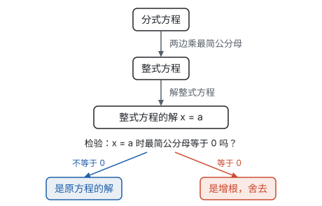
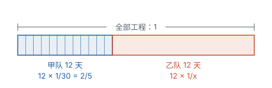

# 分式方程 ★

> 对应人教版八年级上册 18.5。

**分母里含有未知数的方程叫分式方程；解法是两边乘最简公分母，化成整式方程。因为乘的式子可能等于 0，这一步可能多出原方程没有的“解”，所以必须检验。**

## 从哪里来：未知数跑进了分母

一艘船在静水中的速度不知道，水流速度是 3 km/h。它顺流航行 80 km 和逆流航行 60 km 所用的时间相同，求船在静水中的速度。

设船在静水中的速度为 $x$ km/h，顺流速度是 $(x + 3)$ km/h，逆流速度是 $(x - 3)$ km/h。等量关系是“两段用时相同”，而时间 = 路程 ÷ 速度，于是

$$\frac{80}{x + 3} = \frac{60}{x - 3}.$$

未知数出现在分母里了。这不是偶然：时间 = 路程 ÷ 速度，工作时间 = 工作量 ÷ 工作效率，数量 = 总价 ÷ 单价，**只要未知的量是除数，列出的方程就是分式方程。**

分母中含有未知数的方程叫**分式方程**。注意是“分母中含有未知数”：$\frac{x}{2} + 1 = 3$ 虽然有分数线，但分母是数，它仍是一元一次方程。

## 解法：化成整式方程

已经会解整式方程了，自然想到把分母去掉。和一元一次方程去分母一样，两边同乘各分母的最简公分母（见第三部分“分式”）。

上面船速问题列出的方程是

$$\frac{80}{x + 3} = \frac{60}{x - 3},$$

最简公分母是 $(x + 3)(x - 3)$，两边同乘它，得

$$80(x - 3) = 60(x + 3).$$

去括号，得 $80x - 240 = 60x + 180$，所以 $20x = 420$，$x = 21$。

检验：$x = 21$ 时，$(x + 3)(x - 3) = 24 \times 18 \ne 0$，所以 $x = 21$ 是原方程的解。回到题目，顺流速度 24 km/h，用时 $\frac{80}{24} = \frac{10}{3}$ h；逆流速度 18 km/h，用时 $\frac{60}{18} = \frac{10}{3}$ h，确实相同。船在静水中的速度是 21 km/h。

整个过程可以画成下面的流程，最后一步“检验”是分式方程特有的：

**例 1**　解方程 $\frac{x}{x + 1} = \frac{2x}{3x + 3} + 1$。

**思路：** 先把分母分解因式，才看得出最简公分母：$3x + 3 = 3(x + 1)$，所以最简公分母是 $3(x + 1)$。右边的 1 也要乘。

**解：** 两边乘 $3(x + 1)$，得

$$3x = 2x + 3(x + 1).$$

去括号，得 $3x = 2x + 3x + 3$；移项、合并同类项，得 $-2x = 3$，所以 $x = -\frac{3}{2}$。

**检验：** $x = -\frac{3}{2}$ 时，$3(x + 1) = -\frac{3}{2} \ne 0$，所以 $x = -\frac{3}{2}$ 是原方程的解。

## 增根从哪里来

**例 2**　解方程 $\frac{1}{x - 2} + 3 = \frac{x - 1}{x - 2}$。

**解：** 两边乘 $x - 2$，得 $1 + 3(x - 2) = x - 1$，即 $3x - 5 = x - 1$，所以 $x = 2$。

**检验：** $x = 2$ 时，$x - 2 = 0$，原方程的分母为 0，没有意义。所以 $x = 2$ 不是原方程的解，原方程无解。

这里的 $x = 2$ 是去分母后的整式方程的解，却不是原方程的解，叫原方程的**增根**。它是怎么多出来的？

回忆等式的性质 2：两边乘同一个数，等式仍成立。反过来却不一定：一个本来**不成立**的等式，两边都乘 0 以后，就变成了成立的 $0 = 0$。比如 $1 \ne 3$，可是 $1 \times 0 = 3 \times 0$。

去分母时乘的 $x - 2$ 是含未知数的式子。$x$ 取别的值时它不等于 0，变形前后等价；可是当 $x = 2$ 时它等于 0，原方程在这里根本没有意义，乘完以后却可能“成立”了。所以：

- 整式方程的解，**只可能**在“最简公分母等于 0”的地方多出来；
- 检验时，**只要把解代入最简公分母**：不等于 0，就是原方程的解；等于 0，就是增根，要舍去。

也可以代入原方程检验，那样还能顺便查出计算错误，只是麻烦一些。

## 含字母的分式方程（拓展）

增根的来历弄清楚了，就能反过来用：增根一定让最简公分母等于 0。

**例 3**　关于 $x$ 的方程 $\frac{x}{x - 2} - 3 = \frac{m}{x - 2}$。

（1）如果这个方程有增根，求 $m$ 的值；

（2）如果这个方程的解是正数，求 $m$ 的取值范围。

**思路：** 先照常去分母，把 $x$ 用 $m$ 表示出来。增根只可能是让 $x - 2 = 0$ 的 $x = 2$；“解是正数”除了要求 $x > 0$，还要求这个解不是增根。

**解：** 两边乘 $x - 2$，得 $x - 3(x - 2) = m$，即 $-2x + 6 = m$，所以 $x = \frac{6 - m}{2}$。

（1）方程有增根，增根只能是 $x = 2$。令 $\frac{6 - m}{2} = 2$，得 $m = 2$。

（2）解是正数，需要 $\frac{6 - m}{2} > 0$，得 $m < 6$；同时这个解不能是增根，即 $\frac{6 - m}{2} \ne 2$，得 $m \ne 2$。所以 $m < 6$ 且 $m \ne 2$。

**回顾：** 第（2）问最容易漏掉 $m \ne 2$。$m = 2$ 时整式方程的解是 $x = 2$，虽然是正数，却让分母为 0，原方程其实无解。

## 实际问题：工程问题

**例 4**　一项工程，甲队单独做需要 30 天完成。甲、乙两队合做 12 天完成。乙队单独做需要多少天完成？

**思路：** 工程问题的关键是把全部工作量看成 1。甲队 30 天完成，每天完成 $\frac{1}{30}$；设乙队单独做需要 $x$ 天，每天完成 $\frac{1}{x}$。等量关系是：甲 12 天的工作量 + 乙 12 天的工作量 = 全部工作量 1。

**解：** 设乙队单独做需要 $x$ 天完成。根据题意，得

$$\frac{12}{30} + \frac{12}{x} = 1.$$

两边乘 $30x$，得 $12x + 360 = 30x$，所以 $18x = 360$，$x = 20$。

**检验：** $x = 20$ 时 $30x \ne 0$，是原方程的解，而且天数为正，符合题意。

答：乙队单独做需要 20 天完成。

**想一想：** 如果设的不是天数，而是乙队每天完成的工作量 $y$，方程就是

$$12 \times \frac{1}{30} + 12y = 1,$$

这是一元一次方程，解得 $y = \frac{1}{20}$，乙队单独做需要 $1 \div \frac{1}{20} = 20$ 天。

| 比较 | 设天数 $x$ | 设每天的工作量 $y$ |
| --- | --- | --- |
| 方程 | 分式方程 | 一元一次方程 |
| 要不要检验增根 | 要 | 不要 |
| 最后一步 | 直接得到答案 | 还要用 $1 \div y$ 换算成天数 |

天数和每天的工作量互为倒数：设哪一个，另一个就在分母里。未知数放在分母还是分子，取决于设的是哪个量，方程的类型可以通过换个设法来改变。

**实际问题要两次检验：** 先检验是不是增根，再检验是否符合实际（天数、速度为正，人数为整数等）。

## 易错点

- **去分母时漏乘不含分母的项。** 例 4 的方程 $\frac{12}{30} + \frac{12}{x} = 1$ 两边乘 $30x$，左边的 $\frac{12}{30}$ 和 $\frac{12}{x}$ 要乘，右边的 1 也要乘，得 $30x$。
- **分子是多项式时不加括号。** $-\frac{x + 1}{x - 2}$ 乘 $x - 2$ 得 $-(x + 1)$，括号里的每一项都要变号。
- **最简公分母找错。** 分母能分解因式的先分解，如 $3x + 3 = 3(x + 1)$，$x^2 - 1 = (x + 1)(x - 1)$，再取各因式的最高次幂的积。
- **忘记检验，或者检验时代错了地方。** 检验是把解代入**最简公分母**（或原方程），不是代入去分母后的整式方程——整式方程的解代回整式方程总是成立的。
- **把“有增根”和“无解”当成一回事。** 分式方程无解有两种可能：去分母后的整式方程本身无解；或者整式方程的解都是增根。反过来，有增根也不一定无解：去分母后得到一元二次方程时，可能一个根是增根，另一个根是原方程的解。
- **“解是正数”漏掉“不是增根”这个条件。** 例 3 中，方程 $\frac{x}{x - 2} - 3 = \frac{m}{x - 2}$ 去分母后得 $x = \frac{6 - m}{2}$；解是正数，除了 $m < 6$，还要这个解不是增根 $x = 2$，即 $m \ne 2$。

## 联系

- **分式：** 分式的分母不能为 0，这正是分式方程要检验的原因；找最简公分母、分解因式，都是分式运算的基本功。见第三部分“分式”。
- **一元一次方程：** 去分母后大多化成一元一次方程；去分母的做法也和一元一次方程一样，只是乘的式子可能为 0。见第四部分“一元一次方程”。
- **反比例函数：** 路程一定时，时间和速度成反比；工作量一定时，时间和工作效率成反比。分式方程里的 $\frac{80}{x + 3}$、$\frac{12}{x}$，都是反比例关系。见第七部分“反比例函数”。
- **一元二次方程：** 有的分式方程去分母后得到一元二次方程，照样要检验。见第四部分“一元二次方程”。
- **方程思想与建模：** 行程、工程、购物中的“÷”关系，是分式方程最常见的来源。见第十一部分“方程思想与建模”。
