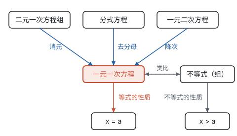

# 总览：从等式到方程

**这一部分的主线是：从实际问题中找出等量关系或不等关系，写成方程或不等式；再依据等式和不等式的性质，把每一种方程都化归为一元一次方程来解。**

## 类型总表

| 类型 | 未知数个数 | 次数 | 怎样解 | 解的个数 |
| --- | --- | --- | --- | --- |
| 一元一次方程 | 1 | 1 | 用等式的性质变形成 $x = a$ | 1 个 |
| 二元一次方程组 | 2 | 1 | 消元（代入或加减），化成一元一次方程 | 通常 1 组；也可能无解或有无数组 |
| 一元一次不等式（组） | 1 | 1 | 用不等式的性质变形成 $x > a$ 或 $x < a$；组要找公共部分 | 无数个，组成一个范围；不等式组可能无解 |
| 分式方程 | 1 | 分母含未知数 | 去分母化成整式方程，再检验 | 可能出现增根，也可能无解 |
| 一元二次方程 | 1 | 2 | 降次（开平方或因式分解），化成两个一元一次方程 | 由判别式决定：2 个、2 个相等或没有实数根 |

## 一条线：都化归为一元一次方程

- **一元一次方程**是起点。它的解法全部来自等式的两条性质：两边加减同一个式子，两边乘除同一个不为 0 的数（见第四部分“一元一次方程”）。
- **二元一次方程组**多了一个未知数，就多要一个方程；消元把两个未知数变成一个（见第四部分“二元一次方程组”）。
- **分式方程**的未知数在分母里，两边乘最简公分母就回到整式方程；因为乘的式子可能为 0，所以要检验（见第四部分“分式方程”）。
- **一元二次方程**的次数高了一次，开平方或因式分解把它拆成两个一次方程（见第四部分“一元二次方程”）。
- **不等式**和方程对照着学：步骤几乎一样，只有两边乘除负数时不等号要改变方向；解不再是一个数，而是一个范围（见第四部分“不等式与不等式组”）。

遇到一种新方程，先问：它和已经会解的方程差在哪里？怎样把这个差别消掉？这就是化归。

## 每种方程在图象上的样子

每一种方程和不等式，都能在坐标系里找到对应的图形：

| 代数的问题 | 在图象上看 |
| --- | --- |
| 解一元一次方程 $kx + b = 0$ | 直线 $y = kx + b$ 与 $x$ 轴交点的横坐标 |
| 解不等式 $kx + b > 0$ | 直线 $y = kx + b$ 在 $x$ 轴上方的部分对应的 $x$ 的范围 |
| 解二元一次方程组 | 两条直线的交点；平行无解，重合有无数个解 |
| 解一元二次方程 $ax^2 + bx + c = 0$ | 抛物线 $y = ax^2 + bx + c$ 与 $x$ 轴交点的横坐标 |
| 判别式的正负 | 抛物线与 $x$ 轴有两个、一个或没有交点 |

这些对应关系要到学了函数才完整（见第七部分“一次函数”和第七部分“二次函数”），这一部分先从数轴开始：不等式的解集画在数轴上，二元一次方程的解画成直线。

## 列方程解实际问题

不管列的是哪种方程，过程都一样：

1. 读题，找出等量关系（或不等关系）：通常是**同一个量的两种表示**；
2. 设未知数，用含未知数的式子表示其他有关的量；
3. 列出方程（组）或不等式（组）；
4. 解；
5. 检验：是不是方程的解（分式方程要查增根），是否符合实际（正数、整数、范围）；
6. 作答。

设哪个量为未知数，会影响列出的方程的类型：同一道工程题，设天数得到分式方程，设每天的工作量得到一元一次方程。多种情境的建模方法见第十一部分“方程思想与建模”。

## 学习顺序

按页面顺序学：

1. **一元一次方程：** 打好等式的性质和解方程步骤的基础；
2. **二元一次方程组：** 学会消元；
3. **不等式与不等式组：** 对照方程学，重点是不等号的方向和数轴表示；
4. **分式方程：** 学完第三部分“分式”后再学，重点是增根；
5. **一元二次方程：** 学完第三部分“整式的乘法”和第三部分“因式分解”、第二部分“实数”中的平方根后再学，和第七部分“二次函数”对照着看。
