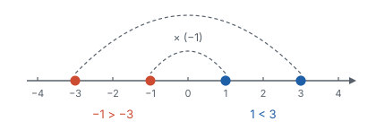
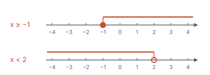
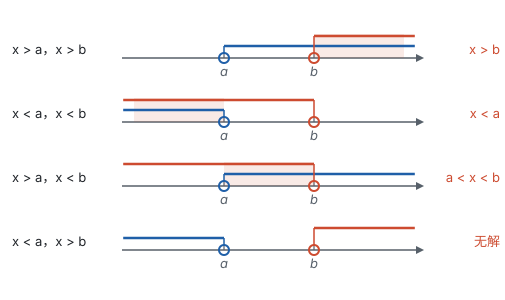
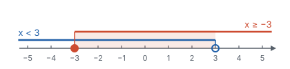

# 不等式与不等式组 ★

> 对应人教版七年级下册第十一章。

**不等式描述“谁大谁小”；解一元一次不等式和解一元一次方程的步骤几乎一样，唯一的区别是：两边乘或除以同一个负数时，不等号要改变方向。** 不等式的解通常有无数个，合起来是一个范围，画在数轴上是一条射线或一段线段。

## 从哪里来：不等关系

生活中很多要求不是“正好等于”，而是“不能超过”“至少要有”：

- 一座桥限重 20 t，车和货的总质量 $m$（t）要满足 $m \le 20$；
- 考试 60 分及格，及格的分数 $x$ 满足 $x \ge 60$；
- 一个数的 2 倍加 3 大于 7，写成 $2x + 3 > 7$。

用 $<$、$>$、$\le$、$\ge$、$\ne$ 表示大小关系的式子叫**不等式**。和方程对照：

| 概念 | 方程 | 不等式 |
| --- | --- | --- |
| 解 | 使等式成立的未知数的值 | 使不等式成立的未知数的值 |
| 解的个数 | 一元一次方程只有一个解 | 通常有无数个解 |
| 全部的解 | 就是那一个值，如 $x = 2$ | 叫**解集**，是一个范围，如 $x > 2$ |
| 解方程 / 解不等式 | 求出那个解 | 求出解集 |

比如 $2x + 3 > 7$，$x = 3$、$x = 2.5$、$x = 100$ 都是它的解，所有的解合起来是 $x > 2$。

只含一个未知数、未知数的次数是 1、不等号两边都是整式的不等式，叫**一元一次不等式**。

## 不等式的性质：从“差的正负”推出来

在数轴上，右边的点表示的数总比左边的大。$a > b$，就是 $a$ 在 $b$ 的右边，也就是 $a - b$ 是正数。所以：

$$a > b \iff a - b > 0.$$

有了这一条，不等式的性质都能推出来：

- **性质 1：** 不等式两边加（或减）同一个数（或式子），不等号的方向不变。理由：$(a + c) - (b + c) = a - b$，差没变，正负当然不变。
- **性质 2：** 不等式两边乘（或除以）同一个正数，不等号的方向不变。理由：如果 $a > b$，$c > 0$，那么 $ac - bc = (a - b)c$，正数乘正数是正数，所以 $ac > bc$。
- **性质 3：** 不等式两边乘（或除以）同一个负数，不等号的方向改变。理由：如果 $a > b$，$c < 0$，那么 $(a - b)c$ 是正数乘负数，是负数，所以 $ac < bc$。

除以一个数等于乘它的倒数，倒数和原数同号，所以除法的情况和乘法一样。

性质 3 在数轴上看得很清楚。乘 −1 就是取相反数，每个点跳到关于原点对称的位置，原来在右边的点跑到了左边，先后顺序整个反过来：$1 < 3$，但 $-1 > -3$。

乘其他负数，比如乘 −2，等于先乘 −1 再乘 2：先把顺序反过来，再按比例拉伸，顺序不再变。所以只要乘的是负数，不等号就要改变方向。

还有一条常用的：如果 $a > b$，$b > c$，那么 $a > c$。在数轴上就是 $a$ 在 $b$ 右边，$b$ 在 $c$ 右边，$a$ 当然在 $c$ 右边。

## 解一元一次不等式：和解方程对照着做

解一元一次不等式的步骤和解一元一次方程一样，目标是化成 $x > a$ 或 $x < a$ 这样的形式。每一步都对照一下依据：

| 步骤 | 解方程的依据 | 解不等式的依据 | 要注意什么 |
| --- | --- | --- | --- |
| 去分母 | 等式的性质 2 | 性质 2（乘的是正数） | 不等号方向不变 |
| 去括号 | 乘法分配律 | 乘法分配律 | 和解方程一样 |
| 移项 | 等式的性质 1 | 性质 1 | 不等号方向不变 |
| 合并同类项 | 乘法分配律 | 乘法分配律 | 和解方程一样 |
| 系数化为 1 | 等式的性质 2 | 性质 2 或性质 3 | **系数是负数时，不等号改变方向** |

**例 1**　解不等式 $\frac{2x - 1}{3} - \frac{5x + 1}{2} \le 1$，并把解集表示在数轴上。

**思路：** 和解方程一样先去分母，两边乘 6。6 是正数，不等号方向不变。最后一步要看系数的正负。

**解：**

$$\begin{aligned} 2(2x - 1) - 3(5x + 1) &\le 6 && \text{去分母} \\ 4x - 2 - 15x - 3 &\le 6 && \text{去括号} \\ 4x - 15x &\le 6 + 2 + 3 && \text{移项} \\ -11x &\le 11 && \text{合并同类项} \\ x &\ge -1 && \text{两边除以 } -11 \text{，不等号改变方向} \end{aligned}$$

**检验：** 取解集里的 $x = 0$，左边 $= -\frac{1}{3} - \frac{1}{2} = -\frac{5}{6}$，确实 $\le 1$；取解集外的 $x = -2$，左边 $= -\frac{5}{3} + \frac{9}{2} = \frac{17}{6}$，大于 1，不满足。说明方向没有弄反。

## 解集画在数轴上

解集是一个范围，画在数轴上最清楚。约定两件事：

- **端点：** 包括这个数（$\le$ 或 $\ge$）画实心点，不包括（$<$ 或 $>$）画空心圈；
- **方向：** 大于向右画，小于向左画。

例 1 的解集 $x \ge -1$ 就是上面一行：从 −1 出发向右，−1 本身也在里面。

## 不等式组：找公共部分

有时一个未知数要同时满足几个条件，比如 $x$ 既要大于 $a$，又要小于 $b$。把几个一元一次不等式合在一起，就组成**一元一次不等式组**。几个不等式解集的**公共部分**，叫不等式组的解集。

找公共部分，最可靠的办法是把每个解集都画在同一条数轴上，看哪一段被所有的线都覆盖。设 $a < b$，两个不等式组成的不等式组只有四种情况：

| 不等式组 | 在数轴上看 | 解集 |
| --- | --- | --- |
| $x > a$，$x > b$ | 两条线都向右，重叠部分从更靠右的 $b$ 开始 | $x > b$ |
| $x < a$，$x < b$ | 两条线都向左，重叠部分到更靠左的 $a$ 为止 | $x < a$ |
| $x > a$，$x < b$ | 一条向右、一条向左，中间重叠 | $a < x < b$ |
| $x < a$，$x > b$ | 一条向左、一条向右，背道而驰，没有重叠 | 无解 |

不用背这张表：每次画一下数轴，重叠的部分一眼就能看出来。

**例 2**　解不等式组

$$\begin{cases} 2(x - 1) < x + 1, \\ \frac{x + 5}{2} \ge 1, \end{cases}$$

并写出它的所有整数解。

**思路：** 先分别解每一个不等式，再在数轴上找公共部分，最后在公共部分里数整数。

**解：** 解第一个不等式：$2x - 2 < x + 1$，得 $x < 3$。

解第二个不等式：$x + 5 \ge 2$，得 $x \ge -3$。

把两个解集画在同一条数轴上：

公共部分是 $-3 \le x < 3$，这就是不等式组的解集。其中 $-3$ 取得到（实心点），3 取不到（空心圈），所以整数解是 −3，−2，−1，0，1，2，共 6 个。

## 实际问题：不等关系定范围

实际问题里的“不超过”“至少”“不少于”，都是不等关系。翻译时要逐字对照：

| 说法 | 符号 |
| --- | --- |
| 不超过、不高于、至多 | $\le$ |
| 不少于、不低于、至少 | $\ge$ |
| 超过、高于 | $>$ |
| 不足、低于 | $<$ |

**例 3**　某班计划买甲、乙两种奖品共 20 件，甲种每件 12 元，乙种每件 8 元。要求总费用不超过 200 元，并且甲种奖品的件数不少于乙种的一半。有哪几种购买方案？

**思路：** 只有一个量可以自由选：甲种买几件。设甲种买 $x$ 件，乙种就是 $(20 - x)$ 件。题目给了两个不等关系：费用“不超过”200 元，甲的件数“不少于”乙的一半，两个条件要同时满足，所以列不等式组。件数还必须是整数。

**解：** 设甲种奖品买 $x$ 件，则乙种买 $(20 - x)$ 件。根据题意，得

$$\begin{cases} 12x + 8(20 - x) \le 200, \\ x \ge \frac{1}{2}(20 - x). \end{cases}$$

解第一个不等式：$4x + 160 \le 200$，得 $x \le 10$。

解第二个不等式：$2x \ge 20 - x$，$3x \ge 20$，得 $x \ge \frac{20}{3}$，也就是 $x \ge 6\frac{2}{3}$。

所以 $6\frac{2}{3} \le x \le 10$。$x$ 是整数，只能取 7、8、9、10。

答：共有 4 种方案：甲 7 件、乙 13 件；甲 8 件、乙 12 件；甲 9 件、乙 11 件；甲 10 件、乙 10 件。

**检验：** 最贵的方案是甲 10 件，费用 $12 \times 10 + 8 \times 10 = 200$ 元，正好不超过；甲 6 件时乙 14 件，$6 < 7$，不满足“不少于一半”，所以 6 不行。

**回顾：** 方程求出的是一个确定的值，不等式求出的是一个范围；实际问题再加上“整数”“正数”等限制，范围就变成了几个具体的方案。要找其中费用最少的方案，还可以把费用写成 $x$ 的一次函数，看它随 $x$ 怎样变化（见第七部分“一次函数”）。

## 易错点

- **两边乘或除以负数时忘了改变不等号方向。** $-11x \le 11$ 两边除以 −11，得 $x \ge -1$，不是 $x \le -1$。去分母乘的是正数，方向不变；系数化为 1 时要先看系数的正负。
- **两边乘或除以一个不知道正负的式子。** 比如关于 $x$ 的不等式 $(m - 1)x > m - 1$ 的解集是 $x < 1$，说明两边除以 $m - 1$ 时不等号改变了方向，所以 $m - 1 < 0$，$m < 1$。如果不知道 $m - 1$ 的正负，就要分情况讨论（见第十一部分“分类讨论”）。
- **实心点和空心圈画反。** 含等号（$\le$、$\ge$）的端点属于解集，画实心点；不含等号的画空心圈。求整数解时，端点能不能取也由这一点决定。
- **把“不超过”“至少”译错。** “不超过 200”包括 200，是 $\le 200$；“少于 200”不包括 200，是 $< 200$。
- **把不等式组的解集写成“合起来”。** 不等式组要求**同时**满足，解集是公共部分，不是两个解集拼在一起。$x < 3$ 和 $x \ge -3$ 的公共部分是 $-3 \le x < 3$，不是“所有实数”。
- **以为不等式两边可以随便“约掉”相同的因式。** 约掉就是两边除以它，要先确定它是正数、负数还是可能为 0。

## 联系

- **有理数：** 数轴上右边的数大，这是不等式所有性质的出发点；乘 −1 就是取相反数，关于原点对称，所以大小顺序反过来。见第二部分“有理数”。
- **一元一次方程：** 解不等式的每一步都和解方程对应，只有乘除负数这一步不同。不等式的边界点，就是把不等号换成等号后方程的解。见第四部分“一元一次方程”。
- **一次函数：** 解 $kx + b > 0$，就是看直线 $y = kx + b$ 在 $x$ 轴上方的部分对应的 $x$ 的范围；比较两个一次函数的大小，就是看哪条直线在上面。见第七部分“一次函数”。
- **三角形：** 三角形任意两边之和大于第三边，已知两边求第三边的范围，就是解不等式组。见第五部分“三角形”。
- **实数：** 估算 $\sqrt{5}$ 在 2 和 3 之间，写出来就是 $2 < \sqrt{5} < 3$。见第二部分“实数”。
- **分类讨论：** 系数含字母时，不等号的方向要看字母的正负，需要分情况。见第十一部分“分类讨论”。
