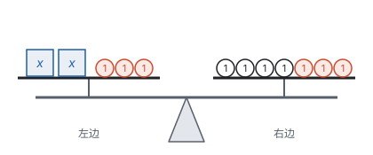
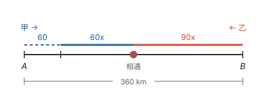

# 一元一次方程

> 对应人教版七年级上册第五章。

**方程是含有未知数的等式；解方程就是依据等式的性质，把方程一步一步变形，直到变成“$x = a$”的样子。** 只含一个未知数、未知数的次数是 1 的整式方程叫一元一次方程，它是后面所有方程的落脚点。

## 从哪里来：从“倒着算”到“顺着列”

“一个数的 3 倍减去 7，得 20，这个数是多少？”用算术做，要倒着想：最后得 20，减 7 之前是 $20 + 7 = 27$，乘 3 之前是 $27 \div 3 = 9$。每一步都要把题目里的运算反过来。

用方程做，只要顺着题意把关系写下来：设这个数是 $x$，那么 $3x - 7 = 20$。怎样从这个式子求出 $x$，是另一件事，而且有固定的办法。

题目再绕一点，差别就明显了：“一个数的 3 倍减去 7，等于它的 2 倍加上 5。”未知的数同时出现在两边，已经没法倒着算；列方程却一样容易：$3x - 7 = 2x + 5$，解得 $x = 12$。

**方程把“怎样求”和“关系是什么”分开了：** 列方程时只管把等量关系如实写下来，解方程时只管按规则变形。

几个基本概念：

- **方程：** 含有未知数的等式。
- **方程的解：** 使方程左右两边的值相等的未知数的值。$x = 12$ 是 $3x - 7 = 2x + 5$ 的解，因为两边都等于 29。
- **解方程：** 求方程的解的过程。
- **一元一次方程：** 只含有一个未知数（元），未知数的次数都是 1，等号两边都是整式。它总能整理成 $ax + b = 0$（$a \ne 0$）的形式。

| 方程 | 是不是一元一次方程 | 原因 |
| --- | --- | --- |
| $2x + 1 = 5$ | 是 | 一个未知数，次数是 1 |
| $x + y = 3$ | 不是 | 两个未知数，是二元一次方程 |
| $x^2 = 4$ | 不是 | 未知数的次数是 2 |
| $\frac{1}{x} = 2$ | 不是 | 分母里有未知数，左边不是整式，是分式方程 |
| $3 + 2 = 5$ | 不是 | 没有未知数，只是等式，不是方程 |

## 等式的性质：天平模型

等式就像一架平衡的天平：左盘放等号左边的量，右盘放等号右边的量。要让天平保持平衡，只能对两边做同样的事：

- **等式的性质 1：** 等式两边加（或减）同一个数（或式子），结果仍相等。如果 $a = b$，那么 $a \pm c = b \pm c$。
- **等式的性质 2：** 等式两边乘同一个数，或除以同一个不为 0 的数，结果仍相等。如果 $a = b$，那么 $ac = bc$；如果 $a = b$，$c \ne 0$，那么 $\frac{a}{c} = \frac{b}{c}$。

下图的天平表示 $2x + 3 = 7$。两边同时拿走 3 个 1（图中红色的 1，性质 1），天平仍平衡，得 $2x = 4$；再把两边都平均分成 2 份，各取一份（性质 2），得 $x = 2$。

为什么除数不能是 0？因为除以 0 没有意义。两边乘 0 虽然还是等式，但变成了 $0 = 0$，原来的信息全丢了，所以解方程时从来不乘 0。这一点到了分式方程会变得很要紧：两边乘一个含未知数的式子时，这个式子可能恰好等于 0（见第四部分“分式方程”）。

另外，等式还可以左右交换（$a = b$ 就是 $b = a$），相等的量可以互相替换（$a = b$，$b = c$，那么 $a = c$）。后一条叫**等量代换**，解方程组时的“代入”靠的就是它。

## 解方程：每一步都有依据

解一元一次方程，目标是把方程变成 $x = a$。通常经过下面几步，每一步都是等式的性质或运算律，不是新规定：

| 步骤 | 做法 | 依据 | 注意 |
| --- | --- | --- | --- |
| 去分母 | 两边乘各分母的最小公倍数 | 等式的性质 2 | 不含分母的项也要乘；分子是多项式时要加括号 |
| 去括号 | 用乘法分配律展开 | 乘法分配律 | 括号前是负号，括号里各项都要变号 |
| 移项 | 含未知数的项移到一边，常数项移到另一边 | 等式的性质 1 | 移过去的项要变号 |
| 合并同类项 | 整理成 $ax = b$ | 乘法分配律 | 只把系数相加 |
| 系数化为 1 | 两边除以 $a$ | 等式的性质 2 | $a \ne 0$；是 $b$ 除以 $a$，不要颠倒 |

**移项为什么要变号？** 以 $3x - 7 = 2x + 5$ 为例，两边同时减 $2x$、再同时加 7（性质 1），得 $3x - 2x = 5 + 7$。结果看起来就像把 $2x$ 从右边“搬”到左边变成 $-2x$，把 $-7$ 从左边“搬”到右边变成 $+7$。移项只是性质 1 的简便写法。

这几步不是非走不可的固定程序。比如 $3(x - 2) = 6$，先两边除以 3 得 $x - 2 = 2$，比先去括号更快。每一步想清楚依据，顺序就可以灵活安排。

**例 1**　解方程 $\frac{x + 1}{2} - \frac{2x - 1}{3} = 1$。

**思路：** 有分母，先去分母。分母 2 和 3 的最小公倍数是 6，两边同乘 6。右边的 1 也要乘；$2x - 1$ 是一个整体，乘完要带着括号。

**解：**

$$\begin{aligned} 3(x + 1) - 2(2x - 1) &= 6 && \text{去分母} \\ 3x + 3 - 4x + 2 &= 6 && \text{去括号} \\ 3x - 4x &= 6 - 3 - 2 && \text{移项} \\ -x &= 1 && \text{合并同类项} \\ x &= -1 && \text{系数化为 1} \end{aligned}$$

**检验：** 把 $x = -1$ 代入原方程，左边 $= \frac{0}{2} - \frac{-3}{3} = 0 + 1 = 1$，等于右边，所以 $x = -1$ 是原方程的解。

## 列方程解实际问题：找等量关系

列方程的关键，是找到**同一个量的两种表示**：一边用题目给的数表示，另一边用含未知数的式子表示，两者相等就是方程。一般的过程是：

1. 读题，找出等量关系；
2. 设未知数，用含未知数的式子表示有关的量；
3. 根据等量关系列出方程；
4. 解方程；
5. 检验：既要检验是不是方程的解，也要检验是否符合实际；
6. 写出答案。

**例 2**　某商品按成本价提高 40% 标价，再打八折出售，每件仍获利 12 元。每件商品的成本是多少元？

**思路：** 涉及的量有成本、标价、售价、利润。利润是“售价 − 成本”，这就是等量关系。成本不知道，设它为 $x$ 元，其余的量都能用 $x$ 表示：标价是 $(1 + 40\%)x = 1.4x$，打八折后售价是 $1.4x \times 0.8 = 1.12x$。

**解：** 设每件商品的成本是 $x$ 元。根据“售价 − 成本 = 利润”，得

$$1.12x - x = 12.$$

合并同类项，得 $0.12x = 12$，所以 $x = 100$。

**检验：** 成本 100 元，标价 140 元，售价 $140 \times 0.8 = 112$ 元，获利 12 元，符合题意。

答：每件商品的成本是 100 元。

**例 3**　$A$、$B$ 两地相距 360 km。甲车从 $A$ 地开往 $B$ 地，每小时行 60 km；甲车出发 1 h 后，乙车从 $B$ 地开往 $A$ 地，每小时行 90 km。乙车出发后多少小时两车相遇？

**思路：** 行程问题先画线段图，把两车走过的路程标在同一条线段上：

从图上看，等量关系是“甲走的路程 + 乙走的路程 = 全程”。设乙车出发后 $x$ h 两车相遇，甲车比乙车多走 1 h，行驶了 $(x + 1)$ h。

**解：** 设乙车出发后 $x$ h 两车相遇。根据题意，得

$$60(x + 1) + 90x = 360.$$

去括号，得 $60x + 60 + 90x = 360$；移项、合并同类项，得 $150x = 300$，所以 $x = 2$。

**检验：** 甲车行驶 3 h，走了 180 km；乙车行驶 2 h，走了 180 km；合起来 360 km，符合题意。

答：乙车出发后 2 h 两车相遇。

**想一想：** 未知数不一定设成题目问的量。也可以设相遇点离 $A$ 地 $y$ km，这时甲车用了 $\frac{y}{60}$ h，乙车用了 $\frac{360 - y}{90}$ h。甲车比乙车多用 1 h，得

$$\frac{y}{60} - \frac{360 - y}{90} = 1.$$

两边乘 180，得 $3y - 2(360 - y) = 180$，解得 $y = 180$，再算出乙车用时 $180 \div 90 = 2$ h，答案相同。

| 比较 | 设乙车的行驶时间为 $x$ h | 设相遇点离 $A$ 地 $y$ km |
| --- | --- | --- |
| 等量关系 | 路程之和 = 全程 | 甲的用时 − 乙的用时 = 1 h |
| 方程 | 没有分母，一步到位 | 有分母，解完还要再算一步 |
| 什么时候用 | 问什么设什么，通常最直接 | 问的量不好表示、而另一个量能把关系说清时 |

同一个情境可以列出不同的方程，因为它们表达的是同一组数量关系，只是选了不同的量做未知数。先想清楚“哪个量用两种方式表示”，再决定设什么。

## 易错点

- **去分母时漏乘不含分母的项。** 解 $\frac{x}{2} - 1 = \frac{x}{3}$，两边乘 6 应得 $3x - 6 = 2x$，不是 $3x - 1 = 2x$。等式的性质 2 要求两边的**每一项**都乘 6。
- **分子是多项式，去分母后不加括号。** $-\frac{2x - 1}{3}$ 乘 6 得 $-2(2x - 1) = -4x + 2$，不是 $-4x - 1$。分数线本身就起括号的作用。
- **移项不变号。** 移项是两边同时加上或减去同一个式子，项从一边到另一边，符号一定改变；只在同一边交换位置的项，符号不变。
- **系数化为 1 时除反了。** $2x = 3$ 的解是 $x = \frac{3}{2}$，不是 $\frac{2}{3}$；$-x = 1$ 的解是 $x = -1$。
- **把分数的基本性质和等式的性质混在一起。** 解 $\frac{x}{0.2} - \frac{x - 1}{0.5} = 1$ 时，把 $\frac{x}{0.2}$ 化成 $5x$、把 $\frac{x - 1}{0.5}$ 化成 $2(x - 1)$，用的是分数的基本性质（分子、分母同乘一个数），只改变这一项的写法，右边的 1 不动，得 $5x - 2(x - 1) = 1$。如果把右边也乘了 5 或 2，就错了。
- **实际问题只解不验。** 人数、件数要是正整数，时间、路程不能是负数。解出的结果不合实际，要么题目无解，要么方程列错了。

## 联系

- **一次函数：** 解方程 $kx + b = 0$，就是找直线 $y = kx + b$ 与 $x$ 轴交点的横坐标。见第七部分“一次函数”。
- **二元一次方程组、分式方程、一元二次方程：** 它们的解法最后都化成一元一次方程：方程组靠消元，分式方程靠去分母，一元二次方程靠降次。见第四部分“二元一次方程组”、第四部分“分式方程”和第四部分“一元二次方程”。
- **不等式：** 解一元一次不等式的步骤和解方程几乎一样，只有两边乘或除以负数时不等号要改变方向。见第四部分“不等式与不等式组”。
- **整式的加减：** 去括号、合并同类项就是整式加减的运算。见第三部分“整式的加减”。
- **几何图形初步：** 求线段长、角的度数时，常设一个量为 $x$，再根据中点、角平分线、余角、补角列方程。见第五部分“几何图形初步”。
- **方程思想与建模：** 找等量关系、设未知数、列方程，是用数学解决实际问题最基本的方法。见第十一部分“方程思想与建模”。
