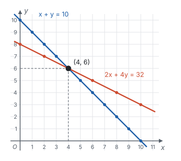
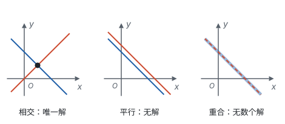

# 二元一次方程组 ★

> 对应人教版七年级下册第十章。

**两个未知数，需要两个独立的等量关系才能确定；解方程组的核心是消元：把两个未知数变成一个，化成一元一次方程。** 在坐标系里看，每个二元一次方程的解组成一条直线，方程组的解就是两条直线的交点。

## 从哪里来：一个方程定不住两个数

“笼子里有鸡和兔共 10 只，数一数脚共 32 只。鸡、兔各有几只？”

设鸡有 $x$ 只，兔有 $y$ 只。题目里有两个等量关系：

- 头数：$x + y = 10$；
- 脚数：$2x + 4y = 32$。

像 $x + y = 10$ 这样，含有两个未知数、含未知数的项的次数都是 1 的整式方程，叫**二元一次方程**。使方程两边相等的一对值，比如 $x = 3$，$y = 7$，叫它的一个解，记作

$$\begin{cases} x = 3, \\ y = 7. \end{cases}$$

只看头数，满足 $x + y = 10$ 的数对有很多；只看脚数，满足 $2x + 4y = 32$ 的数对也有很多。只取自然数，列出来：

| 满足的方程 | 解（$x$，$y$） |
| --- | --- |
| $x + y = 10$ | $(0, 10)$，$(1, 9)$，$(2, 8)$，$(3, 7)$，**$(4, 6)$**，$(5, 5)$，$(6, 4)$，… |
| $2x + 4y = 32$ | $(0, 8)$，$(2, 7)$，**$(4, 6)$**，$(6, 5)$，$(8, 4)$，$(10, 3)$，… |

两行里只有 $(4, 6)$ 同时出现：鸡 4 只、兔 6 只。

**一个二元一次方程有无数个解，两个未知数被“定住”需要两个条件同时成立。** 把两个方程合在一起，用大括号连起来，就是**二元一次方程组**：

$$\begin{cases} x + y = 10, \\ 2x + 4y = 32. \end{cases}$$

两个方程的公共解叫**方程组的解**。

## 消元：把二元变成一元

一个一个去试太慢。已经会解一元一次方程了，能不能把两个未知数变成一个？这就是**消元**。

其实用一元一次方程也能做开头这道鸡兔同笼题（鸡和兔共 10 只，脚共 32 只）：设鸡有 $x$ 只，那么兔有 $(10 - x)$ 只，根据脚数得 $2x + 4(10 - x) = 32$，解得 $x = 4$。这里用 $10 - x$ 表示兔的只数，就是悄悄用了第一个方程 $y = 10 - x$。把这一步明明白白写出来，就是代入消元法。

**代入消元法：** 从一个方程中用一个未知数表示另一个，代入另一个方程。依据是等量代换：$y$ 和 $10 - x$ 相等，在另一个方程里就可以用 $10 - x$ 替换 $y$。

**加减消元法：** 把两个方程的两边分别相加或相减，使某个未知数的系数变成 0。依据是等式的性质：如果 $a = b$，$c = d$，那么 $a + c = b + d$，$a - c = b - d$。某个未知数的系数不相等时，先用等式的性质 2 把方程两边同乘一个数，让它的系数相等或互为相反数。

**例 1**　解方程组

$$\begin{cases} y = 2x - 3, \\ 3x + 2y = 8. \end{cases}$$

**思路：** 第一个方程已经是“用 $x$ 表示 $y$”的样子，直接代入第二个方程。

**解：** 把 $y = 2x - 3$ 代入 $3x + 2y = 8$，得 $3x + 2(2x - 3) = 8$，即 $7x - 6 = 8$，所以 $x = 2$。

把 $x = 2$ 代入 $y = 2x - 3$，得 $y = 1$。所以方程组的解是 $x = 2$，$y = 1$。

**例 2**　解方程组

$$\begin{cases} 3x + 4y = 10, \\ 2x - 3y = 1. \end{cases}$$

**思路：** 哪个未知数的系数都不是 1 或 −1，用代入法要先变出 $x = \frac{1 + 3y}{2}$，带着分母算，很麻烦。看系数：$y$ 的系数是 4 和 −3，符号相反。第一个方程乘 3、第二个方程乘 4，$y$ 的系数就变成 12 和 −12，两式相加，$y$ 就消掉了。

**解：** 第一个方程两边乘 3，第二个方程两边乘 4，得

$$\begin{cases} 9x + 12y = 30, \\ 8x - 12y = 4. \end{cases}$$

两式相加，得 $17x = 34$，所以 $x = 2$。把 $x = 2$ 代入 $3x + 4y = 10$，得 $6 + 4y = 10$，所以 $y = 1$。

所以方程组的解是

$$\begin{cases} x = 2, \\ y = 1. \end{cases}$$

**检验：** $3 \times 2 + 4 \times 1 = 10$，$2 \times 2 - 3 \times 1 = 1$，两个方程都成立。

**想一想：** 两种方法怎么选？

| 方程组的样子 | 更方便的方法 | 原因 |
| --- | --- | --- |
| 有一个方程已经是 $y = \cdots$ 或 $x = \cdots$，或者某个未知数的系数是 1、−1 | 代入消元 | 不用变形或变形简单，不会出现分母 |
| 同一个未知数的系数相等、互为相反数，或者成倍数 | 加减消元 | 直接相加减，或乘一次就能消去 |

两种方法的目标是一样的：让一个未知数消失，剩下一个一元一次方程。

## 几何意义：两条直线的交点

把 $x + y = 10$ 的每一个解 $(x, y)$ 都看成坐标系中的一个点。只取整数时，这些点排成一行；$x$、$y$ 可以取任意实数时，这些点连成一条直线。原因是 $x + y = 10$ 可以写成 $y = -x + 10$，这是一次函数，图象是直线（见第七部分“一次函数”）。同样，$2x + 4y = 32$ 的解组成直线 $y = -\frac{1}{2}x + 8$。

方程组的解要同时满足两个方程，就是**同时在两条直线上的点**，也就是交点 $(4, 6)$。

从这个角度看，就明白方程组的解为什么可能有三种情况：

| 方程组 | 消元时发生了什么 | 两条直线 | 解的情况 |
| --- | --- | --- | --- |
| $x + y = 2$，$x - y = 0$ | 相加得 $2x = 2$，$x = 1$，$y = 1$ | 相交 | 唯一解 |
| $x + y = 2$，$2x + 2y = 5$ | 第一个方程乘 2 得 $2x + 2y = 4$，和第二个方程矛盾 | 平行 | 无解 |
| $x + y = 2$，$2x + 2y = 4$ | 第一个方程乘 2 就是第二个方程 | 重合 | 无数个解 |

第二行的两个方程互相矛盾：$x + y$ 不可能既等于 2 又等于 2.5。第三行的第二个方程只是第一个方程乘 2，没有提供新条件，等于只有一个方程。所以，“两个方程定住两个未知数”，要求这两个方程**互不矛盾、又不是同一个条件**。

## 实际问题：两个量，两个关系

题目里有两个不知道的量时，设两个未知数往往更自然：每个等量关系直接写成一个方程，不必先在脑子里消元。

**例 3**　一艘船顺流航行 48 km 用了 3 h，逆流航行 48 km 用了 4 h。求船在静水中的速度和水流的速度。

**思路：** 顺流时水推着船走，速度是“船速 + 水速”；逆流时水挡着船，速度是“船速 − 水速”。两个速度都能从路程和时间算出来：顺流速度 $48 \div 3 = 16$ km/h，逆流速度 $48 \div 4 = 12$ km/h。

**解：** 设船在静水中的速度为 $x$ km/h，水流速度为 $y$ km/h。根据题意，得

$$\begin{cases} x + y = 16, \\ x - y = 12. \end{cases}$$

两式相加，得 $2x = 28$，$x = 14$；两式相减，得 $2y = 4$，$y = 2$。

答：船在静水中的速度是 14 km/h，水流速度是 2 km/h。

**回顾：** 这道题也可以只设一个未知数：设静水速度为 $x$ km/h，则水速是 $(16 - x)$ km/h，由逆流得 $x - (16 - x) = 12$。两种列法用的是同样的两个关系，区别只在于第一个关系是写成方程，还是直接用来表示另一个量。

## 三元一次方程组（拓展）

三个未知数、三个方程，想法完全一样：**消元**。先消去一个未知数，得到二元一次方程组，再消去一个，得到一元一次方程。

**例 4**　解方程组

$$\begin{cases} x + y + z = 6, \\ x - y + z = 2, \\ 2x + y - z = 1. \end{cases}$$

**思路：** 前两个方程相减，$x$ 和 $z$ 同时消掉，直接得到 $y$。

**解：** 第一个方程减第二个方程，得 $2y = 4$，所以 $y = 2$。

把 $y = 2$ 代入第一个和第三个方程，得

$$\begin{cases} x + z = 4, \\ 2x - z = -1. \end{cases}$$

两式相加，得 $3x = 3$，$x = 1$，于是 $z = 3$。

所以方程组的解是 $x = 1$，$y = 2$，$z = 3$。

## 易错点

- **两式相减时只改了第一项的符号。** $(8x - 12y) - (9x + 12y)$ 是 $-x - 24y$，减去的方程里**每一项**都要变号，右边的常数也一样。
- **方程乘一个数时漏乘常数项。** $2x - 3y = 1$ 两边乘 4，得 $8x - 12y = 4$，右边的 1 也要乘。
- **把变形后的式子代回它自己。** 从鸡兔同笼的第一个方程 $x + y = 10$ 得出 $y = 10 - x$，要代入**第二个**方程 $2x + 4y = 32$；代回第一个方程只会得到 $10 = 10$，什么也求不出。
- **只求出一个未知数就停下。** 方程组的解是一对数，求出 $x$ 后要代回去求 $y$，并写成方程组的形式。
- **列出的两个方程其实是同一个关系。** 两个方程如果只是互相乘了一个倍数，就只提供了一个条件，解不唯一。列方程时要找两个**不同**的等量关系。

## 联系

- **一次函数：** 每个二元一次方程的图象是一条直线，方程组的解就是两条直线的交点；平行无解，重合有无数个解。用两点求一次函数解析式的待定系数法，要解的正是二元一次方程组。见第七部分“一次函数”。
- **一元一次方程：** 消元的目的就是化成一元一次方程；用一个未知数列方程时，“用 $x$ 表示另一个量”其实就是代入。见第四部分“一元一次方程”。
- **平面直角坐标系：** 方程的一个解 $(x, y)$ 就是坐标系里的一个点。见第六部分“平面直角坐标系”。
- **一元二次方程：** 求直线和抛物线的交点，消元后得到的是一元二次方程。见第四部分“一元二次方程”。
- **方程思想与建模：** 题目里有几个未知量，就去找几个互不相同的等量关系。见第十一部分“方程思想与建模”。
