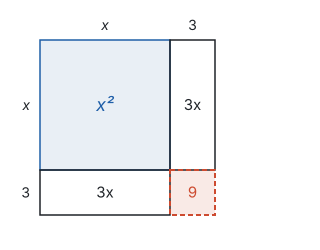
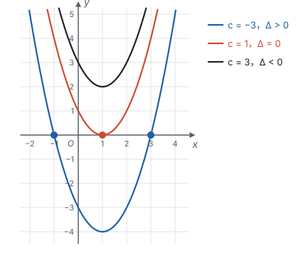
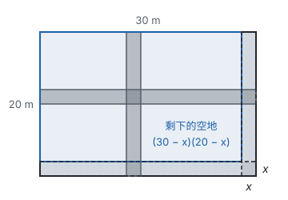
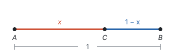

# 一元二次方程 ★

> 对应人教版九年级上册第二十五章。

**只含一个未知数、未知数的最高次数是 2 的整式方程叫一元二次方程；它的各种解法都在做同一件事：降次，把一个二次方程变成两个一次方程。**

## 从哪里来

一块长方形空地，长比宽多 4 m，面积是 60 m²，长和宽各是多少？

设宽为 $x$ m，长就是 $(x + 4)$ m，根据面积得 $x(x + 4) = 60$，整理成

$$x^2 + 4x - 60 = 0.$$

和一元一次方程比，多了一个 $x^2$ 项。面积、增长率、自由落体的距离……很多数量关系里都有“一个量乘它自己”，列出的就是这样的方程。

只含有一个未知数、未知数的最高次数是 2 的整式方程，叫**一元二次方程**。它都能整理成**一般形式**

$$ax^2 + bx + c = 0 \quad (a \ne 0),$$

其中 $ax^2$ 是二次项，$bx$ 是一次项，$c$ 是常数项，$a$、$b$ 分别是二次项系数和一次项系数。要求 $a \ne 0$，因为 $a = 0$ 时 $x^2$ 项消失，就成了一次方程。

一次方程已经会解了，所以问题是：**怎样把“二次”降成“一次”？** 手里有两件工具：

- **开平方：** 如果 $x^2 = p$（$p \ge 0$），那么 $x = \pm\sqrt{p}$。这是平方根的定义。
- **乘积为 0：** 如果 $ab = 0$，那么 $a = 0$ 或 $b = 0$。

下面的几种解法，都是想办法用上这两件工具之一。

## 直接开平方

**例 1**　解方程 $(x - 1)^2 = 9$。

**思路：** 平方等于 9 的数是 3 和 −3，所以 $x - 1$ 要么是 3，要么是 −3。一个二次方程变成了两个一次方程。

**解：** 由平方根的定义，$x - 1 = 3$ 或 $x - 1 = -3$，所以 $x_1 = 4$，$x_2 = -2$。

一般地，方程 $(x + m)^2 = p$：

| $p$ 的情况 | 开平方后 | 根 |
| --- | --- | --- |
| $p > 0$ | $x + m = \sqrt{p}$ 或 $x + m = -\sqrt{p}$ | 两个不相等的实数根 |
| $p = 0$ | $x + m = 0$ | 两个相等的实数根 $x_1 = x_2 = -m$ |
| $p < 0$ | 没有数的平方是负数 | 没有实数根 |

## 配方法：配成正方形

只要方程能写成 $(x + m)^2 = p$ 的样子，就能开平方。那么，$x^2 + 6x = 16$ 能不能变成这个样子？

把 $x^2$ 看成边长为 $x$ 的正方形，把 $6x$ 看成两个 $3 \times x$ 的长方形，一个贴在右边，一个贴在下边。拼起来差一个角，这个角是 $3 \times 3$ 的小正方形。补上它，就是边长为 $x + 3$ 的大正方形：

方程两边同时加上这个角的面积 9（等式的性质 1），得

$$x^2 + 6x + 9 = 25, \quad \text{即} \quad (x + 3)^2 = 25.$$

所以 $x + 3 = \pm 5$，$x_1 = 2$，$x_2 = -8$。

图里 $x$ 是边长，只能看到正数根 2；代数上 $x = -8$ 也满足方程：$64 - 48 = 16$。图帮我们想到“补一个角”，算的时候仍然用代数。

**补多少？** 用完全平方公式对照（见第三部分“整式的乘法”）：

$$(x + m)^2 = x^2 + 2mx + m^2.$$

一次项系数是 $2m$，所以 $m$ 是**一次项系数的一半**，要补上的是 $m^2$，即一次项系数一半的平方。

**例 2**　用配方法解方程 $x^2 - 4x - 1 = 0$。

**思路：** 常数项移到右边，左边补上一次项系数 $-4$ 的一半的平方，也就是 $(-2)^2 = 4$。

**解：** 移项，得 $x^2 - 4x = 1$。两边加 4，得 $x^2 - 4x + 4 = 5$，即 $(x - 2)^2 = 5$。所以 $x - 2 = \pm\sqrt{5}$，$x_1 = 2 + \sqrt{5}$，$x_2 = 2 - \sqrt{5}$。

二次项系数不是 1 时，先两边除以二次项系数，再配方。

## 公式法：配方的一般结果

对一般形式 $ax^2 + bx + c = 0$（$a \ne 0$）配方，得到的结果以后就能直接套用。两边除以 $a$，移项，再加上一次项系数 $\frac{b}{a}$ 一半的平方：

$$\begin{aligned} x^2 + \frac{b}{a}x &= -\frac{c}{a} \\ x^2 + \frac{b}{a}x + \left(\frac{b}{2a}\right)^2 &= \left(\frac{b}{2a}\right)^2 - \frac{c}{a} \\ \left(x + \frac{b}{2a}\right)^2 &= \frac{b^2 - 4ac}{4a^2} \end{aligned}$$

右边的分母 $4a^2 > 0$，所以右边的正负由 $b^2 - 4ac$ 决定。当 $b^2 - 4ac \ge 0$ 时，开平方得（分母开方得 $2\lvert a \rvert$，前面有 $\pm$，写成 $2a$ 结果一样）

$$x = \frac{-b \pm \sqrt{b^2 - 4ac}}{2a}.$$

这就是**求根公式**。用它解方程叫公式法：先把方程化成一般形式，写出 $a$、$b$、$c$，算出 $b^2 - 4ac$，再代入公式。

**例 3**　解方程 $3x^2 - 5x + 1 = 0$。

**解：** $a = 3$，$b = -5$，$c = 1$，$b^2 - 4ac = 25 - 12 = 13 > 0$。

$$x = \frac{5 \pm \sqrt{13}}{6},$$

即 $x_1 = \frac{5 + \sqrt{13}}{6}$，$x_2 = \frac{5 - \sqrt{13}}{6}$。

## 判别式：根的个数

推导公式时已经看到，$\left(x + \frac{b}{2a}\right)^2$ 等于一个和 $b^2 - 4ac$ 同号的数。所以不用解方程，只看 $b^2 - 4ac$ 就知道根的情况。$b^2 - 4ac$ 叫一元二次方程根的**判别式**，记作 $\Delta$：

| $\Delta = b^2 - 4ac$ | 根的情况 | 抛物线 $y = ax^2 + bx + c$ 与 $x$ 轴 |
| --- | --- | --- |
| $\Delta > 0$ | 两个不相等的实数根 | 两个交点 |
| $\Delta = 0$ | 两个相等的实数根 | 一个交点（相切） |
| $\Delta < 0$ | 没有实数根 | 没有交点 |

表的最后一列是几何的说法：方程 $ax^2 + bx + c = 0$ 的根，就是抛物线 $y = ax^2 + bx + c$ 上纵坐标为 0 的点的横坐标，也就是抛物线和 $x$ 轴交点的横坐标。下图是 $y = x^2 - 2x + c$ 在 $c = -3$、1、3 时的图象，对应的 $\Delta$ 分别是 16、0、−8：抛物线越往上，和 $x$ 轴的交点从 2 个变成 1 个，再变成没有。

**例 4**　关于 $x$ 的方程 $kx^2 - 2x + 1 = 0$ 有两个不相等的实数根，求 $k$ 的取值范围。

**思路：** “两个不相等的实数根”对应 $\Delta > 0$。但先要保证它是一元二次方程：二次项系数 $k \ne 0$。

**解：** 由题意，$k \ne 0$，且 $\Delta = (-2)^2 - 4 \times k \times 1 = 4 - 4k > 0$，得 $k < 1$。

所以 $k < 1$ 且 $k \ne 0$。

## 因式分解法：乘积为 0

如果方程一边是 0，另一边能分解成两个一次因式的积，就用第二件工具：两个数的积为 0，至少有一个是 0。

**例 5**　解方程 $x(x - 3) = 2(x - 3)$。

**思路：** 两边都有 $x - 3$，移到一边后提公因式，就变成“积为 0”。

**解：** 移项，得 $x(x - 3) - 2(x - 3) = 0$，提公因式，得 $(x - 3)(x - 2) = 0$。所以 $x - 3 = 0$ 或 $x - 2 = 0$，$x_1 = 3$，$x_2 = 2$。

**想一想：** 能不能两边直接除以 $x - 3$，得 $x = 2$？不能。$x - 3$ 可能等于 0，除以它不符合等式的性质 2，正好把 $x = 3$ 这个根丢了。这和分式方程两边乘含未知数的式子会产生增根，是同一个道理的两面（见第四部分“分式方程”）。

像 $x^2 - 5x + 6 = 0$，左边分解成 $(x - 2)(x - 3)$，也能用因式分解法，得 $x_1 = 2$，$x_2 = 3$（见第三部分“因式分解”）。

开头长方形空地的问题（长比宽多 4 m，面积 60 m²）列出的方程 $x^2 + 4x - 60 = 0$ 也是这样：左边分解成 $(x + 10)(x - 6)$，得 $x_1 = -10$，$x_2 = 6$。宽不能是负数，舍去 $-10$，所以宽 6 m，长 10 m。

## 怎样选方法

| 方程的样子 | 方便的方法 | 用哪件工具降次 |
| --- | --- | --- |
| $(x + m)^2 = p$，或没有一次项 | 直接开平方 | 开平方 |
| 一边为 0，另一边容易分解因式 | 因式分解法 | 积为 0 |
| 二次项系数为 1，一次项系数是偶数 | 配方法 | 配成 $(x + m)^2 = p$ 再开平方 |
| 其他情况 | 公式法 | 配方的结果，公式里的 $\pm$ 就是两个一次方程 |

四种方法其实是两种想法：开平方，或者因式分解。配方法和公式法是为了用上开平方，先把方程变形。

## 根与系数的关系

设方程 $ax^2 + bx + c = 0$（$a \ne 0$）的两个根是 $x_1$、$x_2$（$\Delta \ge 0$）。把求根公式给出的两个根相加、相乘：

$$x_1 + x_2 = \frac{-b + \sqrt{\Delta}}{2a} + \frac{-b - \sqrt{\Delta}}{2a} = -\frac{b}{a},$$

$$x_1 x_2 = \frac{(-b)^2 - \Delta}{4a^2} = \frac{b^2 - (b^2 - 4ac)}{4a^2} = \frac{c}{a}.$$

也可以这样看：二次项系数为 1 时，$x_1$、$x_2$ 是方程的根，方程就能写成 $(x - x_1)(x - x_2) = 0$，展开得

$$x^2 - (x_1 + x_2)x + x_1 x_2 = 0.$$

和 $x^2 + px + q = 0$ 对照，一次项系数是两根之和的相反数，常数项是两根之积。

**例 6**　设 $x_1$、$x_2$ 是方程 $x^2 - 3x - 1 = 0$ 的两个根，求 $x_1^2 + x_2^2$ 和 $\frac{1}{x_1} + \frac{1}{x_2}$ 的值。

**思路：** 两个根都是带根号的数，直接代入很繁。要求的两个式子都能用“两根之和”与“两根之积”表示出来，而这两个量从系数就能读出。先检查 $\Delta = 9 + 4 = 13 > 0$，方程确实有两个实数根。

**解：** 由根与系数的关系，$x_1 + x_2 = 3$，$x_1 x_2 = -1$。

$$x_1^2 + x_2^2 = (x_1 + x_2)^2 - 2x_1 x_2 = 9 + 2 = 11,$$

$$\frac{1}{x_1} + \frac{1}{x_2} = \frac{x_1 + x_2}{x_1 x_2} = \frac{3}{-1} = -3.$$

## 实际问题

**例 7**　某商品原价 100 元，连续两次降价，每次降价的百分率相同，现价 81 元。求每次降价的百分率。

**思路：** 每次降价后的价格是降价前的 $(1 - x)$ 倍。降两次，就是乘两次 $(1 - x)$。

**解：** 设每次降价的百分率为 $x$，根据题意，得

$$100(1 - x)^2 = 81.$$

所以 $(1 - x)^2 = 0.81$，$1 - x = \pm 0.9$，$x_1 = 0.1$，$x_2 = 1.9$。降价的百分率不能超过 100%，$x_2 = 1.9$ 不合题意，舍去。

答：每次降价的百分率是 10%。

**例 8**　一块长 30 m、宽 20 m 的长方形空地上，修两条互相垂直、宽度相同的小路，一条和长平行，一条和宽平行，剩下的部分种草，面积是 504 m²。小路宽多少米？

**思路：** 两条小路交叉，重叠的地方不好算。但把小路平移到空地的边上，剩下部分的面积不变（平移不改变图形的大小），剩下的就拼成了一个长方形，长 $(30 - x)$ m，宽 $(20 - x)$ m。下图中，实线是小路原来的位置，虚线是平移到边上以后的位置，蓝框就是拼成的长方形。

**解：** 设小路宽 $x$ m，根据题意，得

$$(30 - x)(20 - x) = 504.$$

整理，得 $x^2 - 50x + 96 = 0$，即 $(x - 2)(x - 48) = 0$，所以 $x_1 = 2$，$x_2 = 48$。小路宽不能超过空地的宽 20 m，$x_2 = 48$ 舍去。

答：小路宽 2 m。

**回顾：** 方程有两个根，不等于实际问题有两个答案。解完以后要回到题目，逐个检查根是否符合实际。

## 黄金分割数（拓展）

在线段 $AB$ 上找一点 $C$，使较长的一段 $AC$ 与全长 $AB$ 的比，等于较短的一段 $CB$ 与较长一段 $AC$ 的比。设 $AB = 1$，$AC = x$，那么 $CB = 1 - x$：

$$\frac{x}{1} = \frac{1 - x}{x}.$$

两边乘 $x$，得 $x^2 = 1 - x$，即 $x^2 + x - 1 = 0$。用公式法，$\Delta = 1 + 4 = 5$，

$$x = \frac{-1 \pm \sqrt{5}}{2}.$$

$x$ 是线段长，取正根 $x = \frac{\sqrt{5} - 1}{2} \approx 0.618$（参考数据：$\sqrt{5} \approx 2.236$）。这个数叫**黄金分割数**，点 $C$ 叫线段 $AB$ 的黄金分割点。它在建筑、绘画中常用，在相似中还会再遇到（见第八部分“相似”）。

## 易错点

- **忘了二次项系数不为 0。** 题目说“一元二次方程”或“两个实数根”，就隐含 $a \ne 0$。例 4 中方程 $kx^2 - 2x + 1 = 0$ 有两个不相等的实数根，由 $\Delta > 0$ 得 $k < 1$，还要加上 $k \ne 0$，漏掉它是最常见的错误。
- **两边同除以含未知数的式子。** 例 5 解 $x(x - 3) = 2(x - 3)$，如果两边除以 $x - 3$，会丢掉 $x = 3$。应该移项后因式分解。
- **没化成一般形式就套公式。** $3x^2 = 5x - 1$ 要先化成 $3x^2 - 5x + 1 = 0$，这时 $b = -5$，不是 5。
- **配方时只在一边加。** 补上的一次项系数一半的平方，两边都要加；二次项系数不是 1 时要先除掉。
- **开平方漏掉负根。** $x^2 = 4$ 的解是 $x = \pm 2$，不只是 2。
- **用根与系数的关系前不看判别式。** $x^2 + x + 1 = 0$ 的 $\Delta = -3 < 0$，没有实数根，“两根之和为 −1”就没有意义。
- **实际问题不舍根。** 百分率、长度、人数有各自的范围，解出的根要逐个检验。

## 联系

- **二次函数：** 方程 $ax^2 + bx + c = 0$ 的根是抛物线 $y = ax^2 + bx + c$ 与 $x$ 轴交点的横坐标，判别式决定交点个数；把二次函数配方化成顶点式，和配方法解方程是同一种变形。见第七部分“二次函数”。
- **整式的乘法：** 配方就是反用完全平方公式，配方法那张拼图里，把 $x^2 + 6x$ 拼成缺一个角的正方形，再补上 $3 \times 3$ 的角，这个“补一个角”就是 $(x + m)^2 = x^2 + 2mx + m^2$ 的面积模型。见第三部分“整式的乘法”。
- **因式分解：** 因式分解法把二次方程拆成两个一次方程。见第三部分“因式分解”。
- **实数和二次根式：** 直接开平方用的是平方根的定义，公式法的结果常常要化简二次根式。见第二部分“实数”和第三部分“二次根式”。
- **平移、轴对称与旋转：** 小路问题靠平移把零散的图形拼成长方形。见第六部分“平移、轴对称与旋转”。
- **勾股定理：** 已知直角三角形边长之间的关系求边长，列出的往往是一元二次方程。见第五部分“勾股定理”。
- **与圆有关的位置关系：** 直线和圆有两个、一个或没有公共点，和判别式决定抛物线与 $x$ 轴交点个数的道理类似。见第九部分“与圆有关的位置关系”。
- **相似：** 黄金分割是比例线段的一种。见第八部分“相似”。
