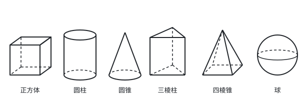
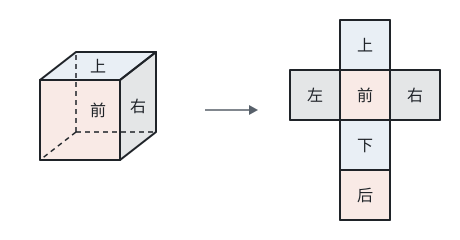
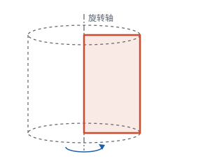
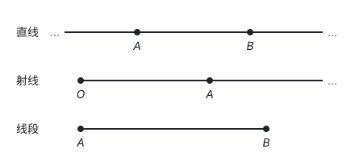
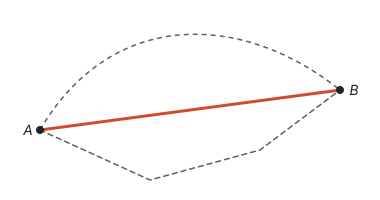
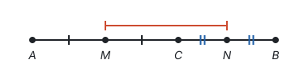
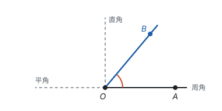
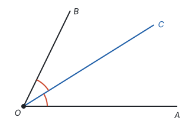
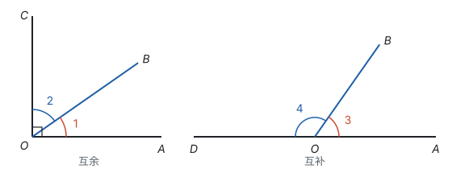

# 几何图形初步

> 对应人教版七年级上册第六章。

**几何研究物体的形状、大小和位置关系；最基本的图形是点、线、面、体，最基本的量是线段的长度和角的大小。**

## 从哪里来

一个易拉罐、一块砖、一个篮球，颜色、材料、重量各不相同。几何只关心它们的形状、大小和位置，把其余的都丢掉，剩下的就是**几何图形**：易拉罐是圆柱，砖是长方体，篮球是球。

几何图形分两类：

- **立体图形：** 各部分不都在同一个平面内，如正方体、长方体、圆柱、圆锥、棱柱、棱锥、球；
- **平面图形：** 各部分都在同一个平面内，如线段、角、三角形、长方形、圆。

区分这些立体图形，看它们由什么样的面围成：

| 立体图形 | 底面 | 侧面 | 特点 |
| --- | --- | --- | --- |
| 棱柱 | 两个，是形状、大小相同的多边形 | 平行四边形（直棱柱是长方形） | 上下一样粗 |
| 圆柱 | 两个，是大小相同的圆 | 一个曲面 | 上下一样粗 |
| 棱锥 | 一个多边形 | 三角形，交于一点（顶点） | 越往上越细，收成一点 |
| 圆锥 | 一个圆 | 一个曲面 | 越往上越细，收成一点 |
| 球 | 没有 | 没有 | 只由一个曲面围成，处处一样“圆” |

正方体、长方体是特殊的四棱柱。棱柱按底面的边数叫三棱柱、四棱柱……，棱锥也一样。

立体图形和平面图形可以互相转化：从不同方向看一个立体图形，看到的是平面图形（见第八部分“投影与视图”）；把立体图形的表面剪开、摊平，得到的也是平面图形，叫**展开图**。

## 展开图

正方体有 6 个面。沿着一些棱剪开，可以把它的表面摊成一个平面图形：

读展开图最常用的问题是：**哪两个面是相对的？** 从正方体本身想：

1. 相对的两个面（比如上面和下面）没有公共的棱；相邻的两个面有一条公共的棱。
2. 展开图里两个正方形有公共边，说明折回去以后它们共用一条棱，所以它们在正方体上是**相邻**的面。因此，相对的两个面在展开图里一定**不相邻**。
3. 展开图里排成一行的三个正方形，中间的一个两边各折起 $90^\circ$，两端的正方形一共转过 $180^\circ$，正好面对面。所以**一行中隔着一个的两个面是相对的面。**

上图中，“上”和“下”隔着“前”，“前”和“后”隔着“下”，“左”和“右”隔着“前”，都在同一行里隔一个。

正方体的展开图一共有 11 种，不用背，用上面的道理就能判断一个图形能不能折成正方体、哪两个面相对。圆柱的展开图是一个长方形和两个圆，圆锥的展开图是一个扇形和一个圆（见第九部分“与圆有关的计算”）。

## 点、线、面、体

把立体图形拆开来看：**体**由**面**围成，面和面相交成**线**，线和线相交成**点**。正方体有 6 个面、12 条棱、8 个顶点，棱就是面与面相交成的线，顶点就是棱与棱相交成的点。面有平的（正方体的面），也有曲的（圆柱的侧面）；线有直的，也有曲的。

反过来，也可以用运动的眼光看：**点动成线，线动成面，面动成体。** 笔尖（点）划过纸面留下一条线；雨刷（线）扫过挡风玻璃扫出一个面；一个长方形绕它的一边旋转一周，扫出一个圆柱：

同样地，直角三角形绕一条直角边旋转一周形成圆锥，半圆绕它的直径旋转一周形成球。

## 直线、射线、线段

拉紧的绳子、笔直的铁轨，给人“直”的印象。把这种“直”的线抽象出来，按有没有端点、能不能延伸，分成三种：

| 图形 | 端点 | 延伸 | 能否度量长度 | 表示方法 |
| --- | --- | --- | --- | --- |
| 直线 | 没有 | 向两方无限延伸 | 不能 | 直线 $AB$（或直线 $BA$）、直线 $l$ |
| 射线 | 1 个 | 向一方无限延伸 | 不能 | 射线 $OA$，端点 $O$ 必须写在前面 |
| 线段 | 2 个 | 不延伸 | 能 | 线段 $AB$（或线段 $BA$）、线段 $a$ |

三者的关系：把线段向一方无限延长，得到射线；向两方无限延长，得到直线。射线和线段都是直线的一部分。

关于直线和线段，有两条最基本的事实，全部几何推理都要从这样的事实出发（见第一部分“基本事实”）：

- **两点确定一条直线：** 经过两点有一条直线，并且只有一条。木工用两个钉子就能把木条固定住，植树时先定两端的树再种中间的树，用的都是这一条。
- **两点之间，线段最短：** 连接两点的所有线中，线段最短。连接两点的线段的**长度**叫作这两点间的**距离**。

## 线段的比较和中点

比较两条线段的长短有两种办法：**度量法**，用刻度尺量出长度再比较；**叠合法**，把一条线段移到另一条上，一端对齐，看另一端落在哪里。两条线段在同一条直线上首尾相接，可以得到它们的和；一条从另一条上截去，得到它们的差。

**把一条线段分成两条相等线段的点，叫作这条线段的中点。** 点 $M$ 是线段 $AB$ 的中点，就是

$$AM = MB = \frac{1}{2}AB, \quad AB = 2AM = 2MB.$$

线段的计算，依据只有两条：点在线段上时，整条线段等于各段的和（线段的和差）；中点把线段分成相等的两半（中点的定义）。长度不能直接算出时，就设未知数，按这两条依据列方程。

**例 1**　如图，点 $C$ 在线段 $AB$ 上，$AC : CB = 2 : 3$，点 $M$ 是 $AB$ 的中点，$MC$ 长 2 cm。求 $AB$ 的长。

**思路：** 已知的是一个比和一小段的长，都不能直接得出 $AB$。比 $2 : 3$ 提示“每一份”设为 $x$，这样 $AC$、$CB$、$AB$、$AM$ 都能用 $x$ 表示；再看 $MC$ 在图上是哪两条线段的差，就得到一个方程。

**解：** 设 $AC = 2x$ cm，则 $CB = 3x$ cm，$AB = 5x$ cm。因为 $M$ 是 $AB$ 的中点，所以 $AM = \frac{1}{2}AB = 2.5x$ cm。由图可知

$$MC = AM - AC = 2.5x - 2x = 0.5x.$$

所以 $0.5x = 2$，$x = 4$，$AB = 5x = 20$（cm）。

**检验：** $AC = 8$ cm，$CB = 12$ cm，比是 $2 : 3$；$AM = 10$ cm，$MC = 10 - 8 = 2$（cm），和已知一致。

**例 2**　如图，点 $C$ 在线段 $AB$ 上，点 $M$、$N$ 分别是 $AC$、$CB$ 的中点，$AB$ 长 10 cm，$AC$ 长 6 cm。求 $MN$ 的长。

**思路：** $MN$ 被点 $C$ 分成 $MC$ 和 $CN$ 两段，每一段都是一条已知线段的一半。

**解：** $MC = \frac{1}{2}AC = 3$ cm，$CB = AB - AC = 4$ cm，$CN = \frac{1}{2}CB = 2$ cm，所以 $MN = MC + CN = 5$ cm。

**想一想：** 答案 5 正好是 $AB$ 的一半，是巧合吗？把具体的数换成字母再算一遍：

$$MN = MC + CN = \frac{1}{2}AC + \frac{1}{2}CB = \frac{1}{2}(AC + CB) = \frac{1}{2}AB.$$

所以不论点 $C$ 在线段 $AB$ 上的什么位置，都有 $MN = \frac{1}{2}AB$，$AC$ 的长其实用不着。如果点 $C$ 在线段 $AB$ 的延长线上（$A$、$B$、$C$ 依次排列），$M$、$N$ 仍然分别是 $AC$、$CB$ 的中点：

这时 $N$ 比 $M$ 更靠近 $C$，$MN$ 是 $MC$ 和 $NC$ 的差：$MN = MC - NC = \frac{1}{2}AC - \frac{1}{2}BC = \frac{1}{2}(AC - BC) = \frac{1}{2}AB$，结论仍然成立。用数算只能得到一个答案，用字母算才看得出结论和 $C$ 的位置无关。

## 角

**有公共端点的两条射线组成的图形叫作角。** 公共端点叫角的**顶点**，两条射线叫角的**边**。

角也可以看成一条射线绕着它的端点旋转而成：射线从起始位置 $OA$ 转到终止位置 $OB$，就形成了 $\angle AOB$。转得越多，角越大。转到终止边和起始边成一条直线时，得到**平角**；转满一圈回到原处，得到**周角**。用旋转的眼光看，平角和周角也是角，这是只看“两条射线”看不出来的。

角的表示方法：$\angle AOB$（顶点的字母写在中间）；顶点处只有一个角时可以写成 $\angle O$；也可以在角内标上数字或希腊字母，写成 $\angle 1$、$\angle \alpha$。

**角的度量。** 把周角平均分成 360 份，每一份是 **1 度**，记作 $1^\circ$。所以周角是 $360^\circ$，平角是 $180^\circ$，平角的一半是直角 $90^\circ$。小于 $90^\circ$ 的角是锐角，大于 $90^\circ$ 而小于 $180^\circ$ 的角是钝角。

比 1 度更小的单位是分和秒，采用六十进制，和钟表上的时、分、秒一样：$1^\circ = 60'$，$1' = 60''$。换算时，小数部分乘 60 化成下一级单位，反过来除以 60：

$$36.25^\circ = 36^\circ + 0.25 \times 60' = 36^\circ 15', \qquad 48^\circ 36' = 48^\circ + \left(\frac{36}{60}\right)^\circ = 48.6^\circ.$$

**角的比较**也有度量法和叠合法：叠合时让两个角的顶点和一条边重合，另一条边放在这条边的同一侧；哪个角的另一条边落在另一个角的内部，哪个角就较小。

**从一个角的顶点出发，把这个角分成两个相等的角的射线，叫作这个角的平分线。** $OC$ 平分 $\angle AOB$，就是

$$\angle AOC = \angle COB = \frac{1}{2}\angle AOB.$$

角的平分线和线段的中点是一回事的两种样子：一个把角分成相等的两半，一个把线段分成相等的两半，计算方法也完全一样。

## 余角和补角

**如果两个角的和等于 $90^\circ$，就说这两个角互为余角；如果两个角的和等于 $180^\circ$，就说这两个角互为补角。**

这是两个角之间的**数量关系**，和它们的位置无关：两个角不挨着，只要度数加起来是 $90^\circ$，也互为余角。$\angle \alpha$ 的余角是 $90^\circ - \angle \alpha$，补角是 $180^\circ - \angle \alpha$，所以一个锐角的补角比它的余角大 $90^\circ$。

由定义可以推出一条常用的性质：**同角（或等角）的余角相等，同角（或等角）的补角相等。**

推导很短：如果 $\angle \beta$ 和 $\angle \gamma$ 都是 $\angle \alpha$ 的余角，即 $\angle \alpha + \angle \beta = 90^\circ$，$\angle \alpha + \angle \gamma = 90^\circ$，那么 $\angle \beta = 90^\circ - \angle \alpha$，$\angle \gamma = 90^\circ - \angle \alpha$，所以 $\angle \beta = \angle \gamma$。等角的情形也一样：$\angle \beta$ 是 $\angle \alpha$ 的余角，$\angle \gamma$ 是另一个角 $\angle \delta$ 的余角，而 $\angle \alpha = \angle \delta$，那么 $\angle \beta = 90^\circ - \angle \alpha = 90^\circ - \angle \delta = \angle \gamma$。补角把 $90^\circ$ 换成 $180^\circ$ 即可。

这条性质是后面证明角相等的第一个工具，“对顶角相等”就是由它推出来的（见第五部分“相交线与平行线”）。

**例 3**　一个角的补角比它的余角的 3 倍少 $10^\circ$，求这个角的度数。

**思路：** 余角、补角都由这个角决定，设这个角为 $x^\circ$，它的余角、补角就都能写出来，再把“比……的 3 倍少 $10^\circ$”翻译成等式。

**解：** 设这个角是 $x^\circ$，则它的余角是 $(90 - x)^\circ$，补角是 $(180 - x)^\circ$。根据题意，

$$180 - x = 3(90 - x) - 10.$$

去括号，得 $180 - x = 260 - 3x$；移项、合并，得 $2x = 80$，$x = 40$。这个角是 $40^\circ$。

**检验：** 补角 $140^\circ$，余角 $50^\circ$，$3 \times 50^\circ - 10^\circ = 140^\circ$，符合题意。

## 易错点

- **延长直线、延长射线。** 直线本来就向两方无限延伸，不能说“延长直线 $AB$”；射线只能说“反向延长射线 $OA$”。能延长的只有线段。
- **射线的名字写反。** 射线 $OA$ 和射线 $AO$ 端点不同、方向相反，是两条不同的射线。端点的字母必须写在前面。
- **把线段当作距离。** 距离是线段的**长度**，是一个数；“线段 $AB$ 是 $A$、$B$ 两点间的距离”的说法不对，应该说“线段 $AB$ 的长度是 $A$、$B$ 两点间的距离”。
- **没有图时只考虑一种位置。** 题目只说“点 $C$ 在直线 $AB$ 上”，$C$ 可能在线段 $AB$ 上，也可能在它的延长线上；“$\angle AOB = 70^\circ$，$\angle BOC = 30^\circ$”，射线 $OC$ 可能在 $\angle AOB$ 的内部，也可能在外部。要分情况画图（见第十一部分“分类讨论”）。
- **度分秒按十进制换算。** $0.5^\circ = 30'$，不是 $50'$；$1^\circ 30'$ 是 $1.5^\circ$，不是 $1.3^\circ$。
- **以为互余的角必须挨在一起。** 互余、互补只看度数的和。另外，只有锐角才有余角，钝角没有余角。
- **一个顶点处有好几个角时写 $\angle O$。** 这时 $\angle O$ 不知道指哪个角，必须用三个字母或数字表示。

## 联系

- **投影与视图：** 从不同方向看立体图形，得到三视图，是立体图形和平面图形互相转化的另一种方式。见第八部分“投影与视图”。
- **与圆有关的计算：** 圆柱、圆锥的侧面积，要先把侧面展开成长方形、扇形再算。见第九部分“与圆有关的计算”。
- **一元一次方程：** 线段、角的计算，只要一个量不知道，就设为 $x$，按线段的和差、角的和差列方程。见第四部分“一元一次方程”。
- **相交线与平行线：** “同角的补角相等”推出“对顶角相等”；直角引出垂直。见第五部分“相交线与平行线”。
- **三角形：** “两点之间，线段最短”推出三角形的三边关系。见第五部分“三角形”。
- **有理数：** 数轴上两点的距离是两数之差的绝对值，线段的计算和数轴上的计算是一回事。见第二部分“有理数”。
- **尺规作图：** 作一条线段等于已知线段、作角的平分线，都是这一页的概念用圆规和直尺实现出来。见第五部分“尺规作图”。
