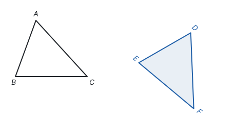
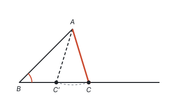
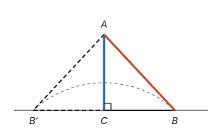
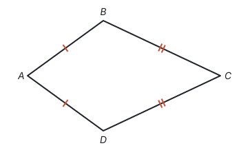
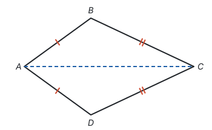
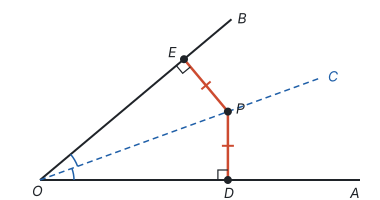

# 全等三角形 ★

> 对应人教版八年级上册第十四章。

**能够完全重合的两个三角形叫全等三角形。** 全等就是形状和大小都相同，只是位置不同：把一个三角形经过平移、翻折、旋转，就能和另一个完全重合。

## 从哪里来

用同一块模板描出来的两个三角形、一块玻璃摔碎前后的形状、复印出来的图形，都是“一模一样”的。数学里用“能不能完全重合”来说清“一模一样”：

重合时，互相重合的顶点叫**对应顶点**，互相重合的边叫**对应边**，互相重合的角叫**对应角**。上图中 $D$ 和 $A$、$E$ 和 $B$、$F$ 和 $C$ 重合，记作 **$\triangle ABC \cong \triangle DEF$**，读作“$\triangle ABC$ 全等于 $\triangle DEF$”。

**记号里的字母顺序就是对应关系：** 写在相同位置上的字母是对应顶点。写成 $\triangle ABC \cong \triangle DEF$，就说明 $A$ 对 $D$、$B$ 对 $E$、$C$ 对 $F$，所以 $AB$ 对 $DE$、$\angle B$ 对 $\angle E$。反过来，对应关系没弄清，就不要急着写全等式。

## 全等三角形的性质

既然能完全重合，重合的部分当然相等：

- **全等三角形的对应边相等；**
- **全等三角形的对应角相等。**

这是全等最常用的地方：要证两条线段相等或两个角相等，先找到分别包含它们的两个三角形，证明这两个三角形全等，再用这条性质。

怎样找对应边、对应角：

- 按全等式里字母的顺序找；
- 两个三角形共用的边（公共边）、共用的角（公共角）、对顶角，一定是对应的；
- 最长边对最长边，最大角对最大角。

## 判定：几个条件就够了

三角形有三条边、三个角，共 6 个量。证明全等时，不必把 6 个量都比一遍。问题变成：**最少知道几个量，三角形的形状和大小就被“定死”了？**

**只知道 1 个或 2 个量，定不死。** 比如只知道两条边分别是 3 和 4，它们的夹角可大可小，第三条边就可长可短，能画出很多个不同的三角形。

**知道 3 个量，大多数情况能定死：**

| 已知 | 名称 | 为什么能定死 |
| --- | --- | --- |
| 三边分别相等 | 边边边（SSS） | 先画一条边，另两条边的长度确定了第三个顶点到两端的距离，用圆规画两段弧，交点只有一个（在同一侧）。这就是三角形的**稳定性** |
| 两边和它们的夹角分别相等 | 边角边（SAS） | 夹角确定了两条边的方向，两边的长度确定了两个端点，第三条边也就确定了 |
| 两角和它们的夹边分别相等 | 角边角（ASA） | 夹边确定了两个顶点，两个角确定了从两端出发的两条射线的方向，两条射线只交于一点 |
| 两角和其中一角的对边分别相等 | 角角边（AAS） | 三角形内角和是 $180^\circ$，两个角相等，第三个角也相等，于是转化成 ASA |

SSS、SAS、ASA 在教材里作为**基本事实**，直接使用，不再证明（见第一部分“基本事实”）。AAS 是由 ASA 和三角形内角和推出来的定理。

**两个反例：3 个量也可能定不死。**

**两边和其中一边的对角（SSA）不能判定全等。** 下图中，$AB$ 的长度、$\angle B$ 的大小都固定，$AC$ 的长度也固定。以 $A$ 为圆心、$AC$ 为半径画弧，和 $\angle B$ 的另一边可能交于两个点 $C$ 和 $C'$，得到的 $\triangle ABC$ 和 $\triangle ABC'$ 满足同样的三个条件，却明显不全等：

**三个角分别相等（AAA）也不能判定全等。** 把一个三角形按比例放大，三个角都不变，边却变长了。这样的两个三角形形状相同、大小不同，叫相似三角形（见第八部分“相似”）。

**直角三角形的特例：斜边、直角边（HL）。** SSA 一般不行，但如果那个已知角是直角，就可以。下图中，$\angle C$ 是直角，直角边 $AC$ 和斜边 $AB$ 的长度固定。以 $A$ 为圆心、$AB$ 为半径画弧，和直线 $CB$ 交于 $B$ 和 $B'$ 两点，这两点关于直线 $AC$ 对称，所以 $\triangle ACB$ 和 $\triangle ACB'$ 沿 $AC$ 翻折能重合，仍然是全等的：

所以**斜边和一条直角边分别相等的两个直角三角形全等**，简称“斜边、直角边”或 HL。学了勾股定理后还能换个角度看：直角三角形的斜边和一条直角边确定了，另一条直角边也就确定了，于是变成 SSS（见第五部分“勾股定理”）。

## 怎样找全等：从结论往回想

**例 1**　如图，$AB = AD$，$CB = CD$。求证：$\angle B = \angle D$。

**思路：** 要证两个角相等，先找分别含有 $\angle B$ 和 $\angle D$ 的两个三角形。连接 $AC$，$\angle B$ 在 $\triangle ABC$ 里，$\angle D$ 在 $\triangle ADC$ 里。再看这两个三角形已经有哪些条件：$AB = AD$，$CB = CD$，还差一个。$AC$ 是两个三角形共用的边，于是三边都相等，用 SSS。

**证明：** 连接 $AC$。在 $\triangle ABC$ 和 $\triangle ADC$ 中，

- $AB = AD$（已知），
- $CB = CD$（已知），
- $AC = AC$（公共边），

所以 $\triangle ABC \cong \triangle ADC$（SSS），所以 $\angle B = \angle D$（全等三角形的对应角相等）。

**回顾：** 这道题的想法是“要证什么相等 → 找包含它们的两个三角形 → 数一数已有几个条件 → 缺的条件去图里找”。公共边、公共角、对顶角是图里最常见的“隐藏条件”。

## 角的平分线

**角平分线上的点到角两边的距离相等。** 这里的“距离”是点到直线的垂线段的长度。

**例 2**　如图，$OC$ 平分 $\angle AOB$，点 $P$ 在 $OC$ 上，$PD \perp OA$ 于点 $D$，$PE \perp OB$ 于点 $E$。求证：$PD = PE$。

**思路：** 要证 $PD = PE$，找含有这两条线段的三角形：$\triangle PDO$ 和 $\triangle PEO$。已有 $\angle POD = \angle POE$（角平分线）、$\angle PDO = \angle PEO = 90^\circ$（垂直），再加上公共边 $OP$，是“两角和其中一角的对边”，用 AAS。

**证明：** 因为 $PD \perp OA$，$PE \perp OB$，所以 $\angle PDO = \angle PEO = 90^\circ$。

在 $\triangle PDO$ 和 $\triangle PEO$ 中，

- $\angle PDO = \angle PEO$（已证），
- $\angle POD = \angle POE$（$OC$ 平分 $\angle AOB$），
- $OP = OP$（公共边），

所以 $\triangle PDO \cong \triangle PEO$（AAS），所以 $PD = PE$。

**反过来也成立：角的内部到角两边距离相等的点，在这个角的平分线上。** 已知 $PD = PE$、$PD \perp OA$、$PE \perp OB$，$\triangle PDO$ 和 $\triangle PEO$ 是有公共斜边 $OP$ 的两个直角三角形，用 HL 证出全等，就得到 $\angle POD = \angle POE$。这两个命题的条件和结论正好互换，互为逆命题，而且都是真命题（见第一部分“定义、命题与定理”）。

## 易错点

- **对应顶点的顺序写错。** $\triangle ABC \cong \triangle DEF$ 和 $\triangle ABC \cong \triangle EDF$ 意思不同。写全等式前先确认对应关系，字母要一一对齐。
- **用 SSA 判定全等。** “两边和其中一边的对角”不能判定。检查一下：已知的角是不是夹在两条已知边**中间**？是夹角才是 SAS。
- **用 AAA 判定全等。** 三个角相等只能说明形状相同，大小可能不同。
- **漏写公共边、公共角。** 它们在图上“看得见”，但在证明里也要作为一个条件写出来，并注明理由。
- **HL 用在非直角三角形上。** HL 只适用于直角三角形，证明时要先说明两个三角形都是直角三角形。
- **把角平分线上的点到边上任意一点的线段当作距离。** 距离必须是垂线段，所以题目里要有“垂直”，或者自己作垂线。

## 联系

- **图形的变化：** 全等就是一个图形经过平移、轴对称（翻折）、旋转后与另一个重合。这三种变换都不改变形状和大小。见第六部分“平移、轴对称与旋转”。
- **等腰三角形：** “等边对等角”“三线合一”都要借助全等来证明。见第五部分“轴对称与等腰三角形”。
- **尺规作图：** “作一个角等于已知角”“作角的平分线”的依据是 SSS。见第五部分“尺规作图”。
- **相似：** 全等是相似比为 1 的相似。相似的判定和全等的判定一一对应，只是把“边相等”换成“边成比例”。见第八部分“相似”。
- **勾股定理：** HL 可以看成“勾股定理 + SSS”。见第五部分“勾股定理”。
- **一次函数：** 一次函数的图象是直线，理由正是一级一级台阶三角形全等（SAS）。见第七部分“一次函数”。
