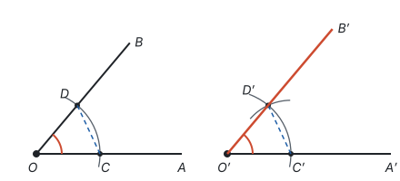
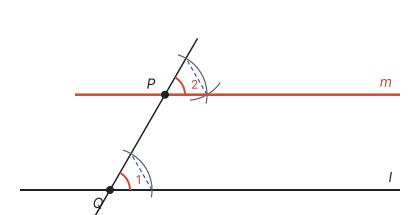
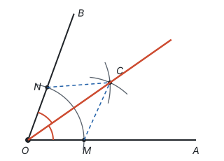
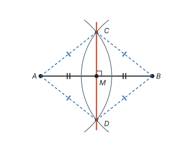
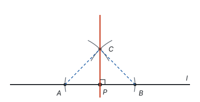
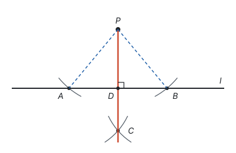
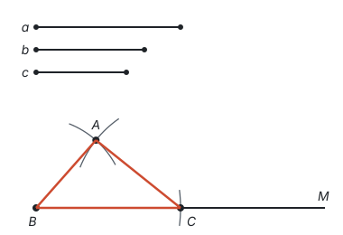
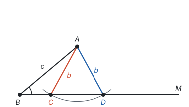
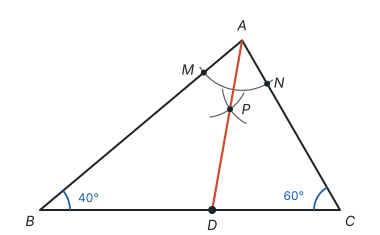
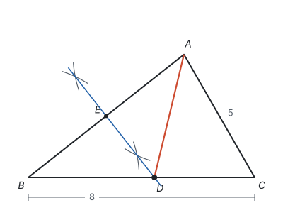

# 尺规作图 ★

> 对应人教版七年级上册第六章，八年级上册第十四章、第十五章等，散见各册。

**尺规作图是只用没有刻度的直尺和圆规作图；每一种作法为什么是对的，都由全等三角形的判定或线段垂直平分线的有关定理来保证。**

## 从哪里来

用刻度尺和量角器，想画多长就画多长，想画多大的角就画多大的角，但量出来的数总有误差。尺规作图把工具限制到最少，只允许做两件事：

| 工具 | 能做的事 | 背后的几何事实 |
| --- | --- | --- |
| 直尺（没有刻度） | 过两个已知点画直线、射线、线段 | 两点确定一条直线 |
| 圆规 | 以已知点为圆心、已知长度为半径画圆或圆弧 | 圆上每一点到圆心的距离都等于半径 |

圆规的作用可以说成两句话：**截取相等的线段**（把一条线段的长度“搬”到别处），**找到到两个已知点的距离分别等于给定长度的点**（两段弧的交点）。新的点只能从交点得来：直线和直线的交点、直线和弧的交点、弧和弧的交点。

工具这样少，作图就不能靠“量”，只能靠“推理”：每一步作出的东西为什么符合要求，都要能说出理由。所以每一种作法后面，都有一条定理撑腰：

| 基本作图 | 关键的一步 | 依据 |
| --- | --- | --- |
| 作一条线段等于已知线段 | 用圆规量出已知线段，在射线上截取 | 圆上的点到圆心距离相等 |
| 作一个角等于已知角 | 用圆规复制一个含这个角的三角形 | 全等三角形的判定 SSS |
| 作角的平分线 | 两段半径相等的弧交出一点 | 全等三角形的判定 SSS |
| 作线段的垂直平分线 | 找两个到线段两端距离相等的点 | 到线段两端距离相等的点在垂直平分线上；两点确定一条直线 |
| 过一点作已知直线的垂线 | 转化成作一条线段的垂直平分线 | 同上 |

作图题的写法一般包括：**已知、求作、作法**，需要时再写证明。作图语言要规范，比如“以点 $A$ 为圆心、$a$ 的长为半径画弧，交射线 $AM$ 于点 $B$”。作图时要保留作图痕迹（画过的弧），最后写出结论，如“$AB$ 就是所求作的线段”。

下面每种基本作图的图都是作图过程的动画，一步一步画出来；图中灰色的弧是作图痕迹，红色是作出的结果，蓝色虚线是说明依据时要连的线。

## 作一条线段等于已知线段

**已知：** 线段 $a$。**求作：** 线段 $AB$，使 $AB = a$。

**作法：**

1. 作射线 $AM$；
2. 用圆规量出线段 $a$ 的长，以点 $A$ 为圆心、$a$ 的长为半径画弧，交射线 $AM$ 于点 $B$。

线段 $AB$ 就是所求作的线段。

**依据：** 点 $B$ 在以 $A$ 为圆心、$a$ 为半径的圆上，所以 $AB = a$。

这一步虽然简单，却是后面所有作图的基本动作：圆规就是用来“搬运长度”的。

## 作一个角等于已知角

**已知：** $\angle AOB$。**求作：** $\angle A'O'B'$，使 $\angle A'O'B' = \angle AOB$。

圆规不能直接量角，只能量长度。办法是：**把角放进一个三角形里，复制三角形的三条边，角也就跟着复制过去了。**

**作法：**

1. 以点 $O$ 为圆心、任意长为半径画弧，分别交 $OA$、$OB$ 于点 $C$、$D$；
2. 画射线 $O'A'$，以点 $O'$ 为圆心、$OC$ 的长为半径画弧，交 $O'A'$ 于点 $C'$；
3. 以点 $C'$ 为圆心、$CD$ 的长为半径画弧，与第 2 步画的弧交于点 $D'$；
4. 过点 $D'$ 画射线 $O'B'$。

$\angle A'O'B'$ 就是所求作的角。

**依据：** 连接 $CD$、$C'D'$。由作法，$O'C' = OC$，$O'D' = OD$，$C'D' = CD$，所以 $\triangle C'O'D' \cong \triangle COD$（SSS），所以 $\angle A'O'B' = \angle AOB$（全等三角形的对应角相等）。

会作等角，就会作平行线。已知直线 $l$ 和直线外一点 $P$：过点 $P$ 任画一条直线，交 $l$ 于点 $Q$，它和 $l$ 所成的一个角记作 $\angle 1$；再以 $P$ 为顶点，用上面的方法作 $\angle 2 = \angle 1$，并让 $\angle 2$ 和 $\angle 1$ 成为同位角，$\angle 2$ 的另一边所在的直线记作 $m$。由“同位角相等，两直线平行”，$m \parallel l$，$m$ 就是过点 $P$ 的平行线（见第五部分“相交线与平行线”）。

## 作角的平分线

**已知：** $\angle AOB$。**求作：** $\angle AOB$ 的平分线。

**作法：**

1. 以点 $O$ 为圆心、适当长为半径画弧，分别交 $OA$、$OB$ 于点 $M$、$N$；
2. 分别以点 $M$、$N$ 为圆心、大于 $\frac{1}{2}MN$ 的长为半径画弧，两弧在 $\angle AOB$ 的内部交于点 $C$；
3. 画射线 $OC$。

射线 $OC$ 就是 $\angle AOB$ 的平分线。

**依据：** 连接 $MC$、$NC$。由作法，$OM = ON$，$MC = NC$，又 $OC = OC$（公共边），所以 $\triangle OMC \cong \triangle ONC$（SSS），所以 $\angle MOC = \angle NOC$，即 $OC$ 平分 $\angle AOB$。

作法里有两个细节，都能从依据里找到原因：

- **第 2 步的两个半径必须相等。** 证明中用到了 $MC = NC$；半径不相等，交点就不在平分线上。
- **半径要大于 $\frac{1}{2}MN$。** 两弧的交点 $C$ 和 $M$、$N$ 组成三角形，由三边关系，$MC + NC > MN$，即 $2MC > MN$。半径小于 $MN$ 的一半，两段弧碰不到一起；正好等于一半，两段弧只在 $MN$ 的中点碰一下，交点落在线段 $MN$ 上，组不成三角形，作图也不准（见第五部分“三角形”）。

## 作线段的垂直平分线

经过线段中点并且垂直于这条线段的直线，叫这条线段的**垂直平分线**。它有一条重要的性质和它的逆命题（见第五部分“轴对称与等腰三角形”）：线段垂直平分线上的点到线段两端的距离相等；反过来，**到线段两端距离相等的点，在这条线段的垂直平分线上。**

**已知：** 线段 $AB$。**求作：** 线段 $AB$ 的垂直平分线。

**作法：**

1. 分别以点 $A$、$B$ 为圆心、大于 $\frac{1}{2}AB$ 的长为半径画弧，两弧交于点 $C$、$D$；
2. 作直线 $CD$。

直线 $CD$ 就是线段 $AB$ 的垂直平分线，它与 $AB$ 的交点 $M$ 就是 $AB$ 的中点。所以这个作法也用来**作线段的中点**。

**依据：** 由作法，$CA = CB$，所以点 $C$ 在 $AB$ 的垂直平分线上；同理点 $D$ 也在。两点确定一条直线，所以直线 $CD$ 就是 $AB$ 的垂直平分线。

**只用全等也能说明：** 连接 $CA$、$CB$、$DA$、$DB$。由 $CA = CB$，$DA = DB$，$CD = CD$，得 $\triangle ACD \cong \triangle BCD$（SSS），所以 $\angle ACM = \angle BCM$。再由 $CA = CB$，$\angle ACM = \angle BCM$，$CM = CM$，得 $\triangle ACM \cong \triangle BCM$（SAS），所以 $AM = BM$，$\angle AMC = \angle BMC$。这两个角是邻补角又相等，所以都是 $90^\circ$。两次全等，就同时得到了“平分”和“垂直”。

## 过一点作已知直线的垂线

过一点作垂线，分点在直线上和点在直线外两种情况。两种情况的想法相同：**先在直线上截出一条线段，使这一点恰好在这条线段的垂直平分线上，再作这条垂直平分线。**

**点 $P$ 在直线 $l$ 上。**

1. 以点 $P$ 为圆心、任意长为半径画弧，交直线 $l$ 于点 $A$、$B$；
2. 分别以点 $A$、$B$ 为圆心、大于 $PA$ 的长为半径画弧，两弧交于点 $C$；
3. 作直线 $PC$。

**依据：** 由作法，$PA = PB$，$CA = CB$，所以 $P$、$C$ 都在线段 $AB$ 的垂直平分线上，直线 $PC$ 就是 $AB$ 的垂直平分线，所以 $PC \perp l$。换个角度看，这也是在作平角 $\angle APB$ 的平分线。

**点 $P$ 在直线 $l$ 外。**

1. 以点 $P$ 为圆心、适当长为半径画弧，交直线 $l$ 于点 $A$、$B$；
2. 分别以点 $A$、$B$ 为圆心、大于 $\frac{1}{2}AB$ 的长为半径画弧，两弧在 $l$ 的另一侧交于点 $C$；
3. 作直线 $PC$，交 $l$ 于点 $D$。

**依据：** 由作法，$PA = PB$，$CA = CB$，所以直线 $PC$ 是 $AB$ 的垂直平分线，$PC \perp l$。

第 1 步的“适当长”要大于点 $P$ 到 $l$ 的距离，否则弧碰不到直线，因为垂线段最短（见第五部分“相交线与平行线”）。第 2 步让两弧交在另一侧，是因为交点 $C$ 离 $P$ 远一些，画出的直线 $PC$ 更准。

## 作三角形

全等三角形的判定说的是“哪些条件能把三角形定死”，作三角形就是把“定死”真的画出来。

**已知三边作三角形（SSS）。** 已知线段 $a$、$b$、$c$，求作 $\triangle ABC$，使 $BC = a$，$CA = b$，$AB = c$。

1. 作射线 $BM$，在 $BM$ 上截取 $BC = a$；
2. 以点 $B$ 为圆心、$c$ 的长为半径画弧，以点 $C$ 为圆心、$b$ 的长为半径画弧，两弧交于点 $A$；
3. 连接 $AB$、$AC$。

其他条件的作法，用的都是上面的基本作图：

| 已知条件 | 作法 | 为什么作出的三角形唯一 |
| --- | --- | --- |
| 三边 | 截取一边，另两边的长作两段弧，交点是第三个顶点 | SSS |
| 两边及其夹角 | 作一个角等于已知角，在角的两边上分别截取两条已知边，连接两个端点 | SAS |
| 两角及其夹边 | 截取已知边，在它的两端分别作两个已知角，两条射线的交点是第三个顶点 | ASA |

两弧（或两射线）的交点在同一侧只有一个，所以作出的三角形是唯一的，这正是判定定理的意思。反过来也能看出另外两种情况：

- **三边不满足三边关系，作不出三角形。** 比如 $b + c < a$，两段弧根本碰不到。
- **已知两边和其中一边的对角，可能作出两个三角形。** 比如已知 $\angle B$ 和两边 $c$、$b$，要求 $AB = c$、$AC = b$：先在 $\angle B$ 的一边上截取 $BA = c$，再以 $A$ 为圆心、$b$ 的长为半径画弧，这段弧和 $\angle B$ 的另一边 $BM$ 可能有两个交点 $C$、$D$。$\triangle ABC$ 和 $\triangle ABD$ 都满足条件，却不全等，这就是 SSA 不能判定全等的原因（见第五部分“全等三角形”）。

## 读作图痕迹

作图题常常不让你作图，而是给出作图步骤或作图痕迹，问作出的东西有什么性质。第一步永远是**认出作的是哪种基本作图**，再用它的依据。

**例 1**　如图，在 $\triangle ABC$ 中，$\angle B = 40^\circ$，$\angle C = 60^\circ$。按以下步骤作图：① 以点 $A$ 为圆心、适当长为半径画弧，分别交 $AB$、$AC$ 于点 $M$、$N$；② 分别以点 $M$、$N$ 为圆心、大于 $\frac{1}{2}MN$ 的长为半径画弧，两弧交于点 $P$；③ 作射线 $AP$，交 $BC$ 于点 $D$。求 $\angle ADC$ 的度数。

**思路：** 从一个角的顶点出发画弧、再用两段等弧交出一点、最后画射线，这是作角的平分线，所以 $AD$ 平分 $\angle BAC$。$\angle BAC$ 由内角和可以求出；$\angle ADC$ 是 $\triangle ABD$ 的外角。

**解：** 在 $\triangle ABC$ 中，$\angle BAC = 180^\circ - 40^\circ - 60^\circ = 80^\circ$。

由作图可知，$AD$ 平分 $\angle BAC$，所以 $\angle BAD = \frac{1}{2}\angle BAC = 40^\circ$。

$\angle ADC$ 是 $\triangle ABD$ 的外角，所以 $\angle ADC = \angle B + \angle BAD = 40^\circ + 40^\circ = 80^\circ$。

**检验：** 在 $\triangle ADC$ 中，$\angle DAC = 40^\circ$，$\angle C = 60^\circ$，$\angle ADC = 180^\circ - 40^\circ - 60^\circ = 80^\circ$，一致。

**例 2**　如图，在 $\triangle ABC$ 中，$AC = 5$，$BC = 8$。分别以点 $A$、$B$ 为圆心、大于 $\frac{1}{2}AB$ 的长为半径画弧，两弧交于两点，过这两点作直线，交 $AB$ 于点 $E$，交 $BC$ 于点 $D$，连接 $AD$。求 $\triangle ADC$ 的周长。

**思路：** 以 $A$、$B$ 为圆心、相同半径画弧，过两个交点作直线，这是作 $AB$ 的垂直平分线。点 $D$ 在这条直线上，所以 $DA = DB$。周长 $AD + DC + AC$ 里，$AD$ 和 $DC$ 单独都不知道，但把 $AD$ 换成 $DB$，$DB + DC$ 正好是 $BC$。

**解：** 由作图可知，$DE$ 是线段 $AB$ 的垂直平分线，点 $D$ 在 $DE$ 上，所以 $DA = DB$。

所以 $\triangle ADC$ 的周长为

$$AD + DC + AC = DB + DC + AC = BC + AC = 8 + 5 = 13.$$

**回顾：** 垂直平分线的作用是把一条线段“换”成另一条相等的线段，让分散的线段首尾相接、合成一条已知的线段。例 1 中的角平分线也是一样，把一个角“分”成两个已知的角：$AD$ 平分 $\angle BAC$，把 $80^\circ$ 的 $\angle BAC$ 分成两个 $40^\circ$ 的角。

## 易错点

- **用刻度尺量长度、用量角器量角度。** 这不是尺规作图。直尺只用来连线，圆规只用来画弧和截取长度。
- **半径小于或等于一半。** 作角平分线、垂直平分线时，半径必须大于 $\frac{1}{2}MN$ 或 $\frac{1}{2}AB$。小于一半，两弧不相交；等于一半，两弧只在中点碰一下，作垂直平分线时只得到一个点，定不出直线。
- **作角平分线时，第二步的两个半径不相等。** 依据是 SSS，用到了两个半径相等；半径不同，交点就不在平分线上。
- **擦掉作图痕迹，或不写结论。** 作图痕迹就是“作法”的证据，要保留；最后要写“射线 $OC$ 就是所求作的角平分线”之类的结论。
- **作图语言不规范。** 应说“以点 $A$ 为圆心、$AB$ 的长为半径画弧”，不说“以 $AB$ 为半径”；应说“延长线段 $AB$”，不说“延长直线 $AB$”。
- **看到作图痕迹认不出作的是什么。** 从角的顶点出发画弧、再交出一点连射线，是角平分线；以线段两端为圆心交出两点连直线，是垂直平分线。先认图，再用性质。

## 联系

- **全等三角形：** 作一个角等于已知角、作角的平分线的依据都是 SSS；已知三边、两边夹角、两角夹边作三角形，分别对应 SSS、SAS、ASA。见第五部分“全等三角形”。
- **轴对称与等腰三角形：** 作垂直平分线、过一点作垂线的依据是“到线段两端距离相等的点在垂直平分线上”；作最短路径时要先作对称点，用的也是作垂线。见第五部分“轴对称与等腰三角形”。
- **三角形：** 两弧能不能相交，由三边关系决定。见第五部分“三角形”。
- **几何图形初步：** 作一条线段等于已知线段、作角的平分线、作线段的中点，是把那里的概念用圆规和直尺实现出来。见第五部分“几何图形初步”。
- **与圆有关的位置关系：** 作三角形两边的垂直平分线，交点是外接圆的圆心；作两个角的平分线，交点是内切圆的圆心。见第九部分“与圆有关的位置关系”。
