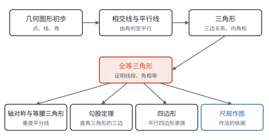

# 总览：从直线形到证明

**这一部分从点、线、角出发，经过三角形走到四边形；每一类图形都按“定义 → 性质 → 判定”来研究，每一条结论都从基本事实一步一步推出来，而不是量出来、看出来。**

## 一条主线

由线段组成的图形叫直线形。这一部分研究直线形的顺序，是从简单的部件一步步搭起来的：

1. **部件：** 点、线、角，以及线段的长度、角的大小（第五部分“几何图形初步”）；
2. **两条直线：** 相交时形成的角、平行时角的关系，第一次用推理代替测量（第五部分“相交线与平行线”）；
3. **三条线段：** 三角形的三边关系、内角和，任何多边形都能分成三角形（第五部分“三角形”）；
4. **两个三角形：** 什么时候完全一样，这是证明线段相等、角相等最主要的工具（第五部分“全等三角形”）；
5. **特殊的三角形和四边形：** 等腰三角形、直角三角形、平行四边形和它的特殊情况（第五部分“轴对称与等腰三角形”、第五部分“勾股定理”、第五部分“四边形”）；
6. **把推理画出来：** 只用直尺和圆规作图，每一步都要有定理作依据（第五部分“尺规作图”）。

图中间的全等三角形是整个部分的枢纽：前面三页为它准备了工具（平行线、内角和、三边关系），后面几页的性质几乎都要靠它来证明。

## 定义、性质、判定对照表

研究一类图形，总是问三个问题：它是什么（**定义**）？已知是它，能得到什么（**性质**）？满足什么条件，才能说是它（**判定**）？性质和判定往往条件、结论互换，互为逆命题（见第一部分“定义、命题与定理”）。

| 对象 | 定义 | 主要性质 | 主要判定 | 页面 |
| --- | --- | --- | --- | --- |
| 平行线 | 同一平面内不相交的两条直线 | 同位角相等，内错角相等，同旁内角互补 | 同位角相等（基本事实），内错角相等，同旁内角互补；平行于同一条直线 | 第五部分“相交线与平行线” |
| 垂线 | 两条直线相交成直角 | 过一点有且只有一条垂线；垂线段最短 | 相交所成的角中有一个是直角 | 第五部分“相交线与平行线” |
| 三角形 | 不在同一直线上的三条线段首尾顺次相接 | 两边之和大于第三边；内角和 $180^\circ$；外角等于不相邻的两个内角的和；稳定性 | 较短两边之和大于最长边的三条线段能组成三角形 | 第五部分“三角形” |
| 全等三角形 | 能够完全重合的两个三角形 | 对应边相等，对应角相等 | SSS，SAS，ASA，AAS；直角三角形还有 HL | 第五部分“全等三角形” |
| 角的平分线 | 把角分成两个相等的角的射线 | 平分线上的点到角两边的距离相等 | 角的内部到角两边距离相等的点在平分线上 | 第五部分“全等三角形” |
| 线段的垂直平分线 | 经过线段中点并且垂直于这条线段的直线 | 垂直平分线上的点到线段两端的距离相等 | 到线段两端距离相等的点在垂直平分线上 | 第五部分“轴对称与等腰三角形” |
| 等腰三角形 | 有两条边相等的三角形 | 等边对等角；底边上的高、中线、顶角平分线重合 | 有两个角相等（等角对等边） | 第五部分“轴对称与等腰三角形” |
| 直角三角形 | 有一个角是直角的三角形 | 两锐角互余；两直角边的平方和等于斜边的平方；斜边上的中线等于斜边的一半 | 有两个角互余；三边满足 $a^2 + b^2 = c^2$ | 第五部分“三角形”、第五部分“勾股定理”、第五部分“四边形” |
| 平行四边形 | 两组对边分别平行的四边形 | 对边相等，对角相等，对角线互相平分 | 两组对边分别相等；一组对边平行且相等；对角线互相平分 | 第五部分“四边形” |
| 矩形、菱形、正方形 | 有一个角是直角、有一组邻边相等、两者兼有的平行四边形 | 矩形对角线相等；菱形对角线互相垂直；正方形兼有两者 | 在平行四边形的基础上加角的条件或边的条件（或对角线的条件） | 第五部分“四边形” |

从上往下看，后面的对象都是在前面对象的基础上**加条件**得到的：三角形加“两边相等”是等腰三角形，加“一个直角”是直角三角形；四边形加“两组对边平行”是平行四边形，再加“一个直角”是矩形。加的条件越多，图形越特殊，性质也越多。

## 要证什么，去哪里找工具

几何证明的第一步是看清结论要证什么，再到学过的性质里找能推出它的那一条。常用的工具集中在下面几页：

| 要证明 | 常用的工具 | 出自 |
| --- | --- | --- |
| 两个角相等 | 对顶角相等；同角（等角）的余角、补角相等；平行线的性质；全等三角形的对应角；等边对等角 | 第五部分“几何图形初步”、第五部分“相交线与平行线”、第五部分“全等三角形”、第五部分“轴对称与等腰三角形” |
| 两条线段相等 | 全等三角形的对应边；等角对等边；角平分线的性质；垂直平分线的性质；平行四边形的性质 | 第五部分“全等三角形”、第五部分“轴对称与等腰三角形”、第五部分“四边形” |
| 两条直线平行 | 平行线的判定；平行四边形的对边；三角形的中位线 | 第五部分“相交线与平行线”、第五部分“四边形” |
| 两条直线垂直 | 相交成直角；等腰三角形三线合一；勾股定理的逆定理；菱形的对角线 | 第五部分“相交线与平行线”、第五部分“轴对称与等腰三角形”、第五部分“勾股定理”、第五部分“四边形” |
| 求角的度数 | 三角形内角和、外角；多边形内角和、外角和；平行线的性质 | 第五部分“三角形”、第五部分“相交线与平行线” |
| 求线段的长 | 勾股定理；线段的和差、中点；全等、等腰转移线段 | 第五部分“勾股定理”、第五部分“几何图形初步” |

## 建议的学习顺序

- **按目录顺序学。** 从“几何图形初步”到“四边形”，每一页都用到前面几页的结论，跳着学会发现理由接不上。
- **证明的写法和几何同步学。** 学“相交线与平行线”时第一次写推理，可以同时读第一部分“怎样证明”和第一部分“基本事实”，弄清推理从哪里开始、每一步为什么要写理由。
- **尺规作图穿插着学。** 学完“几何图形初步”就能作等长的线段；学完“全等三角形”就能作等角、作角平分线；学完“轴对称与等腰三角形”就能作垂直平分线和垂线。最后再集中看一遍第五部分“尺规作图”，把每种作法的依据串起来。
- **往后看，这一部分会反复出现。** 全等推广成相似（见第八部分“相似”），三种图形的变化让全等“动起来”（见第六部分“平移、轴对称与旋转”），圆的性质又要用到等腰三角形、全等和勾股定理（见第九部分“圆的有关性质”）。
