# 相交线与平行线

> 对应人教版七年级下册第七章。

**同一平面内的两条直线，要么相交，要么平行；研究它们，就是研究直线相交时形成的角：角的相等关系可以推出平行，平行又能推出角的相等关系。**

## 从哪里来

在同一平面内画两条直线，它们的公共点最多只有一个：如果有两个公共点，由“两点确定一条直线”，这两条直线就是同一条（见第一部分“基本事实”）。所以同一平面内两条不重合的直线只有两种情况：

| 位置关系 | 公共点 | 要研究的问题 |
| --- | --- | --- |
| 相交 | 1 个 | 交点处形成的 4 个角有什么关系；特别地，什么时候垂直 |
| 平行 | 没有 | 怎样判断两条直线平行；平行时能得到什么 |

平行线“永不相交”，但直线无限长，谁也没法把它画到尽头去检验。所以要判断平行，只能另找一个能看得见、量得出的东西，这就是第三条直线和它们相交成的**角**。整页的主线就是：**相交产生角，角决定平行。**

长方体里有些棱既不相交也不平行，比如上底面的一条棱和下底面上与它方向不同的一条棱，它们不在同一个平面内。这一页只研究同一平面内的直线。

## 相交：对顶角

直线 $AB$、$CD$ 相交于点 $O$，形成 4 个角：

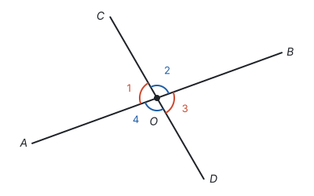

- $\angle 1$ 和 $\angle 2$ 有一条公共边 $OC$，另一边 $OA$、$OB$ 互为反向延长线，它们合起来是平角，叫**邻补角**；
- $\angle 1$ 和 $\angle 3$ 有公共顶点，两边分别互为反向延长线，叫**对顶角**。

**对顶角相等。** 推导只用到邻补角和“同角的补角相等”：

1. $\angle 1 + \angle 2 = 180^\circ$（邻补角，合起来是平角 $\angle AOB$）；
2. $\angle 3 + \angle 2 = 180^\circ$（邻补角，合起来是平角 $\angle COD$）；
3. 所以 $\angle 1 = \angle 3$（同角的补角相等，见第五部分“几何图形初步”）。

同理 $\angle 2 = \angle 4$。所以两条直线相交，4 个角里只要知道一个，其余 3 个就都确定了：比如 $\angle 1 = 80^\circ$，则 $\angle 3 = 80^\circ$，$\angle 2 = \angle 4 = 100^\circ$。

## 垂直

两条直线相交时，如果 4 个角中有一个是直角，由上面的推导，另外 3 个也都是直角。这时说这两条直线**互相垂直**，其中一条叫另一条的**垂线**，交点叫**垂足**。直线 $AB$ 与 $CD$ 垂直，记作 $AB \perp CD$。

关于垂线，有两条常用的结论：

- **在同一平面内，过一点有且只有一条直线与已知直线垂直。** 点在直线上、在直线外都一样。
- **连接直线外一点与直线上各点的所有线段中，垂线段最短。** 简单说成“垂线段最短”。

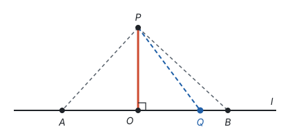

**直线外一点到这条直线的垂线段的长度，叫作点到直线的距离。** 上图中 $PO \perp l$，垂足为 $O$，线段 $PO$ 的长度就是点 $P$ 到直线 $l$ 的距离；直线上别的点，比如 $A$、$B$，和 $P$ 连成的线段都比 $PO$ 长。跳远比赛量成绩，量的就是落地点到起跳线的垂线段的长度。

为什么垂线段最短？学了勾股定理可以直接算出来：$PQ^2 = PO^2 + OQ^2$，只要 $Q$ 不和 $O$ 重合，$OQ^2 > 0$，就有 $PQ > PO$（见第五部分“勾股定理”）。

## 三线八角

平行线的问题要借助第三条直线来研究。直线 $a$、$b$ 被直线 $c$ 所截，两个交点处各形成 4 个角，一共 8 个：

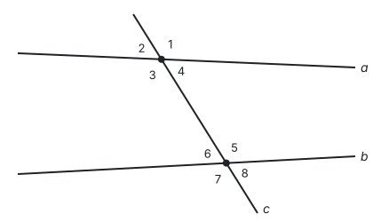

这 8 个角中，不在同一个交点处的两个角，按位置分成三类：

| 名称 | 位置 | 图中的例子 | 形状 |
| --- | --- | --- | --- |
| 同位角 | 在直线 $a$、$b$ 的同一方（都在上方或都在下方），在直线 $c$ 的同一侧 | $\angle 1$ 与 $\angle 5$，$\angle 2$ 与 $\angle 6$，$\angle 3$ 与 $\angle 7$，$\angle 4$ 与 $\angle 8$ | 像字母 F |
| 内错角 | 在直线 $a$、$b$ 之间，在直线 $c$ 的两侧 | $\angle 3$ 与 $\angle 5$，$\angle 4$ 与 $\angle 6$ | 像字母 Z |
| 同旁内角 | 在直线 $a$、$b$ 之间，在直线 $c$ 的同一侧 | $\angle 3$ 与 $\angle 6$，$\angle 4$ 与 $\angle 5$ | 像字母 U |

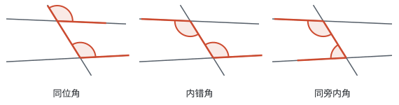

这三个名称只说明角的**位置**。上图中 $a$、$b$ 并不平行，同位角就不相等，所以不能一看到同位角、内错角就说它们相等。

三类角之间有联系。因为每个交点处的 4 个角由一个角就能确定（对顶角相等、邻补角互补），所以下面三个条件只要有一个成立，另外两个也就成立：

- 同位角相等，比如 $\angle 1 = \angle 5$；
- 内错角相等，比如 $\angle 3 = \angle 5$（因为 $\angle 3 = \angle 1$，对顶角）；
- 同旁内角互补，比如 $\angle 3 + \angle 6 = 180^\circ$（因为 $\angle 6 = 180^\circ - \angle 5$，邻补角）。

三个条件其实说的是同一件事：**直线 $a$、$b$ 与直线 $c$ 相交成的“倾斜程度”相同。** 下面的判定和性质，都围绕这件事展开。

## 平行线和平行公理

**在同一平面内，不相交的两条直线叫作平行线。** 直线 $a$ 与 $b$ 平行，记作 $a \parallel b$。

过直线 $b$ 外一点 $P$ 画直线，让它绕 $P$ 转动：大多数位置都会和 $b$ 相交，只是交点有时近、有时远；只有一个位置和 $b$ 不相交。

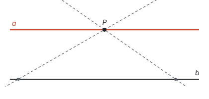

这就是**平行公理**，是一条基本事实：**经过直线外一点，有且只有一条直线与这条直线平行。**

由平行公理可以推出：**如果两条直线都与第三条直线平行，那么这两条直线也互相平行。** 理由：设 $a \parallel c$，$b \parallel c$。假如 $a$ 与 $b$ 相交于点 $P$，那么过点 $P$ 就有两条直线 $a$、$b$ 都与 $c$ 平行，和平行公理矛盾。所以 $a$ 与 $b$ 不相交，$a \parallel b$。这种“假设结论不成立，推出矛盾”的说理方法叫反证法（见第一部分“怎样证明”）。

## 平行线的判定：由角得平行

用直尺和三角尺画平行线：直尺固定不动，三角尺的一边紧靠直尺，沿直尺滑动，沿三角尺的另一边先后画出直线 $a$ 和 $b$。

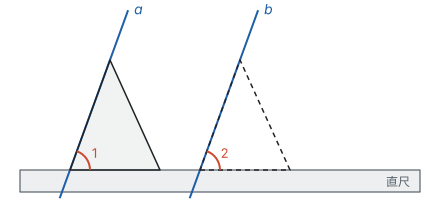

三角尺在滑动中形状不变，所以 $\angle 1 = \angle 2$，它们正是直线 $a$、$b$ 被直尺边所在直线截得的同位角。画出来的 $a$、$b$ 是平行的。把这个经验概括成基本事实：

**同位角相等，两直线平行。**

有了这一条，另外两个判定都能推出来。还是用“三线八角”一节的图，直线 $a$、$b$ 被直线 $c$ 所截，形成 $\angle 1$ 到 $\angle 8$：

- **内错角相等，两直线平行。** 如果 $\angle 3 = \angle 5$，因为 $\angle 3 = \angle 1$（对顶角相等），所以 $\angle 1 = \angle 5$，同位角相等，所以 $a \parallel b$。
- **同旁内角互补，两直线平行。** 如果 $\angle 3 + \angle 6 = 180^\circ$，因为 $\angle 5 + \angle 6 = 180^\circ$（邻补角），所以 $\angle 3 = \angle 5$（同角的补角相等），内错角相等，所以 $a \parallel b$。

还有两个常用的判定：平行于同一条直线的两条直线平行（上一节）；在同一平面内，垂直于同一条直线的两条直线平行（它们和这条直线的同位角都是 $90^\circ$）。

## 平行线的性质：由平行得角

反过来，如果已经知道 $a \parallel b$，同位角一定相等吗？

**两直线平行，同位角相等。** 用平行公理可以说明它：

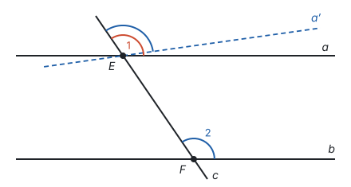

设 $a \parallel b$，直线 $c$ 与 $a$、$b$ 分别交于点 $E$、$F$，同位角是 $\angle 1$ 和 $\angle 2$。假如 $\angle 1 \ne \angle 2$，过点 $E$ 作直线 $a'$，使 $a'$ 与 $c$ 所成的同位角等于 $\angle 2$。由判定，$a' \parallel b$。这样过点 $E$ 就有 $a$、$a'$ 两条直线都与 $b$ 平行，和平行公理矛盾。所以 $\angle 1 = \angle 2$。

有了这一条，和判定的推导一样，借助对顶角、邻补角就得到另外两条：**两直线平行，内错角相等；两直线平行，同旁内角互补。**

判定和性质放在一起看：

| 角 | 判定：由角得平行 | 性质：由平行得角 |
| --- | --- | --- |
| 同位角 | 同位角相等 → 两直线平行 | 两直线平行 → 同位角相等 |
| 内错角 | 内错角相等 → 两直线平行 | 两直线平行 → 内错角相等 |
| 同旁内角 | 同旁内角互补 → 两直线平行 | 两直线平行 → 同旁内角互补 |

每一行的判定和性质，条件和结论正好互换，互为逆命题，而且都是真命题（见第一部分“定义、命题与定理”）。用哪一个，看已知的是什么：**已知角的关系、要证平行，用判定；已知平行、要得到角的关系，用性质。**

## 先判定，再用性质

**例 1**　如图，直线 $a$、$b$ 被直线 $c$、$d$ 所截，$\angle 1 = \angle 2$，$\angle 3 = 75^\circ$。求 $\angle 4$ 的度数。

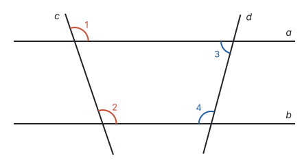

**思路：** 要求的 $\angle 4$ 和已知的 $\angle 3$ 都在直线 $d$ 上，它们是直线 $a$、$b$ 被 $d$ 所截的同旁内角。如果 $a \parallel b$，就有 $\angle 3 + \angle 4 = 180^\circ$。但 $a \parallel b$ 题目没有直接给，要先从 $\angle 1 = \angle 2$ 得到：它们是 $a$、$b$ 被 $c$ 所截的同位角。所以这道题分两步：先用**判定**得到平行，再用**性质**求角。

**解：** 因为 $\angle 1 = \angle 2$，所以 $a \parallel b$（同位角相等，两直线平行）。

所以 $\angle 3 + \angle 4 = 180^\circ$（两直线平行，同旁内角互补），$\angle 4 = 180^\circ - 75^\circ = 105^\circ$。

**回顾：** 直线 $c$ 的作用是“证明平行”，直线 $d$ 的作用是“传递角”。平行线就像一座桥：从一条截线上的角走到平行，再从平行走到另一条截线上的角。

## 拐角问题：添一条平行线

**例 2**　如图，$AB \parallel CD$，点 $E$ 在 $AB$、$CD$ 之间，$\angle B = 40^\circ$，$\angle D = 30^\circ$。求 $\angle BED$ 的度数。

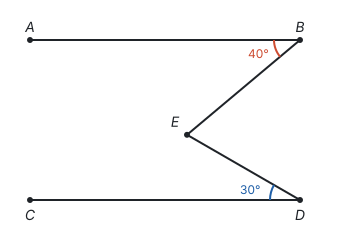

**思路：** 平行线的性质只能用在“两条平行线被第三条直线所截”的图形里。$\angle BED$ 的顶点 $E$ 不在 $AB$、$CD$ 上，图中找不到和它构成同位角、内错角的角。那就自己造一条：过点 $E$ 作 $EF \parallel AB$，$EF$ 把 $\angle BED$ 分成两部分，上面一部分和 $\angle B$ 是 $AB$、$EF$ 被 $BE$ 所截的内错角，下面一部分和 $\angle D$ 是 $EF$、$CD$ 被 $DE$ 所截的内错角。

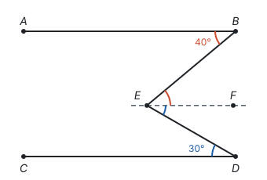

**解：** 过点 $E$ 作 $EF \parallel AB$。

因为 $AB \parallel CD$，所以 $EF \parallel CD$（平行于同一条直线的两条直线平行）。

所以 $\angle BEF = \angle B = 40^\circ$，$\angle FED = \angle D = 30^\circ$（两直线平行，内错角相等）。

所以 $\angle BED = \angle BEF + \angle FED = 70^\circ$。

**回顾：** 把 $40^\circ$、$30^\circ$ 换成任意度数，推理完全一样，所以这种图形里总有 $\angle BED = \angle B + \angle D$。添 $EF$ 这条辅助线，是为了造出“两条平行线被第三条直线所截”的图形，让平行线的性质用得上（见第十一部分“辅助线从哪里来”）。

**想一想：** 也可以延长 $BE$，交 $CD$ 于点 $G$：

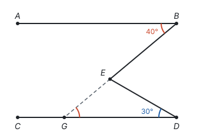

因为 $AB \parallel CD$，所以 $\angle EGD = \angle B = 40^\circ$（内错角相等）。$\angle BED$ 是 $\triangle EGD$ 的外角，等于和它不相邻的两个内角的和，所以 $\angle BED = \angle EGD + \angle D = 70^\circ$（见第五部分“三角形”）。

两种辅助线的想法相同，都是把 $\angle B$ “搬”到能和 $\angle D$ 放在一起的位置：第一种用平行线把角分开再搬，第二种用平行线把 $\angle B$ 搬到 $G$ 处，再用三角形的外角把两个角合起来。

## 易错点

- **只要角相等就说是对顶角。** 对顶角要求两条边分别互为反向延长线，也就是由两条相交直线形成。相等的角不一定是对顶角。
- **看到同位角、内错角就说相等。** 只有两条直线平行时它们才相等。题目没说平行，就要先证平行。
- **判定和性质的理由写反。** 由 $\angle 1 = \angle 2$ 得 $a \parallel b$，理由是“同位角相等，两直线平行”（判定）；写成“两直线平行，同位角相等”就是把结论当成了理由。
- **找错平行的是哪两条直线。** 由一对角相等推平行，要先看清这两个角是哪两条直线被哪条直线所截形成的。比如四边形 $ABCD$ 中，由 $\angle BAC = \angle DCA$，得到的是 $AB \parallel CD$（它们被 $AC$ 所截的内错角），不是 $AD \parallel BC$。
- **把垂线段当作距离。** 点到直线的距离是垂线段的**长度**，是一个数；垂线是直线，垂线段是线段。
- **过直线上一点作平行线。** 平行公理说的是“经过直线**外**一点”；过直线上的点作不出与它平行的直线。

## 联系

- **平移：** 三角尺沿直尺滑动就是平移，平移前后的对应线段平行（或在同一条直线上）且相等。见第六部分“平移、轴对称与旋转”。
- **平面直角坐标系：** 两条坐标轴互相垂直；平行于 $x$ 轴的直线上各点的纵坐标相同，平行于 $y$ 轴的直线上各点的横坐标相同。见第六部分“平面直角坐标系”。
- **一次函数：** $k$ 相同、$b$ 不同的两条直线平行，因为它们和 $x$ 轴所成的同位角相等。见第七部分“一次函数”。
- **三角形：** 三角形内角和是 $180^\circ$，证明时要过一个顶点作对边的平行线，用的正是平行线的性质。见第五部分“三角形”。
- **定义、命题与定理：** 判定和性质互为逆命题，是理解“逆命题”最好的例子。见第一部分“定义、命题与定理”。
- **四边形：** 平行四边形的定义就是两组对边分别平行，它的性质和判定都要反复用到这一页的内容。见第五部分“四边形”。
- **勾股定理：** “垂线段最短”可以用勾股定理说明。见第五部分“勾股定理”。
