# 勾股定理 ★

> 对应人教版八年级下册第二十章。

**直角三角形两条直角边的平方和，等于斜边的平方：如果直角边是 $a$、$b$，斜边是 $c$，那么 $a^2 + b^2 = c^2$。** 它把直角三角形的“形”（有一个直角）变成了三条边之间的“数”的关系：知道任意两条边，就能算出第三条。

## 从哪里来

两条直角边确定了，直角三角形就确定了（两边和它们的夹角，SAS），斜边的长度也就跟着确定了。所以斜边和两条直角边之间一定有一个确定的关系。这个关系是什么？

在方格纸上画一个直角三角形 $ABC$，$\angle C = 90^\circ$，两条直角边沿着格线：$CA = 4$，$CB = 3$。在三条边上各向外画一个正方形，看看它们的面积：

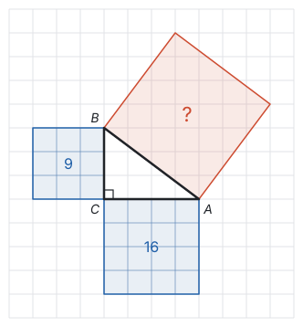

两条直角边上的正方形沿着格线，直接数格子：面积是 9 和 16。

斜边上的正方形斜放着，格线把它切得零零碎碎，没法直接数。换个办法：顺着格线，在它外面套一个大正方形，让它的四个顶点正好落在大正方形的四条边上：

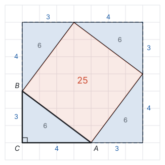

- 大正方形的每条边都被分成 3 和 4 两段，边长是 $3 + 4 = 7$，面积是 $7 \times 7 = 49$。
- 大正方形比斜放的正方形多出四个角上的直角三角形。每一个的两条直角边都是 3 和 4（左下角那个就是 $\triangle ABC$ 本身），面积都是 $\frac{1}{2} \times 3 \times 4 = 6$。
- 所以斜边上的正方形面积是 $49 - 4 \times 6 = 25$。用尺子量一量，斜边 $AB$ 正好长 5，$5 \times 5 = 25$，对得上。

把三个面积放在一起：$9 + 16 = 25$。再换一个直角三角形试试，比如两条直角边都是 1 的等腰直角三角形：两个小正方形面积都是 1，斜边上的正方形用同样的办法算，面积是 2，也有 $1 + 1 = 2$。

于是猜想：**两条直角边上的正方形面积之和，等于斜边上的正方形面积。** 边长的平方就是正方形的面积，所以这个猜想写成式子就是 $a^2 + b^2 = c^2$。

几个例子只能让人相信，不能说明所有直角三角形都这样，要证明。“平方”就是“面积”，所以证明也从面积入手。

我国古代把直角三角形较短的直角边叫“勾”，较长的直角边叫“股”，斜边叫“弦”，所以这个结论叫**勾股定理**。西方叫它毕达哥拉斯定理。

## 拼图证明：同一块面积算两遍

取四个全等的直角三角形，直角边为 $a$、$b$，斜边为 $c$。把它们放进一个边长为 $a + b$ 的大正方形里，有两种摆法：

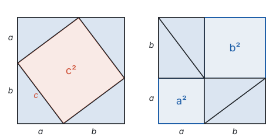

**左边的摆法：** 四个三角形放在四个角上，中间空出一个四边形。它的四条边都是 $c$；它的每个角和两个三角形的锐角拼成一个平角，而直角三角形两个锐角的和是 $90^\circ$，所以每个角是 $180^\circ - 90^\circ = 90^\circ$。所以中间是边长为 $c$ 的正方形，空出的面积是 $c^2$。

**右边的摆法：** 把其中三个三角形平移，两两拼成两个长方形，大正方形里空出边长为 $a$ 和 $b$ 的两个正方形，空出的面积是 $a^2 + b^2$。

大正方形一样大，四个三角形也一样，那么空出的面积一定相等：

$$c^2 = a^2 + b^2.$$

也可以用代数把左边的摆法算一遍：大正方形的面积等于四个三角形加中间的正方形，

$$(a + b)^2 = 4 \times \frac{1}{2}ab + c^2.$$

左边展开是 $a^2 + 2ab + b^2$，右边是 $2ab + c^2$，两边都减去 $2ab$，得 $a^2 + b^2 = c^2$。

**另一种拼法：赵爽弦图。** 三国时期的赵爽把四个三角形放进边长为 $c$ 的正方形里，斜边朝外，中间空出一个小正方形，边长是 $b - a$：

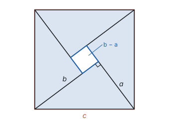

大正方形的面积 = 四个三角形 + 小正方形：

$$c^2 = 4 \times \frac{1}{2}ab + (b - a)^2 = 2ab + b^2 - 2ab + a^2 = a^2 + b^2.$$

**想一想：** 两种拼法都在做同一件事，把一块面积用两种方法表示，再令它们相等。这和用拼图验证 $(a + b)^2 = a^2 + 2ab + b^2$ 是同一种想法（见第三部分“整式的乘法”）。几何上的“面积相等”，写出来就是代数上的“式子相等”。

## 用勾股定理计算：先找直角三角形

用勾股定理之前，先问两件事：直角在哪里？哪条边是斜边？斜边是直角所对的边，也是最长的边。

- 已知两条直角边：$c = \sqrt{a^2 + b^2}$；
- 已知斜边和一条直角边：$b = \sqrt{c^2 - a^2}$。

边长是正数，所以开平方只取算术平方根。算出的结果常常是无理数，要用二次根式表示或化简（见第三部分“二次根式”）。

**例 1**　一架长 25 m 的消防云梯 $AB$ 斜靠在竖直的墙上，云梯底端 $B$ 到墙角 $O$ 的距离是 7 m。如果云梯顶端 $A$ 沿墙下滑 4 m，那么底端也向外滑动 4 m 吗？


**思路：** 墙和地面垂直，云梯、墙、地面围成直角三角形，云梯是斜边。滑动前后云梯长度不变，前后各有一个直角三角形。先算出顶端原来的高度，再算滑动后底端的位置。

**解：** 在 $\text{Rt}\triangle AOB$ 中，$AB = 25$，$OB = 7$，所以

$$OA = \sqrt{AB^2 - OB^2} = \sqrt{625 - 49} = \sqrt{576} = 24.$$

顶端下滑 4 m 后，$OA' = 24 - 4 = 20$。在 $\text{Rt}\triangle A'OB'$ 中，$A'B' = 25$，所以

$$OB' = \sqrt{A'B'^2 - OA'^2} = \sqrt{625 - 400} = \sqrt{225} = 15.$$

$BB' = OB' - OB = 15 - 7 = 8$。答：底端向外滑动 8 m，不是 4 m。

**回顾：** 云梯长度不变，但顶端和底端滑动的距离一般不相等，因为 $OA$、$OB$ 之间是“平方和不变”，不是“和不变”。

**例 2**　（改编自《九章算术》）一个水池的截面宽 10 尺，一根芦苇 $AD$ 长在池子中央，露出水面 1 尺。把芦苇顶端拉向岸边，它的顶端正好碰到岸边的水面 $B$。问水深和芦苇长各多少？

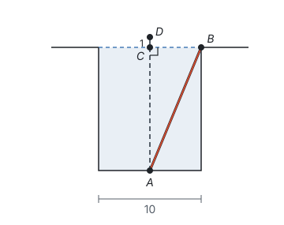

**思路：** 两个未知量都不知道，但它们有关系：芦苇比水深长 1 尺。设水深为 $x$ 尺，芦苇长就是 $(x + 1)$ 尺。拉过去以后，水深 $AC$、半个池宽 $CB$、芦苇 $AB$ 组成直角三角形，勾股定理就给出了一个方程。

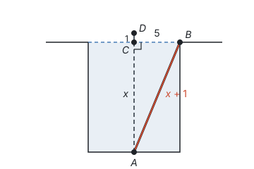

**解：** 设水深 $AC = x$ 尺，则 $AB = AD = (x + 1)$ 尺，$CB = 10 \div 2 = 5$ 尺。在 $\text{Rt}\triangle ACB$ 中，

$$x^2 + 5^2 = (x + 1)^2.$$

展开得 $x^2 + 25 = x^2 + 2x + 1$，所以 $2x = 24$，$x = 12$。答：水深 12 尺，芦苇长 13 尺。

**回顾：** 这里勾股定理不是用来“代入算数”，而是用来**列方程**：设出未知的边，用已知的关系把其他边表示出来，再让三边满足 $a^2 + b^2 = c^2$。方程里的 $x^2$ 两边消掉，最后是一元一次方程。

**例 3**　如图，长方形纸片 $ABCD$ 中，$AB = 8$，$AD = 10$。沿 $AE$ 折叠，使点 $D$ 落在 $BC$ 边上的点 $F$ 处。求 $DE$ 的长。

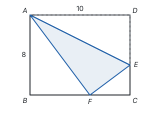

**思路：** 折叠就是轴对称，折过去的部分和原来全等：$AF = AD = 10$，$EF = DE$。先在 $\text{Rt}\triangle ABF$ 里算出 $BF$，得到 $FC$；再设 $DE = x$，$\triangle EFC$ 的三边都能用已知数和 $x$ 表示，列方程。

**解：** 由折叠，$AF = AD = 10$，$EF = DE$。在 $\text{Rt}\triangle ABF$ 中，$BF = \sqrt{10^2 - 8^2} = 6$，所以 $FC = BC - BF = 10 - 6 = 4$。

设 $DE = EF = x$，则 $EC = CD - DE = 8 - x$。在 $\text{Rt}\triangle EFC$ 中，

$$x^2 = (8 - x)^2 + 4^2.$$

展开得 $x^2 = 64 - 16x + x^2 + 16$，所以 $16x = 80$，$x = 5$。答：$DE = 5$。

**回顾：** 折叠问题的两步：先用轴对称找出相等的线段和角（见第五部分“轴对称与等腰三角形”），再在一个直角三角形里用勾股定理列方程。

## 逆定理：由三边判定直角

勾股定理说：直角三角形 ⇒ $a^2 + b^2 = c^2$。反过来问：如果三角形的三边满足 $a^2 + b^2 = c^2$，它一定是直角三角形吗？

古埃及人用打了结的绳子，围成三边为 3、4、5 的三角形，来得到直角。这个做法是对的，但要证明。

**勾股定理的逆定理：如果三角形的三边长 $a$、$b$、$c$ 满足 $a^2 + b^2 = c^2$，那么这个三角形是直角三角形，边 $c$ 所对的角是直角。**

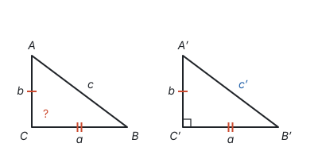

**思路：** 手里只有三边的数量关系，没有角。想办法造一个真正有直角的三角形来比较：如果它和 $\triangle ABC$ 全等，直角就“搬”过来了。

**证明：** 设 $\triangle ABC$ 中 $BC = a$，$AC = b$，$AB = c$。作 $\text{Rt}\triangle A'B'C'$，使 $\angle C' = 90^\circ$，$B'C' = a$，$A'C' = b$，设斜边 $A'B' = c'$。由勾股定理，$c'^2 = a^2 + b^2 = c^2$，$c'$ 和 $c$ 都是正数，所以 $c' = c$。于是 $\triangle ABC$ 和 $\triangle A'B'C'$ 的三边分别相等，$\triangle ABC \cong \triangle A'B'C'$（SSS），$\angle C = \angle C' = 90^\circ$。

**想一想：** 证明逆定理时用到了勾股定理本身，这算不算循环论证？不算。循环论证是用要证的结论去证它自己；这里要证的是“$\triangle ABC$ 是直角三角形”，证明中始终没有假设 $\triangle ABC$ 有直角。勾股定理已经用拼图证明过了，它说的是“直角三角形的三边满足 $a^2 + b^2 = c^2$”，证明里只把它用在自己作出来的 $\text{Rt}\triangle A'B'C'$ 上，而 $\triangle A'B'C'$ 的直角是作图时保证的。$\triangle ABC$ 的直角，是最后靠全等从 $\triangle A'B'C'$ 那里得到的。一般地，证明“若 B 则 A”时，可以使用已经证明的“若 A 则 B”，只要把它用在确实满足 A 的对象上。

勾股定理和它的逆定理，条件和结论正好互换，互为逆命题，而且都是真命题（见第一部分“定义、命题与定理”）。用途也不同：**勾股定理由直角得到边的关系，用来算边；逆定理由边的关系得到直角，用来判定直角。**

能够成为直角三角形三边长的三个正整数叫**勾股数**，比如 3、4、5，5、12、13，8、15、17，7、24、25。一组勾股数同时乘以同一个正整数，还是勾股数，比如 6、8、10。

**例 4**　如图，四边形 $ABCD$ 中，$\angle B = 90^\circ$，$AB = 3$，$BC = 4$，$CD = 12$，$AD = 13$。求四边形 $ABCD$ 的面积。

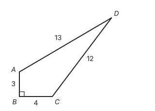

**思路：** 四边形的面积没有公式，连接对角线 $AC$ 分成两个三角形。$\triangle ABC$ 有直角，面积好求，顺便算出 $AC$。$\triangle ACD$ 的三边都知道了，看看它是不是直角三角形。

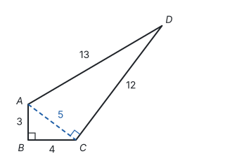

**解：** 连接 $AC$。在 $\text{Rt}\triangle ABC$ 中，$AC = \sqrt{3^2 + 4^2} = 5$。

在 $\triangle ACD$ 中，$AC^2 + CD^2 = 25 + 144 = 169 = AD^2$，所以 $\triangle ACD$ 是直角三角形，$\angle ACD = 90^\circ$（勾股定理的逆定理）。

$$S_{\text{四边形}ABCD} = S_{\triangle ABC} + S_{\triangle ACD} = \frac{1}{2} \times 3 \times 4 + \frac{1}{2} \times 5 \times 12 = 6 + 30 = 36.$$

**回顾：** 一道题里定理和逆定理各用了一次：先由直角算边（定理），再由边判定直角（逆定理）。

## 在数轴上画出无理数

边长为 1 的正方形，对角线长 $\sqrt{1^2 + 1^2} = \sqrt{2}$。这说明 $\sqrt{2}$ 这样的无理数不是只能写成符号，它是一条实实在在能画出来的线段。用勾股定理，可以在数轴上准确地找到很多无理数的位置。

**例 5**　在数轴上画出表示 $\sqrt{13}$ 的点。

**思路：** 要找一个斜边为 $\sqrt{13}$ 的直角三角形，也就是把 13 写成两个整数的平方和：$13 = 9 + 4 = 3^2 + 2^2$。

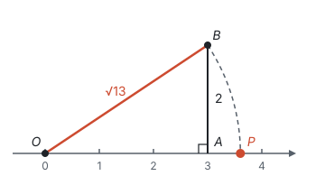

**作法：** 在数轴上找到表示 3 的点 $A$，过 $A$ 作数轴的垂线，在垂线上截取 $AB = 2$，连接 $OB$。以 $O$ 为圆心、$OB$ 为半径画弧，交数轴正半轴于点 $P$。因为 $OP = OB = \sqrt{3^2 + 2^2} = \sqrt{13}$，所以点 $P$ 表示 $\sqrt{13}$。

这正说明了实数和数轴上的点一一对应：无理数也在数轴上占着确定的位置（见第二部分“实数”）。

## 易错点

- **没分清斜边就套公式。** “直角三角形两边长为 3 和 4，求第三边”，要分两种情况：4 是直角边时，第三边是 $\sqrt{3^2 + 4^2} = 5$；4 是斜边时，第三边是 $\sqrt{4^2 - 3^2} = \sqrt{7}$。
- **在不是直角三角形的图形里用勾股定理。** 勾股定理只对直角三角形成立。图里没有直角，就先作高，造出直角三角形。
- **用逆定理时没找最长边。** 判断三边 5、13、12 能否构成直角三角形，要看两条较短边的平方和是否等于最长边的平方：$5^2 + 12^2 = 169 = 13^2$，是直角三角形，直角是 13 所对的角。直接算 $5^2 + 13^2$ 和 $12^2$ 比，就会得出错误的结论。
- **定理和逆定理用混。** 已知是直角三角形、求边，用勾股定理；已知三边、判断是不是直角三角形，用逆定理。证明时理由要写对。
- **忘了开平方，或者开方后写成负数。** $a^2 + b^2 = c^2$ 求出的是 $c^2$，还要开方；边长取正的算术平方根。

## 联系

- **整式的乘法：** 拼图证明和用面积验证乘法公式是同一种方法，$(a + b)^2$ 的展开正是证明中的一步。见第三部分“整式的乘法”。
- **实数与二次根式：** 勾股定理算出的边长常常是无理数，要化简二次根式；用它可以在数轴上画出无理数。见第二部分“实数”和第三部分“二次根式”。
- **全等三角形：** HL 判定可以看成“勾股定理 + SSS”：斜边和一条直角边确定了，另一条直角边也就确定了；逆定理的证明也是靠 SSS。见第五部分“全等三角形”。
- **轴对称与等腰三角形：** 含 $30^\circ$ 角的直角三角形三边之比是 $1 : \sqrt{3} : 2$，等腰直角三角形三边之比是 $1 : 1 : \sqrt{2}$，都由勾股定理算出；折叠问题要先用轴对称找等量。见第五部分“轴对称与等腰三角形”。
- **平面直角坐标系：** 两点 $A(x_1, y_1)$、$B(x_2, y_2)$ 之间的距离，就是以横坐标之差、纵坐标之差为直角边的直角三角形的斜边，所以 $AB^2 = (x_1 - x_2)^2 + (y_1 - y_2)^2$。见第六部分“平面直角坐标系”和第十一部分“以数解形”。
- **锐角三角函数：** 在直角三角形中，$\sin A = \frac{a}{c}$，$\cos A = \frac{b}{c}$，由勾股定理得 $\sin^2 A + \cos^2 A = 1$。见第八部分“锐角三角函数”。
- **圆：** 垂径定理把半径、弦的一半、弦心距放进一个直角三角形，三个量知二求一，靠的就是勾股定理。见第九部分“圆的有关性质”。
