# 四边形 ★

> 对应人教版八年级下册第二十一章。

**平行四边形是两组对边分别平行的四边形；矩形、菱形、正方形是在它的基础上再加一个角或边的条件得到的。** 研究它们的办法都一样：用对角线把四边形分成三角形，借助全等把四边形的问题变回三角形的问题。

## 从哪里来：一个家族

一般的四边形“不稳定”，四条边定了，形状还能随意变，能说的性质很少。要研究，先挑最规整的一类：**两组对边分别平行的四边形叫平行四边形。** 再在平行四边形上加条件，就得到更特殊的图形：

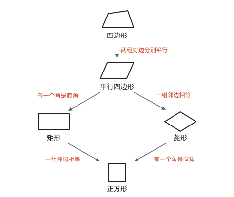

- **矩形：** 有一个角是直角的平行四边形；
- **菱形：** 有一组邻边相等的平行四边形；
- **正方形：** 有一组邻边相等并且有一个角是直角的平行四边形，它既是矩形，又是菱形。

这张图决定了学习的方法：**下一层自动拥有上一层的全部性质。** 矩形、菱形、正方形都是平行四边形，平行四边形的性质它们都有，只需要再研究“多出来的那个条件”带来了什么。判定则反过来：要说明一个图形在某一层，只要说明它在上一层，再加上这一层的条件。

## 平行四边形的性质

平行四边形 $ABCD$ 中，$AB \parallel CD$，$AD \parallel BC$。要找边和角之间的关系，连接对角线 $AC$，把它分成两个三角形：

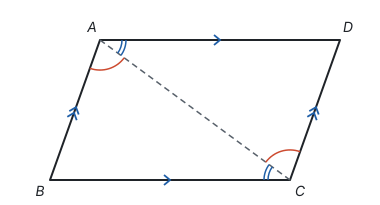

**推导：** 因为 $AB \parallel CD$，所以 $\angle BAC = \angle DCA$；因为 $AD \parallel BC$，所以 $\angle BCA = \angle DAC$（两直线平行，内错角相等）。又 $AC = CA$，所以 $\triangle ABC \cong \triangle CDA$（ASA）。于是 $AB = CD$，$BC = DA$，$\angle B = \angle D$。再把 $A$、$C$ 处的两个角分别加起来，$\angle BAD = \angle BCD$。

**平行四边形的性质：**

- **边：** 两组对边分别平行且相等；
- **角：** 两组对角分别相等，邻角互补（两直线平行，同旁内角互补）；
- **对角线：** 互相平分。

对角线为什么互相平分？设 $AC$、$BD$ 交于点 $O$。在 $\triangle AOB$ 和 $\triangle COD$ 中，$\angle OAB = \angle OCD$，$\angle OBA = \angle ODC$（内错角），$AB = CD$（刚证过），所以 $\triangle AOB \cong \triangle COD$（ASA），$OA = OC$，$OB = OD$。

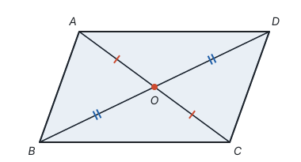

**从变换看：** 把平行四边形绕 $O$ 旋转 $180^\circ$，因为 $OA = OC$、$OB = OD$，$A$ 转到 $C$，$B$ 转到 $D$，整个图形和自己重合。平行四边形是**中心对称图形**，对称中心是对角线的交点。对边相等、对角相等，都是“转过去能重合”的结果（见第六部分“平移、轴对称与旋转”）。

**平行线间的距离处处相等。** 设直线 $a \parallel b$，在 $a$ 上任取两点 $P$、$Q$，分别向 $b$ 作垂线段 $PM$、$QN$。

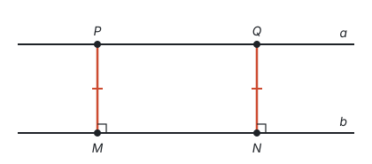

$PM$、$QN$ 都垂直于 $b$，所以 $PM \parallel QN$；又 $PQ \parallel MN$，所以四边形 $PMNQ$ 是平行四边形，$PM = QN$（对边相等）。$P$、$Q$ 是任取的，所以两条平行线之间的距离是一个确定的值；同底的三角形，第三个顶点在与底平行的直线上移动，面积不变。

## 平行四边形的判定

判定是性质反过来问：满足什么条件的四边形，一定是平行四边形？性质里的每一条，反过来基本都成立：

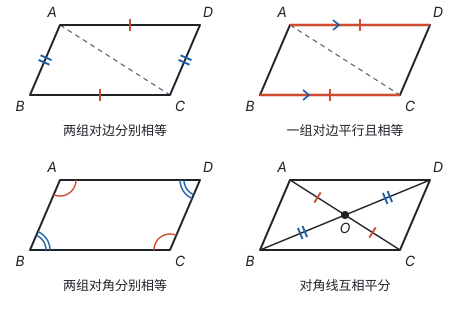

| 判定 | 为什么成立 |
| --- | --- |
| 两组对边分别平行 | 定义 |
| 两组对边分别相等 | 连接 $AC$，$\triangle ABC \cong \triangle CDA$（SSS），得到两对内错角相等，所以两组对边分别平行 |
| 一组对边平行且相等 | 设 $AD \parallel BC$，$AD = BC$。连接 $AC$，$\angle DAC = \angle BCA$，$\triangle ACD \cong \triangle CAB$（SAS），$\angle ACD = \angle CAB$，所以 $AB \parallel CD$ |
| 两组对角分别相等 | 四边形内角和是 $360^\circ$，$\angle A + \angle B = 180^\circ$，同旁内角互补，所以 $AD \parallel BC$；同理 $AB \parallel CD$ |
| 对角线互相平分 | $OA = OC$，$OB = OD$，加上对顶角，$\triangle AOB \cong \triangle COD$（SAS），得 $\angle OAB = \angle OCD$，$AB \parallel CD$；同理 $AD \parallel BC$ |

每一条判定最后都回到了定义“两组对边分别平行”，用的工具都是全等和平行线的判定（见第五部分“相交线与平行线”）。

**例 1**　如图，在平行四边形 $ABCD$ 中，点 $E$、$F$ 在对角线 $AC$ 上，$AE = CF$。求证：四边形 $BEDF$ 是平行四边形。

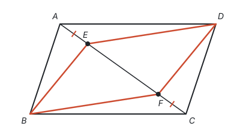

**思路一：证两组对边分别相等。** $BE$ 在 $\triangle ABE$ 里，$DF$ 在 $\triangle CDF$ 里，这两个三角形有 $AB = CD$、$AE = CF$，夹角 $\angle BAE = \angle DCF$（$AB \parallel CD$，内错角），用 SAS 得 $BE = DF$。同样由 $\triangle ADE \cong \triangle CBF$ 得 $DE = BF$。两组对边分别相等，所以是平行四边形。

**思路二：看对角线。** 四边形 $BEDF$ 的对角线是 $BD$ 和 $EF$。$EF$ 在 $AC$ 上，而平行四边形 $ABCD$ 的对角线互相平分，交点 $O$ 同时是 $AC$、$BD$ 的中点。只要说明 $O$ 也是 $EF$ 的中点就行了。

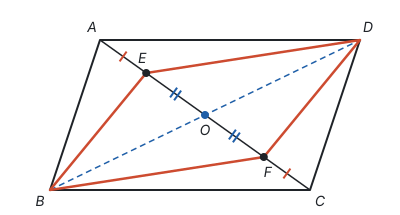

**证明（用思路二）：** 连接 $BD$，交 $AC$ 于点 $O$。因为四边形 $ABCD$ 是平行四边形，所以 $OA = OC$，$OB = OD$。又 $AE = CF$，所以 $OA - AE = OC - CF$，即 $OE = OF$。四边形 $BEDF$ 的对角线 $BD$、$EF$ 互相平分，所以它是平行四边形。

**想一想：** 思路一要证两次全等，思路二一次全等都不用。区别在于思路二注意到了这个图形的中心对称：$E$ 和 $F$ 关于 $O$ 对称，$B$ 和 $D$ 也关于 $O$ 对称。图中如果有平行四边形的对角线，先想“对角线互相平分”这个判定。

## 三角形的中位线

连接三角形两边中点的线段叫**三角形的中位线**。

**三角形的中位线平行于第三边，并且等于第三边的一半。** 如图，$D$、$E$ 分别是 $AB$、$AC$ 的中点，则

$$DE \parallel BC, \quad DE = \frac{1}{2}BC.$$

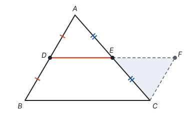

**从哪里想到：** 要证 $DE$ 是 $BC$ 的一半，可以把 $DE$ 加倍，再证加倍后的线段等于 $BC$。怎样加倍？$E$ 是 $AC$ 的中点，把 $\triangle ADE$ 绕 $E$ 旋转 $180^\circ$，$A$ 落到 $C$，$D$ 落到 $DE$ 延长线上的点 $F$，$DF$ 正好是 $DE$ 的两倍。

**证明：** 延长 $DE$ 到点 $F$，使 $EF = DE$，连接 $CF$。

- 在 $\triangle ADE$ 和 $\triangle CFE$ 中，$AE = CE$，$\angle AED = \angle CEF$（对顶角），$DE = FE$，所以 $\triangle ADE \cong \triangle CFE$（SAS）。
- 于是 $CF = AD = BD$，$\angle A = \angle ECF$，所以 $CF \parallel AB$，即 $CF \parallel BD$。
- 四边形 $DBCF$ 中，$BD$ 和 $CF$ 平行且相等，所以它是平行四边形，$DF \parallel BC$，$DF = BC$。
- $DE$ 是 $DF$ 的一半，所以 $DE \parallel BC$，$DE$ 等于 $BC$ 的一半。

**例 2**　求证：顺次连接任意四边形各边中点，得到的四边形是平行四边形。

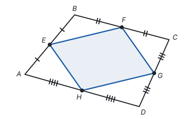

**思路：** 四边形各边的中点，两两在同一个三角形的两边上吗？连接对角线 $AC$，$E$、$F$ 是 $\triangle ABC$ 两边的中点，$H$、$G$ 是 $\triangle ADC$ 两边的中点，$EF$、$HG$ 都是中位线，都和 $AC$ 有关系。

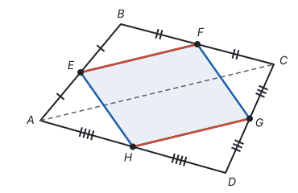

**证明：** 连接 $AC$。在 $\triangle ABC$ 中，$E$、$F$ 分别是 $AB$、$BC$ 的中点，所以 $EF \parallel AC$，$EF$ 等于 $AC$ 的一半。同理，在 $\triangle ADC$ 中，$HG \parallel AC$，$HG$ 等于 $AC$ 的一半。所以 $EF \parallel HG$，$EF = HG$，四边形 $EFGH$ 是平行四边形（一组对边平行且相等）。

**回顾：** 中位线把“中点”这个条件转化成了“平行”和“一半”。题目里有两个以上的中点时，常常可以连线构造中位线（见第十一部分“辅助线从哪里来”）。中点四边形的形状只和原四边形的**对角线**有关，这一点在本页最后还会用到。

## 矩形：加一个直角

**有一个角是直角的平行四边形叫矩形。** 平行四边形邻角互补，一个角是直角，四个角就都是直角。

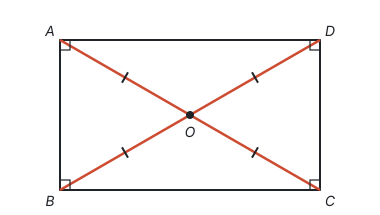

**矩形多出来的性质：**

- **四个角都是直角；**
- **对角线相等。** 在 $\triangle ABC$ 和 $\triangle DCB$ 中，$AB = DC$，$\angle ABC = \angle DCB = 90^\circ$，$BC = CB$，所以 $\triangle ABC \cong \triangle DCB$（SAS），$AC = DB$。

对角线相等又互相平分，所以 $OA = OB = OC = OD$，四个顶点到 $O$ 的距离相等。矩形还是轴对称图形，有两条对称轴，是两组对边中点的连线所在的直线。

**矩形的判定：**

- 有一个角是直角的平行四边形（定义）；
- 有三个角是直角的四边形（第四个角是 $360^\circ - 270^\circ = 90^\circ$，两组对角分别相等，先是平行四边形）；
- **对角线相等的平行四边形。** 已知平行四边形 $ABCD$ 中 $AC = DB$，由 $\triangle ABC \cong \triangle DCB$（SSS）得 $\angle ABC = \angle DCB$，这两个角又互补，所以都是 $90^\circ$。

**例 3**　如图，矩形 $ABCD$ 的对角线交于点 $O$，$\angle AOB = 60^\circ$，$AB = 4$。求 $AC$ 和 $BC$ 的长。

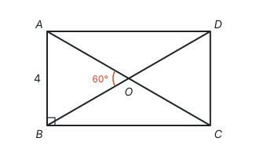

**思路：** 矩形的对角线相等且互相平分，所以 $OA = OB$，$\triangle AOB$ 是等腰三角形；又有一个角是 $60^\circ$，它是等边三角形。

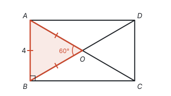

**解：** 因为四边形 $ABCD$ 是矩形，所以 $AC = BD$，并且 $AC$、$BD$ 互相平分，从而 $OA = OB$。又 $\angle AOB = 60^\circ$，所以 $\triangle AOB$ 是等边三角形，$OA = AB = 4$，$AC = 2OA = 8$。

在 $\text{Rt}\triangle ABC$ 中，

$$BC = \sqrt{AC^2 - AB^2} = \sqrt{64 - 16} = \sqrt{48} = 4\sqrt{3}.$$

**回顾：** 矩形的对角线把矩形分成四个等腰三角形。对角线的夹角是 $60^\circ$ 时出现等边三角形，这时 $\angle ACB = 30^\circ$，$AB$ 是 $AC$ 的一半，正是含 $30^\circ$ 角的直角三角形（见第五部分“轴对称与等腰三角形”）。

## 直角三角形斜边上的中线

把矩形沿一条对角线切开，得到两个直角三角形。矩形的“对角线相等且互相平分”，放到直角三角形里就是：

**直角三角形斜边上的中线等于斜边的一半。**

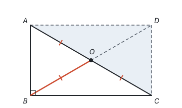

**证明：** 在 $\text{Rt}\triangle ABC$ 中，$\angle ABC = 90^\circ$，$O$ 是斜边 $AC$ 的中点。延长 $BO$ 到点 $D$，使 $OD = OB$，连接 $AD$、$CD$。四边形 $ABCD$ 的对角线互相平分，是平行四边形；又 $\angle ABC = 90^\circ$，所以它是矩形，$BD = AC$。于是 $BO$ 是 $BD$ 的一半，也就是 $AC$ 的一半。

所以 $OA = OB = OC$：**斜边的中点到三个顶点的距离相等。**

**反过来也成立：** 如果三角形一边上的中线等于这边的一半，那么这个三角形是直角三角形。设 $O$ 是 $AC$ 的中点，$OB = OA = OC$。由等边对等角，$\angle A = \angle ABO$，$\angle C = \angle CBO$，所以 $\angle ABC = \angle A + \angle C$。三个角的和是 $180^\circ$，所以 $2\angle ABC = 180^\circ$，$\angle ABC = 90^\circ$。

学了圆以后会看到，这两句话就是“直径所对的圆周角是直角”和它的逆命题：$A$、$B$、$C$ 都在以 $O$ 为圆心的圆上（见第九部分“圆的有关性质”）。

## 菱形：加一组相等的邻边

**有一组邻边相等的平行四边形叫菱形。** 平行四边形对边相等，一组邻边相等，四条边就都相等。

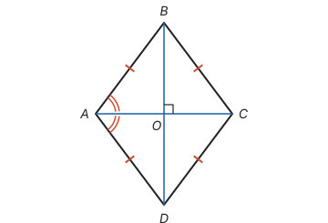

**菱形多出来的性质：**

- **四条边都相等；**
- **对角线互相垂直，并且每条对角线平分一组对角。** 在 $\triangle ABD$ 中，$AB = AD$，是等腰三角形；$O$ 是 $BD$ 的中点（平行四边形的对角线互相平分），所以 $AO$ 是底边上的中线。由三线合一，$AO \perp BD$，$AO$ 平分 $\angle BAD$。

菱形是轴对称图形，两条对角线所在的直线都是它的对称轴。

**菱形的面积：** 对角线把菱形分成 $\triangle ABD$ 和 $\triangle CBD$，它们以 $BD$ 为底，高分别是 $AO$ 和 $CO$，所以

$$S_{\text{菱形}} = \frac{1}{2}BD \cdot AO + \frac{1}{2}BD \cdot CO = \frac{1}{2}BD \cdot AC.$$

**菱形的面积等于两条对角线乘积的一半。** 推导只用到“对角线互相垂直”，所以任何对角线互相垂直的四边形，面积都可以这样算。菱形也是平行四边形，面积还可以用“底 × 高”算。

**菱形的判定：**

- 有一组邻边相等的平行四边形（定义）；
- 四条边都相等的四边形（两组对边分别相等，先是平行四边形）；
- **对角线互相垂直的平行四边形。** 对角线 $AC \perp BD$，又 $OB = OD$，所以 $AC$ 垂直平分 $BD$，$AB = AD$（垂直平分线上的点到线段两端的距离相等）。

**例 4**　菱形 $ABCD$ 的对角线 $AC = 6$，$BD = 8$。求菱形的边长、面积，以及边 $AB$ 上的高。

**思路：** 菱形的对角线互相垂直平分，把菱形分成四个全等的直角三角形，直角边是两条对角线的一半。面积有两种算法：对角线乘积的一半，或者底乘高，两种算出来一定相等，由此求高。

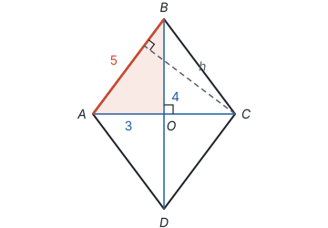

**解：** 设对角线交于点 $O$，则 $OA = 3$，$OB = 4$，$AC \perp BD$。在 $\text{Rt}\triangle AOB$ 中，$AB = \sqrt{3^2 + 4^2} = 5$，边长是 5。面积 $S = \frac{1}{2} \times 6 \times 8 = 24$。设 $AB$ 边上的高为 $h$，则 $AB \cdot h = 24$，即 $5h = 24$，$h = 4.8$。

**回顾：** 求高时没有去找高的垂足，而是把同一块面积算两遍，列出方程。这和勾股定理的拼图证明是同一种想法：那里把边长为 $a + b$ 的大正方形的面积用两种方法表示，再令它们相等，得到 $a^2 + b^2 = c^2$（见第五部分“勾股定理”）。

## 正方形：两个条件都加上

**有一组邻边相等并且有一个角是直角的平行四边形叫正方形。** 它既是矩形又是菱形，两者的性质它全有。

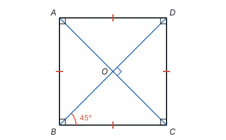

- **边：** 四条边都相等；
- **角：** 四个角都是直角；
- **对角线：** 相等，互相垂直平分，每条对角线平分一组对角（所以对角线和边的夹角是 $45^\circ$，对角线把正方形分成四个全等的等腰直角三角形）。

正方形有四条对称轴。判定时，先证它是矩形，再加一组邻边相等；或者先证它是菱形，再加一个直角。

## 对照：从对角线看四种图形

把前面的性质放在一起：

| 图形 | 边 | 角 | 对角线 | 对称性 |
| --- | --- | --- | --- | --- |
| 平行四边形 | 对边平行且相等 | 对角相等，邻角互补 | 互相平分 | 中心对称 |
| 矩形 | 对边平行且相等 | 四个角都是直角 | 互相平分且相等 | 中心对称，两条对称轴 |
| 菱形 | 对边平行，四边相等 | 对角相等，邻角互补 | 互相垂直平分，平分对角 | 中心对称，两条对称轴 |
| 正方形 | 对边平行，四边相等 | 四个角都是直角 | 互相垂直平分且相等，平分对角 | 中心对称，四条对称轴 |

看“对角线”一列：**两条互相平分的线段，作为对角线总能围成平行四边形；再让它们相等，就是矩形；让它们垂直，就是菱形；既相等又垂直，就是正方形。**


**想一想：** 回到例 2 的中点四边形。例 2 证明了：顺次连接任意四边形 $ABCD$ 各边中点 $E$、$F$、$G$、$H$，得到的四边形 $EFGH$ 是平行四边形。

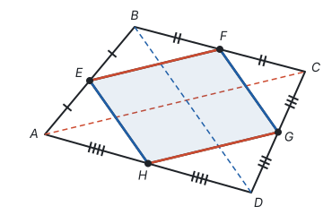

$EF$、$HG$ 平行于 $AC$ 且等于 $AC$ 的一半，$EH$、$FG$ 平行于 $BD$ 且等于 $BD$ 的一半。所以中点四边形的边由原四边形的对角线决定：

- 原四边形的对角线相等（$AC = BD$）时，中点四边形的邻边相等，是菱形；
- 原四边形的对角线互相垂直时，中点四边形的邻边互相垂直，是矩形；
- 两者都满足时，是正方形。

比如矩形的中点四边形是菱形，菱形的中点四边形是矩形。

## 梯形

**一组对边平行、另一组对边不平行的四边形叫梯形。** 平行的两边叫梯形的底，不平行的两边叫梯形的腰。两腰相等的梯形叫**等腰梯形**；一腰和底垂直的梯形叫**直角梯形**。

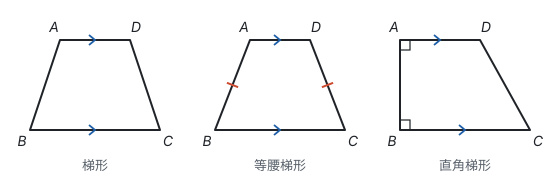

梯形只有一组对边平行，所以它不是平行四边形。等腰梯形的两腰相等，于是“一组对边平行，另一组对边相等”的四边形不一定是平行四边形，见下面的易错点。

## 易错点

- **“一组对边平行，另一组对边相等”当作判定。** 等腰梯形就满足这个条件，却不是平行四边形。可用的是“一组对边**平行且相等**”，说的必须是同一组对边。
- **跳过平行四边形直接判定矩形、菱形。** “对角线相等的四边形”不一定是矩形，“对角线互相垂直的四边形”不一定是菱形，前面都要加上“平行四边形”。不写“平行四边形”这一步、直接从四边形出发的常用判定，是“有三个角是直角”（矩形）和“四条边都相等”（菱形），它们的证明里已经先得到了平行四边形。
- **把中位线和中线混淆。** 三角形的中线连接顶点和对边中点；中位线连接两边中点。
- **斜边上的中线用在非直角三角形里。** “中线等于这边的一半”只对直角三角形的斜边成立，用之前先确认直角和斜边。
- **菱形面积用错。** “对角线乘积的一半”要求对角线互相垂直；一般平行四边形不能这样算。
- **正方形的包含关系弄反。** 正方形是特殊的矩形，也是特殊的菱形；但矩形、菱形不一定是正方形。

## 联系

- **全等三角形、相交线与平行线：** 本页的每条性质和判定，都是连一条对角线后，用平行线的性质得到相等的角，再用全等推出来的。见第五部分“全等三角形”和第五部分“相交线与平行线”。
- **三角形：** 四边形的内角和 $360^\circ$ 来自把它分成两个三角形。见第五部分“三角形”。
- **轴对称与等腰三角形：** 菱形的对角线互相垂直来自等腰三角形的三线合一；矩形的对角线把它分成等腰三角形。见第五部分“轴对称与等腰三角形”。
- **平移、轴对称与旋转：** 平行四边形是中心对称图形；中位线的证明就是把三角形绕中点旋转 $180^\circ$。见第六部分“平移、轴对称与旋转”。
- **平面直角坐标系：** 平行四边形的对角线互相平分，两条对角线的中点重合，所以在坐标系里，平行四边形 $ABCD$ 的顶点满足 $x_A + x_C = x_B + x_D$，$y_A + y_C = y_B + y_D$，已知三个顶点就能求第四个。见第六部分“平面直角坐标系”和第十一部分“以数解形”。
- **相似：** 中位线平行于第三边且等于它的一半，是“平行线分线段成比例”在比为 $1 : 2$ 时的特例。见第八部分“相似”。
- **圆：** 直角三角形斜边上的中线等于斜边的一半，说的就是直角顶点在以斜边为直径的圆上。见第九部分“圆的有关性质”。
- **辅助线：** 倍长中线、连接对角线、构造中位线，都是本页证明里用过的辅助线。见第十一部分“辅助线从哪里来”。
