# 轴对称与等腰三角形 ★

> 对应人教版八年级上册第十五章。

**沿一条直线对折后能够完全重合，就是轴对称；等腰三角形是有对称轴的三角形，它的性质都可以从这条对称轴读出来。** 线段的垂直平分线是轴对称的“骨架”：对称轴就是对应点连线的垂直平分线。

## 从哪里来：对折能重合

蝴蝶的两翼、剪纸的“囍”字、脸的左右两半，都有同一个特点：沿某条直线对折，两边完全重合。数学里把这件事说成两种情况：

- 一个图形沿一条直线折叠，直线两旁的部分能够完全重合，这个图形叫**轴对称图形**，这条直线叫它的**对称轴**。
- 两个图形沿一条直线折叠后能够完全重合，叫这两个图形**关于这条直线对称**。重合的点叫**对称点**（对应点）。

前者说的是一个图形自己和自己，后者说的是两个图形之间；把两个成轴对称的图形合起来看，就是一个轴对称图形。

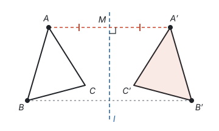

对折的时候，点 $A$ 落到 $A'$。折痕 $l$ 和线段 $AA'$ 有什么关系？设它们交于点 $M$。对折时 $M$ 在折痕上不动，$MA$ 正好盖住 $MA'$，所以 $MA = MA'$；$MA$ 和 $l$ 所成的角，折过去正好盖住 $MA'$ 和 $l$ 所成的角，这两个角相等，合起来是平角，所以都是 $90^\circ$。于是：

**对称轴是任何一对对应点所连线段的垂直平分线。** 另外，成轴对称的两个图形全等（能重合），对应线段相等，对应角相等（见第五部分“全等三角形”）。

要研究轴对称，先要把“垂直平分线”弄清楚。

## 线段的垂直平分线

经过线段中点并且垂直于这条线段的直线，叫这条线段的**垂直平分线**（也叫中垂线）。

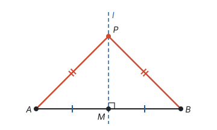

**性质：线段垂直平分线上的点到线段两端的距离相等。**

如图，直线 $l$ 垂直平分 $AB$，垂足为 $M$，点 $P$ 在 $l$ 上。在 $\triangle PMA$ 和 $\triangle PMB$ 中，$AM = BM$，$\angle PMA = \angle PMB = 90^\circ$，$PM = PM$，所以 $\triangle PMA \cong \triangle PMB$（SAS），$PA = PB$。从轴对称看更直接：沿 $l$ 对折，$A$ 落到 $B$，$P$ 不动，$PA$ 就盖住了 $PB$。

**反过来：到线段两端距离相等的点，在这条线段的垂直平分线上。**

已知 $PA = PB$。取 $AB$ 的中点 $M$，连接 $PM$。在 $\triangle PMA$ 和 $\triangle PMB$ 中，$PA = PB$，$AM = BM$，$PM = PM$，所以 $\triangle PMA \cong \triangle PMB$（SSS），$\angle PMA = \angle PMB$。这两个角合起来是平角，所以都是 $90^\circ$，$PM$ 就是 $AB$ 的垂直平分线，$P$ 在它上面。（$P$ 在 $AB$ 上时，$P$ 就是中点 $M$。）

两句话合起来说明：**线段的垂直平分线，就是到线段两端距离相等的所有点组成的直线。** 以后要证“两条线段相等”，可以想到垂直平分线；要证“一个点在垂直平分线上”，只要证它到两端距离相等。尺规作图里“作线段的垂直平分线”，找的正是两个到两端距离相等的点（见第五部分“尺规作图”）。

**例 1**　求证：三角形三条边的垂直平分线交于一点，并且这个点到三个顶点的距离相等。

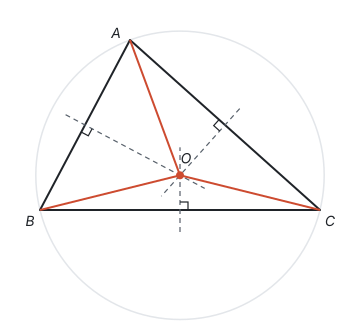

**思路：** 三条线交于一点，可以先让两条线相交，再证第三条线也经过这个交点。“点在垂直平分线上”和“到两端距离相等”可以互相转化，所以把问题都换成距离来说。

**证明：** 设 $AB$、$BC$ 的垂直平分线交于点 $O$，连接 $OA$、$OB$、$OC$。

- 点 $O$ 在 $AB$ 的垂直平分线上，所以 $OA = OB$；
- 点 $O$ 在 $BC$ 的垂直平分线上，所以 $OB = OC$；
- 所以 $OA = OC$，点 $O$ 在 $AC$ 的垂直平分线上（到线段两端距离相等的点在垂直平分线上）。

所以三条垂直平分线都经过点 $O$，并且 $OA = OB = OC$。

**回顾：** 以 $O$ 为圆心、$OA$ 为半径画圆，这个圆经过三个顶点，叫三角形的外接圆，$O$ 叫外心（见第九部分“与圆有关的位置关系”）。第五部分“全等三角形”里，角平分线的性质（角平分线上的点到角两边的距离相等）和它的逆命题（角的内部到角两边距离相等的点，在这个角的平分线上）配合使用，也能证出三条角平分线交于一点，思路完全一样。

## 等腰三角形：对称轴带来的性质

有两条边相等的三角形叫**等腰三角形**。相等的两边叫**腰**，另一边叫**底边**，两腰的夹角叫**顶角**，腰和底边的夹角叫**底角**。

先用垂直平分线看一看：$AB = AC$，说明点 $A$ 到 $B$、$C$ 的距离相等，所以 $A$ 在底边 $BC$ 的垂直平分线上。沿这条垂直平分线对折，$B$ 和 $C$ 互相重合，$A$ 不动，整个三角形和自己重合。所以**等腰三角形是轴对称图形，对称轴是底边的垂直平分线**，它经过顶点 $A$。

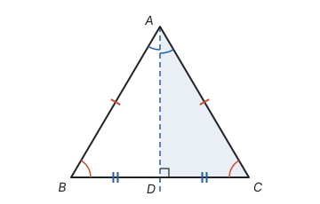

对折时重合的东西都相等，于是得到两条性质：

- **等腰三角形的两个底角相等**（简称“等边对等角”）：$\angle B$ 和 $\angle C$ 重合。
- **等腰三角形的顶角平分线、底边上的中线、底边上的高互相重合**（简称“三线合一”）：对称轴平分顶角，平分底边，又垂直于底边，一条线身兼三职。

写成证明，要借助全等。作 $\angle BAC$ 的平分线 $AD$，交 $BC$ 于点 $D$。在 $\triangle ABD$ 和 $\triangle ACD$ 中，

- $AB = AC$（已知），
- $\angle BAD = \angle CAD$（$AD$ 平分 $\angle BAC$），
- $AD = AD$（公共边），

所以 $\triangle ABD \cong \triangle ACD$（SAS）。于是 $\angle B = \angle C$；$BD = CD$，$AD$ 是底边上的中线；$\angle ADB = \angle ADC$，两角合起来是平角，都是 $90^\circ$，$AD$ 是底边上的高。

**三线合一怎么用：** 在等腰三角形里，只要知道这三条线中的一条，就可以说它也是另外两条。比如已知 $AB = AC$、$D$ 是 $BC$ 的中点，就能直接得到 $AD \perp BC$ 和 $\angle BAD = \angle CAD$，不必再证一次全等。

**例 2**　等腰三角形的一个内角是 $70^\circ$，求另外两个角。

**思路：** 题目没说 $70^\circ$ 是顶角还是底角，两种都可能，要分别算，再检查每种情况能不能构成三角形。

**解：**

- 如果 $70^\circ$ 是顶角，两个底角相等，各是 $(180^\circ - 70^\circ) \div 2 = 55^\circ$；
- 如果 $70^\circ$ 是底角，另一个底角也是 $70^\circ$，顶角是 $180^\circ - 70^\circ \times 2 = 40^\circ$。

所以另外两个角是 $55^\circ$、$55^\circ$，或者 $70^\circ$、$40^\circ$。

**想一想：** 如果那个内角是 $110^\circ$ 呢？它要是底角，两个底角加起来就是 $220^\circ$，超过了 $180^\circ$，不可能。所以 $110^\circ$ 只能是顶角，底角各 $35^\circ$，只有一种答案。钝角或直角只能当顶角。

## 判定：等角对等边

**如果一个三角形有两个角相等，那么这两个角所对的边也相等**（简称“等角对等边”）。它和“等边对等角”的条件、结论互换，是逆命题，而且也是真命题（见第一部分“定义、命题与定理”）。

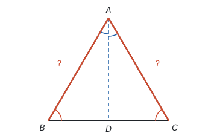

**证明：** 在 $\triangle ABC$ 中，$\angle B = \angle C$。作 $\angle BAC$ 的平分线 $AD$，交 $BC$ 于点 $D$。在 $\triangle ABD$ 和 $\triangle ACD$ 中，$\angle B = \angle C$，$\angle BAD = \angle CAD$，$AD = AD$，所以 $\triangle ABD \cong \triangle ACD$（AAS），$AB = AC$。

这样，判断一个三角形是不是等腰三角形就有了两条路：边相等（定义），或者角相等（这条判定）。题目里出现角平分线和平行线时，常常会“生出”相等的角，再用等角对等边得到相等的边，例 4 就是这样。

**例 3**　如图，在 $\triangle ABC$ 中，$AB = AC$，点 $D$、$E$ 在 $BC$ 上，$BD = CE$。求证：$AD = AE$。

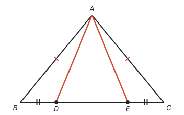

**思路一：找全等。** $AD$ 在 $\triangle ABD$ 里，$AE$ 在 $\triangle ACE$ 里。已知 $AB = AC$、$BD = CE$，还缺一个条件；$AB = AC$ 说明两个底角相等，$\angle B = \angle C$ 正好是这两边的夹角，用 SAS。

**证明一：** 因为 $AB = AC$，所以 $\angle B = \angle C$（等边对等角）。在 $\triangle ABD$ 和 $\triangle ACE$ 中，$AB = AC$，$\angle B = \angle C$，$BD = CE$，所以 $\triangle ABD \cong \triangle ACE$（SAS），$AD = AE$。

**思路二：用对称轴。** 整个图形看起来左右对称，对称轴是底边上的高。如果能说明 $A$ 在 $DE$ 的垂直平分线上，$AD = AE$ 就直接出来了。

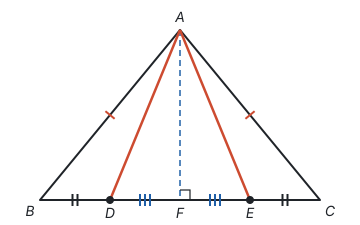

**证明二：** 作 $AF \perp BC$，垂足为 $F$。因为 $AB = AC$，所以 $BF = CF$（三线合一）。又 $BD = CE$，所以 $BF - BD = CF - CE$，即 $DF = EF$。于是 $AF$ 垂直平分 $DE$，所以 $AD = AE$（垂直平分线上的点到线段两端的距离相等）。

**想一想：** 两种证法用的都是“对称”：证法一把对称藏在全等里，证法二直接用对称轴。证法二还说明了更多的东西：只要 $D$、$E$ 关于 $AF$ 对称，不管它们在 $BC$ 上还是在 $BC$ 的延长线上，结论都成立。遇到明显左右对称的图形，先找对称轴，常常比找全等更快。

## 等边三角形

三条边都相等的三角形叫**等边三角形**（正三角形）。它是特殊的等腰三角形：把任何一条边看成底边，另两条边都是腰。

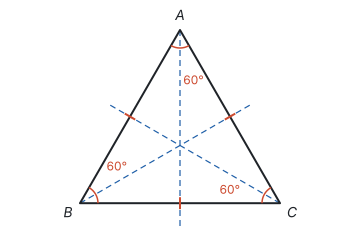

**性质：等边三角形的三个内角都相等，都等于 $60^\circ$。** 由 $AB = AC$ 得 $\angle B = \angle C$，由 $BA = BC$ 得 $\angle A = \angle C$，所以三个角相等；内角和是 $180^\circ$，每个角是 $60^\circ$。等边三角形有三条对称轴，每条都是一个角的平分线所在的直线，也是对边上的中线、高所在的直线。

**判定：**

- 三个角都相等的三角形是等边三角形（由等角对等边，三边两两相等）；
- **有一个角是 $60^\circ$ 的等腰三角形是等边三角形。**

第二条为什么成立？分两种情况：$60^\circ$ 是顶角时，两个底角各是 $(180^\circ - 60^\circ) \div 2 = 60^\circ$；$60^\circ$ 是底角时，另一个底角也是 $60^\circ$，顶角是 $180^\circ - 120^\circ = 60^\circ$。两种情况三个角都是 $60^\circ$，所以是等边三角形。

## 含 30° 角的直角三角形

**在直角三角形中，如果一个锐角等于 $30^\circ$，那么它所对的直角边等于斜边的一半。**

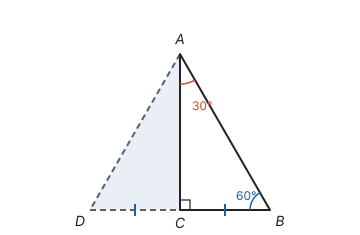

**从哪里想到：** $30^\circ$ 是 $60^\circ$ 的一半，而 $60^\circ$ 是等边三角形的角。把这个直角三角形沿较长的直角边翻折一下，看能不能拼出等边三角形。

**证明：** 在 $\triangle ABC$ 中，$\angle ACB = 90^\circ$，$\angle BAC = 30^\circ$，所以 $\angle B = 60^\circ$。延长 $BC$ 到点 $D$，使 $CD = BC$，连接 $AD$。

- $AC \perp BD$ 且 $CD = BC$，所以 $AC$ 垂直平分 $BD$，$AD = AB$；
- $\triangle ABD$ 是有一个角（$\angle B$）为 $60^\circ$ 的等腰三角形，所以是等边三角形，$AB = BD$；
- $BD = 2BC$，所以 $AB = 2BC$，即 $BC$ 等于斜边 $AB$ 的一半。

$\triangle ADC$ 正是 $\triangle ABC$ 沿 $AC$ 翻折得到的，所以这个直角三角形就是等边三角形的一半。学了勾股定理后还能算出另一条直角边：三边之比是 $1 : \sqrt{3} : 2$（见第五部分“勾股定理”）。

**例 4**　如图，在 $\triangle ABC$ 中，$\angle C = 90^\circ$，$\angle A = 30^\circ$，$BD$ 平分 $\angle ABC$，交 $AC$ 于点 $D$，$CD = 2$。求 $AC$ 的长。

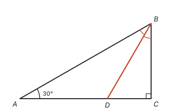

**思路：** $AC$ 被 $D$ 分成 $AD$ 和 $CD$ 两段，$CD$ 已知，只要求 $AD$。先算角：$\angle ABC = 60^\circ$，被平分成两个 $30^\circ$。于是图里有两件事可用：$\triangle BCD$ 是含 $30^\circ$ 角的直角三角形；$\angle ABD = \angle A$，$\triangle ABD$ 是等腰三角形。

**解：** 因为 $\angle C = 90^\circ$，$\angle A = 30^\circ$，所以 $\angle ABC = 60^\circ$。$BD$ 平分 $\angle ABC$，所以 $\angle CBD = \angle ABD = 30^\circ$。

- 在 $\text{Rt}\triangle BCD$ 中，$\angle CBD = 30^\circ$，$CD$ 是斜边 $BD$ 的一半，所以 $BD = 2CD = 4$；
- 在 $\triangle ABD$ 中，$\angle ABD = \angle A = 30^\circ$，所以 $AD = BD = 4$（等角对等边）；
- $AC = AD + CD = 4 + 2 = 6$。

**回顾：** 结果 $AD = 2CD$，$D$ 是 $AC$ 的一个三等分点。这道题里，角平分线“生出”了相等的角，相等的角又“生出”了相等的边，这是等角对等边最常见的用法。

## 大边对大角（拓展）

等腰三角形说的是“边相等 ⇔ 角相等”，自然会问：边不相等时，角怎样？

**在一个三角形中，较大的边所对的角也较大。**

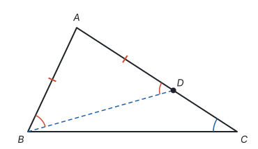

**证明：** 在 $\triangle ABC$ 中，$AC > AB$，要证 $\angle ABC > \angle C$。想法是把“不等”转化成“相等”：在 $AC$ 上截取 $AD = AB$，连接 $BD$。

- $AD = AB$，所以 $\angle ABD = \angle ADB$（等边对等角）；
- $\angle ADB$ 是 $\triangle BDC$ 的外角，所以 $\angle ADB > \angle C$；
- $D$ 在 $\angle ABC$ 的内部，所以 $\angle ABC > \angle ABD$。

于是 $\angle ABC > \angle ABD = \angle ADB > \angle C$。

反过来，**较大的角所对的边也较大**。可以用反证法：如果 $\angle B > \angle C$，而 $AC$ 不大于 $AB$，那么要么 $AC = AB$，得到 $\angle B = \angle C$；要么 $AC < AB$，由上面的结论得到 $\angle B < \angle C$。两种情况都和 $\angle B > \angle C$ 矛盾（见第一部分“怎样证明”）。

由此马上知道：直角三角形中直角最大，所以**斜边最长**；从直线外一点到直线的所有线段中，垂线段最短。

## 最短路径问题

**问题**　如图，$A$、$B$ 两个村庄在一条河 $l$ 的同侧，要在河边修一个水泵站 $P$，分别向两村供水。$P$ 修在哪里，所用水管 $PA + PB$ 最短？

**思路：** 能直接用的基本事实是“两点之间，线段最短”（见第一部分“基本事实”）。可是 $PA$、$PB$ 在 $P$ 处拐了个弯，不是一条线段。如果能把 $PB$ 换成一条等长的线段，放到 $l$ 的另一侧，折线 $A \to P \to B$ 就可能被拉直。轴对称正好能做到：对称不改变长度。

**作法：** 作点 $B$ 关于直线 $l$ 的对称点 $B'$，连接 $AB'$，交 $l$ 于点 $P$。点 $P$ 就是所求的位置。

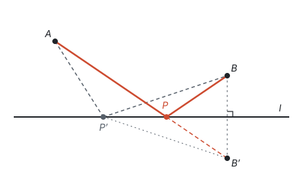

**为什么最短：** $l$ 垂直平分 $BB'$，所以 $l$ 上任意一点到 $B$ 和 $B'$ 的距离相等。

- 对点 $P$：$PA + PB = PA + PB' = AB'$；
- 对 $l$ 上另外任意一点 $P'$：$P'A + P'B = P'A + P'B'$。$A$、$P'$、$B'$ 不在一条直线上时，它们组成三角形，两边之和大于第三边，所以 $P'A + P'B' > AB'$。

所以 $PA + PB$ 最短。不管 $P'$ 在 $l$ 上的什么位置，折线 $A \to P' \to B'$ 都比线段 $AB'$ 长，只有 $P'$ 落在 $P$ 时，折线才被拉成直线。

**同类问题：造桥选址。** $A$、$B$ 两地在一条河的两岸，河的两岸平行，要在河上垂直于河岸造一座桥 $MN$，使路径 $A \to M \to N \to B$ 最短。桥长 $MN$ 等于河宽，是固定的，只要 $AM + NB$ 最短。

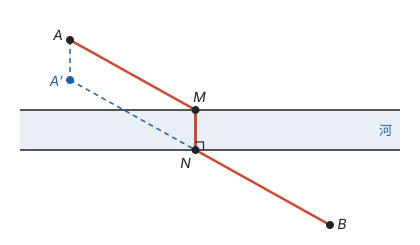

这次两段路被桥隔开，接不起来。办法是把 $A$ 沿垂直于河岸的方向平移一个河宽，得到 $A'$。$AA'$ 和 $MN$ 平行且相等，四边形 $AA'NM$ 是平行四边形，$AM = A'N$（见第五部分“四边形”）。于是 $AM + NB = A'N + NB$，连接 $A'B$ 交对岸于 $N$ 时最短。

**两道题是同一个想法：** 用一种不改变长度的变换（轴对称、平移），把拐弯的路径或断开的路径接成一条线段，再用“两点之间线段最短”。

## 易错点

- **等腰三角形不分情况。** 只说“一个角是 $70^\circ$”，要分它是顶角还是底角；只说“两边长 3 和 7”，要分哪条是腰，并检查三边关系：腰为 3 时 $3 + 3 < 7$，不能构成三角形，只能是 7、7、3，周长 17。
- **三线合一用错了线。** 重合的是**顶角**的平分线、**底边**上的中线、**底边**上的高。腰上的中线和腰上的高一般不重合。
- **把对称轴说成线段或射线。** 对称轴是直线。等腰三角形的对称轴是“顶角平分线所在的直线”，不能说“对称轴是顶角平分线”，因为角的平分线是射线，三角形的角平分线是线段。
- **30° 角的结论用错边。** 等于斜边一半的是 $30^\circ$ 角**所对**的直角边，也就是较短的那条直角边；而且只在直角三角形里成立。
- **垂直平分线的性质和判定弄反。** 已知点在垂直平分线上，推距离相等，是性质；已知距离相等，推点在垂直平分线上，是判定。写理由时要分清。
- **最短路径不看两点在直线的哪一侧。** 两点在直线两侧时，直接连接两点，和直线的交点就是所求；在同侧时，才需要作对称点。

## 联系

- **全等三角形：** 本页的性质都借助全等来证；轴对称的两个图形本来就全等。见第五部分“全等三角形”。
- **平移、轴对称与旋转：** 画轴对称图形，坐标系中关于 $x$ 轴、$y$ 轴对称的点的坐标。见第六部分“平移、轴对称与旋转”。
- **有理数：** 互为相反数的两个数在数轴上关于原点对称，是对称最早的样子。见第二部分“有理数”。
- **二次函数：** 抛物线是轴对称图形，顶点在对称轴上，和等腰三角形的顶点在对称轴上是同一种样子；对称点的纵坐标相等，常用来求对称轴。见第七部分“二次函数”。
- **尺规作图：** 作线段的垂直平分线、作角平分线、过一点作垂线，依据都是轴对称。见第五部分“尺规作图”。
- **勾股定理：** 含 $30^\circ$ 角的直角三角形三边之比 $1 : \sqrt{3} : 2$，要用勾股定理算出。见第五部分“勾股定理”。
- **四边形：** 菱形的对角线互相垂直，靠的就是等腰三角形的三线合一。见第五部分“四边形”。
- **圆：** 外心是三边垂直平分线的交点；圆是轴对称图形，垂径定理就是圆的对称性。见第九部分“圆的有关性质”和第九部分“与圆有关的位置关系”。
- **分类讨论：** 等腰三角形的边、角不确定时要分情况，是分类讨论最常见的场合。见第十一部分“分类讨论”。
