# 三角形

> 对应人教版八年级上册第十三章、八年级下册 21.1。

**三角形是由不在同一条直线上的三条线段首尾顺次相接所组成的图形，是最简单的多边形；任何多边形都能分成三角形，所以三角形的性质是研究一切直线形的基础。**

## 从哪里来

两条线段围不成封闭的图形，三条线段才可以。所以三角形是边数最少的多边形，也是最“基本”的多边形：四边形画一条对角线就分成两个三角形，五边形、六边形也都能分成若干个三角形。弄清楚三角形，就能推出多边形的很多性质。

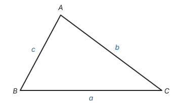

三角形 $ABC$ 记作 $\triangle ABC$。它有三个顶点 $A$、$B$、$C$，三条边 $AB$、$BC$、$CA$，三个内角 $\angle A$、$\angle B$、$\angle C$。顶点 $A$ 所对的边 $BC$ 常记作 $a$，顶点 $B$ 所对的边 $CA$ 记作 $b$，顶点 $C$ 所对的边 $AB$ 记作 $c$。

三角形可以按角分类，也可以按边分类：

| 分类方法 | 类别 | 特征 |
| --- | --- | --- |
| 按角 | 锐角三角形 | 三个角都是锐角 |
| 按角 | 直角三角形 | 有一个角是直角 |
| 按角 | 钝角三角形 | 有一个角是钝角 |
| 按边 | 三边都不相等的三角形 | 三条边互不相等 |
| 按边 | 等腰三角形 | 有两条边相等；三条边都相等的是等边三角形，它是特殊的等腰三角形 |

一个三角形最多有一个直角或一个钝角，理由见后面的内角和。

## 三边关系

任取三根小棒，不一定能围成三角形：3 cm、4 cm、8 cm 的三根就围不起来。什么样的三条线段才能围成三角形？

从“两点之间，线段最短”出发（见第五部分“几何图形初步”）：在 $\triangle ABC$ 中，从 $A$ 到 $B$ 可以直接走线段 $AB$，也可以绕道经过 $C$，走 $AC + CB$。直接走的线段最短，所以

$$AC + CB > AB.$$

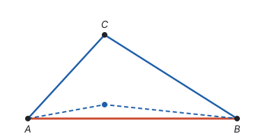

对另外两条边也一样。于是得到：**三角形两边的和大于第三边。** 把 $AC + CB > AB$ 移项，得 $AB - AC < CB$，所以也有：**三角形两边的差小于第三边。**

合起来，第三边 $x$ 的取值范围夹在另两边的差与和之间。比如两边长 3 和 7，第三边满足

$$7 - 3 < x < 7 + 3, \quad \text{即} \quad 4 < x < 10.$$

判断三条线段能否组成三角形，不必把三个不等式都验证一遍：**只要较短的两条线段的和大于最长的线段**就可以了，因为最长的一条加上任何一条，一定大于剩下的那条。

**例 1**　一个等腰三角形的两边长分别是 4 cm 和 9 cm，求它的周长。

**思路：** 等腰三角形有两条边相等，但题目没说 4 cm 和 9 cm 哪个是腰，要分两种情况。每种情况算出三条边后，还要检查它们能不能组成三角形。

**解：**

- 如果腰长 4 cm，三边是 4 cm、4 cm、9 cm。$4 + 4 = 8 < 9$，较短的两边之和小于最长边，不能组成三角形，舍去。
- 如果腰长 9 cm，三边是 9 cm、9 cm、4 cm。$4 + 9 > 9$，能组成三角形，周长是 $9 + 9 + 4 = 22$（cm）。

所以周长是 22 cm。

**回顾：** 算出答案后用三边关系检验，就像解分式方程要检验增根一样：代数上算得出来，不代表图形上存在。

## 三角形的高、中线和角平分线

三角形里有三种重要的线段，它们都从一个顶点出发，落在对边（或对边所在的直线）上，区别在于“落在哪里”：

| 线段 | 定义 | 得到的相等关系 |
| --- | --- | --- |
| 高 | 从顶点向对边所在直线作垂线，顶点和垂足之间的线段 | $AD \perp BC$，$\angle ADB = \angle ADC = 90^\circ$ |
| 中线 | 连接顶点和对边中点的线段 | $BD = DC = \frac{1}{2}BC$ |
| 角平分线 | 内角的平分线与对边相交，顶点和交点之间的线段 | $\angle BAD = \angle DAC = \frac{1}{2}\angle BAC$ |

**高。** 锐角三角形的高都在三角形内部；直角三角形有两条高就是两条直角边；钝角三角形钝角所对的边上的高在内部，另外两条高在外部，要先延长对边，垂足落在延长线上。

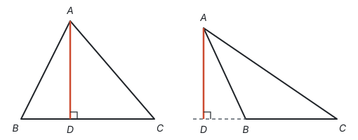

**中线。** $\triangle ABD$ 和 $\triangle ADC$ 的底 $BD = DC$，高都是从 $A$ 到 $BC$ 的距离，所以**三角形的中线把三角形分成面积相等的两部分。**

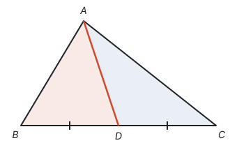

**角平分线。** 三角形的角平分线是一条**线段**，而角的平分线是一条**射线**，这是两者的区别。

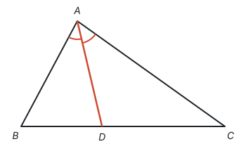

每个三角形都有三条高、三条中线、三条角平分线，而且三条中线交于一点，三条角平分线交于一点，三条高所在的直线也交于一点。三条中线的交点叫**重心**，后面的综合与实践会用到；三条角平分线的交点是三角形内切圆的圆心（见第九部分“与圆有关的位置关系”）。这几个“交于一点”现在先承认，后面可以证明：三条角平分线交于一点，用角平分线的性质和它的逆命题（见第五部分“全等三角形”）；三条中线交于一点，要用到相似（见第八部分“相似”）。

## 三角形的稳定性

用三根木条钉成一个三角形框架，怎么扳也扳不动；用四根木条钉成的四边形框架，一扳就变形：

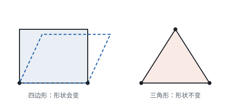

这就是**三角形的稳定性**：三条边的长度确定了，三角形的形状和大小就完全确定了。它的数学依据正是全等三角形的判定“边边边”（见第五部分“全等三角形”）。四边形四条边的长度确定了，四个角仍然可以变，所以没有稳定性。

自行车的车架、屋顶的桁架、斜拉桥的拉索都做成三角形，是利用稳定性；四边形框架上加一根斜木条，分成两个三角形，也就稳定了。反过来，伸缩门、升降架利用的正是四边形的不稳定性。

## 三角形的内角和

**三角形的内角和等于 $180^\circ$。** 把三角形的三个角撕下来拼在一起，正好拼成一个平角，但这只是对一个三角形的实验；要说明所有三角形都这样，需要证明。

拼的时候，是把 $\angle B$ 和 $\angle C$ 搬到顶点 $A$ 旁边。证明就是用平行线把这个“搬”的动作变成推理：

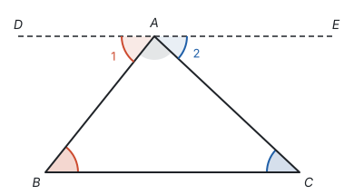

**证明：** 过点 $A$ 作直线 $DE \parallel BC$。

因为 $DE \parallel BC$，所以 $\angle 1 = \angle B$，$\angle 2 = \angle C$（两直线平行，内错角相等）。

因为 $\angle 1$、$\angle BAC$、$\angle 2$ 合起来是平角 $\angle DAE$，所以 $\angle 1 + \angle BAC + \angle 2 = 180^\circ$。

所以 $\angle B + \angle BAC + \angle C = 180^\circ$。

$DE$ 是为了证明而添的线，叫**辅助线**，画成虚线。它的作用是造出平行线，让分散在三个顶点的角能通过内错角集中到一处（见第五部分“相交线与平行线”）。

由内角和立刻得到：

- 一个三角形最多有一个直角或钝角，否则两个角的和就达到或超过 $180^\circ$ 了；
- **直角三角形的两个锐角互余；** 反过来，**有两个角互余的三角形是直角三角形。** 直角三角形 $ABC$ 可以写成 $\text{Rt}\triangle ABC$。

## 三角形的外角

三角形的一边与另一边的延长线组成的角，叫三角形的**外角**。延长 $BC$ 到 $D$，$\angle ACD$ 就是 $\triangle ABC$ 的一个外角。

**三角形的外角等于与它不相邻的两个内角的和。** 推导：$\angle ACD$ 与 $\angle ACB$ 是邻补角，所以 $\angle ACD = 180^\circ - \angle ACB$；由内角和，$\angle A + \angle B = 180^\circ - \angle ACB$。所以

$$\angle ACD = \angle A + \angle B.$$

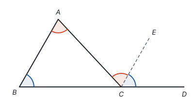

也可以直接用平行线看出来：过 $C$ 作 $CE \parallel AB$，则 $\angle ACE = \angle A$（内错角），$\angle ECD = \angle B$（同位角），两部分合起来就是 $\angle ACD$。这和内角和的证明是同一个想法：那里过点 $A$ 作 $DE \parallel BC$，用内错角把 $\angle B$、$\angle C$ 搬到顶点 $A$ 处。

由此还知道，三角形的外角大于任何一个和它不相邻的内角。求角度时，外角常常比内角和更省事：它一步就把两个内角“加”在一起。

**例 2**　如图，在 $\triangle ABC$ 中，$\angle A = 70^\circ$，$\angle ABC$ 和 $\angle ACB$ 的平分线交于点 $O$。求 $\angle BOC$ 的度数。

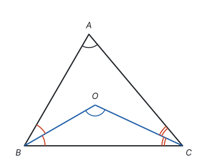

**思路：** $\angle BOC$ 在 $\triangle OBC$ 里，要求它，就要知道 $\angle OBC + \angle OCB$。这两个角分别是 $\angle ABC$、$\angle ACB$ 的一半，单独都求不出来，但它们的**和**可以由 $\triangle ABC$ 的内角和求出来。

**解：** 在 $\triangle ABC$ 中，$\angle ABC + \angle ACB = 180^\circ - \angle A = 110^\circ$。

因为 $BO$、$CO$ 分别平分 $\angle ABC$、$\angle ACB$，所以

$$\angle OBC + \angle OCB = \frac{1}{2}(\angle ABC + \angle ACB) = 55^\circ.$$

在 $\triangle OBC$ 中，$\angle BOC = 180^\circ - 55^\circ = 125^\circ$。

**想一想：** 把 $70^\circ$ 换成一般的 $\angle A$，同样的步骤给出

$$\angle BOC = 180^\circ - \frac{1}{2}(180^\circ - \angle A) = 90^\circ + \frac{1}{2}\angle A.$$

$\angle A = 70^\circ$ 时正好是 $125^\circ$。这里整体求 $\angle OBC + \angle OCB$，而不是分别求两个角，是解这类题的关键：条件不够求出每一个量时，看看要用的是不是它们的和。

## 多边形的内角和与外角和

在平面内，由一些线段首尾顺次相接组成的封闭图形叫**多边形**。连接多边形不相邻的两个顶点的线段叫**对角线**。各边相等、各角也相等的多边形叫**正多边形**。这里只研究凸多边形（整个图形在任何一条边所在直线的同一侧）。

**内角和。** 从 $n$ 边形的一个顶点出发，能向除了它自己和相邻两个顶点以外的 $n - 3$ 个顶点画对角线，把多边形分成 $n - 2$ 个三角形：

这些三角形的内角合起来正好是多边形的内角，所以

$$n \text{ 边形的内角和} = (n - 2) \cdot 180^\circ.$$

五边形是 $540^\circ$，六边形是 $720^\circ$。每个顶点都能引出 $n - 3$ 条对角线，每条对角线被两个端点各算了一次，所以 $n$ 边形共有 $\frac{n(n - 3)}{2}$ 条对角线。

**外角和。** 多边形每个顶点处，一边与相邻边的延长线组成的角是**外角**。每个顶点处的内角与外角是邻补角，和为 $180^\circ$，$n$ 个顶点合计 $n \cdot 180^\circ$。减去内角和，外角和就是

$$n \cdot 180^\circ - (n - 2) \cdot 180^\circ = 360^\circ.$$

**多边形的外角和等于 $360^\circ$，与边数无关。** 换一个角度看更直观：沿多边形的边走一圈，每到一个顶点就转过一个外角，走回起点时正好转了一整圈。把各个外角拼在一起，正好是一个周角：

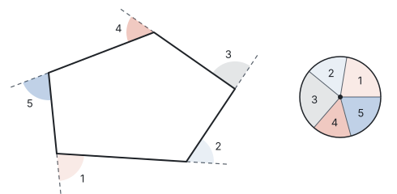

所以正 $n$ 边形的每个外角是 $\frac{360^\circ}{n}$，每个内角是 $180^\circ - \frac{360^\circ}{n}$。求正多边形的内角，先求外角往往更快。

**例 3**　一个多边形的内角和是外角和的 3 倍，它是几边形？

**思路：** 外角和是固定的 $360^\circ$，所以内角和是 $1080^\circ$；内角和又能用边数 $n$ 表示，于是得到关于 $n$ 的方程。

**解：** 设它是 $n$ 边形，则

$$(n - 2) \cdot 180 = 3 \times 360.$$

解得 $n - 2 = 6$，$n = 8$。它是八边形。

**检验：** 八边形的内角和是 $6 \times 180^\circ = 1080^\circ = 3 \times 360^\circ$。

## 综合与实践：确定匀质薄板的重心

一块厚薄均匀、材料均匀的薄板，用一根手指在某一点就能把它顶平，这一点叫薄板的**重心**。怎样找到它？

**悬挂法。** 在薄板边上任选一点 $P$ 钻一个小孔，用细线把它吊起来。薄板静止时，重心一定在点 $P$ 的正下方，所以沿着细线的方向在板上画一条直线，重心就在这条直线上。再换一点 $Q$ 吊起来，又画出一条直线。两条直线的交点 $G$ 就是重心。

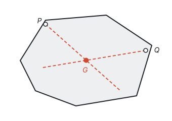

两点确定一条直线，两条直线确定一个点，所以吊两次就够了；吊第三次，画出的直线也经过 $G$，可以用来检验。

**三角形薄板的重心在哪里？** 把三角形薄板切成许多平行于 $BC$ 的细条。每一根细条都是均匀的，它的重心在它的中点。而这些细条的中点都落在中线 $AD$ 上（用相似可以证明，见第八部分“相似”）。所以整块薄板在中线 $AD$ 上是平衡的，重心在 $AD$ 上。同样的道理，重心也在另两条中线 $BE$、$CF$ 上：

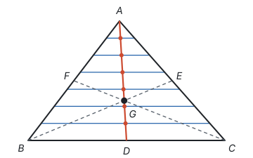

所以**三角形薄板的重心是三条中线的交点**，这就是这个点叫“重心”的原因。用悬挂法吊一块三角形薄板，画出的直线正好都经过中线的交点，可以动手验证。

## 易错点

- **判断三边能否组成三角形时只验证一个不等式，而且选错了。** 应该检验“较短的两边之和大于最长边”；只检验“最长边加一条短边大于另一条短边”永远成立，说明不了问题。
- **等腰三角形的边不分腰和底就直接算。** 已知两边长，要分别以每一条为腰讨论，再用三边关系检验（见第十一部分“分类讨论”）。
- **钝角三角形的高画在内部。** 钝角三角形里，从锐角顶点出发的高在三角形外，要延长对边再作垂线。
- **把三角形的角平分线当成射线。** 三角形的角平分线、中线、高都是线段。
- **外角找错。** 外角是一边与**另一边的延长线**组成的角，不是随便一个在三角形外面的角；“与它不相邻的两个内角”也不能包括和它组成邻补角的那个内角。
- **多边形的边数算出小数。** 边数 $n$ 必须是不小于 3 的正整数。比如“内角和是 $1000^\circ$”解出的 $n$ 不是整数，就说明这样的多边形不存在。
- **以为多边形的外角和随边数增加。** 内角和随边数增加，外角和始终是 $360^\circ$。

## 联系

- **不等式：** 三边关系就是不等式，第三边的取值范围是一个不等式组的解集。见第四部分“不等式与不等式组”。
- **代数式：** 内角和 $(n - 2) \cdot 180^\circ$、对角线条数 $\frac{n(n - 3)}{2}$ 都是用字母 $n$ 表示的一般规律，代入不同的 $n$ 就得到不同多边形的结果。见第三部分“代数式”。
- **相交线与平行线：** 内角和、外角的证明都靠平行线的性质“搬角”。见第五部分“相交线与平行线”。
- **全等三角形：** 三角形的稳定性就是“边边边”；判定全等时反复要用内角和（如由 ASA 推出 AAS）。见第五部分“全等三角形”。
- **轴对称与等腰三角形：** 等腰三角形底边上的高、中线、顶角平分线重合在一起。见第五部分“轴对称与等腰三角形”。
- **勾股定理：** 直角三角形的两个锐角互余，三边之间还有 $a^2 + b^2 = c^2$ 的关系。见第五部分“勾股定理”。
- **四边形：** 四边形的内角和是 $360^\circ$，由对角线把它分成两个三角形得到；三角形的中位线也在那里。见第五部分“四边形”。
- **与圆有关的位置关系：** 三条角平分线的交点是内切圆的圆心，三边垂直平分线的交点是外接圆的圆心。见第九部分“与圆有关的位置关系”。
