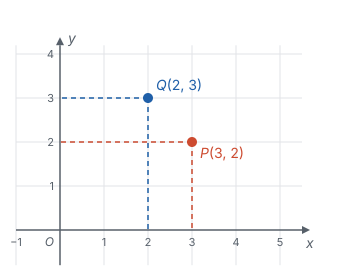
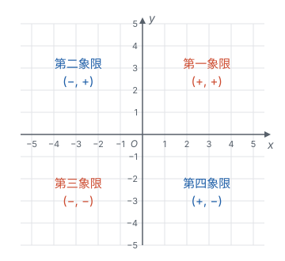
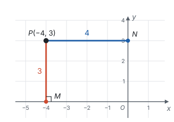
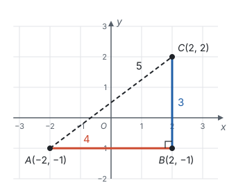
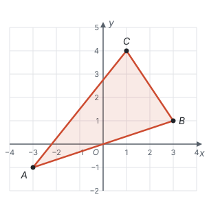
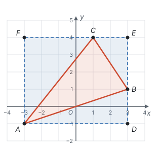
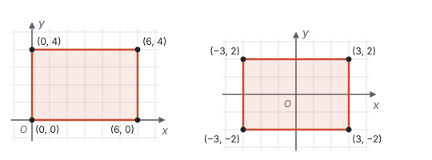
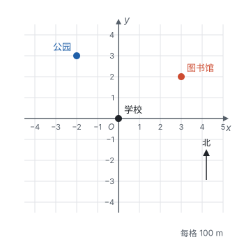
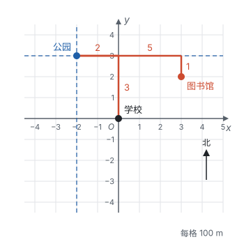
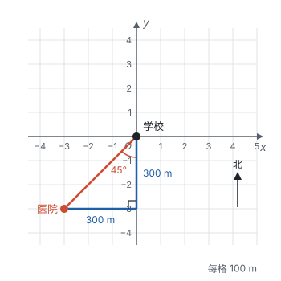

# 平面直角坐标系

> 对应人教版七年级下册第九章。

**平面直角坐标系是把两条数轴垂直地放在一起：平面上的每一个点都对应一对有序实数 $(x, y)$，每一对有序实数也对应平面上唯一的一个点。** 有了它，点的位置可以用数来说，图形的问题可以用计算来做。

## 从哪里来：一个数不够用

在数轴上，一个数就能确定一个点的位置（见第二部分“有理数”）。可是到了平面上，一个数就不够了：

| 情境 | 怎样确定位置 | 用了几个数 |
| --- | --- | --- |
| 电影票 | 5 排 8 号 | 2 个：排数、座号 |
| 教室座位 | 第 3 列第 4 行 | 2 个：列数、行数 |
| 国际象棋棋盘 | e4 | 2 个：一个字母表示列，一个数字表示行 |
| 地球上的位置 | 东经 113.6°，北纬 34.7° | 2 个：经度、纬度 |

这些例子有两个共同点。第一，平面上确定一个位置要**两个数**。第二，两个数的**顺序**不能随便换：“5 排 8 号”和“8 排 5 号”是两个不同的座位。像这样有顺序的两个数 $a$ 与 $b$ 组成的数对，叫**有序数对**，记作 $(a, b)$。

怎样让平面上的每一个点都有一个有序数对？最自然的办法是把数轴用两次：一条横着放，量左右；一条竖着放，量上下。

在平面内画两条**互相垂直、原点重合**的数轴，就组成**平面直角坐标系**：

- 水平的数轴叫 **$x$ 轴**（横轴），取向右为正方向；
- 竖直的数轴叫 **$y$ 轴**（纵轴），取向上为正方向；
- 两轴的交点 $O$ 叫**坐标原点**。

两条轴取成互相垂直的，是为了让两个数各管各的：沿水平方向移动，竖直方向的读数不变；沿竖直方向移动，水平方向的读数不变。

## 点的坐标

有了坐标系，怎样读出一个点对应的数对？过点 $P$ 分别向 $x$ 轴、$y$ 轴作垂线，垂足在 $x$ 轴上对应的数 $a$ 叫点 $P$ 的**横坐标**，在 $y$ 轴上对应的数 $b$ 叫点 $P$ 的**纵坐标**，有序数对 $(a, b)$ 叫点 $P$ 的**坐标**，记作 $P(a, b)$。**横坐标写在前面，纵坐标写在后面。**

图中 $P$ 的坐标是 $(3, 2)$：从原点出发向右 3、向上 2。$Q$ 的坐标是 $(2, 3)$：向右 2、向上 3。两个坐标用的数相同，只是顺序不同，就是两个不同的点。原点 $O$ 的坐标是 $(0, 0)$。

反过来，给出一个有序数对 $(a, b)$，在 $x$ 轴上找到表示 $a$ 的点，过它作 $x$ 轴的垂线；在 $y$ 轴上找到表示 $b$ 的点，过它作 $y$ 轴的垂线。两条垂线只交于一点，这个点就是 $(a, b)$ 表示的点。

所以，**坐标平面内的点和有序实数对是一一对应的**。这和“实数与数轴上的点一一对应”是同一件事，只是从一条直线推广到了整个平面。

## 象限和坐标轴上的点

两条坐标轴把平面分成四个部分，叫四个**象限**：右上方是第一象限，按逆时针方向依次是第二、三、四象限。

每个象限里点的坐标的符号，不用背，直接从坐标的意义推出来：点在 $y$ 轴右边，横坐标就是正数，在左边就是负数；点在 $x$ 轴上方，纵坐标就是正数，在下方就是负数。

| 点的位置 | 横坐标 | 纵坐标 | 例子 |
| --- | --- | --- | --- |
| 第一象限 | 正 | 正 | $(3, 2)$ |
| 第二象限 | 负 | 正 | $(-3, 2)$ |
| 第三象限 | 负 | 负 | $(-3, -2)$ |
| 第四象限 | 正 | 负 | $(3, -2)$ |
| $x$ 轴上 | 任意 | 0 | $(-5, 0)$ |
| $y$ 轴上 | 0 | 任意 | $(0, 4)$ |

**坐标轴上的点不属于任何象限。** 象限是被两条轴隔开的四块区域，轴本身是分界线。

为什么 $x$ 轴上的点纵坐标是 0？点在 $x$ 轴上，向 $x$ 轴作垂线，垂足就是它自己；向 $y$ 轴作垂线，垂足是原点，对应的数是 0。同样，$y$ 轴上的点横坐标是 0。

## 坐标和距离

**点到坐标轴的距离。** 点 $P(a, b)$ 到 $x$ 轴的距离，是 $P$ 到 $x$ 轴的垂线段的长。垂足 $M$ 的坐标是 $(a, 0)$，$PM$ 是竖直的，它的长就是 $b$ 到 0 的距离，也就是 $\lvert b \rvert$。同样，$P$ 到 $y$ 轴的垂线段是 $PN$，垂足 $N$ 的坐标是 $(0, b)$，$PN$ 是水平的，长为 $\lvert a \rvert$。

所以：**点 $P(a, b)$ 到 $x$ 轴的距离是 $\lvert b \rvert$，到 $y$ 轴的距离是 $\lvert a \rvert$。** 图中 $P(-4, 3)$ 到 $x$ 轴的距离是 3，到 $y$ 轴的距离是 $\lvert -4 \rvert = 4$。注意交叉：到 $x$ 轴的距离看**纵坐标**，到 $y$ 轴的距离看**横坐标**。

**平行于坐标轴的线段。** 在平行于 $x$ 轴的直线上，所有点到 $x$ 轴的距离相等，又在 $x$ 轴的同一侧，所以**纵坐标都相同**；同样，平行于 $y$ 轴的直线上的点**横坐标都相同**。这样的两点之间的距离，就是数轴上两点间的距离：

- $A(x_1, y)$、$B(x_2, y)$ 在平行于 $x$ 轴的直线上，$AB = \lvert x_1 - x_2 \rvert$；
- $B(x, y_1)$、$C(x, y_2)$ 在平行于 $y$ 轴的直线上，$BC = \lvert y_1 - y_2 \rvert$。

**任意两点的距离。** 两点不在平行于坐标轴的直线上时，可以借一个直角三角形：

图中 $A(-2, -1)$，$C(2, 2)$。取 $B(2, -1)$，使 $AB$ 平行于 $x$ 轴、$BC$ 平行于 $y$ 轴，则 $\angle ABC = 90^\circ$，

$$AB = \lvert 2 - (-2) \rvert = 4, \quad BC = \lvert 2 - (-1) \rvert = 3.$$

由勾股定理，$AC = \sqrt{4^2 + 3^2} = 5$（见第五部分“勾股定理”）。坐标系里的斜线段，都可以这样化成横、竖两段来算。

**例 1**　已知点 $P(2m - 4, m + 1)$。

(1) 点 $P$ 在 $y$ 轴上，求点 $P$ 的坐标；

(2) 点 $P$ 在第二象限，求 $m$ 的取值范围。

**思路：** 点的位置和坐标的关系，要翻译成关于 $m$ 的方程或不等式。“在 $y$ 轴上”是一个等式条件；“在第二象限”是两个不等式条件，要同时成立。

**解：** (1) 点 $P$ 在 $y$ 轴上，所以横坐标为 0，即 $2m - 4 = 0$，得 $m = 2$。此时 $m + 1 = 3$，所以点 $P$ 的坐标是 $(0, 3)$。

(2) 第二象限的点横坐标为负、纵坐标为正，所以

$$\begin{cases} 2m - 4 < 0, \\ m + 1 > 0. \end{cases}$$

解第一个不等式得 $m < 2$，解第二个得 $m > -1$，所以 $-1 < m < 2$。

**检验：** 取 $m = 0$，$P(-4, 1)$，确实在第二象限；取 $m = 2$，$P(0, 3)$ 在 $y$ 轴上，不属于任何象限，所以 $m = 2$ 不能取。这和第 1 问的结果互相印证。

## 用坐标描述图形

有了坐标，图形的长度、面积就能用计算得到。最常用的是**割补法**：坐标系里横、竖方向的线段长度最好算，所以把斜放的图形放进一个边平行于坐标轴的长方形里，用长方形的面积减去多出来的部分。

**例 2**　在平面直角坐标系中，$A(-3, -1)$，$B(3, 1)$，$C(1, 4)$，求 $\triangle ABC$ 的面积。

**思路：** $\triangle ABC$ 的三条边都是斜的，底和高都不好直接找。但是过三个顶点作平行于坐标轴的直线，围成的长方形边长可以直接从坐标读出；长方形比三角形多出来的是三个直角三角形，它们的直角边也都是横、竖方向的，同样可以直接读出。

**解：** 作长方形 $ADEF$，使 $D(3, -1)$，$E(3, 4)$，$F(-3, 4)$，则 $B$ 在 $DE$ 上，$C$ 在 $EF$ 上。长方形比 $\triangle ABC$ 多出的部分，是 $\triangle ABD$、$\triangle BCE$、$\triangle ACF$ 三个直角三角形：

- 长方形 $ADEF$：$AD = 3 - (-3) = 6$，$DE = 4 - (-1) = 5$，面积为 $6 \times 5 = 30$；
- $\triangle ABD$：$AD = 6$，$BD = 1 - (-1) = 2$，面积为 $\frac{1}{2} \times 6 \times 2 = 6$；
- $\triangle BCE$：$BE = 4 - 1 = 3$，$CE = 3 - 1 = 2$，面积为 $\frac{1}{2} \times 3 \times 2 = 3$；
- $\triangle ACF$：$AF = 4 - (-1) = 5$，$CF = 1 - (-3) = 4$，面积为 $\frac{1}{2} \times 5 \times 4 = 10$。

所以 $\triangle ABC$ 的面积为 $30 - 6 - 3 - 10 = 11$。

**回顾：** 割补法的关键是让所有要算的线段都变成横的或竖的，这样长度就是坐标之差。如果三角形有一条边本来就平行于坐标轴，就直接用这条边作底，高就是第三个顶点到这条边的横向或纵向距离，不必割补。

坐标系是人放上去的，同一个图形可以有不同的放法。比如一个长 6、宽 4 的长方形，把一个顶点放在原点、两边放在坐标轴上，四个顶点是 $(0, 0)$、$(6, 0)$、$(6, 4)$、$(0, 4)$；把中心放在原点、边平行于坐标轴，四个顶点是 $(\pm 3, \pm 2)$。

图形没有变，坐标变了。**建坐标系时，让尽量多的点落在坐标轴上、让图形的对称轴落在坐标轴上，坐标就最简单。**

## 用坐标描述位置

地图就是一个坐标平面。用坐标描述地点的位置，要先说清三件事：原点选在哪里，哪个方向是正方向，一个单位长度代表多少实际距离。通常取正东为 $x$ 轴正方向，正北为 $y$ 轴正方向。

**例 3**　如图，以学校为原点，每个单位长度代表 100 m。公园的坐标是 $(-2, 3)$，图书馆的坐标是 $(3, 2)$。

(1) 公园、图书馆分别在学校的什么位置？

(2) 如果改为以公园为原点，方向和单位长度不变，图书馆和学校的坐标分别是什么？

**思路：** 坐标的两个数，分别是从原点出发向东（负数就是向西）走了多远、向北（负数就是向南）走了多远。换了原点，就是换了出发点，要算的是从新的出发点走到目的地，东西方向、南北方向各要走多远。

**解：** (1) 公园在学校以西 200 m、以北 300 m 处；图书馆在学校以东 300 m、以北 200 m 处。

(2) 以公园为原点，就是过公园重新画两条坐标轴（下图的虚线）：

从公园 $(-2, 3)$ 到图书馆 $(3, 2)$：向东走 $3 - (-2) = 5$ 个单位，向北走 $2 - 3 = -1$ 个单位（即向南 1 个单位），所以图书馆的新坐标是 $(5, -1)$。

从公园 $(-2, 3)$ 到学校 $(0, 0)$：向东走 $0 - (-2) = 2$ 个单位，向北走 $0 - 3 = -3$ 个单位，所以学校的新坐标是 $(2, -3)$。

**回顾：** 换原点后，每个点的新坐标都等于旧坐标减去新原点的旧坐标：横坐标都减 $-2$，纵坐标都减 3。所有点的坐标同时加减同一个数，这正是平移的坐标规律（见第六部分“平移、轴对称与旋转”）。

描述位置还有另一种办法：**方向和距离**。还用例 3 的地图（以学校为原点，每格 100 m，正东、正北为正方向），在上面标出医院：

医院的坐标是 $(-3, -3)$，从学校出发，向西、向南各走 300 m，所以医院在学校的西南方向，也就是南偏西 $45^\circ$ 方向；距离是一个等腰直角三角形的斜边，由勾股定理，是 $\sqrt{3^2 + 3^2} \times 100 = 300\sqrt{2}$（m）。代入参考数据 $\sqrt{2} \approx 1.41$，$300\sqrt{2} \approx 300 \times 1.41 = 423$（m）。这两种说法都要用两个量：坐标用“东西多远、南北多远”，方向和距离用“朝哪个方向、走多远”。

## 易错点

- **横、纵坐标写反。** 坐标 $(a, b)$ 永远是横坐标在前。$(3, 2)$ 和 $(2, 3)$ 是两个不同的点。
- **把坐标轴上的点归入某个象限。** $(0, 4)$ 在 $y$ 轴上，$(-5, 0)$ 在 $x$ 轴上，都不属于任何象限。说“点在第二象限”时，横坐标小于 0、纵坐标大于 0 都要严格成立。
- **到坐标轴的距离弄反。** 点 $(a, b)$ 到 **$x$ 轴**的距离是 $\lvert b \rvert$，是纵坐标的绝对值，因为垂线段是竖直的。
- **距离忘了加绝对值。** 距离不能是负数。已知“点到 $x$ 轴的距离是 3”，纵坐标可能是 3，也可能是 $-3$，要分两种情况。
- **平行于坐标轴弄混。** 平行于 **$x$ 轴**的直线上，是**纵坐标**相同；平行于 $y$ 轴的直线上，是横坐标相同。想不清时，画一条水平线看看哪个坐标没变。
- **地图题忘了单位长度。** 坐标差出来的是单位个数，要乘上每个单位代表的实际距离。

## 联系

- **数轴：** 平面直角坐标系就是两条数轴。点到坐标轴的距离、平行于坐标轴的线段长，都回到数轴上的绝对值和两点间距离。见第二部分“有理数”。
- **不等式组：** 点在哪个象限，翻译过来就是一组不等式。见第四部分“不等式与不等式组”。
- **二元一次方程组：** 二元一次方程的一个解是一个有序数对，在坐标系里就是一个点；方程组的解是两条直线的交点。见第四部分“二元一次方程组”。
- **勾股定理：** 坐标系里任意两点的距离，靠勾股定理化成横、竖两段来算。见第五部分“勾股定理”。
- **图形的变化：** 平移、轴对称、旋转后点的坐标怎样变，都从坐标的意义推出来。见第六部分“平移、轴对称与旋转”。
- **函数：** 函数的一对对应值 $(x, y)$ 就是坐标系里的一个点，所有这样的点组成函数的图象。坐标系是研究函数的舞台。见第七部分“函数”。
- **以数解形：** 有了坐标，几何问题可以化成计算：求长度、求面积、判断位置关系。见第十一部分“以数解形”。
