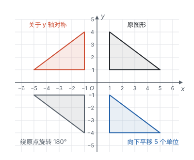

# 总览：给图形装上坐标

**给平面装上坐标，点就变成了一对数；图形的平移、翻折、旋转，就变成了对坐标的简单运算。**

## 从数轴到坐标系

数轴让每个数都有了一个位置（见第二部分“有理数”）。把两条数轴垂直地放在一起，平面上的每个点也都有了一对数，这就是平面直角坐标系。从此，“形”的问题可以用“数”来算：点的位置用坐标说，两点的距离用坐标差和勾股定理算，图形的面积用割补法算。

图形放进坐标系以后，还可以让它动起来。一个图形在平面上保持形状和大小不变地移动，只有三种基本方式：平移、轴对称（翻折）、旋转。

## 三种变换对比

| 变换 | 由什么确定 | 什么不变 | 什么改变 | 对应点的关系 | 坐标怎样变（举例） |
| --- | --- | --- | --- | --- | --- |
| 平移 | 方向、距离 | 形状、大小；对应线段平行（或共线） | 位置 | 连线平行（或共线）且相等 | 向右 $a$、向上 $b$：$(x + a, y + b)$ |
| 轴对称 | 对称轴 | 形状、大小；对称轴上的点 | 位置；顶点的绕向变反 | 对称轴垂直平分对应点连线 | 关于 $x$ 轴：$(x, -y)$；关于 $y$ 轴：$(-x, y)$ |
| 旋转 | 旋转中心、方向、旋转角 | 形状、大小；每点到中心的距离 | 位置；线段的方向 | 到中心距离相等，与中心连线的夹角等于旋转角 | 绕原点旋转 $180^\circ$：$(-x, -y)$ |
| 位似（对照） | 位似中心、相似比 | 形状；对应线段平行（或共线） | 位置、大小 | 连线都经过位似中心，到中心的距离成比例 | 以原点为中心、相似比 $k$：$(kx, ky)$ 或 $(-kx, -ky)$ |

读这张表，可以看出几件事：

- **前三种变换都不改变形状和大小，** 所以变换前后的图形全等。全等是“静止地看”，变换是“动起来看”（见第五部分“全等三角形”）。
- **旋转 $180^\circ$ 就是中心对称。** 两次沿互相垂直的直线翻折，结果正好是绕交点旋转 $180^\circ$：开头那张图里，第一象限的原三角形关于 $y$ 轴对称，落到第二象限；这个三角形再关于 $x$ 轴对称，就落到了第三象限，正是原三角形绕原点旋转 $180^\circ$ 的位置。
- **只有轴对称会把图形翻个面。** 平移和旋转怎么组合，顶点的绕向都不会变。
- **位似改变大小、保持形状，** 是从全等走向相似的变换，放在这里作对照（见第八部分“相似”）。

## 两页之间的关系

| 页面 | 讲什么 | 核心的想法 |
| --- | --- | --- |
| 平面直角坐标系 | 有序数对；点的坐标；象限；点到坐标轴的距离；用坐标描述图形和位置 | 两条数轴组成坐标系，点和有序实数对一一对应 |
| 平移、轴对称与旋转 | 三种变换的性质和画法；中心对称和中心对称图形；对称点的坐标；用坐标表示平移；图案设计；函数图象的平移 | 抓住对应点的关系，性质、画法、坐标规律都从它推出 |

建议的学习顺序：

1. 先学第六部分“平面直角坐标系”（七年级下册）。重点是从坐标的意义出发想问题：横坐标管左右，纵坐标管上下，距离是坐标差的绝对值。
2. 接着学第六部分“平移、轴对称与旋转”里的“平移”和“用坐标表示平移”（七年级下册）。
3. 学完第五部分“轴对称与等腰三角形”后（八年级上册），回来看“轴对称”和对称点的坐标。
4. 九年级上册学旋转时，再看“旋转”“中心对称”和“图案设计”，并把三种变换放在一起对比。

这一部分是后面许多内容的舞台：函数的图象画在坐标系里（见第七部分“函数”），抛物线的平移就是图象上每个点的平移（见第七部分“二次函数”），圆的许多性质来自旋转对称（见第九部分“圆的有关性质”），坐标让几何问题可以计算（见第十一部分“以数解形”）。
