# 平移、轴对称与旋转 ★

> 对应人教版七年级下册 7.4 节和 9.2 节、八年级上册第十五章、九年级上册第二十八章。

**平移、轴对称、旋转都只改变图形的位置，不改变图形的形状和大小，变换前后的两个图形全等。** 每种变换由几个要素完全确定，对应点之间有固定的关系；放进坐标系，这种关系就变成了坐标的简单运算。

## 从哪里来：纸片的三种动法

把一张三角形纸片放在桌上，不许撕、不许折、不许拉，只让它换个位置。仔细想想，基本的动法只有三种：

| 变换 | 怎样动 | 由什么确定 | 生活中的例子 |
| --- | --- | --- | --- |
| 平移 | 沿一个方向滑过去 | 方向、距离 | 推拉窗、电梯、传送带上的箱子 |
| 轴对称 | 沿一条直线翻过去 | 对称轴 | 对折剪纸、镜子里的像 |
| 旋转 | 绕一个点转过去 | 旋转中心、旋转方向、旋转角 | 钟表的指针、风车、拧螺丝 |

纸片本身没有变，所以**变换前后的图形全等**，对应线段相等，对应角相等。反过来，两个全等的图形，总能通过这几种变换的组合重合在一起（见第五部分“全等三角形”）。

研究每一种变换，就是研究一个问题：**对应点之间有什么关系？** 这个关系清楚了，性质就出来了，画图的方法也出来了：变换对图形上每一个点都按同一个规则作用，所以画图时只要找出几个关键点，把它们变过去，再连起来。

## 平移

在平面内，把一个图形整体沿某一方向移动一定的距离，叫**平移**。平移由**方向**和**距离**确定。

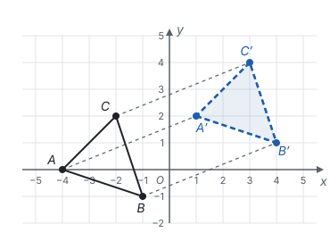

平移时，图形上**每一个点**都沿同一个方向移动了同样的距离。于是：

- **对应点所连的线段平行（或在同一条直线上）且相等：** $AA' \parallel BB' \parallel CC'$，$AA' = BB' = CC'$。
- **对应线段平行（或在同一条直线上）且相等：** $AA'$ 和 $BB'$ 平行且相等，所以四边形 $ABB'A'$ 是平行四边形（一组对边平行且相等），它的另一组对边也平行且相等，即 $AB \parallel A'B'$，$AB = A'B'$（见第五部分“四边形”）。
- **对应角相等，** 平移前后的图形全等。

**画平移后的图形：** 找出图形的关键点（多边形的顶点），把每个关键点都按规定的方向和距离移过去，再按原来的顺序连起来。

## 用坐标表示平移

在坐标系里，平移的方向和距离可以拆成水平、竖直两部分。一个点向右平移 $a$ 个单位，它沿水平方向移动，到 $x$ 轴的距离不变，纵坐标不变；它在水平方向上的读数增加 $a$，横坐标加 $a$。其他方向同理：

| 平移 | 点 $(x, y)$ 变成 |
| --- | --- |
| 向右平移 $a$ 个单位（$a > 0$） | $(x + a, y)$ |
| 向左平移 $a$ 个单位 | $(x - a, y)$ |
| 向上平移 $b$ 个单位（$b > 0$） | $(x, y + b)$ |
| 向下平移 $b$ 个单位 | $(x, y - b)$ |

**左右移动只改横坐标，上下移动只改纵坐标。** 斜着平移，就是两个方向各移一段，横、纵坐标各加一个数。反过来，一个图形上所有点的横坐标都加同一个数、纵坐标都加同一个数，这个图形就是平移了。

**例 1**　如图，$\triangle ABC$ 的顶点 $A(-4, 0)$，$B(-1, -1)$，$C(-2, 2)$。把 $\triangle ABC$ 平移，使点 $A$ 移到点 $A'(1, 2)$，求 $B'$、$C'$ 的坐标。

这是前面讲平移时用过的那张图：

**思路：** 平移时每个点的移动都一样。题目没有直接说怎样平移，但给了一对对应点，从 $A$ 到 $A'$ 的变化就是所有点的变化。

**解：** 从 $A(-4, 0)$ 到 $A'(1, 2)$，横坐标增加 $1 - (-4) = 5$，纵坐标增加 $2 - 0 = 2$，也就是向右平移 5 个单位、再向上平移 2 个单位。所以

$$B'(-1 + 5, -1 + 2) = B'(4, 1), \quad C'(-2 + 5, 2 + 2) = C'(3, 4).$$

**检验：** $BB'$ 的横向变化是 $4 - (-1) = 5$，纵向变化是 $1 - (-1) = 2$，和 $AA'$ 一样，符合“对应点的连线平行且相等”。

**想一想：** 例 1 里坐标系不动、图形动：$\triangle ABC$ 向右平移 5 个单位、向上平移 2 个单位，每个顶点的横坐标都加 5、纵坐标都加 2。反过来，图形不动、坐标系动，坐标也会这样变。第六部分“平面直角坐标系”的例 3 中，地图上的地点没有动，只是把原点从学校换到了公园：以学校为原点时公园是 $(-2, 3)$、图书馆是 $(3, 2)$，换成以公园为原点后，图书馆变成 $(5, -1)$、学校变成 $(2, -3)$，每个点的横坐标都加 2、纵坐标都加 −3，也是加上了同一对数。图形向右平移 2 个单位，和坐标系向左平移 2 个单位，坐标的变化完全一样：运动是相对的。

## 轴对称

把一个图形沿一条直线翻折，得到的图形和原图形**关于这条直线对称**，这条直线叫**对称轴**。轴对称由**对称轴**确定。一个图形沿一条直线对折，两旁的部分能够完全重合，这个图形叫**轴对称图形**。这些概念和垂直平分线的来历，见第五部分“轴对称与等腰三角形”，这里只看它和其他变换的对比。

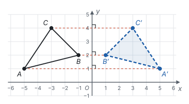

轴对称的核心性质：**对称轴是任何一对对应点所连线段的垂直平分线。** 图中 $AA'$、$BB'$、$CC'$ 都垂直于 $y$ 轴，并且被 $y$ 轴平分。

**画轴对称图形：** 对每个关键点，过它作对称轴的垂线，在垂线上对称轴的另一侧截取等长的线段，得到对称点，再按原来的顺序连起来。

翻折和另外两种变换有一点不同：**翻折会把图形翻个面。** 图中 $A \to B \to C$ 是逆时针方向，翻折后 $A' \to B' \to C'$ 变成了顺时针方向。只靠平移和旋转，永远改不了这个绕向；所以两个全等图形绕向相反时，要重合必须经过一次翻折。

## 旋转

在平面内，把一个图形绕着一个定点 $O$ 沿某个方向转动一个角度，叫**旋转**。点 $O$ 叫**旋转中心**，转动的角叫**旋转角**。旋转由**旋转中心、旋转方向（顺时针或逆时针）、旋转角**三个要素确定，少一个都说不清。

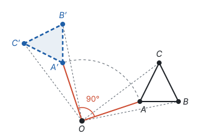

旋转时，图形像钉在 $O$ 点上的纸片一样转动，上面每一个点都绕 $O$ 画一段圆弧，转过同样的角度。于是：

- **对应点到旋转中心的距离相等：** $OA = OA'$，$OB = OB'$，$OC = OC'$；
- **对应点与旋转中心所连线段的夹角等于旋转角：** $\angle AOA' = \angle BOB' = \angle COC' = 90^\circ$；
- **旋转前后的图形全等。**

**画旋转后的图形：** 对每个关键点 $A$，连接 $OA$，按旋转方向作 $\angle AOA'$ 等于旋转角，在射线上截取 $OA' = OA$，得到 $A'$，再按原来的顺序连起来。

**找旋转中心：** 已知两对对应点 $A$、$A'$ 和 $B$、$B'$，因为 $OA = OA'$，$O$ 在 $AA'$ 的垂直平分线上；同样 $O$ 在 $BB'$ 的垂直平分线上。两条垂直平分线的交点就是旋转中心。

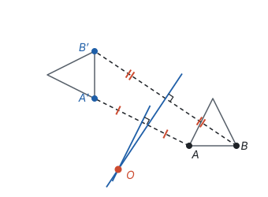

**旋转有什么用？** 旋转不改变长度和角度，却能把一个三角形整个搬到别处去。题目里分散在不同位置的线段和角，可以用旋转把它们拼到一起。

**例 2**　如图，正方形 $ABCD$ 的边长为 6，点 $E$ 在 $BC$ 上，点 $F$ 在 $CD$ 上，$\angle EAF = 45^\circ$。

(1) 求证：$EF = BE + DF$；

(2) 若 $BE = 3$，求 $DF$ 和 $EF$ 的长。

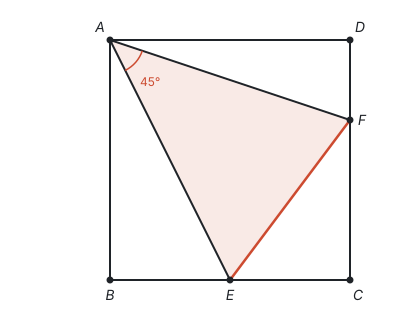

**思路：** 要证一条线段等于另两条线段的和，通常把两条线段接成一条。$BE$ 在 $BC$ 上，$DF$ 在 $CD$ 上，离得很远。注意正方形的两条邻边 $AD = AB$，夹角是 $90^\circ$：把 $\triangle ADF$ 绕点 $A$ 顺时针旋转 $90^\circ$，$AD$ 正好转到 $AB$ 上，$DF$ 就被搬到了 $B$ 点旁边，和 $BE$ 接在同一条直线上。

**证明：** (1) 把 $\triangle ADF$ 绕点 $A$ 顺时针旋转 $90^\circ$，因为 $AD = AB$，$\angle DAB = 90^\circ$，点 $D$ 落在点 $B$ 上。设点 $F$ 落在点 $G$，得到 $\triangle ABG$：

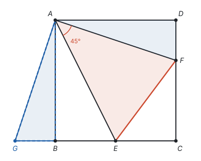

旋转不改变形状和大小，$\triangle ABG \cong \triangle ADF$，所以

$$AG = AF, \quad BG = DF, \quad \angle ABG = \angle D = 90^\circ, \quad \angle GAB = \angle FAD.$$

因为 $\angle ABG + \angle ABC = 90^\circ + 90^\circ = 180^\circ$，所以 $G$、$B$、$C$ 三点在一条直线上，$GE = BG + BE = DF + BE$。

又因为 $\angle BAE + \angle FAD = 90^\circ - \angle EAF = 45^\circ$，所以

$$\angle GAE = \angle GAB + \angle BAE = \angle FAD + \angle BAE = 45^\circ = \angle EAF.$$

在 $\triangle GAE$ 和 $\triangle FAE$ 中，$AG = AF$，$\angle GAE = \angle FAE$，$AE = AE$，所以 $\triangle GAE \cong \triangle FAE$（SAS），$GE = EF$。

所以 $EF = GE = BE + DF$。

**解：** (2) 设 $DF = x$，则 $EF = BE + DF = 3 + x$，$CE = 6 - 3 = 3$，$CF = 6 - x$。在 $\mathrm{Rt} \triangle ECF$ 中，由勾股定理，

$$(3 + x)^2 = 3^2 + (6 - x)^2.$$

展开得 $9 + 6x + x^2 = 45 - 12x + x^2$，所以 $18x = 36$，$x = 2$。所以 $DF = 2$，$EF = 5$。

**检验：** $CE = 3$，$CF = 4$，$EF = 5$，满足 $3^2 + 4^2 = 5^2$。

**回顾：** 旋转的目的是把 $DF$ 搬到 $BE$ 的延长线上。能转过去，靠的是正方形里两条**相等**的邻边 $AD$、$AB$ 有公共端点 $A$：以 $A$ 为中心，转过它们的夹角，一条边就和另一条重合。以后看到“共端点的两条等线段”（正方形、等边三角形、等腰直角三角形里都有），就可以想到绕这个公共端点旋转。

## 中心对称

旋转角是 $180^\circ$ 的旋转最特殊。把一个图形绕着某一点旋转 $180^\circ$，如果它能和另一个图形重合，就说这两个图形**关于这个点对称**，或者说**中心对称**，这个点叫**对称中心**。

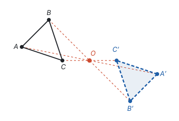

旋转 $180^\circ$ 时，$\angle AOA' = 180^\circ$，所以 $A$、$O$、$A'$ 在一条直线上；又 $OA = OA'$，所以 $O$ 是 $AA'$ 的中点。于是：

**中心对称的两个图形，对应点所连线段都经过对称中心，并且被对称中心平分。** 要找对称中心，连接两对对应点，交点就是。

和轴对称一样，也要分清“两个图形”和“一个图形”：一个图形绕某一点旋转 $180^\circ$ 后能和**自己**重合，这个图形叫**中心对称图形**。

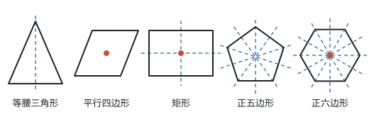

| 图形 | 轴对称图形 | 对称轴条数 | 中心对称图形 |
| --- | --- | --- | --- |
| 线段 | 是 | 2 | 是 |
| 等腰三角形（腰和底不相等） | 是 | 1 | 不是 |
| 等边三角形 | 是 | 3 | 不是 |
| 平行四边形 | 一般不是 | 0 | 是 |
| 矩形、菱形（不是正方形） | 是 | 2 | 是 |
| 正方形 | 是 | 4 | 是 |
| 正五边形 | 是 | 5 | 不是 |
| 正六边形 | 是 | 6 | 是 |
| 圆 | 是 | 无数条 | 是 |

**平行四边形是中心对称图形，对称中心是两条对角线的交点。** “平行四边形的对角线互相平分”说的正是这件事：每个顶点和它的对顶点关于对角线交点对称。

**正 $n$ 边形都有 $n$ 条对称轴，但只有 $n$ 是偶数时才是中心对称图形。** 绕中心旋转 $180^\circ$ 后，每个顶点都要落到另一个顶点上，这就要求每个顶点正对面还有一个顶点。$n$ 是奇数时，顶点的正对面是一条边的中点，所以正三角形、正五边形都不是中心对称图形。

## 对称点的坐标

在坐标系里，关于坐标轴或原点对称的点，坐标有简单的关系。这些关系都从对应点的性质推出来，不用单独记。

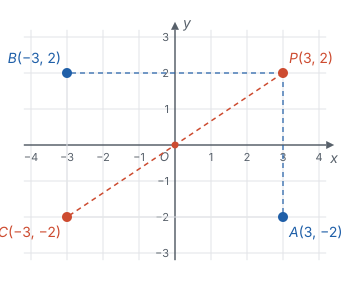

**关于 $x$ 轴对称：** $x$ 轴垂直平分 $PA$。“垂直”说明 $PA$ 是竖直的，横坐标相同；“平分”说明 $P$、$A$ 到 $x$ 轴的距离相等、分在两侧，纵坐标互为相反数。所以 $P(3, 2)$ 关于 $x$ 轴的对称点是 $A(3, -2)$。

**关于 $y$ 轴对称：** 同理，纵坐标相同，横坐标互为相反数，$P(3, 2)$ 关于 $y$ 轴的对称点是 $B(-3, 2)$。

**关于原点对称：** 原点是 $PC$ 的中点，从 $P$ 到 $O$ 是向左 3、向下 2，从 $O$ 到 $C$ 也是向左 3、向下 2，所以横、纵坐标都互为相反数，$C(-3, -2)$。

图中还能看出：$P(3, 2)$ 先关于 $y$ 轴对称到 $B(-3, 2)$，再关于 $x$ 轴对称，就到了 $C(-3, -2)$。**两次沿互相垂直的直线翻折，合起来就是绕交点旋转 $180^\circ$。** 翻两次面，绕向又翻了回来，所以结果是一个旋转。

把本页的坐标规律合在一起：

| 变换 | 点 $(x, y)$ 变成 | 哪个坐标变了 |
| --- | --- | --- |
| 向右平移 $a$、向上平移 $b$ | $(x + a, y + b)$ | 横、纵坐标各加一个数 |
| 关于 $x$ 轴对称 | $(x, -y)$ | 纵坐标变为相反数 |
| 关于 $y$ 轴对称 | $(-x, y)$ | 横坐标变为相反数 |
| 关于原点对称 | $(-x, -y)$ | 横、纵坐标都变为相反数 |

**例 3**　已知点 $P(a + 1, 3)$ 和点 $Q(-2, b - 1)$。$P$、$Q$ 分别关于 $x$ 轴、$y$ 轴、原点对称时，求 $a$、$b$ 的值。

**思路：** 每种对称都说清了哪个坐标相等、哪个坐标互为相反数，按它列出两个方程就行。拿不准时，想一想对称轴垂直平分对应点连线：关于 $x$ 轴对称，连线是竖直的，所以横坐标相等。

**解：**

| 情况 | 横坐标的关系 | 纵坐标的关系 | $a$ | $b$ |
| --- | --- | --- | --- | --- |
| 关于 $x$ 轴对称 | 相等：$a + 1 = -2$ | 互为相反数：$b - 1 = -3$ | $-3$ | $-2$ |
| 关于 $y$ 轴对称 | 互为相反数：$a + 1 = 2$ | 相等：$b - 1 = 3$ | $1$ | $4$ |
| 关于原点对称 | 互为相反数：$a + 1 = 2$ | 互为相反数：$b - 1 = -3$ | $1$ | $-2$ |

**检验：** 以关于 $x$ 轴对称为例，$a = -3$、$b = -2$ 时，$P(-2, 3)$，$Q(-2, -3)$，横坐标相同，纵坐标互为相反数，确实关于 $x$ 轴对称。

## 图案设计

许多美丽的图案，都是从一个简单的基本图形出发，经过平移、轴对称、旋转得到的。分析一个图案，就是找出它的基本图形和用到的变换；设计一个图案，就是反过来做。

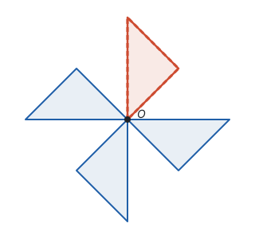

上图的风车，基本图形是强调色的那一片叶子。把它绕点 $O$ 依次旋转 $90^\circ$、$180^\circ$、$270^\circ$，得到另外三片。从这个“做法”可以直接读出图案的性质：

- 整个图案绕 $O$ 旋转 $90^\circ$ 后和自己重合，因为每片叶子都转到了下一片的位置；
- 所以旋转 $180^\circ$ 也和自己重合，它是**中心对称图形**；
- 它**不是轴对称图形**：每片叶子都朝同一个绕向“甩”出去，翻折会把绕向变反，找不到一条能让它和自己重合的对称轴。

同一个基本图形换一种变换，得到的图案就不一样：一片叶子不断平移，得到一排花边；沿一条直线翻折，得到左右对称的剪纸。

## 用坐标看函数图象的平移

函数图象也是图形，也可以平移。把 $y = x^2$ 的图象向右平移 2 个单位，得到的新图象是什么函数的图象？

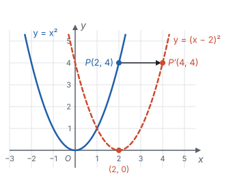

原图象上每个点 $(x, y)$ 都变成 $(x + 2, y)$。比如 $P(2, 4)$ 变成 $P'(4, 4)$，顶点 $O(0, 0)$ 变成 $(2, 0)$。

反过来想：新图象在横坐标为 $x$ 的地方有多高？它是从原图象上横坐标为 $x - 2$ 的点平移过来的，高度没变，所以新图象上 $y = (x - 2)^2$。**向右平移 2 个单位，式子里的 $x$ 换成 $x - 2$，** 因为新图象要“晚 2 个单位”才达到原来的高度。

向上平移 3 个单位就简单了：每个点的纵坐标加 3，式子变成 $y = x^2 + 3$。

一次函数 $y = kx + b$ 中 $b$ 的作用，就是把 $y = kx$ 的图象上下平移（见第七部分“一次函数”）。对直线来说，左右平移和上下平移还可以互相转化：$y = 2x$ 向右平移 1 个单位得 $y = 2(x - 1) = 2x - 2$，和向下平移 2 个单位的结果一样。二次函数的各种形式，也都是由 $y = ax^2$ 平移得到的（见第七部分“二次函数”）。

## 易错点

- **平移的坐标变化方向弄反。** 向左、向下是减，向右、向上是加；左右只改横坐标，上下只改纵坐标。拿不准时，画出一个点移动一下看看。
- **关于 $x$ 轴对称，改错了坐标。** 关于 **$x$ 轴**对称，横坐标不变、**纵坐标**变为相反数。原因是对应点连线垂直于 $x$ 轴，是竖直的。
- **旋转只说角度。** “旋转 $90^\circ$”说不清是哪个变换，必须同时说清旋转中心和旋转方向。
- **旋转角找错。** 旋转角是对应点与旋转中心所连线段的夹角，如 $\angle AOA'$，顶点一定在旋转中心。
- **中心对称和中心对称图形不分。** 前者说两个图形之间的关系，后者说一个图形自己的性质。轴对称和轴对称图形也一样。
- **平行四边形当成轴对称图形。** 一般的平行四边形沿任何直线对折都不能重合；它是中心对称图形。矩形、菱形、正方形才同时是轴对称图形。
- **正多边形都当成中心对称图形。** 只有边数是偶数的正多边形才是。
- **函数图象向右平移写成 $x + 2$。** 向右平移 2 个单位，新图象在 $x$ 处的高度等于原图象在 $x - 2$ 处的高度，所以是 $x$ 换成 $x - 2$。

## 联系

- **全等三角形：** 三种变换都不改变形状和大小，变换前后的图形全等；两个全等图形总能用变换的组合重合。见第五部分“全等三角形”。
- **轴对称与等腰三角形：** 轴对称的定义、垂直平分线、利用轴对称求最短路径。见第五部分“轴对称与等腰三角形”。
- **四边形：** 平移的性质靠平行四边形来证；平行四边形是中心对称图形，对角线互相平分。见第五部分“四边形”。
- **平面直角坐标系：** 所有坐标规律都从坐标的意义推出；换原点和平移是同一件事的两种看法。见第六部分“平面直角坐标系”。
- **一次函数和二次函数：** 函数图象的平移，就是图象上每个点的平移；抛物线是轴对称图形。见第七部分“一次函数”和第七部分“二次函数”。
- **反比例函数：** 反比例函数的图象是中心对称图形，对称中心是原点。见第七部分“反比例函数”。
- **相似：** 位似是另一种变换，它保持形状、按比例改变大小，在坐标系中表现为坐标乘同一个数。见第八部分“相似”。
- **圆：** 圆绕圆心旋转任意角度都和自己重合，弧、弦、圆心角之间的关系就是从这里来的。见第九部分“圆的有关性质”。
- **辅助线：** 旋转、翻折、平移都能把分散的条件集中起来，例 2 就是一个例子：正方形 $ABCD$ 中 $\angle EAF = 45^\circ$，把 $\triangle ADF$ 绕点 $A$ 顺时针旋转 $90^\circ$，$DF$ 就接到了 $BE$ 的延长线上，证出 $EF = BE + DF$。见第十一部分“辅助线从哪里来”。
