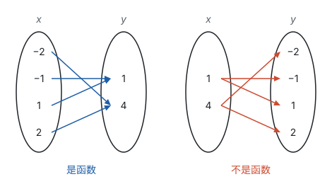
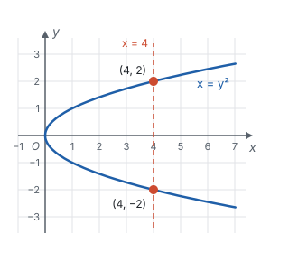
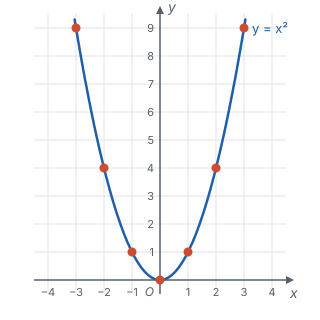
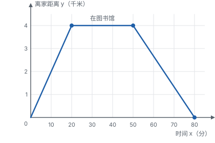
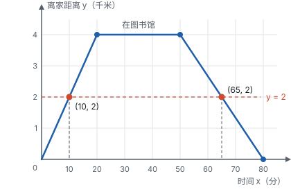

# 函数

> 对应人教版八年级下册第二十二章。

**函数是一种对应：在一个变化过程中，有两个变量 $x$ 和 $y$，对于 $x$ 的每一个确定的值，$y$ 都有唯一确定的值和它对应，就说 $y$ 是 $x$ 的函数。** 这里 $x$ 叫自变量；$x = a$ 时对应的 $y$ 值，叫 $x = a$ 时的函数值。

## 从哪里来

世界上很多量在变，而且一个量的变化常常跟着另一个量走：

| 变化过程 | 一个量 | 跟着变的量 | 关系 |
| --- | --- | --- | --- |
| 汽车以 60 km/h 匀速行驶 | 行驶时间 $x$（h） | 路程 $y$（km） | $y = 60x$ |
| 画不同大小的圆 | 半径 $r$ | 面积 $S$ | $S = \pi r^2$ |
| 一天之中 | 时刻 | 气温 | 写不出式子，但每个时刻都有一个气温 |

在一个变化过程中，数值会变的量叫**变量**，数值始终不变的量叫**常量**。$y = 60x$ 里，$x$、$y$ 是变量，60 是常量；$S = \pi r^2$ 里，$\pi$ 是常量。

这些例子有一个共同的样子：**先定下一个量，另一个量就跟着定下来了。** 时间定了，路程就定了；半径定了，面积就定了；时刻定了，气温就定了。

这种样子其实早就见过。代数式 $2x - 1$ 的值随 $x$ 变化：$x = 3$ 时值是 5，$x = -1$ 时值是 −3，$x$ 每取一个值，式子只算出一个值（见第三部分“代数式”）。函数就是把“代数式的值”这件事，推广到一切“一个量定下来、另一个量就跟着定下来”的变化过程，不管能不能写成式子。

## 为什么要“每一个”和“唯一”

定义里有两个关键词，各管一件事。

**“每一个”：** 自变量允许取的每个值，都要有函数值。允许取哪些值，叫自变量的**取值范围**，后面专门讲。

**“唯一”：** 一个 $x$ 只能对应一个 $y$。定义函数，就是为了“知道 $x$，就能说出 $y$ 是多少”；如果一个 $x$ 对应两个 $y$，就说不出“那个” $y$ 了。

下图左边，$x$ 取 −2、−1、1、2，每个 $x$ 都只射出一支箭头：这是 $y = x^2$，是函数。两个不同的 $x$ 指向同一个 $y$（−2 和 2 都对应 4）并不违反定义，“唯一”只要求从 $x$ 出发的箭头只有一支。右边是满足 $y^2 = x$ 的对应：$x = 4$ 时 $y$ 可以是 2，也可以是 −2，一个 $x$ 射出两支箭头，所以 $y$ 不是 $x$ 的函数。

放到坐标系里看：同一个 $x$ 对应的点都在同一条竖直的直线上。“唯一”就是说，**任何一条竖直的直线和函数的图象最多只有一个交点。** 下面是满足 $x = y^2$ 的点组成的图形，竖直的直线 $x = 4$ 和它交于 $(4, 2)$、$(4, -2)$ 两点，所以它不是 $y$ 关于 $x$ 的函数的图象：

## 自变量的取值范围

自变量不是想取什么值都行，要受两方面的限制：

| 限制来自 | 要求 | 例子 |
| --- | --- | --- |
| 分式 | 分母不能为 0 | $y = \frac{1}{x - 2}$ 中 $x \ne 2$ |
| 二次根式 | 被开方数不能是负数 | $y = \sqrt{x + 3}$ 中 $x \ge -3$ |
| 实际意义 | 符合实际：长度、时间为正数，件数、人数为整数等 | 买 $x$ 支笔，$x$ 是正整数 |

整式（如 $y = 2x - 1$）对 $x$ 没有限制，$x$ 可以取任意实数。几种限制同时出现时，要**同时满足**，取它们的公共部分。

**例 1**　求下面函数中自变量 $x$ 的取值范围：

$$y = \frac{\sqrt{x + 2}}{x - 1}$$

**思路：** 式子里有两处会“出问题”：根号里不能是负数，分母不能是 0。两个要求同时满足。

**解：** 由 $x + 2 \ge 0$，得 $x \ge -2$；由 $x - 1 \ne 0$，得 $x \ne 1$。所以 $x \ge -2$ 且 $x \ne 1$。

**例 2**　等腰三角形的周长是 20 cm，腰长为 $x$ cm，底边长为 $y$ cm。写出 $y$ 关于 $x$ 的函数解析式，并求自变量的取值范围。

**思路：** 解析式由周长直接得到。取值范围不能只看式子 $y = 20 - 2x$（式子对 $x$ 没有限制），要看实际意义：边长是正数，三条边还要能围成三角形。

**解：** 由 $2x + y = 20$，得 $y = 20 - 2x$。

1. 底边长为正数：$20 - 2x > 0$，得 $x < 10$。
2. 两腰之和大于底边（三角形两边之和大于第三边，见第五部分“三角形”）：$2x > 20 - 2x$，得 $x > 5$。
3. 腰长 $x$ 是正数，已包含在 $x > 5$ 中。

所以 $y = 20 - 2x$，自变量的取值范围是 $5 < x < 10$。

**检验：** 取 $x = 6$，底边 $y = 8$，三边 6、6、8 能围成三角形；取 $x = 4$，底边 $y = 12$，$4 + 4 < 12$，围不成。

## 三种表示法

同一个函数可以用三种方式写出来。比如每支笔 3 元，买 $x$ 支笔花 $y$ 元：

| 表示法 | 这个例子 | 好处 | 局限 |
| --- | --- | --- | --- |
| 列表法 | 列出 $x = 1, 2, 3, 4, 5$ 时 $y = 3, 6, 9, 12, 15$ | 不用计算，直接查到函数值 | 只能列出一部分，看不出整体规律 |
| 解析式法 | $y = 3x$（$x$ 为正整数） | 准确、完整，便于计算和推理 | 不直观；有些关系写不出式子 |
| 图象法 | 在坐标系中描出点 $(1, 3)$、$(2, 6)$、…… | 直观，一眼看出变化趋势 | 读出的数值往往不精确 |

这三种表示法说的是同一个对应关系，学函数就是在三者之间来回翻译：由式子列表、画图，由图读出性质，再回到式子说明为什么（见第一部分“三种数学语言”）。

注意这个例子的图象：$x$ 只能取正整数，所以图象是一个个孤立的点，不能连成直线。**图象是什么样子，要看自变量的取值范围。**

**画函数图象的方法叫描点法，** 分三步：列表（取一些自变量的值，算出函数值）、描点（以每一对值为坐标，在坐标系中描出点）、连线（按自变量从小到大，用平滑的曲线连起来）。比如画 $y = x^2$：

| $x$ | −3 | −2 | −1 | 0 | 1 | 2 | 3 |
| --- | --- | --- | --- | --- | --- | --- | --- |
| $y$ | 9 | 4 | 1 | 0 | 1 | 4 | 9 |

函数的图象，就是**所有满足解析式的点** $(x, y)$ 组成的图形：图象上每个点的坐标都满足解析式，满足解析式的点都在图象上。这句话是后面判断“点在不在图象上”和求交点的依据。

## 读图：从图象中读出信息

**例 3**　小明骑车从家出发去图书馆，在图书馆看了一会儿书，再骑车回家。下图是他离家的距离 $y$（千米）和出发后的时间 $x$（分）的关系。

（1）图书馆离家多远？小明在图书馆待了多久？

（2）去图书馆和回家的速度分别是多少？

（3）出发后多长时间，小明离家 2 千米？

**思路：** 横轴是时间，纵轴是离家的距离。图象上升，说明离家越来越远；水平，说明距离不变，人没有动；下降，说明在往回走。每一段的速度就是“距离的变化 ÷ 时间的变化”。

**解：**（1）$x$ 从 20 到 50，$y$ 一直是 4，所以图书馆离家 4 千米，小明在图书馆待了 $50 - 20 = 30$ 分钟。

（2）去：20 分钟走 4 千米，每分钟 0.2 千米，即 12 千米/时。回：从 $x = 50$ 到 $x = 80$，30 分钟走 4 千米，即 8 千米/时。

（3）去的路上，每分钟走 0.2 千米，走 2 千米用 $2 \div 0.2 = 10$ 分钟；回的路上，要走 $4 - 2 = 2$ 千米，每分钟走 $\frac{4}{30} = \frac{2}{15}$ 千米，用 $2 \div \frac{2}{15} = 15$ 分钟，所以 $x = 50 + 15 = 65$。答：出发后 10 分钟和 65 分钟时，小明离家 2 千米。

**回顾：** 第（3）问有两个答案，图上一条水平的直线 $y = 2$ 和图象交于两点：

所以在这个过程中，$y$ 是 $x$ 的函数（每个时刻只有一个距离），$x$ 却不是 $y$ 的函数（同一个距离对应两个时刻，$y = 4$ 时更是对应无数个时刻）。谁是谁的函数，要回到定义里的“唯一”去判断。

## 易错点

- **把“唯一”理解成“一一对应”。** $y = x^2$ 中，$x = 2$ 和 $x = -2$ 对应同一个 $y = 4$，$y$ 仍然是 $x$ 的函数。定义只要求一个 $x$ 对应一个 $y$，不要求一个 $y$ 只对应一个 $x$。
- **求取值范围只考虑一种限制。** 式子里既有分母又有根号时，两个条件都要写，并且用“且”连起来；实际问题还要再看实际意义，比如例 2（周长 20 cm 的等腰三角形，腰长 $x$ cm，底边长 $y = 20 - 2x$ cm）里还要用三角形三边的关系，才得到 $5 < x < 10$。
- **忽视二次根式在分母上的情况。** $y = \frac{1}{\sqrt{x - 1}}$ 中，根号在分母上，被开方数既不能是负数，也不能是 0，所以 $x > 1$，不是 $x \ge 1$。
- **图象上的点和解析式对不上。** 点在函数图象上，它的坐标就一定满足解析式，可以代入；反过来，坐标不满足解析式的点，一定不在图象上。
- **读图时看错了纵轴的意思。** 例 3（小明骑车去图书馆，看了一会儿书，再骑车回家）中纵轴是“离家的距离”，不是“走过的路程”。图象下降，是在往家的方向走，走过的路程其实还在增加。

## 联系

- **代数式：** 代数式的值随字母变化，字母每取一个值，式子只有一个值，这就是函数的雏形。见第三部分“代数式”。
- **平面直角坐标系：** 有了坐标系，一对对 $(x, y)$ 才能画成点，函数才有了图象。见第六部分“平面直角坐标系”。
- **三种数学语言：** 解析式、表格、图象是同一个函数的符号语言和图形语言。见第一部分“三种数学语言”。
- **一次函数、反比例函数、二次函数：** 初中要学的三种具体的函数，每一种都从解析式出发研究图象和性质。见第七部分“总览：三种函数对照”。
- **动点与函数：** 图形里的点在动，线段长、面积跟着变，就产生了函数。见第十一部分“动点与函数”。
