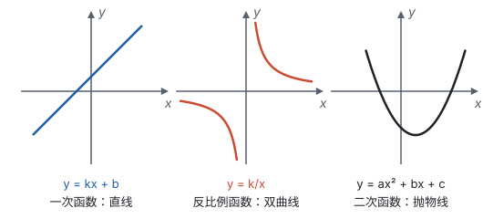

# 总览：三种函数对照

**这一部分研究变化中的对应关系：先弄清什么是函数，再学一次函数、反比例函数、二次函数三种具体的函数。每一种函数都有解析式和图象两种面貌，性质既能从式子推出来，也能在图上看出来。**

## 对照表

| | 一次函数 | 反比例函数 | 二次函数 |
| --- | --- | --- | --- |
| 解析式 | $y = kx + b$（$k \ne 0$） | $y = \frac{k}{x}$（$k \ne 0$） | $y = ax^2 + bx + c$（$a \ne 0$） |
| 描述什么样的变化 | 均匀变化：$x$ 每增加 1，$y$ 变化同一个数 | 乘积一定：$xy = k$ | $x$ 每增加 1，$y$ 的变化量本身在均匀地变 |
| 自变量的取值范围 | 全体实数 | $x \ne 0$ | 全体实数 |
| 图象 | 直线 | 双曲线，两支 | 抛物线 |
| 系数管什么 | $k$ 管方向和陡缓，$b$ 管与 $y$ 轴的交点 | $k$ 的正负管所在象限，$\lvert k \rvert$ 管离原点的远近 | $a$ 管开口方向和大小，顶点 $(h, k)$ 管位置，$c$ 管与 $y$ 轴的交点 |
| 增减性 | $k > 0$ 时增大，$k < 0$ 时减小 | 在每一个象限内：$k > 0$ 时减小，$k < 0$ 时增大 | 以对称轴为界，两侧相反 |
| 对称性 | — | 关于原点中心对称，关于直线 $y = x$、$y = -x$ 轴对称 | 关于对称轴 $x = h$ 轴对称 |
| 最大值、最小值 | 没有 | 没有 | 在顶点取到（顶点在取值范围内时） |
| 确定解析式要几个条件 | 2 个 | 1 个 | 3 个 |
| 几何意义 | $k$ 是倾斜程度 | $\lvert k \rvert$ 是图上矩形的面积 | 顶点是最高点或最低点 |
| 与方程、不等式 | $y = 0$ 是一元一次方程；图象在 $x$ 轴上方、下方是一元一次不等式 | 和直线联立，消元后是分式方程，常化成一元二次方程 | $y = 0$ 是一元二次方程，判别式决定和 $x$ 轴的交点个数 |

表里的“增减性”都是“$y$ 随 $x$ 的增大而……”；二次函数表里的 $k$ 是顶点的纵坐标，和反比例函数的 $k$ 不是一回事。

## 研究每一种函数，走的是同一条路

三种函数的页面，都按同一个顺序展开：

1. **从实际问题得到解析式：** 均匀变化、乘积一定、面积和利润，各自引出一种函数。
2. **描点画图：** 列表、描点、连线（见第七部分“函数”）。
3. **看图说性质，再用式子说明：** 图上看出的对称、增减，都要回到解析式说清为什么。
4. **待定系数法：** 有几个待定的系数，就需要几个条件。
5. **联系方程和不等式：** 令 $y = 0$ 或者让两个函数相等，就回到了方程。
6. **解决实际问题：** 比较方案、求最大值或最小值，注意自变量的取值范围。

学透了一次函数，反比例函数和二次函数就是沿着同一条路再走两遍。每走到一步，都可以问自己：上一种函数在这一步是什么样子？

## 函数、方程、不等式：同一件事的几种问法

设两个函数的值分别是 $y_1$、$y_2$，下面每一行左右两边问的是同一件事：

| 在图象上看 | 用方程、不等式说 |
| --- | --- |
| 图象与 $x$ 轴交点的横坐标 | 方程 $y_1 = 0$ 的解 |
| 图象在 $x$ 轴上方的部分对应的 $x$ 的范围 | 不等式 $y_1 > 0$ 的解 |
| 两个图象的交点 | 两个解析式联立成的方程组的解 |
| 一个图象在另一个图象上方的部分对应的 $x$ 的范围 | 不等式 $y_1 > y_2$ 的解 |

第四部分“总览：从等式到方程”里有一张对照表，把解一元一次方程、一元一次不等式、二元一次方程组、一元二次方程，分别对应成直线与 $x$ 轴的交点、直线在 $x$ 轴上方的部分、两条直线的交点、抛物线与 $x$ 轴的交点。这里是那张表的完整版：方程和不等式是代数的问法，函数图象是几何的问法。

## 学习顺序

1. **函数：** 先弄清“对应”和“唯一”，会求自变量的取值范围，会读图（见第七部分“函数”）。学之前要熟悉第六部分“平面直角坐标系”。
2. **一次函数：** 最简单的函数，把“解析式 ↔ 图象 ↔ 方程、不等式”的对应关系完整走一遍（见第七部分“一次函数”）。
3. **反比例函数：** 和正比例函数对照着学，重点是“在每一个象限内”和 $k$ 的几何意义（见第七部分“反比例函数”）。
4. **二次函数：** 学完第四部分“一元二次方程”后再学，重点是配方找顶点、平移和最值（见第七部分“二次函数”）。

学完这一部分，可以接着看第十一部分“动点与函数”：图形中的点在运动，线段和面积跟着变，就要用这里的三种函数去描述。
