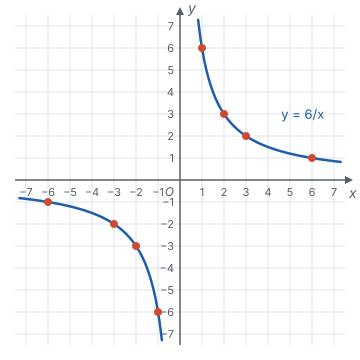
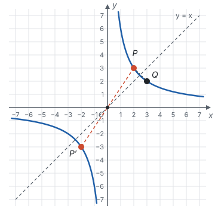
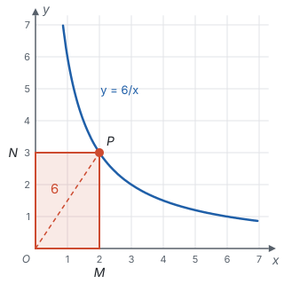
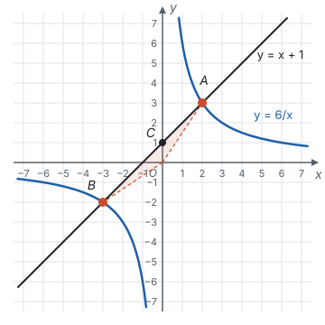

# 反比例函数 ★

> 对应人教版九年级上册第二十七章。

**反比例函数描述“乘积一定”：两个变量 $x$、$y$ 的乘积总是同一个不为 0 的常数 $k$，写成 $y = \frac{k}{x}$（$k \ne 0$）。** 它的图象是分在两个象限里的两支曲线，叫双曲线。

## 从哪里来

| 情境 | 不变的量 | 两个变量 | 关系 |
| --- | --- | --- | --- |
| 面积为 12 cm² 的长方形 | 面积 12 | 长 $x$，宽 $y$ | $xy = 12$，即 $y = \frac{12}{x}$ |
| 从甲地到乙地，路程 120 km | 路程 120 | 速度 $v$，时间 $t$ | $vt = 120$，即 $t = \frac{120}{v}$ |
| 一批零件共 600 个，平均分给几个人做 | 总数 600 | 人数 $n$，每人做的个数 $m$ | $nm = 600$，即 $m = \frac{600}{n}$ |

共同点是：**两个量的乘积不变。** 一个量变成原来的 2 倍，另一个量就变成原来的一半，这就是“成反比例”。一般地，形如

$$y = \frac{k}{x}\quad(k \text{ 是常数，} k \ne 0)$$

的函数叫**反比例函数**。它也可以写成 $xy = k$ 或 $y = kx^{-1}$。

和正比例函数对照着看：正比例函数 $y = kx$ 是**比值**一定（$\frac{y}{x} = k$），反比例函数是**乘积**一定（$xy = k$）。

定义里的两个限制都有来由：

- **$x \ne 0$：** $x$ 在分母上，分母不能为 0。
- **$k \ne 0$：** $k = 0$ 时 $y$ 恒等于 0，不再随 $x$ 变化。

由 $xy = k \ne 0$ 还能看出：$y$ 也永远不会等于 0。

## 图象：为什么是两支曲线

用描点法画 $y = \frac{6}{x}$ 的图象：

| $x$ | −6 | −3 | −2 | −1 | 1 | 2 | 3 | 6 |
| --- | --- | --- | --- | --- | --- | --- | --- | --- |
| $y$ | −1 | −2 | −3 | −6 | 6 | 3 | 2 | 1 |

图象的样子，每一点都能从解析式 $xy = 6$ 推出来：

1. **分成两支。** $x$ 不能取 0，所以 $y$ 轴上没有图象上的点，图象在 $y$ 轴两侧断开。
2. **在第一、三象限。** $xy = 6 > 0$，$x$、$y$ 同号：$x > 0$ 时 $y > 0$，$x < 0$ 时 $y < 0$。
3. **越来越靠近坐标轴，但永远碰不到。** $x$ 越大，$y = \frac{6}{x}$ 越接近 0，曲线越贴近 $x$ 轴，但 $y$ 不会等于 0；$x$ 越接近 0，$y$ 越大，曲线越贴近 $y$ 轴，但 $x$ 不会等于 0。

## k 管什么

**$k$ 的正负管位置和增减。** $k > 0$ 时 $x$、$y$ 同号，图象在第一、三象限；$k < 0$ 时 $x$、$y$ 异号，图象在第二、四象限。

增减性用作差来说明。设 $k > 0$，在第一象限的那一支上取两点，$0 < x_1 < x_2$，则

$$y_1 - y_2 = \frac{k}{x_1} - \frac{k}{x_2} = \frac{k(x_2 - x_1)}{x_1 x_2}.$$

$k > 0$，$x_2 - x_1 > 0$，$x_1 x_2 > 0$，所以 $y_1 - y_2 > 0$，即 $y_1 > y_2$：$x$ 增大，$y$ 减小。$x_1 < x_2 < 0$ 时，$x_1 x_2$ 仍然大于 0，结论一样。$k < 0$ 时，差的符号反过来，$y$ 随 $x$ 的增大而增大。

注意推导里用到了 $x_1 x_2 > 0$，也就是 **$x_1$、$x_2$ 同号，两点在同一支上。** 两点分别在两支上时，结论不成立：$y = \frac{6}{x}$ 中，$x = -1$ 时 $y = -6$，$x = 1$ 时 $y = 6$，$x$ 增大，$y$ 反而增大了。所以增减性一定要说“**在每一个象限内**”。

**$\lvert k \rvert$ 管远近。** $\lvert k \rvert$ 越大，同一个 $x$ 对应的 $\lvert y \rvert$ 越大，曲线离原点越远。

| | $k > 0$ | $k < 0$ |
| --- | --- | --- |
| 图象所在象限 | 第一、三象限 | 第二、四象限 |
| 增减性 | 在每一个象限内，$y$ 随 $x$ 的增大而减小 | 在每一个象限内，$y$ 随 $x$ 的增大而增大 |

## 对称性

在 $y = \frac{6}{x}$ 的图象上取点 $P(2, 3)$。

- 点 $P'(-2, -3)$ 也满足 $xy = 6$，也在图象上。一般地，$(a, b)$ 在图象上，则 $(-a)(-b) = ab = k$，所以 $(-a, -b)$ 也在图象上。$(a, b)$ 和 $(-a, -b)$ 关于原点对称，所以**双曲线是中心对称图形，对称中心是原点。**
- 点 $Q(3, 2)$ 也在图象上。一般地，$(a, b)$ 在图象上，则 $ba = k$，$(b, a)$ 也在图象上。$(a, b)$ 和 $(b, a)$ 关于直线 $y = x$ 对称，所以**双曲线也是轴对称图形**，直线 $y = x$ 是它的一条对称轴（同理，$(-b, -a)$ 也在图象上，直线 $y = -x$ 是另一条）。

过原点的直线也关于原点中心对称，所以双曲线和一条过原点的直线相交时，一个交点关于原点的对称点也同时在两个图象上，两个交点关于原点对称。

## k 的几何意义：面积不变

“乘积一定”在图上是什么样子？在 $y = \frac{6}{x}$ 的图象上任取一点 $P(x, y)$，作 $PM \perp x$ 轴于点 $M$，$PN \perp y$ 轴于点 $N$，得到长方形 $OMPN$。它的两条边长是 $\lvert x \rvert$ 和 $\lvert y \rvert$，所以

$$S_{\text{长方形}OMPN} = \lvert x \rvert \cdot \lvert y \rvert = \lvert xy \rvert = \lvert k \rvert = 6.$$

点 $P$ 在曲线上怎么动，长方形的形状都在变，面积却始终是 6：

连接 $OP$，它把长方形分成两个全等的直角三角形，所以 $S_{\triangle OPM} = \frac{\lvert k \rvert}{2}$。

反过来，已知这样的长方形或三角形的面积，就能求出 $\lvert k \rvert$，再由图象所在的象限定出 $k$ 的正负。

## 待定系数法：一个条件就够了

反比例函数 $y = \frac{k}{x}$ 只有一个待定的系数 $k$，所以**一个条件**就能确定它。

**例 1**　反比例函数的图象经过点 $(2, -3)$。求它的解析式，并判断点 $(-1, 6)$、$(3, 2)$ 是否在这个函数的图象上。

**思路：** 设 $y = \frac{k}{x}$，用 $k = xy$ 求 $k$ 最快。判断点在不在图象上，就看它的坐标满不满足解析式，也就是横、纵坐标的乘积是不是 $k$。

**解：** 设 $y = \frac{k}{x}$。把 $(2, -3)$ 代入，得 $k = 2 \times (-3) = -6$，所以解析式是 $y = -\frac{6}{x}$。

$(-1) \times 6 = -6$，所以点 $(-1, 6)$ 在图象上；$3 \times 2 = 6 \ne -6$，所以点 $(3, 2)$ 不在图象上。

## 比较函数值的大小

**例 2**　点 $A(-2, y_1)$、$B(-1, y_2)$、$C(3, y_3)$ 都在 $y = \frac{6}{x}$ 的图象上，比较 $y_1$、$y_2$、$y_3$ 的大小。

**思路：** 解析式和横坐标都知道，直接算出三个函数值最稳妥。

**解：** $y_1 = \frac{6}{-2} = -3$，$y_2 = \frac{6}{-1} = -6$，$y_3 = \frac{6}{3} = 2$，所以 $y_3 > y_1 > y_2$。

**想一想：** 如果把函数换成 $y = \frac{m^2 + 1}{x}$，$m$ 不知道，就算不出具体的值了，这时要用性质：

1. $k = m^2 + 1 > 0$，图象在第一、三象限，在每一个象限内 $y$ 随 $x$ 的增大而减小。
2. $A$、$B$ 的横坐标都是负数，在第三象限的同一支上；$-2 < -1$，所以 $y_1 > y_2$。
3. $C$ 在第一象限，$y_3 > 0$；而 $y_1$、$y_2$ 都小于 0。

所以仍然是 $y_3 > y_1 > y_2$。直接计算适合数都已知的情况；用性质比较，要先把点**按所在的象限分组**，同一组里才能用增减性，不同组之间比较正负。

## 和一次函数的交点

**例 3**　一次函数 $y = x + 1$ 的图象与反比例函数 $y = \frac{6}{x}$ 的图象交于 $A$、$B$ 两点（点 $A$ 在第一象限），直线 $AB$ 与 $y$ 轴交于点 $C$。

（1）求 $A$、$B$ 两点的坐标；

（2）求 $\triangle AOB$ 的面积；

（3）$x$ 取什么值时，一次函数的值大于反比例函数的值？

**思路：** 交点同时在两个图象上，它的坐标同时满足两个解析式，所以联立成方程组。$\triangle AOB$ 的三条边都不在坐标轴上，但直线 $AB$ 和 $y$ 轴交于 $C$，$OC$ 把它分成两个三角形，它们以 $OC$ 为公共底，高就是 $A$、$B$ 到 $y$ 轴的距离。

**解：**（1）联立

$$\begin{cases} y = x + 1, \\ y = \dfrac{6}{x}, \end{cases}$$

得 $x + 1 = \frac{6}{x}$，两边乘 $x$，整理得 $x^2 + x - 6 = 0$，即 $(x + 3)(x - 2) = 0$，所以 $x = 2$ 或 $x = -3$。代入 $y = x + 1$，得 $A(2, 3)$，$B(-3, -2)$。

（2）在 $y = x + 1$ 中令 $x = 0$，得 $C(0, 1)$，$OC = 1$。点 $A$ 到 $y$ 轴的距离是 2，点 $B$ 到 $y$ 轴的距离是 3，所以

$$S_{\triangle AOB} = S_{\triangle AOC} + S_{\triangle BOC} = \frac{1}{2} \times 1 \times 2 + \frac{1}{2} \times 1 \times 3 = \frac{5}{2}.$$

（3）“一次函数的值大于反比例函数的值”，就是直线在双曲线**上方**。看图，以两个交点的横坐标 −3、2 和不能取的 0 为分界：$-3 < x < 0$ 时直线在上方，$x > 2$ 时直线也在上方。所以 $-3 < x < 0$ 或 $x > 2$。

**检验：** 取 $x = -1$，$x + 1 = 0$，$\frac{6}{x} = -6$，$0 > -6$，成立；取 $x = 1$，$2 < 6$，不成立，和答案一致。

**回顾：** $A(2, 3)$ 和 $B(-3, -2)$ 不关于原点对称，因为直线 $y = x + 1$ 不过原点。只有过原点的直线和双曲线的两个交点，才关于原点对称。

## 实际问题

**例 4**　某蓄电池的电压一定，用它给一个可变电阻 $R$（Ω）供电，电流 $I$（A）与 $R$ 成反比例。当 $R = 9$ 时，$I = 4$。

（1）写出 $I$ 关于 $R$ 的函数解析式；

（2）如果电路中的电流不能超过 12 A，可变电阻 $R$ 应控制在什么范围？

**思路：** 电压一定，就是 $I$ 与 $R$ 的乘积一定。求范围时，先找 $I$ 正好等于 12 时的 $R$，再看 $R$ 往哪边变电流会变小。

**解：**（1）设 $I = \frac{k}{R}$，由 $k = 9 \times 4 = 36$，得 $I = \frac{36}{R}$（$R > 0$）。

（2）$I = 12$ 时，$R = \frac{36}{12} = 3$。$k = 36 > 0$，$R > 0$，在第一象限内 $I$ 随 $R$ 的增大而减小，所以要 $I \le 12$，需要 $R \ge 3$。答：可变电阻应不小于 3 Ω。

## 易错点

- **增减性漏了“在每一个象限内”。** 反比例函数在整个定义范围上并不单调：$y = \frac{6}{x}$ 中，$x = -1$ 时 $y = -6$，$x = 1$ 时 $y = 6$，$x$ 增大，$y$ 反而增大了。比较函数值时，先看点在不在同一支上。
- **几何意义忘了绝对值，或者把三角形当成长方形。** 长方形 $OMPN$ 的面积是 $\lvert k \rvert$，$\triangle OPM$ 的面积是 $\frac{\lvert k \rvert}{2}$。由面积求 $k$ 时，还要根据图象所在象限确定符号。
- **把不是反比例函数的式子当成反比例函数。** $y = \frac{2}{x + 1}$、$y = \frac{1}{x^2}$ 都不是反比例函数：前者的分母不是 $x$，后者 $xy$ 不是常数。判断时看能不能化成 $xy = k$（$k \ne 0$）。
- **以为图象和坐标轴有交点。** $x \ne 0$、$y \ne 0$，双曲线只会无限靠近坐标轴，不会相交。
- **解不等式时漏了 $x = 0$ 这个分界。** 例 3 第（3）问求 $y = x + 1$ 的值大于 $y = \frac{6}{x}$ 的值时 $x$ 的范围，两个交点的横坐标是 −3 和 2，答案是 $-3 < x < 0$ 或 $x > 2$。$x$ 从负数变到正数时，要经过双曲线断开的地方，所以答案分成两段。

## 联系

- **分式：** $y = \frac{k}{x}$ 是分式，$x \ne 0$ 就是分式有意义的条件；面积一定的长方形，一边变长另一边就变短。见第三部分“分式”。
- **分式方程：** 路程一定时时间和速度成反比，工作量一定时时间和效率成反比，列出的分式方程里藏着反比例关系。见第四部分“分式方程”。
- **一次函数：** 正比例函数是比值一定，反比例函数是乘积一定；两者的交点要联立方程组去求。见第七部分“一次函数”。
- **一元二次方程：** 一次函数和反比例函数联立，消元后常得到一元二次方程，它有几个根，两个图象就有几个交点。见第四部分“一元二次方程”。
- **中心对称和轴对称：** 双曲线关于原点中心对称，关于直线 $y = x$ 和 $y = -x$ 轴对称。见第六部分“平移、轴对称与旋转”。
- **以数解形：** 用 $k$ 的几何意义求面积，是用坐标算几何量的典型。见第十一部分“以数解形”。
