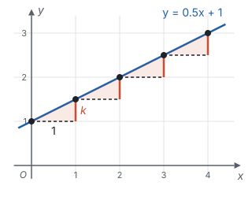
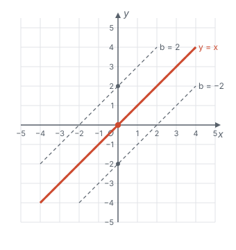
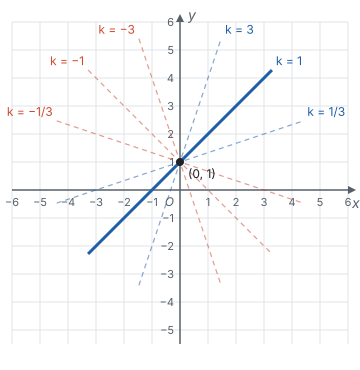
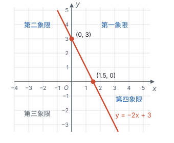
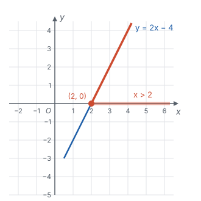
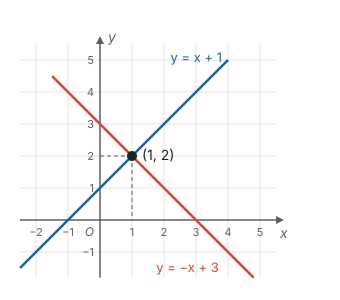
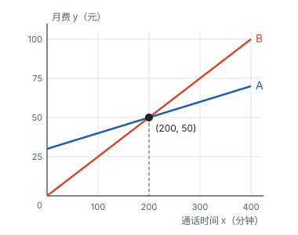

# 一次函数 ★

> 对应人教版八年级下册第二十三章。

**一次函数描述“均匀变化”：自变量 $x$ 每增加 1，函数值 $y$ 总是变化同一个数 $k$。** 写成式子是 $y = kx + b$（$k$、$b$ 是常数，$k \ne 0$），它的图象是一条直线。

## 从哪里来

先看几个生活中的例子：

| 情境 | 起点 | 每一步的变化 | 函数关系 |
| --- | --- | --- | --- |
| 手机套餐：月租 20 元，每通话 1 分钟加 0.1 元 | 不打电话也要付 20 元 | 每多 1 分钟，多 0.1 元 | $y = 0.1x + 20$ |
| 一根 20 cm 长的蜡烛，每分钟烧掉 0.5 cm | 开始时长 20 cm | 每过 1 分钟，短 0.5 cm | $y = -0.5x + 20$ |
| 匀速行驶的汽车，速度 60 km/h，从出发点开始计算路程 | 开始时路程为 0 | 每过 1 小时，多走 60 km | $y = 60x$ |

三个例子的共同点是：**有一个起点，然后每一步变化的量都一样。** 起点就是 $b$（$x = 0$ 时 $y$ 的值），每一步的变化量就是 $k$。这种关系就叫一次函数：

- **$y = kx + b$（$k \ne 0$）** 叫一次函数。$x$ 的次数是 1，所以叫“一次”。
- $b = 0$ 时，$y = kx$ 叫**正比例函数**，它是一次函数的特殊情况：起点是 0，$y$ 和 $x$ 成正比。

为什么要求 $k \ne 0$？$k = 0$ 时 $y = b$，不管 $x$ 怎么变，$y$ 都不变，已经没有“变化”可言，也就不是一次函数了。

## 为什么图象是一条直线

在 $y = 0.5x + 1$ 的图象上，取 $x = 0, 1, 2, 3, 4$ 这几个点。$x$ 每增加 1，$y$ 都增加 0.5。从一个点走到下一个点，都是“向右 1 格、向上 0.5 格”，形成一级一级相同的台阶：

每一级台阶都是一个直角三角形，两条直角边分别是 1 和 $k$，夹角都是直角。根据“两边及其夹角分别相等的两个三角形全等”，这些小三角形全部全等（见第五部分“全等三角形”），所以每一段斜边和水平方向的夹角都相等。相邻两段斜边首尾相接、方向又相同，连起来就不会拐弯，是一条直线。

$x$ 不只取整数，取 0.5、0.1 这样更小的步长，道理也一样。所以一次函数的图象是一条直线。

既然是直线，**画图时只要找两个点**，因为两点确定一条直线（见第一部分“基本事实”）。最方便的两个点通常是与 $y$ 轴的交点 $(0, b)$，和再往右走 1 步的点 $(1, k + b)$。

## k 和 b 管什么

**$b$ 管起点。** $x = 0$ 时 $y = b$，所以直线和 $y$ 轴交于点 $(0, b)$。$b$ 变了，直线整体上下平移，倾斜程度不变：

从另一个角度看：$y = kx + b$ 的每个函数值都比 $y = kx$ 多 $b$，所以它的图象就是把 $y = kx$ 的图象向上平移 $b$ 个单位（$b$ 是负数就向下）。

**$k$ 管方向和陡缓。** $x$ 每增加 1，$y$ 变化 $k$：

- $k > 0$ 时，$x$ 增加，$y$ 也增加，直线从左往右**上升**；
- $k < 0$ 时，$x$ 增加，$y$ 反而减少，直线从左往右**下降**；
- $\lvert k \rvert$ 越大，每一步变化得越多，直线越**陡**。

直线经过哪几个象限，不用背表格，看两件事就能推出来：从哪里出发（$b$ 决定直线和 $y$ 轴交在上半轴还是下半轴），往哪个方向走（$k$ 决定上升还是下降）。比如 $y = -2x + 3$：从 $y$ 轴上的点 $(0, 3)$ 出发，往右走一路下降，先经过第一象限，穿过 $x$ 轴后进入第四象限；往左走一路上升，留在第二象限。所以它经过第一、二、四象限。

## 待定系数法：两个条件定一条直线

知道了函数是一次函数，只剩 $k$ 和 $b$ 两个数不知道，这时只要**两个条件**就能求出它们：把两个点的坐标代入 $y = kx + b$，得到关于 $k$、$b$ 的二元一次方程组，解出来就行。这种先设出式子、再求系数的方法叫**待定系数法**。

为什么恰好两个条件？代数上，两个未知数需要两个方程；几何上，两点确定一条直线。这是同一件事的两种说法。

**例 1**　一次函数的图象经过点 $(1, 3)$ 和 $(-1, -1)$，求它的解析式。

**思路：** 是一次函数，所以设 $y = kx + b$，两个点给出两个方程。

**解：** 设 $y = kx + b$。把两点坐标代入，得

$$\begin{cases} k + b = 3, \\ -k + b = -1. \end{cases}$$

两式相加，得 $2b = 2$，所以 $b = 1$；代入第一个式子，得 $k = 2$。所以解析式是 $y = 2x + 1$。

**检验：** $x = -1$ 时，$y = 2 \times (-1) + 1 = -1$，和已知点一致。

## 一次函数与方程、不等式：同一个问题的三种问法

对于 $y = 2x - 4$，下面三个问题其实在问同一条直线：

| 问法 | 代数的问法 | 在图象上看 |
| --- | --- | --- |
| $x$ 取什么值时 $y = 0$？ | 解方程 $2x - 4 = 0$，得 $x = 2$ | 直线和 $x$ 轴的交点 $(2, 0)$ 的横坐标 |
| $x$ 取什么值时 $y > 0$？ | 解不等式 $2x - 4 > 0$，得 $x > 2$ | 直线在 $x$ 轴上方的部分，对应的 $x$ 的范围 |
| $x$ 取什么值时 $y < 0$？ | 解不等式 $2x - 4 < 0$，得 $x < 2$ | 直线在 $x$ 轴下方的部分，对应的 $x$ 的范围 |

两个一次函数放在一起，就对应二元一次方程组。方程组

$$\begin{cases} y = x + 1, \\ y = -x + 3 \end{cases}$$

的解，就是同时满足两个式子的 $x$、$y$，也就是**同时在两条直线上的点：两条直线的交点**。

用代入法：$x + 1 = -x + 3$，得 $x = 1$，$y = 2$。图上两条直线正好交于 $(1, 2)$。

反过来也能看出方程组的解有几种情况：两条直线相交，方程组有唯一解；两条直线平行（$k$ 相同、$b$ 不同），方程组无解。

## 实际问题：用函数做比较

**例 2**　两种手机套餐：A 套餐月租 30 元，通话每分钟 0.1 元；B 套餐没有月租，通话每分钟 0.25 元。每月通话多长时间时，选 A 套餐更省钱？

**思路：** 两种套餐的月费都随通话时间变化，先把月费和通话时间的关系写出来。设每月通话 $x$ 分钟，则

- A 套餐的月费：$0.1x + 30$（元）；
- B 套餐的月费：$0.25x$（元）。

“A 更省钱”就是“A 的月费小于 B 的月费”。接下来可以直接比较两个式子，也可以把它们看成两个函数，画图比较。

**解法一：列不等式。**

1. A 更省钱，就是 $0.1x + 30 < 0.25x$。
2. 移项，得 $30 < 0.25x - 0.1x$，即 $30 < 0.15x$。
3. 两边同时除以 0.15，得 $x > 200$。
4. 答：每月通话超过 200 分钟时，选 A 套餐更省钱。

**解法二：画函数图象。**

1. 设月费为 $y$ 元。A 套餐：$y = 0.1x + 30$；B 套餐：$y = 0.25x$。两个都是一次函数。
2. 求两条直线的交点：令 $0.1x + 30 = 0.25x$，得 $x = 200$，此时 $y = 50$，交点是 $(200, 50)$。
3. 在同一坐标系中画出两条直线：

4. 读图：B 的 $k$ 更大，上升得更快。在交点左边，B 的直线更低；在交点右边，A 的直线更低。
5. 答：每月通话超过 200 分钟时，选 A 套餐更省钱；正好 200 分钟时两种一样；少于 200 分钟时选 B 套餐更省钱。

**想一想：** 两种解法用的是同一个关系，只是看的角度不同。

| 比较 | 解法一：列不等式 | 解法二：画函数图象 |
| --- | --- | --- |
| 核心的一步 | 解 $0.1x + 30 < 0.25x$ | 找两条直线的交点，再看哪条线在下面 |
| 得到什么 | 一个答案：$x > 200$ | 整个变化过程：交点左边、交点上、交点右边分别哪种便宜，差距怎样随通话时间变大 |
| 好处 | 步骤少，算得快，结果精确 | 直观，一眼看出全局，还能回答题目没问的问题（比如 B 在什么时候更省钱、多打 100 分钟两种套餐差多少钱） |
| 局限 | 只回答了题目问的那一个问题 | 要准确的数值，还得回到方程去算交点 |

两种解法其实是一回事：不等式 $0.1x + 30 < 0.25x$ 成立的 $x$，正是图上 A 的直线在 B 的直线**下方**的那一段对应的 $x$；不等式变成等式 $0.1x + 30 = 0.25x$ 时的解 $x = 200$，正是两条直线**交点**的横坐标。只要一个答案时，列不等式更快；要比较整个过程、或者一时不知道从哪下手时，先画图看清全局，再用方程算出精确值。

## 易错点

- **忘了 $k \ne 0$。** 问“$y = (m - 2)x + 3$ 是一次函数，$m$ 满足什么条件”，答案是 $m \ne 2$。一次项系数为 0 时，式子里就没有 $x$ 了。
- **把 $b$ 当成直线和 $x$ 轴的交点。** $b$ 是 $x = 0$ 时的 $y$ 值，是直线和 **$y$ 轴**的交点的纵坐标。和 $x$ 轴的交点要令 $y = 0$ 去求。
- **读图解不等式时看错了轴。** “$y > 0$”看的是图象在 $x$ 轴上方的部分，答案是这部分对应的 **$x$ 的范围**，不是 $y$ 的范围。
- **增减性去看 $b$。** “$y$ 随 $x$ 的增大而增大”只由 $k$ 决定（$k > 0$），和 $b$ 无关。$b$ 只决定直线上下的位置。
- **实际问题忘了自变量的范围。** 通话时间、物品件数不能是负数，件数还必须是整数；开头那根 20 cm 长、每分钟烧掉 0.5 cm 的蜡烛，燃烧的时间不能超过烧完所需的 40 分钟。

## 联系

- **二元一次方程组：** 方程组的解就是两条直线的交点。见第四部分“二元一次方程组”。
- **一元一次方程和不等式：** 解方程 $kx + b = 0$ 就是找直线和 $x$ 轴的交点；解不等式 $kx + b > 0$ 就是看直线在 $x$ 轴上方的部分。见第四部分“一元一次方程”和第四部分“不等式与不等式组”。
- **全等三角形：** 图象为什么是直线，靠的是一级一级台阶三角形全等。见第五部分“全等三角形”。
- **平移：** $b$ 的作用就是把 $y = kx$ 的图象上下平移。见第六部分“平移、轴对称与旋转”。
- **锐角三角函数：** $k$ 是“竖直方向变化量 ÷ 水平方向变化量”，$k > 0$ 时正好是直线与 $x$ 轴正方向夹角的正切，所以 $k$ 越大直线越陡。见第八部分“锐角三角函数”。
- **二次函数：** 一次函数每一步的变化量相同；二次函数每一步的变化量本身在均匀地变，所以图象弯成了抛物线。见第七部分“二次函数”。
