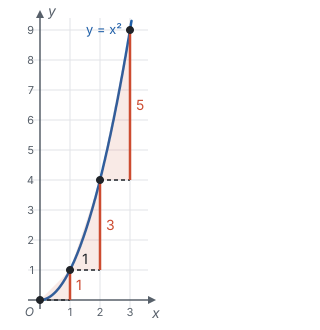
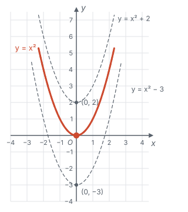
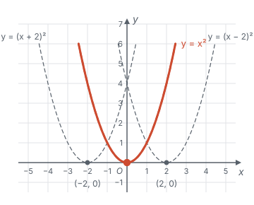
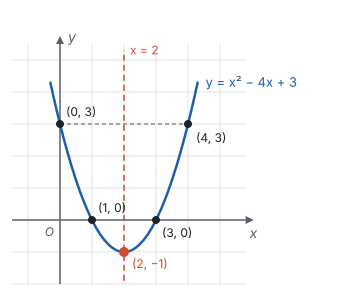
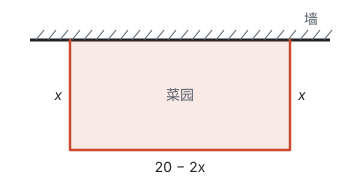
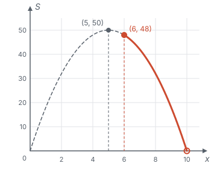

# 二次函数 ★

> 对应人教版九年级上册第二十六章。

**二次函数 $y = ax^2 + bx + c$（$a \ne 0$）的图象是抛物线，每一条抛物线都能由 $y = ax^2$ 的图象平移得到。** 所以研究二次函数只要看清两件事：$a$ 决定抛物线的形状（开口方向和大小），顶点决定它的位置。

## 从哪里来

| 情境 | 函数关系 | 展开后 |
| --- | --- | --- |
| 正方形的边长为 $x$，面积为 $y$ | $y = x^2$ | $y = x^2$ |
| 用长 20 m 的篱笆围一个矩形，一边长为 $x$ m，面积为 $S$ m² | $S = x(10 - x)$ | $S = -x^2 + 10x$ |
| 某产品原价 100 元，连续两年每年涨价的百分率都是 $x$，两年后价格为 $y$ 元 | $y = 100(1 + x)^2$ | $y = 100x^2 + 200x + 100$ |

这些关系展开后，$x$ 的最高次数都是 2。一般地，形如

$$y = ax^2 + bx + c\quad(a, b, c \text{ 是常数，} a \ne 0)$$

的函数叫**二次函数**。$a \ne 0$ 是为了保证有二次项；$a = 0$ 时它就成了一次函数（或常数）。

二次函数和一次函数有什么不同？看 $y = x^2$ 在 $x = 0, 1, 2, 3$ 时的值：0，1，4，9。$x$ 每增加 1，$y$ 分别增加 1，3，5，**每一步的增加量不再相同，而是每次多 2**。

一次函数的台阶一样高，连起来是直线；二次函数的台阶一级比一级高（一般地，$x$ 每增加 1，$y$ 的增加量每次多 $2a$），连起来就弯成了曲线。

## 最简单的抛物线：y = ax²

$y = x^2$ 的图象已经用描点法画过（见第七部分“函数”），就是这张图：

它的性质都能从解析式看出来：

- **关于 $y$ 轴对称。** $x$ 和 $-x$ 的函数值相等：$a(-x)^2 = ax^2$。所以图象上每个点 $(x, y)$ 关于 $y$ 轴的对称点 $(-x, y)$ 也在图象上。
- **顶点是原点。** $a > 0$ 时，$ax^2 \ge 0$，只有 $x = 0$ 时 $y = 0$，所以原点是图象的**最低点**，图象开口向上；$a < 0$ 时，$ax^2 \le 0$，原点是**最高点**，开口向下。
- **$\lvert a \rvert$ 越大，开口越小。** 同一个 $x$，$\lvert a \rvert$ 越大，$\lvert y \rvert$ 越大，曲线升（降）得越快，看上去越“瘦”。

增减性由对称得到。$a > 0$ 时，在 $y$ 轴右侧，$0 \le x_1 < x_2$ 时 $x_1^2 < x_2^2$，所以 $y$ 随 $x$ 的增大而增大；左侧和右侧关于 $y$ 轴对称，变化方向正好相反，$y$ 随 $x$ 的增大而减小。$a < 0$ 时两侧都反过来。

## 平移：y = a(x − h)² + k

**上下平移：$k$。** $y = x^2 + k$ 的每个函数值都比 $y = x^2$ 多 $k$，所以图象是把 $y = x^2$ 向上平移 $k$ 个单位（$k$ 是负数就向下），顶点从 $(0, 0)$ 移到 $(0, k)$。这和一次函数中 $b$ 的作用是一回事：$y = 2x + b$ 的图象，是把 $y = 2x$ 的图象向上平移 $b$ 个单位。

**左右平移：$h$。** $y = (x - 2)^2$ 的图象在哪里？在 $y = x^2$ 上取一点 $(x_0, y_0)$，即 $y_0 = x_0^2$。把它向右平移 2 个单位，得到点 $(x_0 + 2, y_0)$。代入 $y = (x - 2)^2$：

$$\big((x_0 + 2) - 2\big)^2 = x_0^2 = y_0,$$

所以这个点在 $y = (x - 2)^2$ 的图象上。$y = x^2$ 上的每个点向右平移 2 个单位，都落在 $y = (x - 2)^2$ 上，**图象是向右平移了 2 个单位**。

换个角度理解：$y = x^2$ 在 $x = 0$ 时取到最小值，$y = (x - 2)^2$ 要等到 $x - 2 = 0$，也就是 $x = 2$ 时才取到。同样的函数值，都要“晚 2 个单位”才出现，所以图象整体右移。同理，$y = (x + 2)^2 = [x - (-2)]^2$ 是向左平移 2 个单位。

两种平移合起来：**$y = a(x - h)^2 + k$ 的图象，是把 $y = ax^2$ 的图象向右平移 $h$ 个单位、向上平移 $k$ 个单位**（$h$、$k$ 是负数就向左、向下）。平移不改变形状，所以 $a$ 不变；原点 $(0, 0)$ 移到了 $(h, k)$。这个式子叫二次函数的**顶点式**。

| $y = a(x - h)^2 + k$ | $a > 0$ | $a < 0$ |
| --- | --- | --- |
| 开口方向 | 向上 | 向下 |
| 对称轴 | 直线 $x = h$ | 直线 $x = h$ |
| 顶点 | $(h, k)$，最低点 | $(h, k)$，最高点 |
| 增减性 | $x < h$ 时 $y$ 随 $x$ 的增大而减小；$x > h$ 时 $y$ 随 $x$ 的增大而增大 | $x < h$ 时 $y$ 随 $x$ 的增大而增大；$x > h$ 时 $y$ 随 $x$ 的增大而减小 |
| 最值 | $x = h$ 时，$y$ 有最小值 $k$ | $x = h$ 时，$y$ 有最大值 $k$ |

这张表不用背：画出草图（开口方向 + 顶点），每一行都能从图上读出来。

## 一般式：配方找顶点

一般式 $y = ax^2 + bx + c$ 看不出顶点，要用**配方**把它化成顶点式，和配方法解一元二次方程是同一个变形（见第四部分“一元二次方程”）。

**例 1**　求抛物线 $y = x^2 - 4x + 3$ 的顶点、对称轴和它与坐标轴的交点，并画出草图。

**思路：** 配方得到顶点和对称轴；与 $y$ 轴的交点令 $x = 0$，与 $x$ 轴的交点令 $y = 0$。

**解：** 配方：

$$y = x^2 - 4x + 3 = (x^2 - 4x + 4) - 4 + 3 = (x - 2)^2 - 1.$$

所以顶点是 $(2, -1)$，对称轴是直线 $x = 2$，开口向上。

令 $x = 0$，得 $y = 3$，与 $y$ 轴交于 $(0, 3)$。点 $(0, 3)$ 关于直线 $x = 2$ 的对称点是 $(4, 3)$，也在抛物线上。

令 $y = 0$，得 $x^2 - 4x + 3 = 0$，即 $(x - 1)(x - 3) = 0$，与 $x$ 轴交于 $(1, 0)$ 和 $(3, 0)$。

**回顾：** 两个交点 $(1, 0)$、$(3, 0)$ 的纵坐标相等，所以关于对称轴对称，对称轴正好是 $x = \frac{1 + 3}{2} = 2$。**抛物线上纵坐标相等的两点，横坐标的平均数就是对称轴。** 这常常比配方更快。

对一般的 $y = ax^2 + bx + c$ 做同样的配方：

$$\begin{aligned} y &= a\left(x^2 + \frac{b}{a}x\right) + c \\ &= a\left(x^2 + \frac{b}{a}x + \frac{b^2}{4a^2}\right) - \frac{b^2}{4a} + c \\ &= a\left(x + \frac{b}{2a}\right)^2 + \frac{4ac - b^2}{4a}. \end{aligned}$$

所以抛物线的对称轴是直线 $x = -\frac{b}{2a}$，顶点是

$$\left(-\frac{b}{2a},\ \frac{4ac - b^2}{4a}\right).$$

这个公式是配方的结果，记不住时，重新配一次方就能得到。

## a、b、c 在图象上的样子

| 系数 | 管什么 | 为什么 |
| --- | --- | --- |
| $a$ | 开口方向和大小 | 平移不改变 $a$，形状和 $y = ax^2$ 一样 |
| $c$ | 与 $y$ 轴的交点 $(0, c)$ | 令 $x = 0$，得 $y = c$ |
| $b$（和 $a$ 一起） | 对称轴的位置 | 对称轴是 $x = -\frac{b}{2a}$：$a$、$b$ 同号时它小于 0，在 $y$ 轴左侧；异号时在右侧；$b = 0$ 时就是 $y$ 轴 |

还有几个常用的式子，也都是“代入一个 $x$”：$a + b + c$ 是 $x = 1$ 时的函数值，$a - b + c$ 是 $x = -1$ 时的函数值。看图时，找到这些点在 $x$ 轴上方还是下方，就知道式子的正负。

## 待定系数法：三个条件，三种设法

二次函数有 $a$、$b$、$c$ 三个待定系数，一般需要**三个条件**。设成哪种形式，看条件给的是什么：

| 已知条件 | 设成 | 待定的系数 |
| --- | --- | --- |
| 图象上的三个点 | 一般式 $y = ax^2 + bx + c$ | $a$、$b$、$c$ |
| 顶点 $(h, k)$ 和另一个点 | 顶点式 $y = a(x - h)^2 + k$ | 只剩 $a$ |
| 与 $x$ 轴的两个交点 $(x_1, 0)$、$(x_2, 0)$ 和另一个点 | 交点式 $y = a(x - x_1)(x - x_2)$ | 只剩 $a$ |

交点式的来由：$x = x_1$ 和 $x = x_2$ 时 $y = 0$，所以 $x_1$、$x_2$ 是方程 $ax^2 + bx + c = 0$ 的两个根，二次式就能分解成 $a(x - x_1)(x - x_2)$（见第三部分“因式分解”）。

**例 2**　分别根据下列条件求抛物线的解析式：

（1）经过点 $(0, -3)$、$(1, -4)$、$(-1, 0)$；

（2）顶点是 $(1, -4)$，且经过点 $(0, -3)$；

（3）与 $x$ 轴交于 $(-1, 0)$、$(3, 0)$，且经过点 $(0, -3)$。

**解：**（1）设 $y = ax^2 + bx + c$。由过点 $(0, -3)$，得 $c = -3$。再代入另两点：

$$\begin{cases} a + b - 3 = -4, \\ a - b - 3 = 0, \end{cases}$$

即 $a + b = -1$，$a - b = 3$，解得 $a = 1$，$b = -2$。所以 $y = x^2 - 2x - 3$。

（2）设 $y = a(x - 1)^2 - 4$。代入 $(0, -3)$，得 $a - 4 = -3$，$a = 1$。所以 $y = (x - 1)^2 - 4$，展开得 $y = x^2 - 2x - 3$。

（3）设 $y = a(x + 1)(x - 3)$。代入 $(0, -3)$，得 $a \times 1 \times (-3) = -3$，$a = 1$。所以 $y = (x + 1)(x - 3)$，展开得 $y = x^2 - 2x - 3$。

**想一想：** 三问得到的是同一条抛物线，只是已知条件的“样子”不同。

| 比较 | 一般式 | 顶点式 | 交点式 |
| --- | --- | --- | --- |
| 要解的 | 二元一次方程组（先由 $(0, c)$ 定出 $c$） | 一个一元一次方程 | 一个一元一次方程 |
| 利用了什么 | 三个普通的点 | 顶点同时给出了 $h$、$k$ 两个条件 | 两个交点给出了两个条件 |

顶点和与 $x$ 轴的交点是“特殊的点”，一个顶点顶两个条件，所以顶点式、交点式只剩一个系数要求。拿到条件先看有没有特殊的点，再决定怎样设。

## 与一元二次方程的关系

令 $y = 0$，二次函数 $y = ax^2 + bx + c$ 就变成一元二次方程 $ax^2 + bx + c = 0$。所以**方程的根，就是抛物线与 $x$ 轴交点的横坐标。** 抛物线与 $x$ 轴有几个交点，方程就有几个实数根，由判别式 $\Delta = b^2 - 4ac$ 决定（见第四部分“一元二次方程”）。

以 $y = x^2 - 2x + c$ 为例，配方得 $y = (x - 1)^2 + (c - 1)$，$c$ 变化时抛物线上下平移：

| $c$ | $\Delta = 4 - 4c$ | 方程 $x^2 - 2x + c = 0$ 的根 | 抛物线与 $x$ 轴 |
| --- | --- | --- | --- |
| −3 | 16 > 0 | $x_1 = -1$，$x_2 = 3$ | 两个交点 |
| 1 | 0 | $x_1 = x_2 = 1$ | 一个交点（顶点在 $x$ 轴上） |
| 3 | −8 < 0 | 没有实数根 | 没有交点 |

**拓展：** 同一张图还能读出不等式的解：$x^2 - 2x - 3 < 0$，就是抛物线 $y = x^2 - 2x - 3$ 在 $x$ 轴**下方**的部分，对应 $-1 < x < 3$；$x^2 - 2x - 3 > 0$，就是抛物线在 $x$ 轴上方的部分，对应 $x < -1$ 或 $x > 3$。这和一次函数中“看直线在 $x$ 轴上方还是下方”是同一个想法。

## 最值问题：先看顶点，再看范围

二次函数的最大值或最小值在顶点取到，前提是**顶点的横坐标在自变量的取值范围内**。实际问题一定要先写出取值范围。

**例 3**　如图，用长 20 m 的篱笆靠墙围一个矩形菜园（靠墙的一边不用篱笆），设垂直于墙的边长为 $x$ m，菜园面积为 $S$ m²。

（1）墙足够长时，$x$ 为多少时菜园面积最大？最大面积是多少？

（2）如果墙长只有 8 m，菜园面积最大是多少？

**思路：** 平行于墙的边长是 $20 - 2x$，面积是两边之积，得到二次函数。配方找顶点，再检查顶点在不在取值范围里。

**解：**（1）$S = x(20 - 2x) = -2x^2 + 20x = -2(x - 5)^2 + 50$。

边长为正数：$x > 0$ 且 $20 - 2x > 0$，所以 $0 < x < 10$。$a = -2 < 0$，开口向下，顶点横坐标 5 在范围内，所以 $x = 5$ 时 $S$ 最大，最大面积是 50 m²，此时平行于墙的边长 10 m。

（2）平行于墙的边不能超过墙长：$20 - 2x \le 8$，得 $x \ge 6$。所以 $6 \le x < 10$。

顶点的横坐标 5 不在这个范围里。范围在对称轴 $x = 5$ 的右侧，开口向下时右侧 $S$ 随 $x$ 的增大而减小，所以 $x$ 取最小的 6 时 $S$ 最大：$S = 6 \times 8 = 48$。答：最大面积是 48 m²。

**回顾：** 第（2）问如果直接答“最大是 50”，就错了：$x = 5$ 时平行于墙的边长 10 m，墙只有 8 m，围不出来。最值问题的三步是：写出函数和取值范围 → 配方找顶点 → 顶点在范围内就取顶点，不在范围内就看范围端点，由增减性判断。

**例 4**　某商品进价每件 40 元。售价 50 元时，每天能卖 500 件；售价每涨 1 元，每天少卖 10 件。售价定为多少元时，每天的利润最大？最大利润是多少？

**思路：** 利润 = 每件的利润 × 销量，两个因式都随涨价的钱数变化。设每件涨价 $x$ 元，把两个因式都用 $x$ 表示。

**解：** 设每件涨价 $x$ 元，每天利润为 $W$ 元。每件利润 $(50 + x - 40)$ 元，销量 $(500 - 10x)$ 件，所以

$$W = (10 + x)(500 - 10x) = -10x^2 + 400x + 5000 = -10(x - 20)^2 + 9000.$$

涨价的钱数不是负数，$x \ge 0$；销量不能是负数，$500 - 10x \ge 0$，$x \le 50$。所以 $0 \le x \le 50$。顶点横坐标 20 在范围内，$a = -10 < 0$，所以 $x = 20$ 时 $W$ 最大，为 9000。答：售价定为 70 元时，每天的利润最大，是 9000 元。

**检验：** 售价 70 元时，每件利润 30 元，销量 $500 - 10 \times 20 = 300$ 件，$30 \times 300 = 9000$。

## 易错点

- **左右平移的方向弄反。** $y = (x + 2)^2$ 是 $y = x^2$ 向**左**平移 2 个单位，顶点 $(-2, 0)$。依据是“同样的函数值，$x$ 要早 2 个单位取到”，不是看括号里的符号。
- **顶点坐标的符号写错。** $y = -2(x + 1)^2 + 3$ 的顶点是 $(-1, 3)$。先把括号写成 $x - h$ 的样子：$x + 1 = x - (-1)$，所以 $h = -1$。
- **忘了 $a \ne 0$。** “$y = (m - 1)x^2 + 2x$ 是二次函数”要求 $m \ne 1$。题目只说“函数”时，还要讨论 $a = 0$ 的情况，这时它是一次函数（见第十一部分“分类讨论”）。
- **最值不看取值范围。** 顶点不在取值范围内时，最值在范围的端点取到。例 3 第（2）问就是这样：靠 8 m 长的墙围菜园，$S = -2(x - 5)^2 + 50$，$6 \le x < 10$，顶点横坐标 5 不在范围内，最大面积不是 50 m²，而是 $x = 6$ 时的 48 m²。
- **增减性不分段。** 二次函数的增减性在对称轴两侧相反，不能笼统地说“$y$ 随 $x$ 的增大而增大”，要说清在对称轴的哪一侧。
- **随便用交点式。** 抛物线与 $x$ 轴没有交点（$\Delta < 0$）时，没有交点式可设。

## 联系

- **一元二次方程：** 方程的根是抛物线与 $x$ 轴交点的横坐标，判别式决定交点个数；配方找顶点和配方法解方程是同一个变形。见第四部分“一元二次方程”。
- **整式的乘法和因式分解：** 顶点式、交点式展开就是一般式，用的是乘法公式；一般式分解因式就得到交点式。见第三部分“整式的乘法”和第三部分“因式分解”。
- **轴对称：** 抛物线是轴对称图形，对称点的纵坐标相等，常用来求对称轴。见第五部分“轴对称与等腰三角形”。
- **平移：** 顶点式就是把 $y = ax^2$ 的图象平移，“右移 $h$”对应 $x$ 换成 $x - h$，“上移 $k$”对应函数值加 $k$。见第六部分“平移、轴对称与旋转”。
- **一次函数：** 一次函数每一步的变化量不变，二次函数每一步的变化量在均匀地变；直线在 $x$ 轴上方、下方对应一元一次不等式，抛物线也一样。见第七部分“一次函数”。
- **动点与函数、方程思想与建模：** 动点问题中的面积、实际问题中的利润，常常是二次函数，最值就是顶点。见第十一部分“动点与函数”和第十一部分“方程思想与建模”。
